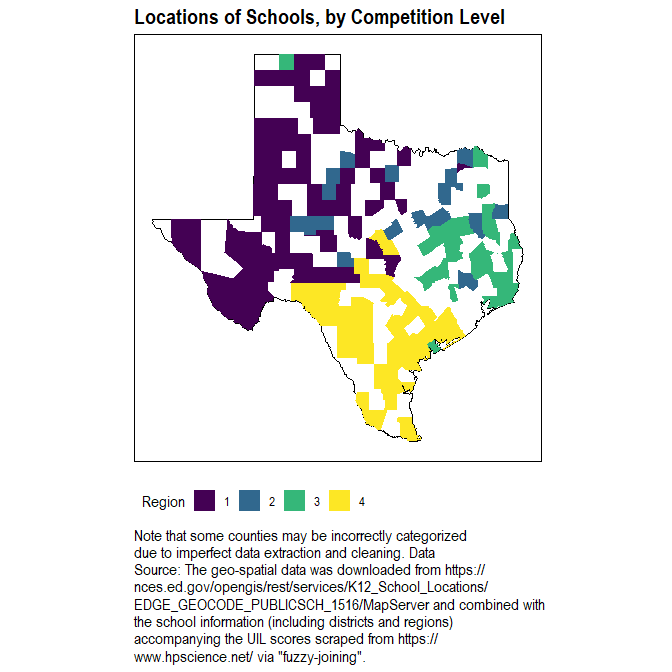
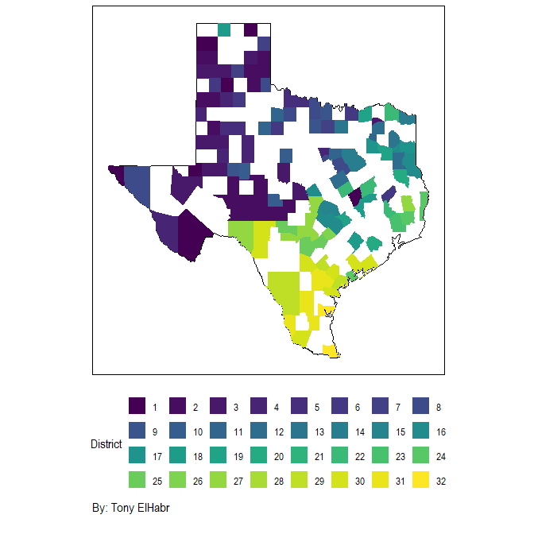

<!--
<button>Show</button>-->
**NOTE:** <i> This is part of a series of write-ups discussing my
findings of [Texas high school academic University Interscholastic
Scholarship (UIL) competitions](http://www.uiltexas.org/academics).

To keep this and the other write-ups concise and to focus reader
attention on the content, I have decided not to show the underlying code
(especially that which is used to create the visuals). Nonetheless, the
full code can be viewed on [my GitHub
account](https://github.com/tonyelhabr). In the future, I may write some
some kind of addendum to demonstrate some of the programming
implementation that I think is notable in some way. </i> <!--
-->

Introduction
------------

After I finished high school in 2012, I thought it would be interesting
to look back and evaluate my performance in the academic [University
Interscholastic League](http://www.uiltexas.org/) (UIL) competitions
that I competed in with historical results. (To provide some background,
most public high schools in Texas are registered in the [University
Interscholastic League](http://www.uiltexas.org/) (UIL), which "exists
to provide educational extracurricular academic, athletic, and music
contests". For those familiar with the [National Collegiate Athletic
Association](https://www.ncaa.com/) (NCAA), the UIL serves an analogous
role for Texas high school extracurricular activities.)

Aside from my own self-interest in the historical results in these
competitions, I think that this analysis can provide some insight into
which schools (and individual students) are really the most "elite".
School-wide and invidividual average scores on state- and national-
standardized tests (e.g. the [SAT](https://en.wikipedia.org/wiki/SAT))
certainly are the most common measure of academic strength, but I think
rankings by academic competitions may be more indicative.

### About the Data

To make some sense of the my analysis, the reader should be aware of the
following details about the data.

-   The competition data was scraped from https<nolink>://www.hpscience.net/
    for all years from 2008 through 2017. [^1] The data is not listed in
    an extremely user-friendly format (in my opinion). Consequently, the
    "cleaned" data is imperfect in some ways.

-   The UIL categorizes schools into one of six **"Conferences"**. The
    conference labels range from **1A, 2A, ..., 6A**, where the
    increasing leading digit (i.e. 1, 2, etc.) generally corresponds to
    increasing school size.

-   Schools only compete against other schools in their conference.

-   The UIL defines **3 levels of competition** (in order of
    "difficulty"): District\_\_, **Region**, and **State**. These are
    listed in order of "difficulty". That is, Winning a District
    competitions, results in a Region competition appearance, and,
    subsequently, winning a Region competition results in a State
    competition appearance. (Keep in mind that schools still only
    compete against other schools in their same conference, even as they
    advance.)

-   The UIL defines **32 total Districts** in Texas, which are
    aggregated into **4 Regions**. (The source of the geo-spatial data
    is
    <https://nces.ed.gov/opengis/rest/services/K12_School_Locations>.)

+ The UIL defines __32 total Districts__ in Texas, which are aggregated into __4 Regions__.
(The source of the geo-spatial data is
<https://nces.ed.gov/opengis/rest/services/K12_School_Locations>.)

-   For schools, winning is a "winner-take-all" matter: only the school
    with the most combined points among its top handful individual
    competitors (3 for most competitions) advances. On the other hand,
    an individual may advance even if his school does not win if he
    places among the top "n". The value of "n" is dependent on the
    competition type. [^2]

-   There are **5 different academic competitions "types"**:
    **Calculator Applications, Computer Science, Mathematics, Number
    Sense, and Science**. [^3]

What's Next
-----------

In this series, I investigate the following topics:

+ [The relationships among the competition years, types, levels](/post/analysis-texas-high-school-academics-2-competitions).

+ [Individual participation and performance](/post/analysis-texas-high-school-academics-3-individuals) (including myself).

+ [School participation and performance](/post/analysis-texas-high-school-academics-4-schools) (including my high school).

+ [Miscellaneous topics](/post/analysis-texas-high-school-academics-5-miscellaneous), such as sibling performance
.

[^1]: I checked the site's "robots.txt" file prior to scraping rate limits.

[^2]: See the UIL rules for more details.

[^3]: [There are many more UIL competition types](http://www.uiltexas.org/files/academics/academics-brief-overview.pdf) than those analyzed here (including competitions for theater, band, etc.), but these are the ones for academics.
