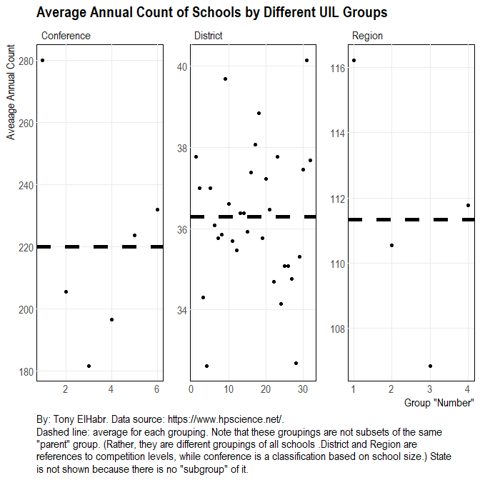
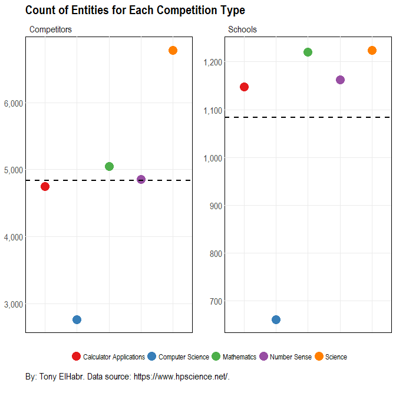
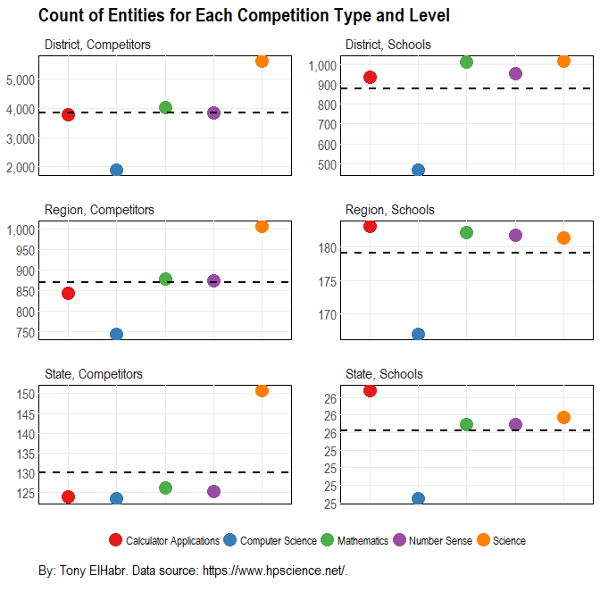
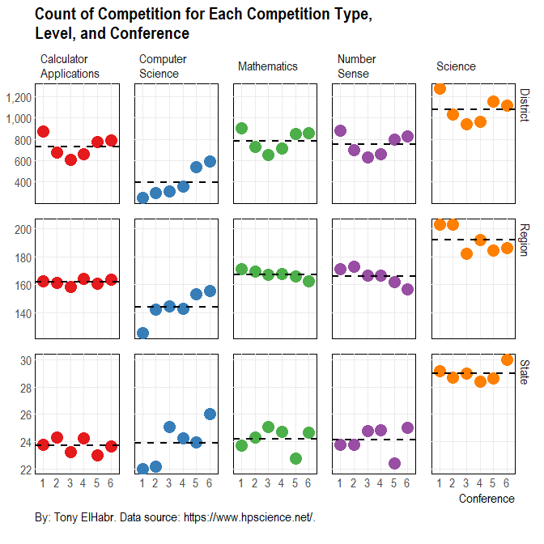
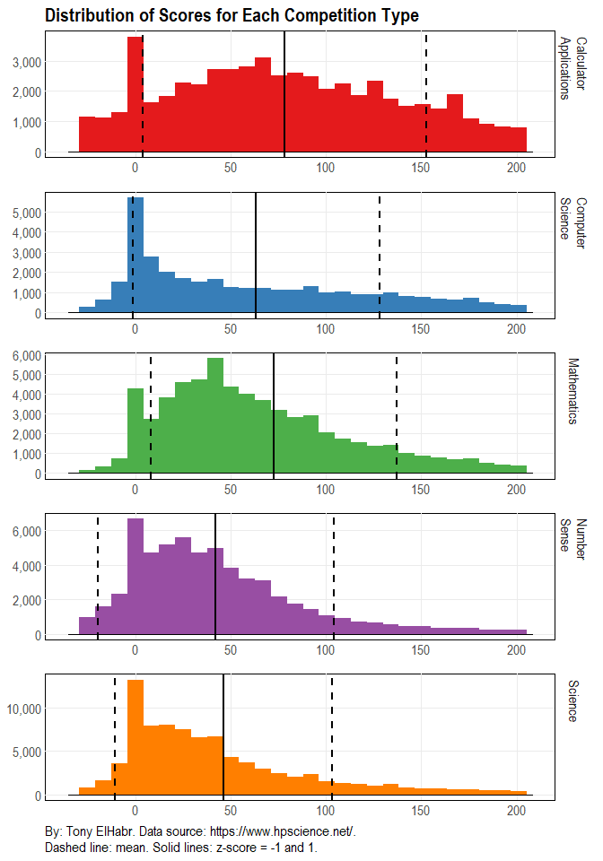
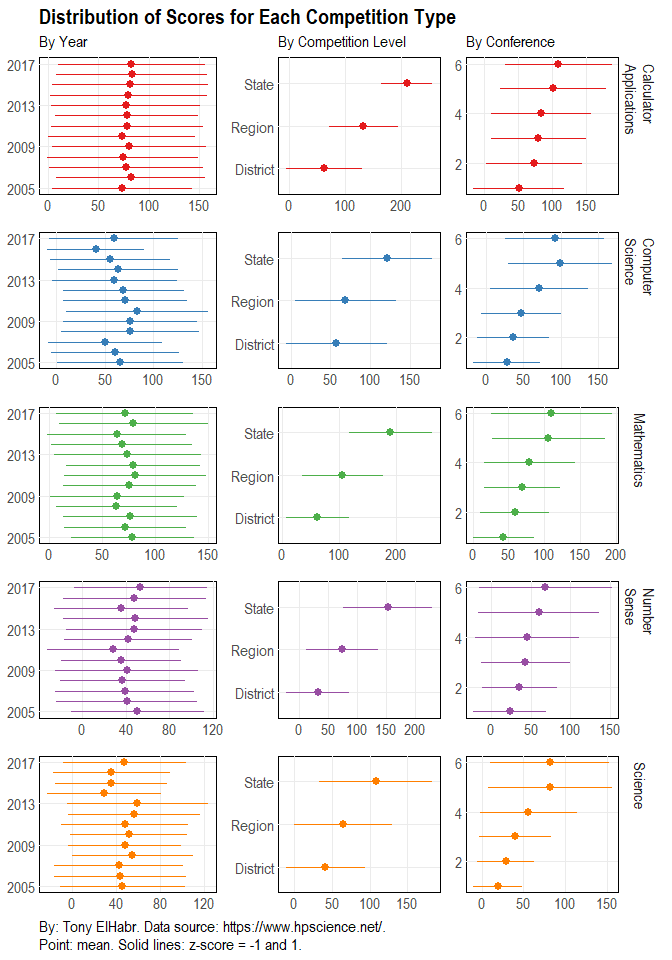
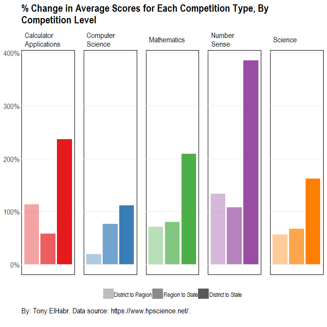
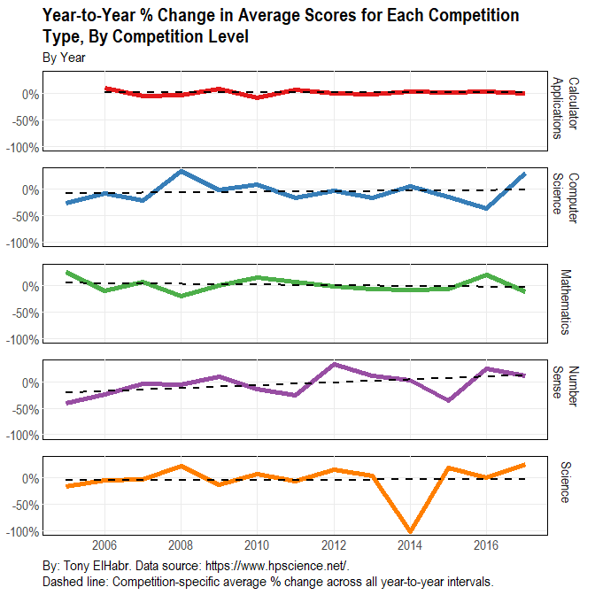

Competition Participation
-------------------------

Some of the first questions that might come to mind are those regarding
the number of schools in each level of competition (District, Region,
and State) and each conference classification level (1A, 2A, ... 6A).

It seems fair to say that the distribution of schools among Districts,
Regions, and Conferences is relatively even. [^1] [^2] This is to be
expected since the UIL presumably tries to divide schools evenly among
each grouping (to the extent possible) in order to stimulate fair
competition.

With some context regarding the number of schools in each competition
level and in conference, let's now consider the number of distinct
individual competitors and schools for each competition type (i.e.
Calculator, Computer Science, etc.)

Science stands out when evaluating participation by competition type
alone.

But what about when considering competition level as well?

Science seems to prevail again.

Now, what about when also considering conferences?

Once again, Science seems to be the most popular. So, in all, science
appears to be the answer to the numerous variations of the "Which
competition type/level has the most ...?" question.

### Competition Scores

With an understanding of the participation in the UIL competitions,
let's now consider the scores. What does the distribution of scores for
each competition type look like?

Take what you will from the above visual, but it is interesting to see
which competition types have wider distributions. This could imply a
number of different things:

-   A competition type with a wider distribution (relative to the
    others) may be more likely to attract "newbies".

-   Or, such a distribution may simply be headed by "experts".

-   Or, perhaps, it might simply imply that the test was not well made
    (or "fair"), resulting in a wide variety of scores. (On the other
    hand, one might simply see a right- or left-skewed distribution if
    the test is not robust.)

To try to understand the score distributions better, let's break them
down by year, competition level, and conference.

One might observe the following from the above plot:

-   It appears from the by-year breakdown that there is no discernible
    trends among score distributions across years. The lack of pattern
    in score distributions over time is a strong indication that the
    tests have about the same difficulty every year. This implies that
    it would not be unreasonable to compare raw test scores for a given
    competition type when comparing individuals and schools across
    different years.

-   It is evident from the competition type visual that score range
    distributions shift upwards with increasing competition level, as
    would be expected with more "superior" competitors advancing to
    higher levels of competition.

-   From the conference visual, it is apparent that scores generally
    increase with increasing conference number, which, itself,
    corresponds with increasing student body size. This could be
    indicative of a number of factors, including:

    -   Larger schools have more "superior" individual competitors,
        perhaps due to having a larger "talent pool" of students.

    -   In an effort to compete in as many different competition types
        as possible and/or reach the minimum number of individual
        competitors needed to qualify the school as a team (echo.g. at
        least 3 individuals), scmaller schools push individuals to
        participate in competitions even if they are not really prepared
        to do so. (This might be considered a form of [selection
        bias](https://en.wikipedia.org/wiki/Selection_bias).)

So maybe there isn't some broad, temporal trend to the scores. But is
there a trend in scores among the competition levels (for a given
competition type)? One would think that, assuming that test difficulty
is constant across competition levels, there would be an aggregate
increase in scores with increasing competition level (because only the
top scoring individuals and schools advance).

In fact, it does appear that score distributions skew higher with
increasing levels of competition. If this were not true, then I would
suspect that test are made to be more difficult at each competition
stage. [^3]

Notably, it appears that Number Sense demonstrates the largest "jumps"
in aggregate scores with increasing competition levels. Having competed
in this competition before, I do not find this all too surprising. More
than any other competition type, those who succeed Number Sense seem to
rely on natural abilities (as opposed to training) to beat out the
competition. (I would go so far as to say that for some individuals,
this natural ability is "savant-like".) Consequently, with increasing
competition level, it is more likely that these "superior" competitors
stand out, and, as observed here, cause the the scoring distributions to
skew higher.

So there **does** seem to be a trend of higher scores with higher
competition level, but has **that** trend changed over time? [^4]

[^trend]:
Recall that there is no apparent trend when not distinguishing by competition level.

As with the raw scores, there does not appear to be any noticeable trend
in the change in level of difficulty of tests between each competition
level over time. (Aside from a steep drop-off in the Science scores in
2014, there's really nothing too interesting about this plot.) Along
with the previous temporal visual where a trend with competition level
is not distinguished, this plot is a strong indication that the tests
(and, most likely, the skills of the competitors) have not changed over
time.

Such visual inferences are supported quantitatively. Observe the
[p-values](https://en.wikipedia.org/wiki/P-value) of the variables for
[linear regression](https://en.wikipedia.org/wiki/Linear_regression)
models fit for each competition type, where the average year-to-year
score difference (as a percentage) is estimated given average individual
competitor score and year. Taking the customary p-value threshold of
0.05 as the level of significance (where one may deduce that the model
is not predictive if the p.value is greater than the threshold value),
the year term is shown to be insignificant.

$$
mean \space year \space diff \space pct = intercept + mean * \beta_{1} + year * \beta_{2}
$$

<table>
<thead>
<tr class="header">
<th align="left">comp</th>
<th align="right">(Intercept)</th>
<th align="right">mean</th>
<th align="right">year</th>
</tr>
</thead>
<tbody>
<tr class="odd">
<td align="left">Calculator Applications</td>
<td align="right">0.1589</td>
<td align="right">0.0048</td>
<td align="right">0.1290</td>
</tr>
<tr class="even">
<td align="left">Computer Science</td>
<td align="right">0.1885</td>
<td align="right">0.0239</td>
<td align="right">0.1957</td>
</tr>
<tr class="odd">
<td align="left">Mathematics</td>
<td align="right">0.5551</td>
<td align="right">0.0146</td>
<td align="right">0.5137</td>
</tr>
<tr class="even">
<td align="left">Number Sense</td>
<td align="right">0.1761</td>
<td align="right">0.3733</td>
<td align="right">0.1807</td>
</tr>
<tr class="odd">
<td align="left">Science</td>
<td align="right">0.4813</td>
<td align="right">0.0321</td>
<td align="right">0.4958</td>
</tr>
</tbody>
</table>

There could be a number of confounding factors that explain the
relatively even level of competition over time, including the following.

-   It could be that test makers have purposely adjusted the difficulty
    of tests to result in scores that are similar to historical scores
    for a given competition and/or competition level.

-   Or, perhaps more likely, the difficulty of tests and the skill level
    of competitors have stayed relatively the same over time.

If the latter is true, at the very least we can say that, despite how
the media or popular culture may portray younger generations, the
prowess of the academic "elite" of the current generation of high school
students in Texas has not dropped off. (Nonetheless, nothing definitive
should be deduced about those who do not compete in UIL academic
competitions and are anywhere outside of Texas.)

Wrap-up
-------

In this write-up, the participation and scores of Texas high school
academic UIL competitions are illustrated in a number of different
ways--by competition type, by competition level, by year, and by
variations of these. Next, we'll take a closer look at some more
specific questions, focusing on individual competitors.

[^1]: The State competition level is not shown because it there is no "sub-grouping" of State (like there is 1, 2, 3, ... for each of the groupings shown).

[^2]: As a technical note, Districts, Regions, and Conferences are not really all of the same "type" of data. Nevertheless, these different "groupings" each stratify the sample population in some manner.

[^3]: Actually, it might be true that there *is* some increase in test difficulty with advancing competitions, but such an adjustment, if it is truly made, does not quite offset the skill level of the advancing competitors.

[^4]: Recall that there is no apparent trend when not distinguishing by competition level.
