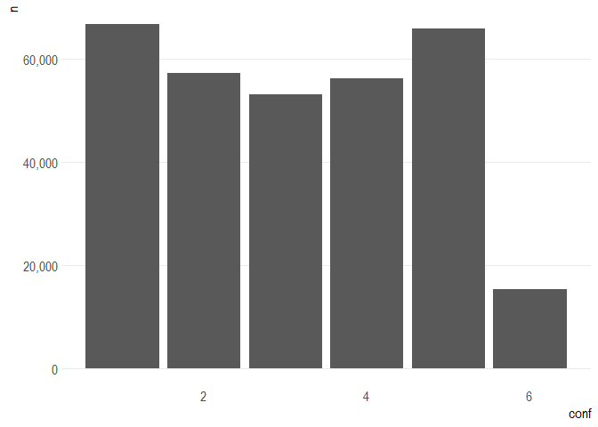
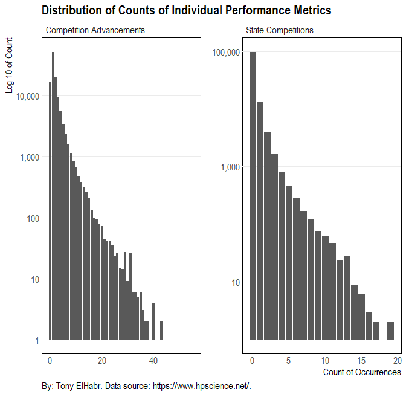
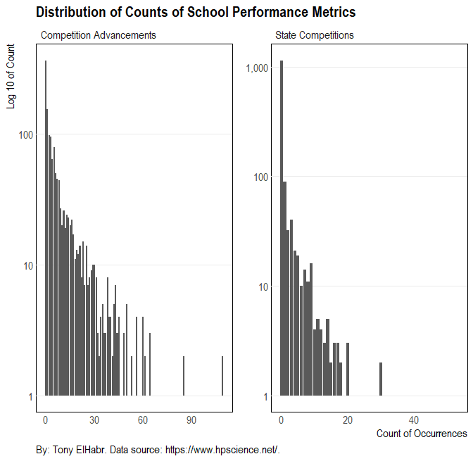
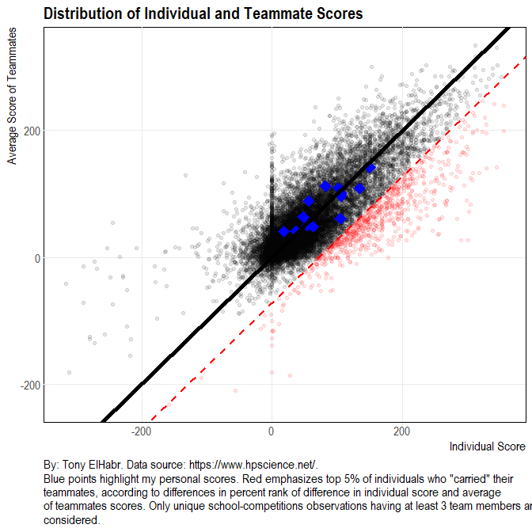
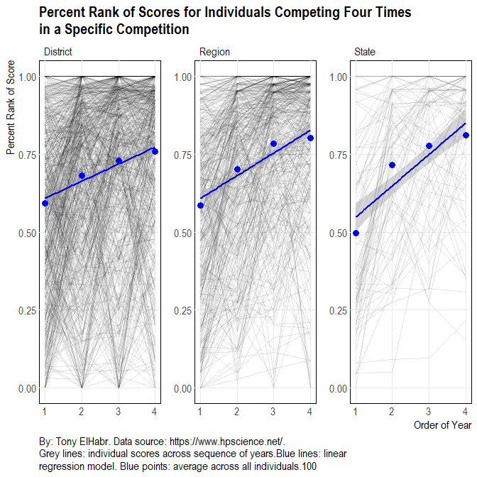

Let's take a look at individual competitors in the academic UIL
competitions.

Individual Participation
------------------------

The first question that comes to mind is that of participation--which
individuals have competed the most?

**NOTE:**

<i> To give some context to the values for individual participants, I'll
include the numbers for myself ("Elhabr, Anthony") in applicable
contexts. </i>

<table>
<thead>
<tr class="header">
<th align="right">rnk</th>
<th align="left">name</th>
<th align="left">school</th>
<th align="left">city</th>
<th align="right">conf</th>
<th align="right">n</th>
</tr>
</thead>
<tbody>
<tr class="odd">
<td align="right">1</td>
<td align="left">Jansa, Wade</td>
<td align="left">GARDEN CITY</td>
<td align="left">GARDEN CITY</td>
<td align="right">1</td>
<td align="right">57</td>
</tr>
<tr class="even">
<td align="right">2</td>
<td align="left">Chen, Kevin</td>
<td align="left">CLEMENTS</td>
<td align="left">SUGAR LAND</td>
<td align="right">5</td>
<td align="right">56</td>
</tr>
<tr class="odd">
<td align="right">3</td>
<td align="left">Hanson, Dillon</td>
<td align="left">LINDSAY</td>
<td align="left">LINDSAY</td>
<td align="right">1</td>
<td align="right">53</td>
</tr>
<tr class="even">
<td align="right">4</td>
<td align="left">Gee, John</td>
<td align="left">CALHOUN</td>
<td align="left">PORT LAVACA</td>
<td align="right">4</td>
<td align="right">47</td>
</tr>
<tr class="odd">
<td align="right">5</td>
<td align="left">Zhang, Mark</td>
<td align="left">CLEMENTS</td>
<td align="left">SUGAR LAND</td>
<td align="right">5</td>
<td align="right">47</td>
</tr>
<tr class="even">
<td align="right">6</td>
<td align="left">Robertson, Nick</td>
<td align="left">BRIDGE CITY</td>
<td align="left">BRIDGE CITY</td>
<td align="right">3</td>
<td align="right">46</td>
</tr>
<tr class="odd">
<td align="right">7</td>
<td align="left">Ryan, Alex</td>
<td align="left">KLEIN</td>
<td align="left">KLEIN</td>
<td align="right">5</td>
<td align="right">46</td>
</tr>
<tr class="even">
<td align="right">8</td>
<td align="left">Strelke, Nick</td>
<td align="left">ARGYLE</td>
<td align="left">ARGYLE</td>
<td align="right">3</td>
<td align="right">45</td>
</tr>
<tr class="odd">
<td align="right">9</td>
<td align="left">Niehues, Taylor</td>
<td align="left">GARDEN CITY</td>
<td align="left">GARDEN CITY</td>
<td align="right">1</td>
<td align="right">44</td>
</tr>
<tr class="even">
<td align="right">10</td>
<td align="left">Bass, Michael</td>
<td align="left">SPRING HILL</td>
<td align="left">LONGVIEW</td>
<td align="right">3</td>
<td align="right">43</td>
</tr>
<tr class="odd">
<td align="right">1722</td>
<td align="left">Elhabr, Anthony</td>
<td align="left">CLEMENS</td>
<td align="left">SCHERTZ</td>
<td align="right">4</td>
<td align="right">13</td>
</tr>
</tbody>
</table>

**Note:** 1 \# of total rows: 123,409

Although the names here may not provide much insight, the counts provide
some context regarding the limits of individual participation.

Given that counts of overall participation may not be indicative of
anything directly, it may be a better idea to break it down by
conference.

It seems that there has not been as much invdividual participation in
the 6A conference (`conf 6`)-- which is the conference with largest high
schools (according to student body size).

I hypothesize that this phenomenon can be attributed to "pre-filtering
of talent" by these large schools. In other words, conference 6A schools
may be more likely to designate their individual competitors to compete
in only specific competitions and prevent any student who may be
capable, yet not fully prepared, from entering a competition. High
standards and expectations of aptitude are relatively common at very
large schools, even if what may be deemed "unacceptable" at such a
school would be very satisfactory at a smaller school. By comparison,
schools in all other conferences may be more willing to let individual
students compete in as many competition types as they desire, even if
they have not prepared for them whatsoever.

Such a phenomenon might be evident in lower scores (in aggregate) for
conferences where participation is greater. In fact, this is exactly
what is observed. [^1] On average, conference 6A has the highest scores,
while conference 1A has the lowest.

So what about people's scores? Who did best according to score? In order
to simplify the data, let's look at a couple of statistics based on
score, aggregating across all scores for each individual. In particular,
let's look at the average and sum of placing percent rank (`prnk`) and
of individual competitors "defeated" (`n_defeat`). (Note that
competitors defeated is defined as the number of scores less that that
of a given individual for a unique competition, and a unique competition
is defined as a unique combination of year, competition level, and
competition type.)

<table>
<thead>
<tr class="header">
<th align="right">rnk</th>
<th align="left">name</th>
<th align="left">school</th>
<th align="left">city</th>
<th align="right">n</th>
<th align="right">prnk_mean</th>
<th align="right">n_defeat_mean</th>
</tr>
</thead>
<tbody>
<tr class="odd">
<td align="right">1</td>
<td align="left">Hanson, Dillon</td>
<td align="left">LINDSAY</td>
<td align="left">LINDSAY</td>
<td align="right">53</td>
<td align="right">0.97</td>
<td align="right">29.17</td>
</tr>
<tr class="even">
<td align="right">2</td>
<td align="left">Chen, Kevin</td>
<td align="left">CLEMENTS</td>
<td align="left">SUGAR LAND</td>
<td align="right">56</td>
<td align="right">0.91</td>
<td align="right">29.80</td>
</tr>
<tr class="odd">
<td align="right">3</td>
<td align="left">Jansa, Wade</td>
<td align="left">GARDEN CITY</td>
<td align="left">GARDEN CITY</td>
<td align="right">57</td>
<td align="right">0.89</td>
<td align="right">29.86</td>
</tr>
<tr class="even">
<td align="right">4</td>
<td align="left">Niehues, Taylor</td>
<td align="left">GARDEN CITY</td>
<td align="left">GARDEN CITY</td>
<td align="right">44</td>
<td align="right">0.96</td>
<td align="right">31.20</td>
</tr>
<tr class="odd">
<td align="right">5</td>
<td align="left">Gee, John</td>
<td align="left">CALHOUN</td>
<td align="left">PORT LAVACA</td>
<td align="right">47</td>
<td align="right">0.90</td>
<td align="right">25.21</td>
</tr>
<tr class="even">
<td align="right">6</td>
<td align="left">Zhang, Mark</td>
<td align="left">CLEMENTS</td>
<td align="left">SUGAR LAND</td>
<td align="right">47</td>
<td align="right">0.89</td>
<td align="right">29.15</td>
</tr>
<tr class="odd">
<td align="right">7</td>
<td align="left">Strelke, Nick</td>
<td align="left">ARGYLE</td>
<td align="left">ARGYLE</td>
<td align="right">45</td>
<td align="right">0.93</td>
<td align="right">26.56</td>
</tr>
<tr class="even">
<td align="right">8</td>
<td align="left">Robertson, Nick</td>
<td align="left">BRIDGE CITY</td>
<td align="left">BRIDGE CITY</td>
<td align="right">46</td>
<td align="right">0.88</td>
<td align="right">25.33</td>
</tr>
<tr class="odd">
<td align="right">9</td>
<td align="left">Ryan, Alex</td>
<td align="left">KLEIN</td>
<td align="left">KLEIN</td>
<td align="right">46</td>
<td align="right">0.86</td>
<td align="right">26.20</td>
</tr>
<tr class="even">
<td align="right">10</td>
<td align="left">Xu, Steven</td>
<td align="left">DAWSON</td>
<td align="left">PEARLAND</td>
<td align="right">43</td>
<td align="right">0.88</td>
<td align="right">26.81</td>
</tr>
<tr class="odd">
<td align="right">2608</td>
<td align="left">Elhabr, Anthony</td>
<td align="left">CLEMENS</td>
<td align="left">SCHERTZ</td>
<td align="right">13</td>
<td align="right">0.60</td>
<td align="right">16.62</td>
</tr>
</tbody>
</table>

**Note:** 1 \# of total rows: 117,684

Also, I think it's interesting to look at the distribution of counts for
competitors defeated, advancement, and state competition appearances.
The heavily right skewed distribution of values gives an indication of
the difficulty of succeeding consistently.

For comparison's sake, let's visualize the same metrics aggregated at
the school level. Keep in mind that while the sample of students should
have larger counts for number of advancements and state competition
appearances (y-axis) for any given number of occurences (x-axis) because
there are many more students than schools, schools are more likely to
have a wider range of occurrences (x-axis) because there are less
schools in each competition (compared to the number of individuals).

To understand why this is true, let's take an example: Say there is a
District level competition where there are 8 schools and 40 individuals
competing. It is more likely that a given school advances to the next
level of competition (as a result of having a total score that is higher
than the scores of the other 7 schools) than any single individual, who
if not from the school that advances, can only advance as a result of
having a top "n" (e.g. 3) score.

We see that the distributions are skewed towards the right here as well,
although not quite as "evenly". This indicates that some schools tend to
perform well at a more consistent rate than individuals themselves.
Intuitively, this makes sense. It can be very difficult for individuals
alone to beat out the competition, especially if they have an "off" day.
On the other hand, schools, relying on teams of individuals, are placed
according to the sum of the top "n" (e.g. 3) of individual competitor
scores. Thus, because school scores are dependent on groups of
individuals-- who will tend to perform more consistently in aggregate
than any one individual-- school placings are more likely to be similar
across years, meaning that schools that are observed to do well in any
given year are more likely to do well in other years as well (relative
to individual competitors).

So it should be obvious that it is difficult to make it the highest
level of competition--State. But exactly how difficult is it? Let's
identify those people (and their scores) who have made the State
competition level four times--which is the upper limit for a typical
high school student [^2]-- for a given competition type.

Clearly, these individuals represent a very small subset of the total
sample. They might be considered the "elite". Of these individuals, who
has appeared in State competitions for more than one type of
competition?

<table>
<thead>
<tr class="header">
<th align="left">name</th>
<th align="left">school</th>
<th align="left">city</th>
<th align="right">conf</th>
<th align="right">n</th>
</tr>
</thead>
<tbody>
<tr class="odd">
<td align="left">Chen, Kevin</td>
<td align="left">CLEMENTS</td>
<td align="left">SUGAR LAND</td>
<td align="right">5</td>
<td align="right">4</td>
</tr>
<tr class="even">
<td align="left">Jansa, Wade</td>
<td align="left">GARDEN CITY</td>
<td align="left">GARDEN CITY</td>
<td align="right">1</td>
<td align="right">4</td>
</tr>
<tr class="odd">
<td align="left">Hanson, Dillon</td>
<td align="left">LINDSAY</td>
<td align="left">LINDSAY</td>
<td align="right">1</td>
<td align="right">3</td>
</tr>
<tr class="even">
<td align="left">Strelke, Nick</td>
<td align="left">ARGYLE</td>
<td align="left">ARGYLE</td>
<td align="right">3</td>
<td align="right">3</td>
</tr>
<tr class="odd">
<td align="left">Bass, Michael</td>
<td align="left">SPRING HILL</td>
<td align="left">LONGVIEW</td>
<td align="right">3</td>
<td align="right">2</td>
</tr>
<tr class="even">
<td align="left">Deaver, Matthew</td>
<td align="left">SILSBEE</td>
<td align="left">SILSBEE</td>
<td align="right">3</td>
<td align="right">2</td>
</tr>
<tr class="odd">
<td align="left">Liu, Jason</td>
<td align="left">DAWSON</td>
<td align="left">PEARLAND</td>
<td align="right">4</td>
<td align="right">2</td>
</tr>
<tr class="even">
<td align="left">Ryan, Alex</td>
<td align="left">KLEIN</td>
<td align="left">KLEIN</td>
<td align="right">5</td>
<td align="right">2</td>
</tr>
<tr class="odd">
<td align="left">Williams, Tyler</td>
<td align="left">POOLVILLE</td>
<td align="left">POOLVILLE</td>
<td align="right">1</td>
<td align="right">2</td>
</tr>
<tr class="even">
<td align="left">Xu, Steven</td>
<td align="left">DAWSON</td>
<td align="left">PEARLAND</td>
<td align="right">4</td>
<td align="right">2</td>
</tr>
</tbody>
</table>

**Note:** 1 \# of total rows: 11

I would consider those individuals appearing here to be the "elite of
the elite".

Individual Performance
----------------------

Now, I want to try to answer a somewhat ambiguous question: Which
individuals were most "dominant"?

### Evaluating "Dominance"

Because the term "dominance" is fairly subjective, it must be defined
explicitly. Here is my definition/methodology, along with some
explanation.

First, I assign a percent rank to individual placings in all
competitions based on score relative to other scores in that
competition. I choose to use percent rank--which is a always a value
between 0 and 1--because it inherently accounts for the wide range of
number of competitors across all competitions. (For this context, a
percent rank of 1 corresponds to the highest score in a given
competition [^3], and, conversely, a value of 0 corresponds to the lowest
score.)

I should note that I evaluated some other metrics for gauging individual
success, including the total number of individuals defeated in
competitions. Percent rank based on score and number of defeats attempt
to quantify the same underlying variable, but I think percent rank is a
little more "natural" to interpret because it contextualizes number of
competitors with its unit range. By comparison, the interpretation of
number of defeats is less direct because the number of other competitors
is not accounted directly.

Then, to come up with a final set of ranks, one for each unique
competitor, based on the percent ranks for individual competitions, I
simply sum up the percent ranks for each individual.

The sum is used instead of an average [^4] because rankings based on
averages --and inferences made upon them--are sensitive to individuals
who do not compete in many competitions, yet place very well in them. A
final ranking based on a summed value does not suffer from this pitfall,
although it can be sensitive to the sample size of each participant.
(i.e. An individual might participate in a high number of competitions
and under-perform relative to the average in all of them, yet their
final ranking, based on summed percent ranks, might indicate that they
are an above-average performer.)

<table>
<thead>
<tr class="header">
<th align="left">name</th>
<th align="left">school</th>
<th align="right">conf</th>
<th align="right">rnk_sum_prnk</th>
<th align="right">rnk_mean_prnk</th>
<th align="right">rnk_sum_n_defeat</th>
<th align="right">rnk_mean_n_defeat</th>
</tr>
</thead>
<tbody>
<tr class="odd">
<td align="left">Hanson, Dillon</td>
<td align="left">LINDSAY</td>
<td align="right">1</td>
<td align="right">1</td>
<td align="right">191</td>
<td align="right">3</td>
<td align="right">5205</td>
</tr>
<tr class="even">
<td align="left">Chen, Kevin</td>
<td align="left">CLEMENTS</td>
<td align="right">5</td>
<td align="right">2</td>
<td align="right">809</td>
<td align="right">2</td>
<td align="right">4834</td>
</tr>
<tr class="odd">
<td align="left">Jansa, Wade</td>
<td align="left">GARDEN CITY</td>
<td align="right">1</td>
<td align="right">3</td>
<td align="right">1298</td>
<td align="right">1</td>
<td align="right">4827</td>
</tr>
<tr class="even">
<td align="left">Niehues, Taylor</td>
<td align="left">GARDEN CITY</td>
<td align="right">1</td>
<td align="right">4</td>
<td align="right">200</td>
<td align="right">4</td>
<td align="right">3612</td>
</tr>
<tr class="odd">
<td align="left">Gee, John</td>
<td align="left">CALHOUN</td>
<td align="right">4</td>
<td align="right">5</td>
<td align="right">1114</td>
<td align="right">14</td>
<td align="right">10361</td>
</tr>
<tr class="even">
<td align="left">Zhang, Mark</td>
<td align="left">CLEMENTS</td>
<td align="right">5</td>
<td align="right">6</td>
<td align="right">1272</td>
<td align="right">5</td>
<td align="right">5213</td>
</tr>
<tr class="odd">
<td align="left">Strelke, Nick</td>
<td align="left">ARGYLE</td>
<td align="right">3</td>
<td align="right">7</td>
<td align="right">562</td>
<td align="right">12</td>
<td align="right">8340</td>
</tr>
<tr class="even">
<td align="left">Robertson, Nick</td>
<td align="left">BRIDGE CITY</td>
<td align="right">3</td>
<td align="right">8</td>
<td align="right">1598</td>
<td align="right">15</td>
<td align="right">10277</td>
</tr>
<tr class="odd">
<td align="left">Ryan, Alex</td>
<td align="left">KLEIN</td>
<td align="right">5</td>
<td align="right">9</td>
<td align="right">2561</td>
<td align="right">8</td>
<td align="right">8754</td>
</tr>
<tr class="even">
<td align="left">Xu, Steven</td>
<td align="left">DAWSON</td>
<td align="right">4</td>
<td align="right">10</td>
<td align="right">1661</td>
<td align="right">16</td>
<td align="right">8160</td>
</tr>
<tr class="odd">
<td align="left">Elhabr, Anthony</td>
<td align="left">CLEMENS</td>
<td align="right">4</td>
<td align="right">2330</td>
<td align="right">30385</td>
<td align="right">2934</td>
<td align="right">34266</td>
</tr>
</tbody>
</table>

**Note:** 1 \# of total rows: 123,337

Some of the same individuals from the participation-based ranking of
competitors also appear among the top of the ranks by my evaluation of
domination. This is somewhat expected due to the nature of my
methodology (in particular, my choice to use a sum instead of an average
or some other statistic). Certainly some additional statistical analysis
could be done here to investigate other methods of quantifying dominance
(beyond my analysis). [^5] Because there is no well-agreed upon metric or
method anywhere for quantifying dominance for this particular topic,
it's difficult to really judge the findings here.

In any matter, the difference between the ranks based on the average and
the sum of percent ranks is not all too great--I found that the
correlation between the two is anywhere between ~0.75 and ~0.95 when
using either score percent rank or number of defeats as the metric for
ranking.

<table>
<thead>
<tr class="header">
<th align="left">rowname</th>
<th align="right">rnk_sum_prnk</th>
<th align="right">rnk_mean_prnk</th>
<th align="right">rnk_sum_n_defeat</th>
<th align="right">rnk_mean_n_defeat</th>
</tr>
</thead>
<tbody>
<tr class="odd">
<td align="left">rnk_sum_prnk</td>
<td align="right">NA</td>
<td align="right">0.8192</td>
<td align="right">0.9488</td>
<td align="right">0.7375</td>
</tr>
<tr class="even">
<td align="left">rnk_mean_prnk</td>
<td align="right">0.8192</td>
<td align="right">NA</td>
<td align="right">0.7840</td>
<td align="right">0.8829</td>
</tr>
<tr class="odd">
<td align="left">rnk_sum_n_defeat</td>
<td align="right">0.9488</td>
<td align="right">0.7840</td>
<td align="right">NA</td>
<td align="right">0.8449</td>
</tr>
<tr class="even">
<td align="left">rnk_mean_n_defeat</td>
<td align="right">0.7375</td>
<td align="right">0.8829</td>
<td align="right">0.8449</td>
<td align="right">NA</td>
</tr>
</tbody>
</table>

### Evaluating "Carrying"

Another way of identifying superb ability is to compare the scores of
individuals with those of their teammates. Individuals with high scores
relative to their teammates might be said to have "carried" their
teammates. Although this kind of evaluation is dependent on the skill of
each team (independent of the competition setting), I think that it is
another interesting way of evaluating skill.

I was hoping that I might see myself appearing among the most dominant
by this measure of skill, but it does not say anything necessarily bad
about myself that I don't. I competed with other individuals who I
considered to be very knowledgeable and who often scored better than me.
Also, from the opposite point of view, I don't think I was a poor
performer who relied upon teammates to boost the team's overall score.
This is why the data points corresponding to me show up in the middle of
the pack in the previous visual.

### "Improvement"

I think something else that would be interesting to look at is personal
"improvement" between years. Theoretically, if we assume that
individuals improve their academic ability and competition skills every
year, then we should see individual scores for a given competition type
and level increase from one year to next. I would be very surprised to
find that this is not true.

To evaluate improvement, we can simply reduce the whole data set to just
those who have competed in the same competition type and level in more
than one year and check whether or not their scores increased or
decreased from one year to the next. [^6] Actually, in order to account
for variance in competition difficulty across years, it's better to use
the percent rank of the individual's placing (based on score) rather
than score itself.

<table>
<thead>
<tr class="header">
<th align="left">improve</th>
<th align="left">n</th>
</tr>
</thead>
<tbody>
<tr class="odd">
<td align="left">FALSE</td>
<td align="left">23,022</td>
</tr>
<tr class="even">
<td align="left">TRUE</td>
<td align="left">35,305</td>
</tr>
</tbody>
</table>

**Note:** 1 \# of total rows: 2

So it is true that individual scores--actually, percent rank of
placings--do tend to improve as the individual ages. But is this trend
statistically significant? That's easy enough to answer--we can simply
perform a [binomial
test](https://en.wikipedia.org/wiki/Binomial_test)--where the [null
hypothesis](https://en.wikipedia.org/wiki/Null_hypothesis) is that the
distribution of "TRUE" and "FALSE" regarding improvement is truly a 50 %
- 50 % split. If the [p-value](https://en.wikipedia.org/wiki/P-value) of
the test is below a threshold value--let's say 0.05--then we can deny
the null hypothesis and say that there is a non-trivial trend of
individual improvement.

<table>
<thead>
<tr class="header">
<th align="left">metric</th>
<th align="right">value</th>
</tr>
</thead>
<tbody>
<tr class="odd">
<td align="left">estimate</td>
<td align="right">0.6053</td>
</tr>
<tr class="even">
<td align="left">p.value</td>
<td align="right">0.0000</td>
</tr>
<tr class="odd">
<td align="left">conf.low</td>
<td align="right">0.6013</td>
</tr>
<tr class="even">
<td align="left">conf.high</td>
<td align="right">0.6093</td>
</tr>
</tbody>
</table>

In fact, this is exactly what is observed.

Now, let's reduce the set to just those who have appeared in
competitions at a given competition type four times (for the sake of
visualization) and plot the scores across years for each individual.

It is evident visually that people do have a tendency to improve over
time.

Wrap-up
-------

I'll leave the discussion of individuals at that, although there is much
more that could be explored.

[^1]: See the previous post.

[^2]: The assumption here is that each student takes four years to complete high school.

[^3]: A unique competition is defined as one having a unique year, competition type, and competition level.

[^4]: The average may also be considered a valid means of aggregating the values for each individual.

[^5]: I'll leave further analysis for another person and/or time.

[^6]: I don't think it is relevant to require that the scores be in consecutive years, so I don't enforce that criteria.
