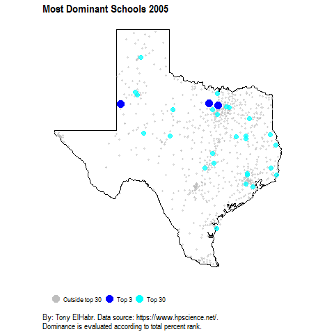
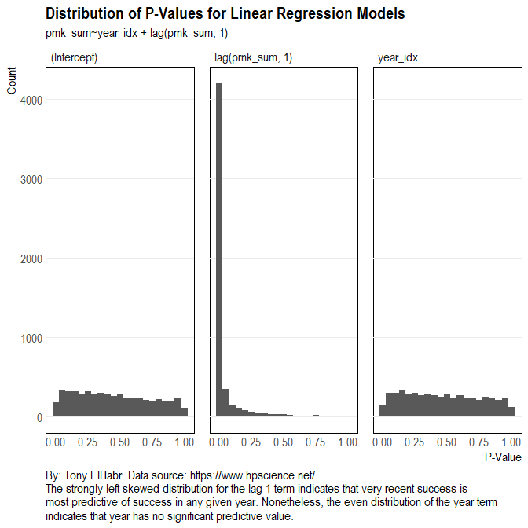
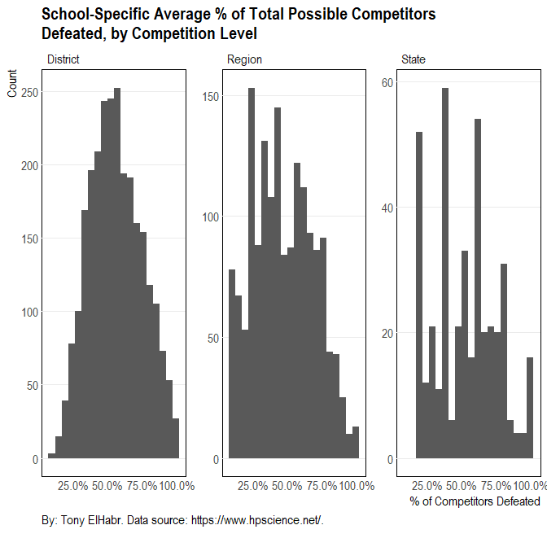

Having investigated individuals elsewhere, let's now take a look at the
schools.

**NOTE:**

<i> Although I began the examinations of competitions and individuals by
looking at volume of participation (to provide context), I'll skip an
analogous discussion here because the participation of schools is shown
indirectly through those analyses.) </i>

School Scores
-------------

Let's begin by looking at some of the same metrics shown for individual
students, but aggregated across all students for each school. In order
to give the reader some insight into school performance, I'll rank and
show schools by a singular metric of performance. To be consistent, I'll
use the same metric used for ranking the individuals--summed percentile
rank of scores (`prnk_sum`).

**NOTE:** <i> For the same reason stated before for showing my own
scores among the individuals, I'll include the numbers for my high
school ("CLEMENS") in applicable contexts. </i>

<table style="width:100%;">
<colgroup>
<col width="4%" />
<col width="12%" />
<col width="11%" />
<col width="4%" />
<col width="8%" />
<col width="9%" />
<col width="11%" />
<col width="12%" />
<col width="13%" />
<col width="11%" />
</colgroup>
<thead>
<tr class="header">
<th align="right">rnk</th>
<th align="left">school</th>
<th align="left">city</th>
<th align="right">n</th>
<th align="right">prnk_sum</th>
<th align="right">prnk_mean</th>
<th align="right">n_defeat_sum</th>
<th align="right">n_defeat_mean</th>
<th align="right">n_advanced_sum</th>
<th align="right">n_state_sum</th>
</tr>
</thead>
<tbody>
<tr class="odd">
<td align="right">1</td>
<td align="left">ARGYLE</td>
<td align="left">ARGYLE</td>
<td align="right">168</td>
<td align="right">159.01</td>
<td align="right">0.95</td>
<td align="right">867</td>
<td align="right">5.16</td>
<td align="right">109</td>
<td align="right">53</td>
</tr>
<tr class="even">
<td align="right">2</td>
<td align="left">CLEMENTS</td>
<td align="left">SUGAR LAND</td>
<td align="right">174</td>
<td align="right">149.88</td>
<td align="right">0.86</td>
<td align="right">936</td>
<td align="right">5.38</td>
<td align="right">109</td>
<td align="right">47</td>
</tr>
<tr class="odd">
<td align="right">3</td>
<td align="left">LINDSAY</td>
<td align="left">LINDSAY</td>
<td align="right">154</td>
<td align="right">134.39</td>
<td align="right">0.87</td>
<td align="right">791</td>
<td align="right">5.14</td>
<td align="right">93</td>
<td align="right">40</td>
</tr>
<tr class="even">
<td align="right">4</td>
<td align="left">KLEIN</td>
<td align="left">KLEIN</td>
<td align="right">152</td>
<td align="right">131.13</td>
<td align="right">0.86</td>
<td align="right">783</td>
<td align="right">5.15</td>
<td align="right">87</td>
<td align="right">30</td>
</tr>
<tr class="odd">
<td align="right">5</td>
<td align="left">DULLES</td>
<td align="left">SUGAR LAND</td>
<td align="right">155</td>
<td align="right">129.02</td>
<td align="right">0.83</td>
<td align="right">825</td>
<td align="right">5.32</td>
<td align="right">90</td>
<td align="right">37</td>
</tr>
<tr class="even">
<td align="right">6</td>
<td align="left">WYLIE</td>
<td align="left">ABILENE</td>
<td align="right">156</td>
<td align="right">124.70</td>
<td align="right">0.80</td>
<td align="right">636</td>
<td align="right">4.08</td>
<td align="right">91</td>
<td align="right">31</td>
</tr>
<tr class="odd">
<td align="right">7</td>
<td align="left">GARDEN CITY</td>
<td align="left">GARDEN CITY</td>
<td align="right">144</td>
<td align="right">122.77</td>
<td align="right">0.85</td>
<td align="right">823</td>
<td align="right">5.72</td>
<td align="right">85</td>
<td align="right">33</td>
</tr>
<tr class="even">
<td align="right">8</td>
<td align="left">HIGHLAND PARK</td>
<td align="left">DALLAS</td>
<td align="right">149</td>
<td align="right">121.71</td>
<td align="right">0.82</td>
<td align="right">655</td>
<td align="right">4.40</td>
<td align="right">85</td>
<td align="right">25</td>
</tr>
<tr class="odd">
<td align="right">9</td>
<td align="left">SALADO</td>
<td align="left">SALADO</td>
<td align="right">127</td>
<td align="right">103.31</td>
<td align="right">0.81</td>
<td align="right">605</td>
<td align="right">4.76</td>
<td align="right">73</td>
<td align="right">30</td>
</tr>
<tr class="even">
<td align="right">10</td>
<td align="left">WESTWOOD</td>
<td align="left">AUSTIN</td>
<td align="right">130</td>
<td align="right">102.67</td>
<td align="right">0.79</td>
<td align="right">546</td>
<td align="right">4.20</td>
<td align="right">67</td>
<td align="right">9</td>
</tr>
<tr class="odd">
<td align="right">231</td>
<td align="left">CLEMENS</td>
<td align="left">SCHERTZ</td>
<td align="right">77</td>
<td align="right">43.35</td>
<td align="right">0.56</td>
<td align="right">233</td>
<td align="right">3.03</td>
<td align="right">17</td>
<td align="right">0</td>
</tr>
</tbody>
</table>

**Note:** 1 \# of total rows: 1,436

Admittedly, there's not a lot of insight to extract from this summary
regarding individual schools. Nonetheless, it provides some useful
context regarding the magnitude of performance metric values aggregated
at the school level.

To begin gaining some better understanding this list of top-performing
schools, let's break down school performance by year.

Also, let's combine the performance metric values with coordinate data
to visualize where the best schools are located.

Now, let's visualize school dominance across years.

We saw elsewhere that there is no significant temporal trend for
competition types or competition level, but is there some kind of
temporal trend for schools? My intuition says that there should **not**
be any kind of significant relationship between year and performance.
Rather, I would guess that--going with the theory that certain schools
tend to do well all of the time--the school itself should have some
non-trivial relationship with performance. (If this is true, this would
imply that the top-performing schools have students that are better
suited for these academic competitions, perhaps due to a strong support
group of teachers, demographics, house income, or some other factor not
quantified directly here.) Also, I hypothesize that recent performance
is probably the strongest indicator of current performance, as it is in
many different contexts. I should note that I think these things may
only be shown to be true when also factoring in competition type--it
seems more likely that schools are "elite" for certain competition
types, as opposed to all competitions in aggregate.

To put these ideas together more plainly, I am curious to know if the
success of a school in any given year can be predicted as a function of
the school itself, the year, and the school's performance in the
previous year. [^1] As before, my preference for quantifying performance
is percent rank sum (`prnk_sum`) of team score (relative to other
schools at a given competition level). Also, I think it's a good idea to
"re-scale" the year value to have a first value of 1 (corresponding to
the first year in the scraped data--2004), with subsequent years taking
on subsequent integer values. (This variable is named `year_idx`).

So, to be explicit, a [linear regression
model](https://en.wikipedia.org/wiki/Linear_regression) of the following
form is calculated for each unique school and competition type.
(Accounting for competition type allows us to properly model the reality
that a given school may excel in some competition types but not others.)

$$
prnk\_sum = intercept + prnk\_sum_{year-1} * \beta_{1} + year\_idx * \beta_{2}
$$

*p**r**n**k*\_*s**u**m* = *i**n**t**e**r**c**e**p**t* + *p**r**n**k*\_*s**u**m**y**e**a**r* − 1 \* *β*1 + *y**e**a**r*\_*i**d**x* \* *β*2

Note that, because this formula is applied to each school-competition
type pair, the intercept term corresponds to the school entity itself.

The distribution of [p-values](https://en.wikipedia.org/wiki/P-value)
for each term in the model provide some insight regarding the predictive
power of the variables. Visually, it does seem like two of my hypotheses
are valid:

1.  Recent performance does seem to be predictive of school performance
    in a given competition type in any given year.

2.  Year itself is not predictive (meaning that there is no temporal
    trend indicating that performance improves or worsens over time).

However, my other thought that school itself has some kind of predictive
value does **not** appear to be true. [^2]

Perhaps the deduction that, in general, individual schools do **not**
tend to dominate the rest of the competition can be comprehended in
another way. The distribution of the percentage of possible opponent
schools defeated at each competition level for each school should
re-enforce this inference.

Indeed, observing that the histograms do **not** show any noticeable
skew to the right supports the notion that, in general, individual
schools are not dominating specific competition types. If this theory
were true, we would see some non-trivial right-hand skew. This
possibility is closest to being true (albeit not that close) with the
District level of competition (i.e. the lowest level of competition).
This observation is not all so surprising given that if it were true
that schools do dominate at some level of competition, it is most likely
to be true at the lowest level of competition.

Wrap-Up
-------

Certainly analysis of schools in these academic UIL competitions
deserves some more attention than that given here, but I think some of
the biggest questions about school performance have been answered.

[^1]: Actually, I don't specifically enforce the criteria that theprevious year is used. Rather, I use the most recent year's value, which may or may not be the previous year if the school did not compete in the previous year.

[^2]: For more information regarding interpretation of p-value distributions, I recommend reading [David Robinson](http://varianceexplained.org/)'s [very helpful blog post](http://varianceexplained.org/statistics/interpreting-pvalue-histogram/) on the topic.
