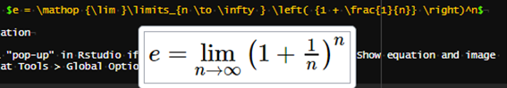
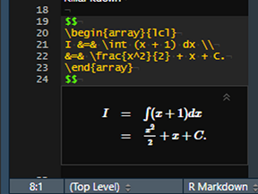

Unfortunately, I haven't had as much time to make blog posts
in the past year or so. 
I started taking classes as part of 
[Georgia Tech's Online Master of Science in Analytics (OMSA)](https://pe.gatech.edu/degrees/analytics)
program last summer (2018) while continuing to work full-time, so extra time
to code and write hasn't been abundant for me.

Anyways, I figured I would share one neat thing I learned
as a consequence of taking classes---writing compact 
["cheat sheets"](https://en.wikipedia.org/wiki/Cheat_sheet)
with [`{rmarkdown}`](https://rmarkdown.rstudio.com/). [^1]
 
[^1]: For those unfamiliar with the concept of a cheat sheet, there's no malice in it, despite what the moniker implies. From my experience, it is relatively common for teachers to let students use self-created note sheets (i.e. cheat sheets) for aid with taking exams.

Writing with `{rmarkdown}` is fairly straightforward---mostly
thanks to an abundance of freely available learning resources, like the 
[***R Markdown: The Definitive Guide***](https://bookdown.org/yihui/rmarkdown)---and using
[CSS](https://www.w3schools.com/css/default.asp) to customize your Rmarkdown output to your liking
is not too difficult either.
(By the way, huge shout-out to [Yihui Xie](https://yihui.name/)
and everyone else who has contributed
to the development of the `{rmarkdown}` package.)
My objective was to make an **extremely** compact PDF
that minimizes all white space [^4].
Despite my knowledge of CSS,
I had a hard time getting an output that I liked purely from CSS,
so I looked online to see if I could find some good LaTex templates.
(After all, I would be knitting the Rmarkdown document to PDF,
and [LaTex](https://www.latex-project.org/) would be incorporated 
via the equations on the cheat sheet.)
Some templates I found worked fine but weren't completely to my liking. [^5]


[^4]: in order to maximize the amount of space used for content, of course

[^5]: One of the ones that I really liked was [this one](https://github.com/tim-st/latex-cheatsheet). However, it's a bit more complex than I wanted. (This one implements a "structure" in which one "main" tex file references several others with the `\input` Latex command.)


In my search for an "ideal" template, I stumbled upon a small tidbit
in the very last portion of the 
[PDF chapter of the ***R Markdown*** book](https://bookdown.org/yihui/rmarkdown/pdf-document.html)
stating "You can also replace the underlying pandoc template using the template option". 🤔

At first, I was a bit intimidated by the idea of writing my own template.
("I have to write my own template from scratch
using a framework (LaTeX) that I've hardly even touched before now! 😨")
But alas, the task became less intimidating when I realized that
I could use the tried-and-true method of copying-pasting-modifying
from [Stack Overflow](https://stackoverflow.com/)!

## The Template

Using the template from
[this Stack Overflow post](https://tex.stackexchange.com/questions/8827/preparing-cheat-sheets) [^6] as a basis, I ended
up creating a relatively minimal template.
For the curious reader, see [this GitHub repo](https://github.com/tonyelhabr/cheat-sheet-rmarkdown),
for the latest version of my template. It also includes an example cheat sheet.


[^6]: which was super helpful for a LaTex noob like me because it has comments explaining what specific lines/sections are doing

The "gist" of my template is shown below.

```
% Packages and preamble
[...]

\begin{document}

\begin{multicols*}{4}

$body$
\end{multicols*}

\end{document}
```


The key for me was to understand how [pandoc variables](https://pandoc.org/MANUAL.html#variables-for-latex)
like `$body$` are used as placeholders for user-supplied content.
(I know I haven't mentioned [pandoc](https://pandoc.org/) up to this point, 
but suffice it to say that
it---along with the R package [`{knitr}`](https://yihui.name/knitr/)---are what power the `{rmarkdown}` package.)


The `multicols` command shown in the snippet above is also noteworthy. This
LaTex command provides the functionality for I wanted most for my 
cheat sheet---multiple columns of content!
I should point out that there are `in_header`, `before_body`, and `after_body` YAML options for customizing PDF output with `{rmarkdown}`. [^7]

[^7]: See the [PDF chapter of the ***R Markdown*** book](https://bookdown.org/yihui/rmarkdown/pdf-document.html) for some guidance with these.

These options are probably sufficient for most people's customization needs
(so using a custom template would not be necessary).
But for me personally, the appeal of having "complete" control
of my output by using a template convinced me to forego these options. [^8]

[^8]: I'm sure I could create a perfectly fine cheat sheet using just these options, or, even re-create the output that I have achieved with my template.

## Usage

So, exactly how do you use a custom template with `{rmarkdown}`?
It's as simple as specifying the path to your template file with the `template`
option in the YAML header of your Rmarkdown document. [^9]

[^9]: You can specify other options as well, such as `keep_latex: true`
o  an alternative LaTex engine with `latex_engine`.


```
---
output:
  pdf_document:
    includes:
      template: {/path/to/template.tex}
---
```

## Why This Way?

Before I was using [Rstudio](https://www.rstudio.com/) and `{rmarkdown}` to write my cheat sheets,
I tried out a couple of LaTex editors [^10].
First, I tried the very popular [Overleaf](https://www.overleaf.com).
It is well known and commonly used because
it is web-based, allows the user to collaborate in real-time, and
provides real-time previewing [^11].
However, there was just something that felt "clunky" about the editor, and
the ambiguity over package versions and usage was bothersome to me. [^12]
The other editor I tried for some time was [TeXworks](http://www.tug.org/texworks/)
(with the [pdftex distribution](https://ctan.org/pkg/pdftex?lang=en))
Using the "Typset" command to generate my PDF output on an ad-hoc basis seemed to me
to be a satisfactory workflow, but, among other things, I felt limited by the customization
offered by TeXworks. [^13]

[^10]: and [there are lots of them out there](https://tex.stackexchange.com/questions/339/latex-editors-ides)

[^11]: The live preview feature is probably my favorite of all.

[^12]: Others may view the hands-off approach to package management as an advantage of using Overleaf.

[^13]: Perhaps this is the fault of my own. Perhaps all the customization that I would like exists and I just have not discovered how to enable it.

And so I turned to Rstudio and `{rmarkdown}` and didn't look back.
While learning how to create a custom template was a (minor) inconvenience,
it has paid off in a number of ways:

+ I can use a familiar editor---Rstudio.

+ I can use a familiar workflow---writing in an Rmarkdown document and `knit`ting to create my desired output.

+ Because I'm using `{rmarkdown}`, I can use `{rmarkdown}` functionality that is not available when solely writing in LaTex.

This last point is huge.
**The whole world of [markdown](https://daringfireball.net/projects/markdown/) syntax is valid!**
For example,
I can add emphasis to text with markdown's `**` and `__` tokens (instead of LaTex's more "verbose" syntax);
I can use `#` to define section headers (which I just think is super "elegant");
and I can use HTML comments to comments out multiple lines of text.
(Note that native LaTex only has a single-line comment token---`%`. [^14])
Additionally, beyond just the markdown functionality, I can include `R` code
thanks to added layer of functionality offered by `{rmarkdown}`.

[^14]: I realize that you can define custom commands or use a package to create multi-line comments in LaTex, but that ruins the point that I'm trying to make 😊.

The one big thing that I feel like I "sacrificed" by moving to Rstudio and `{rmarkdown}`
is the live preview feature that comes with Overleaf (and can be emulated
with some configuration in other LaTex editors). Nonetheless, I feel like I get
a reasonable facsimile of this feature with Rstudio's functionality
for inline previews of equations. [^15]
Below are examples of the preview capabilities for both single- and
multi-line equations.

[^15]: See the "Show equation and image previews" option in Tools > Global Options... > R Markdown.






## What Works for Me May Not Work For You

Although what I've described in this post has been working well for me---and
I'd encourage others to try it out---I don't claim it
to be the "best" solution for all of your cheat sheet needs. [^16]
If you've got a workflow that works for you, that's great! Keep using it!
Be pragmatic.

[^16]: I wouldn't be surprised if I find a better workflow for myself in the future.

