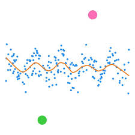
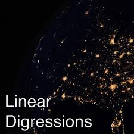
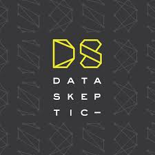
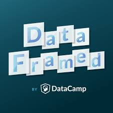

***UPDATE: This post was updated on 2019-06-30.***

I love podcasts. I would estimate that I listen to between 1 to 6 (yes,
6 <f0><U+009F><U+0098><U+00B1>) per day. Consequently, I have opinions
on podcasts.

If you're still [listening to podcasts at regular
speed](https://www.buzzfeed.com/doree/meet-the-people-who-listen-to-podcasts-at-super-fast-speeds),
then I'm not sure I can respect you. (I'm kidding... kind of.) I
personally, find that 2x speed is right for me--not so fast that I can't
understand anything, but also not slow enough where I can lose interest
due to pacing. Of course, I'm not completely absorbing everything that I
listen to, but I'm not too concerned with that--I mostly listen to
sports/comedy podcasts, where I don't *need* to remember the
conversation. In the case that I do want to listen intently to
something, then I won't hesitate to slow it down (probably only to 1.5x,
because 1x still feels like glaciers moving).

Aside from sports and comedy podcasts, I do also listen to "smart"
podcasts to provide a much needed change of pace for myself, such as
those discussing data science. With my self-proclaimed expertise when it
comes to the podcast ecosphere, I thought I would make a list of the
main data science ones that I enjoy.

This is not a novel idea--there are plenty of other articles
ranking/listing data science podcasts. Nonetheless, I provide my list
with the disclaimer that it is *completely subjective*, given from the
point of view of a person who does not generally listen to podcasts for
entertainment purposes (but can still appreciate a high-quality podcast
irregardless of its entertainment value). Also, just for fun, I provide
unique "ratings" using model-related error metrics/term for each
podcast. These arbitrary ratings are exactly that--arbitrary (although
the reader may be tempted to infer some kinds of meaning from them).

In no particular order...

[Not So Standard Deviations](http://nssdeviations.com/)
-------------------------------------------------------

-   **Personal Rating:** 0.72 [ROC
    AUC](https://en.wikipedia.org/wiki/Receiver_operating_characteristic#Area_under_the_curve)
-   **Average Episode Length:** 45 min.
-   **Publishing Frequencty:** Approx. every 2 weeks

[Roger Peng](https://twitter.com/rdpeng) and [Hilary
Parker](https://twitter.com/hpster) have a really nice chemistry on
their (shrewdly-named) podcast [Not So Standard
Deviations](http://nssdeviations.com/). I think that they capture the
sense of humor/charisma of the data science community at larger better
than any of the other data science podcasts that I have listened to. For
example, their "off-the-wall" podcast names, such as ["46 - Uncanny
Valley of
Stickerness"](http://nssdeviations.com/46-uncanny-valley-of-stickerness)
or ["Episode 42 - One Piece
PJs"](http://nssdeviations.com/episode-42-one-piece-pjs), would leave
you guessing as to what kind of podcast it is. This is not to say that
they're unintelligible in any way--they blend light-hearted, off-topic
conversation with current event news regarding the data science realm
seamlessly.

After quickly perusing the web for articles written about data science
podcasts, I was surprised to see this one missing from a lot of lists
(or not ranked highly). It's been around since 2015, so I would think
exposure would not be a problem.)

[Linear Digressions](http://lineardigressions.com/)
---------------------------------------------------

-   **Personal Rating:** 0.15 [Brier
    score](https://en.wikipedia.org/wiki/Brier_score)
-   **Average Episode Length:** 30 min.
-   **Publishing Frequencty:** weekly

[Katie Malone](https://twitter.com/multiarmbandit) and [Ben
Jaffe](https://twitter.com/benjaffe) put out weekly podcasts that have a
consistent format--discussion of a single data-related concept, where
Katie, a physicist-turned-data-scientist plays the role of a teacher and
Ben, a web developer with interest in data scientist, plays the role of
the student. This "gimmick" plays well to me as a listener, particularly
when I am unfamiliar with the topic which an episode is discussing.
While I rarely laugh at the intentional corny joke that Ben (and
sometimes Katie) prepare for the open of the podcast, I can appreciate
the effort.

[Data Skeptic](https://dataskeptic.com/)
----------------------------------------

-   **Personal Rating:** 0.68 [R
    squared](https://en.wikipedia.org/wiki/Coefficient_of_determination)
-   **Average Episode Length:** 30 min.
-   **Publishing Frequencty:** Weekly

The [Data Skeptic](https://dataskeptic.com/) podcast hosted by [Kyle
Polich](https://dataskeptic.com/contributors/kyle) provides a mixed bag
of weekly content--episodes either feature guests from industry and
academia individual interviews, or they provide brief technical
discussion of specific concepts on "mini" episodes, where Kyle is joined
by co-host [Linh Da Tran](https://dataskeptic.com/contributors/linhda))
on "mini" episodes. While the interview episodes are "hit-or-miss"
material for me depending on the guest and my interest in a particular
subject, the mini technical episodes are worth a listen regardless of
the topic. It follows a teacher-student format (very similar to the
[Linear Digressions](http://lineardigressions.com/) format) in these
episodes, where Kyle plays the role of the teacher and Linh plays the
role of the student. Linh sense of naivety and her "outsider"
perspective echos with me as a listener who may be unfamiliar with the
topic that Kyle is presenting.

[DataFramed](https://www.datacamp.com/community/podcast)
--------------------------------------------------------

***UPDATE: Note that this podcast seems to have been discontinued
amidst the [DataCamp scandal](https://www.buzzfeednews.com/article/daveyalba/datacamp-sexual-harassment-metoo-tech-startup)
and [fallout](https://noamross.github.io/datacamp-sexual-assault/)
in April 2019.***

-   **Personal Rating:** 0.4 [Euclidean
    norm](https://en.wikipedia.org/wiki/Norm_(mathematics)#Euclidean_norm)
-   **Average Episode Length:** 1 hour
-   **Publishing Frequency:** Weekly

Host [Hugo Bowne-Anderson](https://twitter.com/hugobowne) brings on
experts from industry and academia for "deep-dive" interviews in order
to explore an underlying question--"What is data science?". This is the
most structured podcast of the ones that I've listed, which actually
makes it unique in a way. I really like some of the questions that Hugo
asks to every guest (e.g. "Where do you see data science going in the
future?", a question that is ironic because it asks the guest to make a
prediction regarding a field of study that is nearly all about making
predictions) because it helps the listener gauge exactly how different
experts view their roles/responsibilities in the data science realm at
large. I look forward to seeing how this podcast (which was only started
at the beginning of 2018) grows in the future.

[The R Cast](https://r-podcast.org/)
------------------------------------

-   **Personal Rating:** 0.22 [Kolmogorov–Smirnov
    statistic](https://en.wikipedia.org/wiki/Kolmogorov%E2%80%93Smirnov_test#Kolmogorov%E2%80%93Smirnov_statistic)
-   **Average Episode Length:** 30 min.
-   **Publishing Frequency:** Very infrequent

Despite the great amount of irregularity in release of episodes of the
[The R Cast](https://r-podcast.org/) (it has had just over 20 episodes
between the beginning of 2018 its inaugural episode in early 2012), I
applaud the content that host [Eric Nantz](https://twitter.com/thercast)
(@thercast) provides. The podcast has changed a lot over time, as Eric
has seemingly transitioned from concept-centric episodes to
guest-focused one. While its content is by no means "superb", I think
that I have reserved a special place in my heart for this podcast simply
because Eric is extremely relatable--he just seems like a normal,
hard-working guy who loves R and wants to give back to the community
whatever he can. While I can't stand the cheesy video-game music that he
uses for transitions, I suffer through it because it somehow symbolizes
his "average-Joe-just-trying-to-do-his-best" complex to me.

[Python Bytes](https://pythonbytes.fm/)
------------------------------------

-   **Personal Rating:** 0.81 [Hamming distance](https://en.wikipedia.org/wiki/Hamming_distance)
-   **Average Episode Length:** 20 min.
-   **Publishing Frequency:** Once per week

In this weekly podcast, co-hosts [Michael Kennedy](https://blog.michaelckennedy.net/)
and [Brian Okken](http://pythontesting.net/) provide listeners with about
set of "quick hits", usually covering recent news in the `python` ecosphere.
Even though I don't use `python` as much as I do `R`, I want to be able
to stay connected to both communities. Understanding what's going on in
the `python` community can provide some insight into the `rstats` community.
(For example, if package development and maintenance has become a hot topic
amongst `python` developers, those discussion might spill over to the `R`
developer community.) Additionally, if I do need to spend lots of time
doing a `python` project, I want to feel confident that I'm up-to-date
on current `python` best practices.

Others Worth Mentioning
-----------------------

These other podcasts are ones that I have tried out, but don't really
listen to on a consistent basis.

-   [Partially Derivative](http://partiallyderivative.com/)

Similar to [Not So Standard Deviations](http://nssdeviations.com/) in
style (i.e. ranges from casual conversation to serious discussion of
topics).

-   [Learning Machines 101](http://www.learningmachines101.com/)

Topic-based, which makes it easy to go through and pick episodes at
random from its relatively large archive. Probably the most technical
show that I've listened (as implied by the podcast's name), which can
make it difficult to follow. Nonetheless, high quality content.

-   [Talk Python To Me](https://talkpython.fm/)

Definitely a good show for `python` enthusiasts. [^1] I binged a ton of
episodes when I was picking up `python`. However, ever since I've
started using `R` as my main language, I've put this one on the
back-burner.
-   [O'Reilly Data Show Podcast](https://www.oreilly.com/topics/oreilly-data-show-podcast)

Episodes consist mostly of interviews with industry guests. Seems to be
more focused on "big data" and enterprise applications. Not super
engaging for me simply because it is nearly all business talk.

-   [Data Stories](http://datastori.es/)

Focused more so on data visualization than any of the other podcasts.
Guest-oriented. Provides a TED-talk kind of vibe.

--------------------------------------------------------------------------------

[^1]: This podcast is hosted by [Michael Kennedy](https://blog.michaelckennedy.net/), so if you enjoy [Python Bytes](https://pythonbytes.fm/), then you'll probably like this one too.
