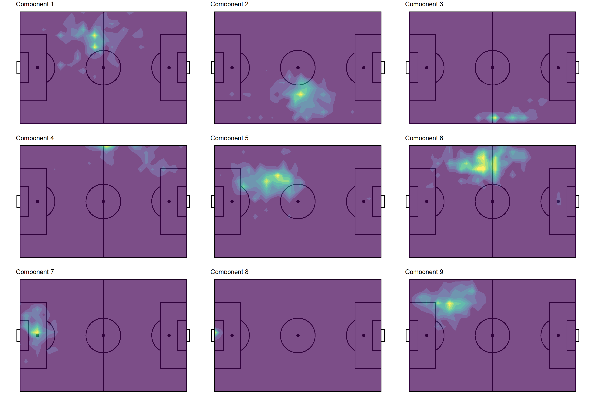

While reading up on modern soccer analytics ([I've had an itch for soccer and tracking data recently](https://www.tonyelhabr.rbind.io/soccer-pitch-control-r)), I stumbled upon [an excellent set of tutorials]((https://github.com/devinpleuler/analytics-handbook)) written by [Devin Pleuler](https://twitter.com/devinpleuler). In particular, his notebook on [non-negative matrix factorization (NNMF)](https://en.wikipedia.org/wiki/Non-negative_matrix_factorization) caught my eye. I hadn't really heard of the concept before, but it turned out to be much less daunting once I realized that it is just another type of matrix decomposition. [Singular value decomposition (SVD)](https://en.wikipedia.org/wiki/Singular_value_decomposition), which I'm much more familiar with, belongs to the same family of calculations (although NNMF and SVD are quite different). In an effort to really gain a better understanding of NNMF, I set out to emulate his notebook.

In the process of converting his python code to R, I encountered three challenges with resolutions worth documenting.

1)  Before the NNMF calculation, I needed to perform [non-equi join](https://www.w3resource.com/sql/joins/perform-a-non-equi-join.php) with a fairly size-able data set. Unfortunately, [`{dplyr}`](https://dplyr.tidyverse.org/)[^1] does not have built-in support for such a join 😭. I tossed aside any kind of personal implicit bias against [`{data.table}`](https://cran.r-project.org/web/packages/data.table/index.html)---which is certainly the go-to option in the R ecosystem for non-equi joins---and used it for this process.

2)  For the NNMF calculation, the only R implementation (that I could find) comes with the [{NMF} package](https://cran.r-project.org/web/packages/NMF/index.html)[^2], which requires the installation of the [Bioconductor-exclusive {BiocManager} package](https://cran.r-project.org/web/packages/BiocManager/index.html). I'm relatively unfamiliar with [Bioconductor](https://www.bioconductor.org/), so this was not very appealing (although I did end up downloading `{NMF}` and trying it out). Instead, I ended up using [`{reticulate}`](https://rstudio.github.io/reticulate/) to call the [`skearn.decomposition.NMF()`](https://scikit-learn.org/stable/modules/generated/sklearn.decomposition.NMF.html) function directly (as is done in the python code). This is a perfect example of using `{reticulate}` for a non-trivial reason (i.e. for an algorithm).

3)  After the NNMF computation, I needed to perform [2-D Gaussian smoothing](https://en.wikipedia.org/wiki/Gaussian_blur), which is helpful for making the output of the NNMF output more interpretable. The [`{spatstat}` package](https://cran.r-project.org/web/packages/spatstat/index.html) had just the function for the job (`spatstat::blur()`), and it all it took for me was to write some a tidy wrapper function to integrate it nicely into my workflow.

[^1]: the go-to package for data manipulation and all SQL-ish things

[^2]: Non-negative matrix factorization may also be abbreviated just as NMF, hence the package name.

I've always considered myself a "whatever gets the job done" kind of person, not insistent on ignoring solutions that use "base" R, `{data.table}`, python, etc. Nonetheless, replicating Devin's notebook really underscored the importance of being comfortable outside of a `{tidyverse}`-centric workflow.

Anyways, this post outlines the code and my thought process in porting Devin's code to R. I'll skip some of the details, emphasizing the things that are most interesting.

## Data

We'll be working with the [open-sourced StatsBomb data](https://github.com/statsbomb/open-data) for the [2018 Men's World Cup](https://en.wikipedia.org/wiki/2018_FIFA_World_Cup), which I've called `events` below. [^3]

[^3]: There's nothing too interesting about the data retrieval---I've essentially just called `StatsBombR::FreeCompetitions()`, `StatsBombR::FreeMatches()`,`StatsBombR::FreeEvents()`, and `StatsBombR::allclean()` in succession for `competition_id = 43`.

This is a relatively large data set with lots of columns (and rows). However, we only need three columns for what we're going to do: (1) a unique identifier for each player, `player_id`, along with their (2) `x` and (3) `y` coordinates.


```r
library(tidyverse)
```


A quick summary of the data shows that there are 603 unique players, and that the `x` and `y` coordinates range from 1 to 120 (yards) and 1 to 80 respectively.


```r
events <-
  events %>% 
  select(player_id = player.id, x = location.x, y = location.y) %>% 
  drop_na() %>% 
  summarize(
    n = n(),
    n_player = n_distinct(player_id),
    across(c(x, y), list(min = min, max = max, mean = mean))
  )
events
```

    ## # A tibble: 1 x 8
    ##       n n_player x_min x_max x_mean y_min y_max y_mean
    ##   <int>    <int> <dbl> <dbl>  <dbl> <dbl> <dbl>  <dbl>
    ## 1 224018      603     1   120  60.05     1    80  40.37

## Non-Equi Joining with `{data.table}`

Our first challenge is to convert the following chunk of python.


```python
import numpy as np

x_scale, y_scale = 30, 20

x_bins = np.linspace(0, 120, x_scale)
y_bins = np.linspace(0, 80, y_scale)

players = {}

for e in events:
    if 'player' in e.keys():
        player_id = e['player']['id']
        if player_id not in players.keys():
            players[player_id] = np.zeros((x_scale, y_scale))
        try:
            x_bin = int(np.digitize(e['location'][0], x_bins[1:], right=True))
            y_bin = int(np.digitize(e['location'][1], y_bins[1:], right=True))
            players[player_id][x_bin][y_bin] += 1
        except:
            pass
```

This code creates a nested `dict`, where the keys are player id's and the values are 20x30 matrices. Each element in the matrix is an integer that represents the count of times that the player was recorded being at a certain position on the pitch. (These counts range from 0 to 94 for this data set.)

Some technical details:

1.  The python `events` is actually a pretty heavily nested list[^4], hence the non-rectangular operations such as `e['player']['id']`.
2.  Observations with missing coordinates are ignored with the `try`-`except` block.
3.  `x` and `y` values (elements of the `'location'` sub-list) are mapped to "bins" using `numpy`'s `digitize()` function, which is analogous to `base::cut()`.

[^4]: minimally converted from the original JSON format

How can we do this same data manipulation in an idiomatic R fashion? We could certainly create a named list element and use `base::cut()` to closely match the python approach. However, I prefer to stick with data frames and SQL-ish operations since I think these are much more "natural" for R users.[^5]

[^5]: compared to `dict` and `list`s or python users

So, going forward with data frames and joins, it's quickly apparent that we'll have to do some non-equi joining. `{fuzzyjoin}` and [`{sqldf}`](https://cran.r-project.org/web/packages/sqldf/index.html) offer functionality for such an approach, but `{data.table}` is really the best option. The only minor inconvenience here is that we have to explicitly coerce our `events` data frame to a data.table.

We'll also need a helper, grid-like data frame to assist with the binning. The 600-row `grid_xy_yards` data frame (30 `x` bins \* 20 `y` bins) below is essentially a tidy definition of the cells of the grid upon which we are binning the `events` data. (One can use whatever flavor of `crossing()`, `expand.grid()`, `seq()`, etc. that you prefer to create a data frame like this.)

Visually, this grid looks like this.


And if you prefer numbers instead of a chart, see the first 10 rows below.


```r
grid_xy_yards
```

    ## # A tibble: 600 x 5
    ##     idx     x      y next_y next_x
    ##   <int> <dbl>  <dbl>  <dbl>  <dbl>
    ## 1     1     0  0      4.211  4.138
    ## 2     2     0  4.211  8.421  4.138
    ## 3     3     0  8.421 12.63   4.138
    ## 4     4     0 12.63  16.84   4.138
    ## 5     5     0 16.84  21.05   4.138
    ## 6     6     0 21.05  25.26   4.138
    ## 7     7     0 25.26  29.47   4.138
    ## 8     8     0 29.47  33.68   4.138
    ## 9     9     0 33.68  37.89   4.138
    ## 10    10     0 37.89  42.11   4.138
    ## # ... with 590 more rows

Two things to note about this supplementary data frame:

1.  Cells aren't evenly spaced integers, i.e. `x` cells are defined at 0, 4.138, 8.276, ..., 80 instead of something like 0, 4, 8, ..., 80, and `y` cells are defined at 0, 4.211, 8.421, ..., 120 instead of something like 0, 4, 8, ..., 120). That's simply due to using 30 and 20 instead of 31 and 21 to split up the `x` and `y` ranges respectively. I point this out because this SQL-ish approach would have been much easier if these numbers were just integers! We could have done an inner join on an integer grid instead of non-equi-joining upon a grid of floating point numbers. Unfortunately, joining on floating point numbers as keys leads to [inconsistent results, simply due to the nature of floating points](https://stackoverflow.com/questions/52207851/how-do-you-join-on-floating-point-columns-in-sql).[^6]

2.  The index `idx` is important! This will come back into play when we do the NNMF procedure, at which point we'll "flatten" out our `x`-`y` pairs into a 1-d format.

[^6]: A potential solution would be to round the floating point numbers before joining and "restore" them after the join, but that's just kluge-y and inelegant.

Ok, on to the actual data joining.


```r
events_dt <- events %>% drop_na() %>% data.table::as.data.table()
grid_xy_yards_dt <- grid_xy_yards %>% data.table::as.data.table()

# We don't even have to load `{data.table}` for this to work!
events_binned <-
  events_dt[grid_xy_yards_dt, on=.(x > x, x <= next_x, y >= y, y < next_y)] %>% 
  as_tibble() %>% 
  select(player_id, idx, x, y)
events_binned
```

    ## # A tibble: 224,038 x 4
    ##    player_id   idx     x     y
    ##        <int> <int> <dbl> <dbl>
    ##  1      5462     1     0     0
    ##  2      5467     1     0     0
    ##  3      5488     1     0     0
    ##  4      3632     1     0     0
    ##  5      5576     1     0     0
    ##  6      5595     1     0     0
    ##  7      5263     1     0     0
    ##  8      4063     1     0     0
    ##  9      5231     1     0     0
    ## 10      5231     1     0     0
    ## # ... with 224,028 more rows

In retrospect, this join was pretty straightforward!

The rest of the code below is just doing the actual tallying.

1.  First, we make an intermediate data set `grid_players`, which is the Cartesian product of all possible cells in the grid and all players in `events`.
2.  Second, we "add back" missing cells to `events_binned` using the intermediate data set `grid_players`.

In the end, we end up with a `players` data frame with 603 `player_id`s \* 30 `x` bins \* 20 `y` bins = 361,800 rows.


```r
# This `dummy` column approach is an easy way to do a Cartesian join when the two data frames don't share any column names.
grid_players <-
  grid_xy_yards %>% 
  mutate(dummy = 0L) %>% 
  # Cartesian join of all possible cells in the grid and all players in `events`.
  full_join(
    events %>% 
      drop_na() %>% 
      distinct(player_id) %>% 
      mutate(dummy = 0L),
    by = 'dummy'
  )

players <-
  events_binned %>% 
  group_by(player_id, x, y, idx) %>% 
  summarize(n = n()) %>% 
  ungroup() %>% 
  # Rejoin back on the grid to 'add back' cells with empty counts (i.e. `n = 0`).
  full_join(grid_players, by = c('player_id', 'x', 'y', 'idx')) %>% 
  select(-dummy, -next_x, -next_y) %>% 
  replace_na(list(n = 0L)) %>% 
  arrange(player_id, x, y)
players
```

    ## # A tibble: 361,800 x 5
    ##    player_id     x      y   idx     n
    ##        <int> <dbl>  <dbl> <int> <int>
    ##  1      2941     0  0         1     0
    ##  2      2941     0  4.211     2     0
    ##  3      2941     0  8.421     3     0
    ##  4      2941     0 12.63      4     0
    ##  5      2941     0 16.84      5     0
    ##  6      2941     0 21.05      6     0
    ##  7      2941     0 25.26      7     0
    ##  8      2941     0 29.47      8     0
    ##  9      2941     0 33.68      9     0
    ## 10      2941     0 37.89     10     0
    ## # ... with 361,790 more rows

To make this a little bit more tangible, let's plot Messi's heatmap. (Is this really a blog post about soccer if it doesn't mention Messi 😆?)


## Non-Negative Matrix Factorization (NNMF) with `{reticulate}` and `sklearn`

Next up is the actual NNMF calculation. I don't care if you're the biggest R [stan](https://www.urbandictionary.com/define.php?term=Stan) in the world---you have to admit that the python code to perform the NNMF is quite simple and (dare I say) elegant.


```python
from sklearn.decomposition import NMF

# Flatten individual player matrices into shape=(600,) which is the product of the original shape components (30 by 20)
unraveled = [np.matrix.flatten(v) for k, v in players.items()]
comps = 30
model = NMF(n_components=comps, init='random', random_state=0)
W = model.fit_transform(unraveled)
```

After re-formatting our `players` data into a wide format---equivalent to the `numpy.matrix.flatten()` call in the python code---we could use the `{NMF}` package for an R replication.


```r
# Convert from tidy format to wide format (603 rows x 600 columns)
players_mat <-
  players %>% 
  select(player_id, idx, n) %>% 
  pivot_wider(names_from = idx, values_from = n) %>% 
  select(-player_id) %>% 
  as.matrix()

comps <- 30L
W <- NMF::nmf(NMF::rmatrix(players_mat), rank = comps, seed = 0, method = 'Frobenius')
```

However, I found that the results weren't all that comparable to the python results. (Perhaps I needed to define the arguments in a different manner.) So why not use `{reticulate}` and call the `sklearn.decomposition.NMF()` function to make sure that we exactly emulate the python decomposition?


```r
sklearn <- reticulate::import('sklearn')
# Wont' work if `n_components` aren't explicitly defined as integers!
model <- sklearn$decomposition$NMF(n_components = comps, init = 'random', random_state = 0L)
W <- model$fit_transform(players_mat)
```

The result includes 30 20x30 matrices---one 30x20 `x`-`y` matrix for each of the 30 components (`comps`). We have some wrangling left to do to gain anything meaningful from this NNMF procedure, but we have something to work with!

## Gaussian Smoothing with `{spatstat}`

The last thing to do is to post-process the NNMF results and, of course, make pretty plots. The python plotting is pretty standard `matplotlib`, with the exception of the Gaussian smoothing performed on each component's matrix `model.component_` in the loop to make sub-plots.


```python
from scipy.ndimage import gaussian_filter

for i in range(9):
    # ... Excerpted
    z = np.rot90(gaussian_filter(model.components_[i].reshape(x_scale, y_scale), sigma=1.5), 1)
    # ... Excerpted
```

The first 9 smoothed component matrices come out looking like this. [^7]

[^7]: There is nothing stopping us from plotting all 30 components---and, in fact, Devin does in his notebook---but I think it's easier to digest a fraction of the components (for pedagogical purposes).


There's a couple of steps involved to do the same thing in R.

1.  First, we'll convert the components matrices to a tidy format, `decomp_tidy`

2.  Second, we'll join our tidied components matrices with our tidy grid of cells, `grid_xy_yards`, and convert our `x` and `y` bins to integers in preparation of the matrix operation performed in the subsequent step.

3.  Lastly, we'll perform the Gaussian smoothing on nested data frames with a custom function, `smoothen_dimension`, that wraps `spatstat::blur()`. This function also maps `idx` back to field positions (in meters instead of yards) using the supplementary `grid_xy_rev_m`[^8] data frame (which is a lot like `grid_xy_yards`)

[^8]: StatsBomb data treats the origin as the top-left corner of the pitch, which I find inconvenient for plotting since I prefer the origin to be the bottom left. Thus, this grid also flip the y-axis of the grid, hence the `_rev` part of the variable name.


```r
# 1
decomp_tidy <-
  model$components_ %>% 
  as_tibble() %>% 
  # "Un-tidy" tibble with 30 rows (one for each dimension) and 600 columns (one for every `idx`)
  mutate(dimension = row_number()) %>% 
  # Convert to a tidy tibble with dimensions * x * y rows (30 * 30 * 20 = 1800)
  pivot_longer(-dimension, names_to = 'idx', values_to = 'value') %>% 
  # The columns from the matrix are named `V1`, `V2`, ... `V600` by default, so convert them to an integer that can be joined on.
  mutate(across(idx, ~str_remove(.x, '^V') %>% as.integer()))

# 2
decomp <-
  decomp_tidy %>% 
  # Join on our grid of x-y pairs.
  inner_join(
    # Using `dense_rank` because we need indexes here (i.e. 1, 2, ..., 30 instead of 0, 4.1, 8.2, ..., 120 for `x`).
    grid_xy_yards %>% 
      select(idx, x, y) %>% 
      mutate(across(c(x, y), dense_rank))
  )

# 3
smoothen_component <- function(.data, ...) {
  mat <-
    .data %>% 
    select(x, y, value) %>% 
    pivot_wider(names_from = x, values_from = value) %>% 
    select(-y) %>% 
    as.matrix()
  
  mat_smoothed <-
    mat %>% 
    spatstat::as.im() %>% 
    # Pass `sigma` in here.
    spatstat::blur(...) %>% 
    # Could use `spatstat::as.data.frame.im()`, but it converts directly to x,y,value triplet of columns, which is not the format I want.
    pluck('v')
  
  res <-
    mat_smoothed %>% 
    # Convert 20x30 y-x matrix to tidy format with 20*30 rows.
    as_tibble() %>% 
    mutate(y = row_number()) %>% 
    pivot_longer(-y, names_to = 'x', values_to = 'value') %>% 
      # The columns from the matrix are named `V1`, `V2`, ... `V30` by default, so convert them to an integer that can be joined on.
    mutate(across(x, ~str_remove(.x, '^V') %>% as.integer())) %>% 
    arrange(x, y) %>% 
    # "Re-index" rows with `idx`, ranging from 1 to 600.
    mutate(idx = row_number()) %>% 
    select(-x, -y) %>% 
    # Convert `x` and `y` indexes (i.e. 1, 2, 3, ..., to meters and flip the y-axis).
    inner_join(grid_xy_rev_m) %>% 
    # Re-scale smoothed values to 0-1 range.
    mutate(frac = (value - min(value)) / (max(value) - min(value))) %>% 
    ungroup()
  res
}

decomp_smooth <-
  decomp %>% 
  nest(data = -c(dimension)) %>% 
  # `sigma` passed into `...` of `smoothen_component()`. (`data` passed as first argument.)
  mutate(data = map(data, smoothen_component, sigma = 1.5)) %>% 
  unnest(data)
decomp_smooth
```

<div>

    ## # A tibble: 18,000 x 8
    ##    dimension    value   idx     x     y next_y next_x     frac
    ##        <int>    <dbl> <int> <dbl> <dbl>  <dbl>  <dbl>    <dbl>
    ##  1         1 0.002191     1     0 68     4.211  4.138 0.004569
    ##  2         1 0.004843     2     0 64.42  8.421  4.138 0.01064 
    ##  3         1 0.008334     3     0 60.84 12.63   4.138 0.01863 
    ##  4         1 0.01130      4     0 57.26 16.84   4.138 0.02541 
    ##  5         1 0.01258      5     0 53.68 21.05   4.138 0.02834 
    ##  6         1 0.01208      6     0 50.11 25.26   4.138 0.02719 
    ##  7         1 0.01033      7     0 46.53 29.47   4.138 0.02319 
    ##  8         1 0.008165     8     0 42.95 33.68   4.138 0.01824 
    ##  9         1 0.006156     9     0 39.37 37.89   4.138 0.01364 
    ## 10         1 0.004425    10     0 35.79 42.11   4.138 0.009680
    ## # ... with 17,990 more rows

</div>

With the data in the proper format, the plotting is pretty straightforward `{ggplot2}` code (so it's excerpted).


Viola! I would say that our R version of the python plot is very comparable (just by visual inspection). Note that we could achieve a similar visual profile without the smoothing---see below---but the smoothing undoubtedly makes pattern detection a little less ambiguous.




From the smoothed contours, we can discern several different player profiles (in terms of positioning).

-   Components 1, 5, 9: left back
-   Components 2: right midfielder
-   Component 3: attacking right midfielder
-   Component 4: wide left midfielder
-   Component 6: central left midfielder
-   Components 7, 8: goalkeeper

The redundancy with left back and goalkeeper is not ideal. That's certainly something we could fine tune with more experimentation with components. Anyways, the point of this post wasn't so much about the insights that could be gained (although that's ultimately what stakeholders would be interested in if this were a "real" analysis).

## Conclusion

Translating python code can be challenging, throwing us off from our typical workflow (for me, being `{tidyverse}`-centric). But hopefully one can see the value in "doing whatever it takes", even if it means using "non-tidy" R functions (e.g. `{data.table}`, matrices, etc.) or a different language altogether.


