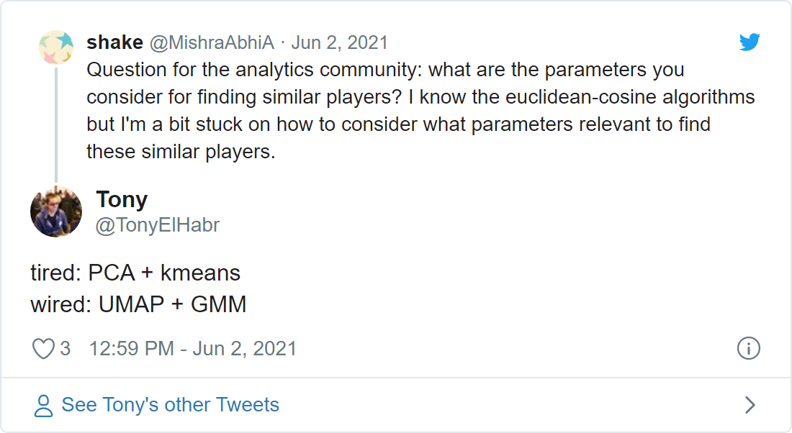

```{r setup, include=F, echo=F, cache=F}
knitr::opts_chunk$set(
  include = TRUE,
  echo = TRUE,
  cache = FALSE,
  eval = FALSE,
  cache.lazy = FALSE,
  fig.show = 'hide',
  fig.align = 'center',
  fig.width = 8,
  fig.asp = 0.75,
  fig.retina = 2,
  warning = FALSE,
  message = FALSE
)
```

## Introduction

Combining [principal component analysis (PCA)](https://en.wikipedia.org/wiki/Principal_component_analysis) and [kmeans clustering](https://en.wikipedia.org/wiki/K-means_clustering) seems to be a pretty popular 1-2 punch in data science. I'm not here to illustrate when using both a [dimensionality reduction](https://en.wikipedia.org/wiki/Dimensionality_reduction) technique and clustering technique is really the best thing to do[^1], I'm here to illustrate the potential advantages of upgrading your PCA + kmeans workflow to [Uniform Manifold Approximation and Projection (UMAP)](https://umap-learn.readthedocs.io/en/latest/) + [Gaussian Mixture Model (GMM)](https://en.wikipedia.org/wiki/Mixture_model).

[^1]: In some contexts you can may just want to do feature selection and/or a manual grouping of dataSome might say that you may not need to



For this demonstration, I'll be using the [data set](https://docs.google.com/spreadsheets/d/1lQgIDcxsHT1m_IayMldmiHVOt4ICbX-ys8Mh9rggPHM/edit?usp=sharing) pointed out [here](https://twitter.com/ronanmann/status/1408504415690969089?s=21), including over 100 stats for players from [soccer's "Big 5" leagues](https://fbref.com/en/comps/Big5/Big-5-European-Leagues-Stats).

```{r }
library(tidyverse)
df <- 
  'FBRef 2020-21 T5 League Data.xlsx' %>% 
  readxl::read_excel() %>% 
  janitor::clean_names() %>% 
  mutate(across(where(is.double), ~replace_na(.x, 0)))

# Let's only use players with a 10 matches' worth of minutes.
df_filt <- df %>% filter(min > (10 * 90))
```

```{r}
df_filt %>% dim()
```

```{r }
# [1] 1626  128
```

Trying to infer something from the correlation matrix doesn't get you very far, so one can see why dimensionality reduction will be useful.


Additionally, we don't really have "labels" here (more on this later), so clustering can be useful for learning something from our data.

## Unsupervised Evaluation

We'll be feeding in the results from the dimensionality reduction---PCA and UMAP---to a clustering method---either kmeans or GMM. So, given that clustering comes second, all we need to do is figure out how to judge the clustering; this will tell us how "good" the combination of dimensionality reduction and clustering is overall.

I'll save you from google-ing and just tell you that [within-cluster sum of squares (WSS)](https://en.wikipedia.org/wiki/Total_sum_of_squares) is typically used for kmeans and [Bayesian Information Criteria (BIC)](https://en.wikipedia.org/wiki/Bayesian_information_criterion) is the go-to metric for GMM. WSS and BIC are not on the same scale, so we can't directly compare kmeans and GMM at this point. Nonetheless, we can experiment with different numbers of components---the one ["hyperparameter"](https://en.wikipedia.org/wiki/Hyperparameter_(machine_learning)) for dimensionality reduction---prior to the clustering to identify if more or less components is "better", given the clustering method. Oh, and why not also vary the number of clusters---the one notable hyperparameter for clustering---while we're at it?


For kmeans, we see that WSS decreases with increasing number of clusters, which is typically what we see in ["elbow" plots]([the "elbow" method]([https://en.wikipedia.org/wiki/Elbow_method\_(clustering)](https://en.wikipedia.org/wiki/Elbow_method_(clustering)){.uri} like this. Additionally, we see that WSS decreases with increasing number of components. This makes sense---additional components means more data is accounted for.[^2] There is definitely a point of "diminishing returns", somewhere around 3 clusters, after which WSS barely improves.[^3] Aside from these sanity checks, we note that the kmeans models using UMAP pre-processing do better, compared to those using PCA.

[^2]: While this whole thing is more about comparing techniques, I should make a note about WSS. Note that we don't want to increase the number of components for the sake of minimizing WSS. We lose some degree of interpretation with increasing components. Additionally, we could be [overfitting](https://en.wikipedia.org/wiki/Overfitting) the model by increasing the number of components. Although we don't have the intention of classifying new observations in this demo, it's still good to keep overfitting in mind.

[^3]: This demo isn't really intended to be a study in how to choose the best number of clusters, but I figured I'd point this out.

Moving on to GMM, we observe that BIC generally increases with the number of clusters as well. (Note that, due to the way [the `{mclust}` package defines it's objective function, higher BIC is "better"](https://stats.stackexchange.com/questions/237220/mclust-model-selection), while it is the opposite in most contexts.)


Regarding number of components, we see that the GMM models using more UMAP components do better, as we should have expected. On the other hand, we observe that GMM models using less PCA components do better than those with more components! this is a bit of an odd finding that I don't have a great explanation for. (Someone please math-splain to me.) Nonetheless, we see that UMAP does better than PCA overall, as we observed with kmeans.

For those interested in the code, I `map`-ed a function across of grid of parameters to generate the data for these plots.[^4]

[^4]: I'd suggest [this blog post form Julia Silge](https://juliasilge.com/blog/kmeans-employment/)) for a better explanation of clustering with R and [`{tidymodels}`](https://www.tidymodels.org/).

```{r}
do_dimr_clust <-
  function(n, k,
           f_dimr = c('pca', 'umap'),
           f_clust = c('kmeans', 'gmm'),
           ...) {
    f_dimr <- match.arg(f_dimr)
    f_clust <- match.arg(f_clust)
    f_step <- ifelse(f_dimr == 'pca', recipes::step_pca, embed::step_umap)
    f_fit <- ifelse(f_clust == 'gmm', stats::kmeans, mclust::Mclust)
    
    data <-
      recipes::recipe(formula( ~ .), data = df_filt) %>%
      recipes::step_normalize(recipes::all_numeric_predictors()) %>%
      f_step(recipes::all_numeric_predictors(), num_comp = n) %>% 
      recipes::prep() %>% 
      recipes::juice() %>% 
      select(where(is.numeric))
    fit <- f_fit(data, ...)
    broom::glance(fit)
  }

metrics <-
  crossing(
    n = seq.int(2, 8),
    k = seq.int(2, 8),
    f_dimr = c('pca', 'umap'),
    f_clust = c('kmeans', 'mclust')
  ) %>%
  mutate(metrics = pmap(
    list(n, k, f, g),
    ~ do_dimr_clust(
      n = ..1,
      k = ..2,
      f = ..3,
      g = ..4
    )
  ))
metrics
```

```{r}
# # A tibble: 196 x 5
#        n     k f     g      metrics         
#    <int> <int> <chr> <chr>  <list>          
#  1     2     2 pca   kmeans <tibble [1 x 4]>
#  2     2     2 pca   gmm    <tibble [1 x 7]>
#  3     2     2 umap  kmeans <tibble [1 x 4]>
#  4     2     2 umap  gmm    <tibble [1 x 7]>
#  5     2     3 pca   kmeans <tibble [1 x 4]>
#  6     2     3 pca   gmm    <tibble [1 x 7]>
#  7     2     3 umap  kmeans <tibble [1 x 4]>
#  8     2     3 umap  gmm    <tibble [1 x 7]>
#  9     2     4 pca   kmeans <tibble [1 x 4]>
# 10     2     4 pca   gmm    <tibble [1 x 7]>
# # ... with 186 more rows
```

## "Supervised" Evaluation

We actually do have something that we can use to help us identify clusters---player position (`pos`). Let's treat these position groups as pseudo-labels with which we can gauge the effectiveness of the clustering.

```{r}
df_filt <-
  df_filt %>% 
  mutate(
    across(
      pos,
      ~case_when(
        .x %in% c('DF,MF', 'MF,DF') ~ 'DM',
        .x %in% c('DF,FW', 'FW,DF') ~ 'M',
        .x %in% c('MF,FW', 'FW,MF') ~ 'AM',
        .x == 'DF' ~ 'D',
        .x == 'MF' ~ 'M',
        .x == 'FW' ~ 'F',
        .x == 'GK' ~ 'G',
        TRUE ~ .x
      )
    )
  )
df_filt %>% count(pos, sort = TRUE)
```

```{r}
# # A tibble: 6 x 2
#   pos       n
#   <chr> <int>
# 1 D       595
# 2 M       364
# 3 AM      273
# 4 F       196
# 5 G       113
# 6 DM       85
```

Typically we don't have labels for clustering tasks; if we do, we're usually doing some kind of supervised multi-label classification. But our labels aren't "true" labels in this case, both because:

1.  a player's nominal position often doesn't completely describe their style of play, and
2.  the grouping I did to reduce the number of positions from 11 to 6 was perhaps not optimal.

So now let's do the same as before---evaluate different combinations of PCA and UMAP with kmeans and GMM. But now we can use some supervised evaluation metrics: (1) [accuracy](https://en.wikipedia.org/wiki/Accuracy_and_precision) and (2) mean [log loss](https://en.wikipedia.org/wiki/Cross_entropy). While the former is based on the "hard" predictions, the latter is based on probabilities for each class. Kmeans returns just hard cluster assignments, so computing accuracy is straightforward; since it doesn't return probabilities, we'll treat the hard assignments as having a probability of 1 to compute log loss.[^5]

[^5]: Perhaps this is against best practice, but we'll do it here for the sake of comparison.

We can compare the two clustering methods more directly now using these two metrics. Since we know that there are 6 position groups, we'll keep the number of clusters constant at 6. (Note that number of *clusters* was shown on the x-axis before; but since we have fixed number of components at 6, now we show the number of *components* on the x-axis.)


Looking at accuracy first, we see that the best combo depends on our choice for number of components. Overall, we might say that the UMAP combos are better.


Looking at average log loss, we see that the GMM clustering methods seem to do better overall (although this may be due to the fact that log loss is not typically used for supervised kmeans). The PCA + GMM does the best across all number of components, with the exception of 7. Note that we get a mean log loss around 28 when we predict the majority class (defender) with a probability of 1 for all observations. (This is a good "baseline".)

UMAP shines relative to PCA according to accuracy, and GMM beats out kmeans in terms of log loss. Despite these conclusions, we still don't really have clear evidence that UMAP + GMM is the best 1-2 punch; nonetheless, we can at least feel good about it's general strength.

### Aside: Re-coding Clusters

I won't bother to show all the code to generate the above plots since it's mostly just `broom::tidy()` and `{ggplot2}`. But, if you ever worked with "semi-supervised" stuff like this (if we can call it that), you'll know that figuring out which of your clusters correspond to your known groups can be difficult. In this case, I started from a variable holding the predicted `.class` and the true class (`pos`).

```{r}
assignments
```

```{r}
# # A tibble: 1,626 x 2
#    .class pos  
#     <int> <chr>
#  1      1 D    
#  2      2 D    
#  3      3 M    
#  4      3 M    
#  5      4 AM   
#  6      2 D    
#  7      2 D    
#  8      4 F    
#  9      2 D    
# 10      1 D    
# # ... with 1,616 more rows
```

I generated a correlation matrix these two columns, ready to pass into a matching procedure.

```{r}
cors <-
  assignments %>% 
  fastDummies::dummy_cols(c('.class', 'pos'), remove_selected_columns = TRUE) %>% 
  corrr::correlate(method = 'spearman', quiet = TRUE) %>% 
  filter(term %>% str_detect('pos')) %>% 
  select(term, matches('^[.]class'))
cors
```

```{r}
# # A tibble: 6 x 7
#   term   .class_1 .class_2 .class_3 .class_4 .class_5 .class_6
#   <chr>     <dbl>    <dbl>    <dbl>    <dbl>    <dbl>    <dbl>
# 1 pos_AM  -0.208   -0.241   -0.178    0.0251   0.625   -0.123 
# 2 pos_D    0.499    0.615   -0.335   -0.264   -0.428   -0.208 
# 3 pos_DM   0.0797   0.0330   0.0548  -0.0829  -0.0519  -0.0642
# 4 pos_F   -0.171   -0.199   -0.168    0.724    0.0232  -0.101 
# 5 pos_G   -0.127   -0.147   -0.124   -0.0964  -0.157    1     
# 6 pos_M   -0.222   -0.267    0.724   -0.180    0.0395  -0.147
```

`clue::solve_LSAP()` does the bipartite matching magic for us here. The rest is just pre- and post-processing.

```{r}
k <- 6 # number of clusters
cols_idx <- 2:(k+1)
cors_mat <- as.matrix(cors[,cols_idx]) + 1 # all values have to be positive
rownames(cors_mat) <- cors$term
cols <- names(cors)[cols_idx]
colnames(cors_mat) <- cols
cols_idx_min <- clue::solve_LSAP(cors_mat, maximum = TRUE)
cols_min <- cols[cols_idx_min]
pairs <-
  tibble::tibble(
    .class = cols_min %>% str_remove('^[.]class_') %>% as.integer(),
    pos = cors$term %>% str_remove('pos_')
  )
pairs
```

```{r}
# # A tibble: 6 x 2
#   .class pos  
#    <int> <chr>
# 1      5 AM   
# 2      2 D    
# 3      1 DM   
# 4      4 F    
# 5      6 G    
# 6      3 M 
```

This `pairs` variable can be used to re-code the `.class` column in our `assignments` from before.

## UMAP + GMM

## PCA

Functionally, kmeans is a specific form of GMM. Thus, if you wanted to be technical about it, you might say that you should never use kmeans. But what about PCA? Are there cases when you should use it instead of UMAP, which arguably does a better job of identifying groups (as we've seen visually with two components).

I would argue that yes, PCA still has its place. One might argue that the linear algebraic nature behind PCA perhaps make it a better for interpretability. In particular, we'll use PCA to create "similarity scores" for players, using Euclidean distance between a chosen player's PCA components and other players' PCA components as our measure for similarity.

The thing I'll focus on here is the

## Extra

How does varying the number of components in our two dimensionality reduction methods---PCA and UMAP--- and the number of clusters in our two clustering techniques---kmeans and GMM---change a loss function value?
