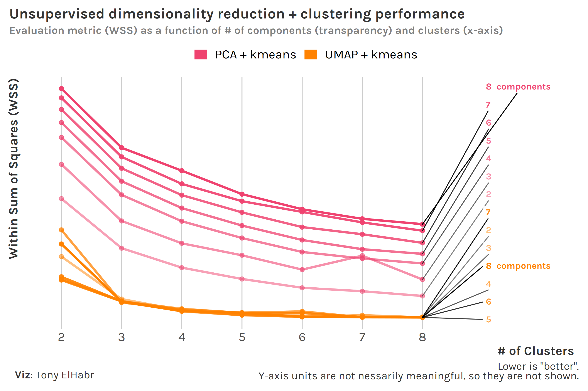

```{r setup, include=F, echo=F, cache=F}
knitr::opts_chunk$set(
  include = TRUE,
  echo = TRUE,
  cache = FALSE,
  eval = FALSE,
  cache.lazy = FALSE,
  fig.show = 'hide',
  fig.align = 'center',
  fig.width = 8,
  fig.asp = 0.75,
  fig.retina = 2,
  warning = FALSE,
  message = FALSE
)
```

## Introduction

Combining [principal component analysis (PCA)](https://en.wikipedia.org/wiki/Principal_component_analysis) and [kmeans clustering](https://en.wikipedia.org/wiki/K-means_clustering) seems to be a pretty popular 1-2 punch in data science. I'm not here to illustrate when using both a [dimensionality reduction](https://en.wikipedia.org/wiki/Dimensionality_reduction) technique and clustering technique is really the best thing to do[^1], I'm here to illustrate the potential advantages of upgrading your PCA + kmeans workflow to [Uniform Manifold Approximation and Projection (UMAP)](https://umap-learn.readthedocs.io/en/latest/) + [Gaussian Mixture Model (GMM)](https://en.wikipedia.org/wiki/Mixture_model).

[^1]: In some contexts you can may just want to do feature selection and/or a manual grouping of dataSome might say that you may not need to


For this demonstration, I'll be using the [data set](https://docs.google.com/spreadsheets/d/1lQgIDcxsHT1m_IayMldmiHVOt4ICbX-ys8Mh9rggPHM/edit?usp=sharing) pointed out [here](https://twitter.com/ronanmann/status/1408504415690969089?s=21), including over 100 stats for players from [soccer's "Big 5" leagues](https://fbref.com/en/comps/Big5/Big-5-European-Leagues-Stats).

```{r }
library(tidyverse)
df <- 
  'FBRef 2020-21 T5 League Data.xlsx' %>% 
  readxl::read_excel() %>% 
  janitor::clean_names() %>% 
  mutate(
    across(where(is.integer), ~replace_na(.x, 0L)),
    across(where(is.double), ~replace_na(.x, 0))
  )

# Let's only use players with a 10 matches' worth of minutes.
df_filt <- df %>% filter(min > 10 * 90)
```

```{r}
df_filt %>% dim()
```

```{r }
# [1] 1626  128
```

## Unsupervised Evaluation

We'll be feeding in the results from the dimensionality reduction---PCA and UMAP---to a clustering method---either kmeans or GMM. So, given that clustering comes second, all we need to do is figure out how to judge the clustering; this will tell us how "good" the combination of dimensionality reduction and clustering is overall.

I'll save you from google-ing and just tell you that [within-cluster sum of squares (WSS)](https://en.wikipedia.org/wiki/Total_sum_of_squares) is typically used for kmeans and [Bayesian Information Criteria (BIC)](https://en.wikipedia.org/wiki/Bayesian_information_criterion) is the go-to metric for GMM. WSS and BIC are not on the same scale, so we can't directly compare kmeans and GMM at this point. Nonetheless, we can experiment with different numbers of components---the one ["hyperparameter"](https://en.wikipedia.org/wiki/Hyperparameter_(machine_learning)) for dimensionality reduction---prior to the clustering to identify if more or less components is "better", given the clustering method. Oh, and why not also vary the number of clusters---the one notable hyperparameter for clustering---while we're at it?



For kmeans, we see that WSS


```{r}
f_dimr <- 'pca'
f_clust <- 'kmeans'
f_step <- if(f_dimr == 'pca') { recipes::step_pca } else { embed::step_umap }
f_fit <- if(f_clust == 'kmeans') kmeans else embed::step_umap
f_fit <- if(.g == 'kmeans') {
  kmeans
} else if (.g == 'mclust') {
  mclust::Mclust
}
rec_init <-
  recipes::recipe(formula(~.), data = df_filt) %>% 
  recipes::update_role(recipes::all_nominal_predictors(), new_role = 'id') %>% 
  recipes::step_normalize(recipes::all_numeric_predictors())

```

## "Supervised" Evaluation

Let's not mess around anymore. We actually do have something that we can use to help us identify clusters---player position (`pos`). I'll be treating these position groups as "labels" with which we can gauge the effectiveness of the clustering.

```{r}
df_filt <-
  df_filt %>% 
  mutate(
    across(
      pos,
      ~case_when(
        .x %in% c('DF,MF', 'MF,DF') ~ 'DM',
        .x %in% c('DF,FW', 'FW,DF') ~ 'M',
        .x %in% c('MF,FW', 'FW,MF') ~ 'AM',
        .x == 'DF' ~ 'D',
        .x == 'MF' ~ 'M',
        .x == 'FW' ~ 'F',
        .x == 'GK' ~ 'G',
        TRUE ~ .x
      )
    )
  )
df_filt %>% count(pos, sort = TRUE)
```

```{r}
# # A tibble: 6 x 2
#   pos       n
#   <chr> <int>
# 1 D       595
# 2 M       364
# 3 AM      273
# 4 F       196
# 5 G       113
# 6 DM       85
```

Typically we don't have labels for clustering tasks; if we do, we're usually doing some kind of supervised multi-label classification. But our labels aren't "true" labels in this case, both because: (1) a player's nominal position often doesn't completely describe their style of play, and (2) the grouping I did to reduce the number of positions from 11 to 6 was perhaps not optimal. (The DM defensive midfielder (DM) grouping is particularly "lazy"; if you look at the players, most are closer to attacking fullbacks.)

## Extra

How does varying the number of components in our two dimensionality reduction methods---PCA and UMAP--- and the number of clusters in our two clustering techniques---kmeans and GMM---change a loss function value?
