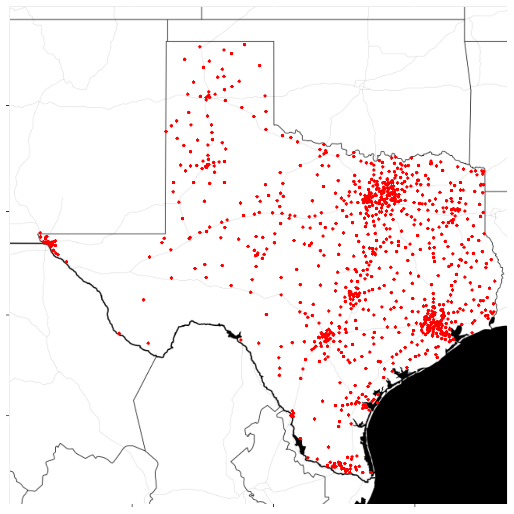

---
title: The DRY Principle and Knowing When to Make a Package
# slug: dry-principle-make-a-package 
date: "2018-05-05"
categories:
  - r
tags:
  - r
  - package
  - dry
image:
  caption: ""
  focal_point: ""
  preview_only: false
header:
  caption: ""
  image: "featured.jpg"
---

Don’t Repeat Yourself (DRY)
---------------------------

Probably everyone who has done some kind of programming has heard of the
[“Don’t Repeat
Yourself”](https://en.wikipedia.org/wiki/Don%27t_repeat_yourself) (DRY)
principle. In a nutshell, it’s about reducing code redundancy for the
purpose of reducing error and enhancing readability.

Undoubtedly the most common manifestation of the DRY principle is the
creation of a function for re-used logic. The “rule of 3” is a good
shorthand for identifying when you might want to rethink how your code
is organized– “You should consider writing a function whenever you’ve
copied and pasted a block of code more than twice (i.e. you now have
three copies of the same code)”, per the [*R For Data Science*
book](http://r4ds.had.co.nz/functions.html)

The DRY principle can be applicable to other settings as well. For
example, data scientist [David Robinson](https://twitter.com/drob) once
remarked (probably only half jokingly) that one should write a blog post
after giving the same piece of advice three time. [^1]

DRY and R Packages
------------------

I’d like to suggest applying the DRY principle to package creation–if
you use a set of 3 functions at least 3 times, then you should put them
in a package. In fact, there need not be more than 1 function or 1 use
case–given that the function or use case is significant enough–to
justify the initiation of a package.

Well-known R community member [Bob Rud](https://rud.is/b)–[who is among
the most active R
developers](https://rud.is/b/2018/04/04/exploring-r-bloggers-posts-with-the-feedly-api/)–
has made creating minimal, useful R packages commonplace. In his
description of his [Stack Overflow Driven
Development](https://rud.is/b/2017/09/28/sodd-stackoverflow-driven-development/),
he suggests that not only is such a practice useful for abstracting
functionality, but it can also be a great way to enhance one’s skills
while helping others.

If one is fearful of creating a package–perhaps due to the potential
responsibility of having to maintain it if it is used by others–then I
would suggest creating a “personal” package (that you don’t really
intend to be used by anyone else). In fact, I believe it is fairly
common practice for active R users to have their own personal packages.
[^2] For example,

-   [Bob Rud](http://rud.is/b)’s
    [`{hrbrmisc}`](https://github.com/hrbrmstr/hrbrmisc) and
    [`hrbrthemes`](https://github.com/hrbrmstr/hrbrthemes)
-   [David Robinson](http://varianceexplained.org)’s
    [`{drlib}`](https://github.com/dgrtwo/drlib)
-   [Julia Silge](https://juliasilge.com)’s
    [`{silgelib}`](https://github.com/juliasilge/silgelib)
-   [Strenge Jack](http://strengejacke.de)’s
    [`{sjmisc}`](https://github.com/strengejacke/sjmisc),
    [`{sjPlot}`](https://github.com/strengejacke/sjPlot),
    [`{sjstats}`](https://github.com/strengejacke/sjstats), and
    [`{sjlabelled}`](https://github.com/strengejacke/sjlabelled)

Following the examples of others, I have created several personal
packages for atomic purposes. [^3]

-   [`{tetext}`](https://github.com/tonyelhabr/tetext) for [*Tidy Text
    Mining*](https://www.tidytextmining.com/) principles.
-   [`{teplot}`](https://github.com/tonyelhabr/teplot) for plotting
    functions.
-   [`{teproj}`](https://github.com/tonyelhabr/teproj) for
    project-related functions.


### Examples

To give an example of how such a package can be useful, I’ll describe
some recent additions to my `{teplot}` package to assist with
geo-spatial visualization of single U.S. states.

I was working on something related to high schools in Texas (look out
for a blog post in the future) and was beginning to copy-paste some
functions that I had used for another project for visualizing
geo-spatial data in the state. The moment I thought about reusing the
code was the moment that I realized that I should put it in a package.
Now, visualizing geo-spatial data in Texas is as easy as follows.

``` {.r}
library("ggplot2")
library("teplot")
library("ggmap")
library("dplyr")

path <- "https://raw.githubusercontent.com/tonyelhabr/uil-v02/master/data/schools-nces-join.csv"
schools_geo <- readr::read_csv(path)

viz_map_base <-
  teplot::create_map_state(state = "texas", show_county = FALSE) +
  teplot::theme_te() +
  teplot::theme_map()

viz_map_bycnts <-
  viz_map_base +
  geom_polygon(
    data =
      schools_geo %>%
      count(county) %>%
      inner_join(
        teplot::get_map_data_county_tx(),
        by = c("county" = "subregion")
      ),
    aes(fill = n)
  ) +
  scale_fill_gradient(
    trans = "log",
    low = "white",
    high = "red"
  ) +
  theme(legend.position = "none")
viz_map_bycnts
```

I also added a [stamen
map](http://maps.stamen.com/#toner/12/37.7706/-122.3782) to the package
data so that I can use it easily as a base layer.

``` {.r}
viz_map_bycnts_stamen <-
  teplot::ggmap_stamen_tx +
  geom_point(
    data = schools_geo,
    aes(x = lon, y = lat),
    color = "red",
    size = 1
  )
viz_map_bycnts_stamen
```



To give a separate example, I used my `{tetext}` package for nearly all
of the code in [the flexdashboard that I created for analyzing the
Twitter acccounts of NBA
teams.](/post/nba-tweets-tms-flexdashboard) There, I
simply called the function `tetext::visualize_time_facet()` to generate
a fairly illustrative visual.

``` {.r}
viz_time_facet_all <-
  data_facet_trim %>%
  tetext::visualize_time_facet(
    timebin = timestamp,
    color = id,
    facet = id,
    scale_manual_config = list(values = colors_filt),
    facet_config = list(scales = "fixed"),
    labs_config = list(title = NULL)
  )
viz_time_facet_all
```


Getting Started
---------------

If one has no experience with creating packages and does not know where
to get started, there are plenty of awesome resources out there to learn
more about it. To name a few:

-   [Hillary Parker’s “famous” blog
    post](https://hilaryparker.com/2014/04/29/writing-an-r-package-from-scratch/)
-   [*R Packages* book](http://r-pkgs.had.co.nz/) by [Hadley
    Wickham](https://twitter.com/hadleywickham)
-   [Karl Broman’s primer](kbroman.org/pkg_primer/)
-   [Jenny Bryan’s class tutorial](http://stat545.com/packages00_index.html)

(There’s a good reason why these resources show up at the top of a
Google search for “R packages”.)

Although it may seem daunting at first, one should realize that the
pay-off will be great. (Just think about how much time, effort, and
debugging you save when writing a function. Now scale that feeling by
the number of functions that you include in your package!) I created my
first package to assist with using my company’s color scheme in plots.
Up until that point, I had been needlessly copy-pasting the same hex
values into each separate project where I wanted to use the color
palette. (If this happens to be your use case, then check out [Dr. Simon
J’s blog
post](https://drsimonj.svbtle.com/creating-corporate-colour-palettes-for-ggplot2)
on exactly this topic!)


Conclusion
----------
Even if it you don’t program much (or at all), the DRY principle will
undoubtedly be applicable to you at some point in time. If you’re
working with `R`, then I suggest using packages as a solution to your
DRY problems.

------------------------------------------------------------------------

[^1]: [Hadley Wickham](https://twitter.com/hadleywickham) suggested that a book might be even better.

[^2]: Although several of these have actually been published on CRAN (suggesting that they are really more than just personal packages), each started out as just a package for the individual.

[^3]: It seems common to include one’s initials in the name of a personal package, so I have copied that format.
