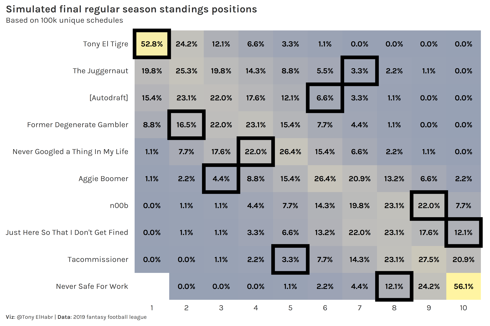

```{r setup, include=F, echo=F, cache=F}
knitr::opts_chunk$set(
  include = FALSE,
  echo = FALSE,
  cache = FALSE,
  eval = FALSE,
  cache.lazy = FALSE,
  fig.show = 'hide',
  fig.align = 'center',
  fig.width = 8,
  fig.asp = 0.75,
  fig.retina = 2,
  warning = FALSE,
  message = FALSE
)
```

## Introduction

Every year I play in several fantasy football (American) leagues. For those who are unaware, it's a game that occurs every year in sync with the [National Football League (NFL)](https://en.wikipedia.org/wiki/National_Football_League) where participants play in weekly head-to-head games as general managers of virtual football teams. (Yes, it's very silly.) The winner at the end of the season is often not the player with the team that scores the most points; often a fortunate sequence of matchups dictates who comes out on top.

I didn't fare so well this year in one of my leagues, but my disappointing placement was not due to my team struggling to score points; rather, I was extremely unlucky. I finished the season in 7th place despite scoring the most points!

This inspired me to quantify just how unlikely I was. The most common way to calculate the likelihood of a given team's ranking in a league with is with a [Monte Carlo simulation](https://mathworld.wolfram.com/MonteCarloMethod.html) based on some parameterized model of scoring to generate probabilities for the final standings. [FiveThirtyEight uses such a model for their soccer models](https://fivethirtyeight.com/methodology/how-our-club-soccer-predictions-work/), for example. For a setting in which team scores are independent of one another, such as fantasy football, another approach is to simply [calculate what each team's record would be if they had played every other team each week](https://github.com/JakePartusch/fantasy-tools). (So, if your league has 10 teams and each plays each other once, each team would have a hypothetical count of 90 games played.) However, I was particularly interested in answering the question: "In how many different schedules would I have finished where I did?"

## Problem

Figuring out how unlucky I was to finish 7th requires me to first figure out how many possible schedules there are. Formally, the problem can be put as follows[^1]:

[^1]: <https://math.stackexchange.com/questions/284416/how-many-possible-arrangements-for-a-round-robin-tournament>

> Let $T={t_1, …, t_n}$ be a set of an even $n$ teams. Let $R$ denote a round consisting of a set of pairs $(t_i, t_j)$ (denoting a match), such that $0 < i <j ≤ n$, and such that each team in $T$ is participates exactly once in $R$. Let $S$ be a schedule consisting of a tuple of $n−1$ valid rounds $(R_1, …, R_{n−1})$, such that all rounds in $S$ are pair-wise disjoint (no round shares a match). How many valid constructions of $S$ are there for $n$ input teams?

For a small number of teams, it's fairly simple to write out all possible combinations of matchups. For example, for a two-team league (where each team plays each other once), there is only one possible schedule (soluytion)---Team 1 vs. Team 2. For a four-team league, there are six possible schedules. Two are shown below.

<center>

| solution | round | team1 | team2 |
|----------|-------|-------|-------|
| 1        | 1     | 1     | 2     |
|          |       | 3     | 4     |
|          | 2     | 1     | 3     |
|          |       | 2     | 4     |
|          | 3     | 1     | 4     |
|          |       | 2     | 3     |
| 2        | 1     | 1     | 3     |
|          |       | 2     | 4     |
|          | 2     | 1     | 2     |
|          | 3     | 1     | 4     |
|          |       | 2     | 3     |

</center>

Note that there is no concept of "home advantage" in fantasy football, so the order of teams in a given matchup does not matter. Also, note that if our restriction ("constraint") that each team must play each other once and only once, implies that the number of teams has to be an even number.

## Constraint Programming

To truly answer this question, we can turn to [constraint programming](https://en.wikipedia.org/wiki/Constraint_programming). If you're familiar with constraint programming, then you'll notice that this set-up is similar to the canonical [nurse scheduling problem](https://en.wikipedia.org/wiki/Nurse_scheduling_problem) and is a specific form of the [tournament problem](https://en.wikipedia.org/wiki/Traveling_tournament_problem).

Below is some python code that is able to identify the number feasible solutions for four teams. I print out the first solution for illustrative purposes.

``` {.python}
from ortools.sat.python import cp_model

class SolutionPrinter(cp_model.CpSolverSolutionCallback):
    def __init__(self, games, n_team, n_show=None):
        cp_model.CpSolverSolutionCallback.__init__(self)
        self._games = games
        self._n_show = n_show
        self._n_team = n_team
        self._n_sol = 0

    def on_solution_callback(self):
        self._n_sol += 1
        print()
        if self._n_show is None or self._n_sol <= self._n_show:
            print(f'Solution {self._n_sol}.')
            for team1 in range(self._n_team):
                for team2 in range(self._n_team):
                    if team1 != team2:
                        print(
                            f'Team {team1 + 1} vs. Team {team2 + 1} in Round {self.Value(self._games[(team1, team2)])}'
                        )
        else:
            print(f'Found solution {self._n_sol}.')

    def get_n_sol(self):
        return self._n_sol

n_team = 4
n_w = n_team - 1
model = cp_model.CpModel()
games = {}
for team1 in range(n_team):
    for team2 in range(n_team):
        if team1 != team2:
            games[(team1, team2)] = model.NewIntVar(1, n_w, f'{team1:02}_{team2:02}')

for team1 in range(n_team):
    for team2 in range(n_team):
        if team1 != team2:
            model.Add(games[(team1, team2)] == games[(team2, team1)])


# Each team can only play in 1 game each week
for t in range(n_team):
    model.AddAllDifferent(
        [games[(t, team2)] for team2 in range(n_team) if t != team2]
    )

solver = cp_model.CpSolver()
solution_printer = SolutionPrinter(games, n_team=n_team, n_show=2)
status = solver.SearchForAllSolutions(model, solution_printer)

print()
print(f'Solve status: {solver.StatusName(status)}')
print(f'Solutions found: {solution_printer.get_n_sol()}')
```

``` {.python}
## Solution 1.
## Team 1 vs. Team 2 in Round 3
## Team 1 vs. Team 3 in Round 2
## Team 1 vs. Team 4 in Round 1
## Team 2 vs. Team 1 in Round 3
## Team 2 vs. Team 3 in Round 1
## Team 2 vs. Team 4 in Round 2
## Team 3 vs. Team 1 in Round 2
## Team 3 vs. Team 2 in Round 1
## Team 3 vs. Team 4 in Round 3
## Team 4 vs. Team 1 in Round 1
## Team 4 vs. Team 2 in Round 2
## Team 4 vs. Team 3 in Round 3
## 
## Found solution 2.
## 
## Found solution 3.
## 
## Found solution 4.
## 
## Found solution 5.
## 
## Found solution 6.
## 
## Solve status: OPTIMAL
## Solutions found: 6
```

Easy enough to run for 10 teams and get an answer, right? **WRONG**. Turns out this the number of feasible solutions (schedules) starts to blow up really quickly. In fact, I believe the number of solutions for this particular problem is only known up to 14 teams. (I've intentionally left the numbers un-rounded to emphasize just how much the number of solutions increases as a function of the number of teams.)

```{r eval=F, echo=F, include=F}
library(tidyverse)
tibble(
  n = seq(2, 14, by = 2),
  k1 = c(1, 1, 6, 6240, 1225566720, 252282619805368320, 98758655816833727741338583040)
) %>% 
  mutate(
    n_factor = factorial(n - 1),
    solutions = k1 * n_factor
  ) %>% 
  select(n, solutions) %>% 
  mutate(across(solutions, ~scales::number(.x, big.mark = ',', accuracy = 1))) %>% 
  knitr::kable()
```

<center>

|   n | solutions                                           |
|----:|:----------------------------------------------------|
|   2 | 1                                                   |
|   4 | 6                                                   |
|   6 | 720                                                 |
|   8 | 31,449,600                                          |
|  10 | 444,733,651,353,600                                 |
|  12 | 10,070,314,878,246,925,803,220,024                  |
|  14 | 614,972,203,951,464,579,840,082,248,206,026,604,282 |

</center>

Unless you happen to be an expert in [graph theory](https://en.wikipedia.org/wiki/Graph_(discrete_mathematics)) and [combinatorics](https://mathworld.wolfram.com/Combinatorics.html), you probably wouldn't be able to figure this out by hand; for us non-experts out there, we can refer to a known sequence of [1-factorizations of a complete graph $K_{2n}$](http://oeis.org/A000438) and use our brain to figure out permutations in a given round. (Don't worry if that makes no sense.)

Why do I bring this up? Well, I realized that generating all possible schedules for a 10-team league (such as my aforementioned league) is just not reasonable for anyone without a supercomputer and a lot of time. I enhanced the above python code a bit and tried it out for a 10-team league and was only able to generate a couple of million solutions after 3 hours.

## Alternative: Exhaustive Search

The failure to generate all solutions made me reconsider things a bit. If I can't reasonably "have it all", I should simplify things a bit. By "simplify", I mean perform an ["exhaustive" (or "brute-force) search](https://en.wikipedia.org/wiki/Brute-force_search) that stops after a specified number of solutions. And, by re-writing things in R, I can eliminate dependencies on [Google's ortools package](https://developers.google.com/optimization) and python. (Both are great, but, nonetheless, they are potential obstacles for R users.)

Writing a script to perform an exhaustive search is not so easy itself, and, in this case, requires a completely different approach to the problem. My steps are as follows:

1.  Set up an $n$ x $n-1$ matrix, where the $n$ rows designate teams and the $n-1$ columns designate rounds.

``` {.r}
league_size = 4
rounds <- league_size - 1
mat <- matrix(nrow = league_size, ncol = rounds)
mat
```

``` {.r}
##      [,1] [,2] [,3]
## [1,]   NA   NA   NA
## [2,]   NA   NA   NA
## [3,]   NA   NA   NA
## [4,]   NA   NA   NA
```

2.  Randomly select the opponent of team 1 in round 1.

``` {.r}
team_i <- 1
round_i <- 1
retry_i <- 1
idx_team <- 1:league_size
set.seed(1)

team_1_round_1 <- sample(2:league_size, 1, replace = FALSE)
mat[team_i, round_i] <- team_1_round_1
mat
```

``` {.r}
##      [,1] [,2] [,3]
## [1,]    2   NA   NA
## [2,]   NA   NA   NA
## [3,]   NA   NA   NA
## [4,]   NA   NA   NA
```

3.  Find a unique set of opponents for teams 2 through $n$ to fill the rest of the cells in column 1.

``` {.r}
while(team_i <= league_size) {
  if(team_i %in% teams_already_matched) {
    team_i_round_i <- which(team_i == teams_already_matched)
    mat[team_i, round_i] <- team_i_round_i
    team_i <- team_i + 1
  } else {
    teams_cant_match <- unique(c(teams_already_indexed, teams_already_matched))
    teams_unmatched <- setdiff(teams_possible, teams_cant_match)
    n_matched <- length(teams_unmatched)
    if(n_matched == 0) {
      mat[2:league_size, round_i] <- NA
      team_i <- 2
    } else {
      team_i_round_i <- if(n_matched == 1) {
        teams_unmatched
      } else {
        sample(teams_unmatched, 1)
      }

      mat[team_i, round_i] <- team_i_round_i
      team_i <- team_i + 1
    }
  }
}
```

``` {.r}
##      [,1] [,2] [,3]
## [1,]    2   NA   NA
## [2,]    1   NA   NA
## [3,]    4   NA   NA
## [4,]    3   NA   NA
```

4.  Identify a unique set of opponents for team 1 for all other rounds (rounds 2 through $n-1$).

``` {.r}
teams_possible <- setdiff(idx_team, c(1, team_1_round_1))
team1_all_rounds <- sample(teams_possible, size = length(teams_possible))
mat[1, 2:rounds] <- team1_all_rounds
mat
```

``` {.r}
##      [,1] [,2] [,3]
## [1,]    2    3    4
## [2,]    1   NA   NA
## [3,]    4   NA   NA
## [4,]    3   NA   NA
```

5.  Repeat step 3 for rounds 2 through $n-2$ (penultimate round).

``` {.r}
while(round_i < rounds) {
  team_i <- 2
  while(team_i <= league_size) {
    teams_possible <- setdiff(idx_team, team_i)
    teams_already_indexed <- 1:(team_i - 1)
    teams_already_matched <- mat[teams_already_indexed, round_i]
    teams_already_played <- mat[team_i, 1:(round_i - 1)]
    reset <- FALSE
    if(team_i %in% teams_already_matched) {
      team_i_round_i <- which(team_i == teams_already_matched)
      if(any(team_i_round_i == teams_already_played)) {
        reset <- TRUE
      }
    } else {
      teams_cant_match <-
        unique(c(teams_already_indexed, teams_already_matched, teams_already_played))
      teams_unmatched <- setdiff(teams_possible, teams_cant_match)
      n_matched <- length(teams_unmatched)
      if (n_matched == 0) {
        reset <- TRUE
      } else {
        team_i_round_i <- if(n_matched == 1) {
          teams_unmatched
        } else {
          sample(teams_unmatched, 1)
        }
      }
    }
    
    if(reset) {
      mat[2:league_size, round_i] <- NA
      team_i <- 2
      retry_i <- retry_i + 1
    } else {
      mat[team_i, round_i] <- team_i_round_i
      team_i <- team_i + 1
    }
  }
  round_i <- round_i + 1
}
mat
```

``` {.r}
##      [,1] [,2] [,3]
## [1,]    2    3    4
## [2,]    1    4   NA
## [3,]    4    1   NA
## [4,]    3    2   NA
```

6.  Identify the only valid set of matchups for the last round $n-1$.

``` {.r}
idx_not1 <- 2:league_size
total <- Reduce(sum, idx_team) - idx_not1
rs <- rowSums(mat[idx_not1, 1:(rounds - 1)])
teams_last <- total - rs
mat[idx_not1, rounds] <- teams_last
mat
```

``` {.r}
##      [,1] [,2] [,3]
## [1,]    2    3    4
## [2,]    1    4    3
## [3,]    4    1    2
## [4,]    3    2    1
```

That is the core of the solution. The rest of the work[^2] involves repeating the steps for however many times you want, always checking for duplicates of previous solutions, i.e. [sampling without replacement](https://en.wikipedia.org/wiki/Simple_random_sample#Distinction_between_a_systematic_random_sample_and_a_simple_random_sample). (Or, if you don't care about schedules being unique, i.e. sampling without replacement, it's even easier.)

[^2]: In fantasy football, teams often play each other more than once in a year (depending on your league size), so I've somewhat simplified the problem for the purpose of this post. More work could be done to figure out the number of possibilities when more than one game has to be scheduled for each pair of teams.

## Application

Since generating unique schedules is something I'd like to be able to do every year for my fantasy football leagues, I [wrote a package for it, called `{ffsched}`](https://github.com/tonyelhabr/ffsched). The package includes functionality to retrieve your league's fantasy scores from [ESPN](https://www.espn.com/fantasy/), which you can combine with the simulated schedules to generate a plot such as the following.


It's immediately evident how un-lucky I ("Tony El Tigre") was. In the 100,000 simulations, I never finished below 7th, and I only finished 7th 1.1% of the time!

In the previous year I scored the most points and finished first. "The Juggernaut" got the short end of the stick in 2019, finishing 7th. He only finished 7th or lower in 6.6% of schedules.



## Take-away

An exhaustive search as a work-around for true constraint programming isn't always elegant and can be difficult to implement, but if you're motivated enough to do it---as I was to prove my extreme lack of fortune---it can generate what you need to make a compelling point. My use case (for generating unique fantasy generating football schedules) is inconsequential, but such techniques are often immensely important in real world contexts.
