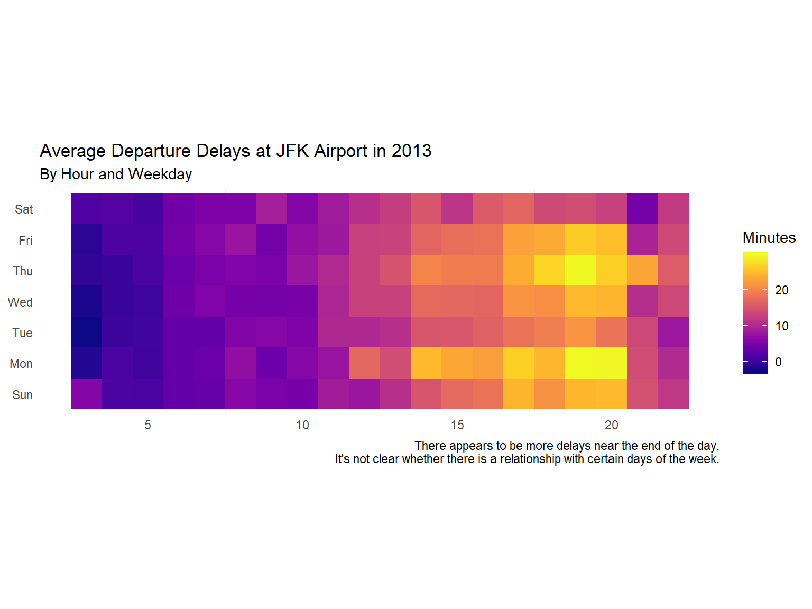

In my job, I often work with data sampled at regular intervals. Samples
may range from 5-minute intervals to daily intervals, depending on the
specific task. While working with this kind of data is straightforward
when its in a database (and I can use SQL), I have been in a couple of
situations where the data is spread across .csv files. In these cases, I
lean on `R` to scrape and compile the data. Although some other
languages might be superior for such a task, I often need to produce
some kind of visualization or report at the end, so choosing to handle
all of the data with `R` is a no-brainer for me–I can easily transition
to using `{ggplot2}` and `{rmarkdown}` to generate some pretty output.


Minute-Level Data
-----------------

When working with data sampled at 5-minute intervals (resulting in 288
intervals in a day), I’ve found that I’ve used a common “idiom” to
generate a time-based “dictionary”. For example, here’s how I might
create such a date dictionary for the year 2013. [^1]

``` {.r}
library("dplyr")
library("lubridate")

date_1 <- lubridate::ymd("2013-01-01")
date_2 <- lubridate::ymd("2013-12-31")

ymd_seq <- seq.Date(date_1, date_2, by = "day")
ymd_grid <-
  data_frame(
    ymd = lubridate::ymd(ymd_seq),
    yyyy = lubridate::year(ymd_seq),
    mm = lubridate::month(ymd_seq),
    dd = lubridate::day(ymd_seq)
  )

hhmmss <-
  expand.grid(
    hh = seq(1L, 24L, 1L), 
    min = seq(5L, 60L, by = 5L), 
    sec = 0L) %>% 
  as_tibble()

dates_dict <-
  ymd_grid %>%
  right_join(hhmmss %>% mutate(yyyy = lubridate::year(date_1), by = "year")) %>% 
  arrange(yyyy, mm, dd, hh, min)
dates_dict
```

    ## # A tibble: 105,120 x 8
    ##    ymd         yyyy    mm    dd    hh   min   sec by   
    ##    <date>     <dbl> <dbl> <int> <int> <int> <int> <chr>
    ##  1 2013-01-01  2013     1     1     1     5     0 year 
    ##  2 2013-01-01  2013     1     1     1    10     0 year 
    ##  3 2013-01-01  2013     1     1     1    15     0 year 
    ##  4 2013-01-01  2013     1     1     1    20     0 year 
    ##  5 2013-01-01  2013     1     1     1    25     0 year 
    ##  6 2013-01-01  2013     1     1     1    30     0 year 
    ##  7 2013-01-01  2013     1     1     1    35     0 year 
    ##  8 2013-01-01  2013     1     1     1    40     0 year 
    ##  9 2013-01-01  2013     1     1     1    45     0 year 
    ## 10 2013-01-01  2013     1     1     1    50     0 year 
    ## # ... with 1.051e+05 more rows

And, just to prove that there are 288 5-minute intervals for each day in
the year, I can use `dplyr::count()` twice in succession. [^2]

``` {.r}
dates_dict %>% count(yyyy, mm, dd) %>% count()
```

    ## # A tibble: 1 x 1
    ##      nn
    ##   <int>
    ## 1   365

I then extract data (from individual files) using the time-based
dictionary as a “helper” for custom functions for creating file paths
and processing the data after importing it.

After the dirty work of is done, I can transition to the fun
part–exploring and interpreting the data. This process often turns out
to be a cycle of visualization, data transformation, and modeling.


class="section level3">

### An Example (With the `nycflights13` Package)

To provide an example, I’ll use the `flights` data set from the
[`{nycflight13}`](https://cran.r-project.org/web/packages/nycflights13/index.html)
package. [^3] This package includes
information regarding all flights leaving from New York City airports in
2013, as well as information regarding weather, airlines, airports, and
planes.

Let’s say that I that I’m interested in the average flight departure
delay time at the JFK airport. I might hypothesize that there is a
relationship between departure delay time with different time periods,
such as hour in the day and days in the week.

First, I’ll perform the necessary transformation to the `flights` data
to investigate my hypothesis. Specifically, I need to create columns for
hour and weekday. (For hour (`hh`), I simply use the scheduled departure
time (`sched_dep_time`).)

``` {.r}
library("nycflights13")

flights_jfk <-
  nycflights13::flights %>% 
  filter(origin == "JFK") %>% 
  mutate(hh = round(sched_dep_time / 100, 0) - 1) %>% 
  mutate(ymd = lubridate::ymd(sprintf("%04.0f-%02.0f-%02.0f", year, month, day))) %>% 
  mutate(wd = lubridate::wday(ymd, label = TRUE))
```

Next, I might create a heat map plotting hours against weekdays.



To investigate the patterns more “scientifically”, I might perform a
one-way Analysis of Variance (ANOVA) on different time variables. I
would make sure to test time periods other than just weekday (`wd`) and
hour (`hh`), such as `month` and `day`.

``` {.r}
summary(aov(dep_delay ~ month, data = flights_jfk))
```

    ##                 Df    Sum Sq Mean Sq F value   Pr(>F)    
    ## month            1     55213   55213   36.25 1.74e-09 ***
    ## Residuals   109414 166664445    1523                     
    ## ---
    ## Signif. codes:  0 '***' 0.001 '**' 0.01 '*' 0.05 '.' 0.1 ' ' 1
    ## 1863 observations deleted due to missingness

``` {.r}
summary(aov(dep_delay ~ day, data = flights_jfk))
```

    ##                 Df    Sum Sq Mean Sq F value Pr(>F)
    ## day              1        40    40.2   0.026  0.871
    ## Residuals   109414 166719617  1523.8               
    ## 1863 observations deleted due to missingness

``` {.r}
summary(aov(dep_delay ~ wd, data = flights_jfk))
```

    ##                 Df    Sum Sq Mean Sq F value Pr(>F)    
    ## wd               6    246401   41067   26.99 <2e-16 ***
    ## Residuals   109409 166473256    1522                   
    ## ---
    ## Signif. codes:  0 '***' 0.001 '**' 0.01 '*' 0.05 '.' 0.1 ' ' 1
    ## 1863 observations deleted due to missingness

``` {.r}
summary(aov(dep_delay ~ hh, data = flights_jfk))
```

    ##                 Df    Sum Sq Mean Sq F value Pr(>F)    
    ## hh               1   5701754 5701754    3874 <2e-16 ***
    ## Residuals   109414 161017904    1472                   
    ## ---
    ## Signif. codes:  0 '***' 0.001 '**' 0.01 '*' 0.05 '.' 0.1 ' ' 1
    ## 1863 observations deleted due to missingness

The “statistically significant” p values for the `wd` and `hh` variables
provides incentive to investigate them more closely. I might try an
ANOVA F-statistic test comparing linear regression models using each
variable as a lone predictor with a linear model where both are used as
predictors.

``` {.r}
lm_wd <- lm(dep_delay ~ wd, data = flights_jfk)
lm_hh <- lm(dep_delay ~ hh, data = flights_jfk)
lm_both <- lm(dep_delay ~ wd + hh, data = flights_jfk)
anova(lm_both, lm_wd, test = "F")
```

    ## Analysis of Variance Table
    ## 
    ## Model 1: dep_delay ~ wd + hh
    ## Model 2: dep_delay ~ wd
    ##   Res.Df       RSS Df Sum of Sq      F    Pr(>F)    
    ## 1 109408 160778456                                  
    ## 2 109409 166473256 -1  -5694800 3875.2 < 2.2e-16 ***
    ## ---
    ## Signif. codes:  0 '***' 0.001 '**' 0.01 '*' 0.05 '.' 0.1 ' ' 1

``` {.r}
anova(lm_both, lm_hh, test = "F")
```

    ## Analysis of Variance Table
    ## 
    ## Model 1: dep_delay ~ wd + hh
    ## Model 2: dep_delay ~ hh
    ##   Res.Df       RSS Df Sum of Sq      F    Pr(>F)    
    ## 1 109408 160778456                                  
    ## 2 109414 161017904 -6   -239447 27.157 < 2.2e-16 ***
    ## ---
    ## Signif. codes:  0 '***' 0.001 '**' 0.01 '*' 0.05 '.' 0.1 ' ' 1

Of course, this process would go on. For instance, I would certainly
need to investigate if there is a relationship between departure delay
and specific airlines.


Final Thoughts
--------------

Working with interval data was initially a challenge for me, but after
working with it more and more often, I find that it’s not so bad after
all. It gets more interesting when there is missing data or data samples
at irregular intervals, but that’s a story for another day.


------------------------------------------------------------------------

[^1]: The technique that I show here would have to be adjusted slightly if working with more than one year at a time, but it wouldn't be difficult to do so. I tend to only use this design pattern for one year at a time anyways.

[^2]: By the way, how cool is following one `dplyr::count()` call with another? I only found out about that nice little trick recently.

[^3]: Thanks to [Hadley Wickham](http://hadley.nz/) for compiling this data package, as well as for developing the `{lubridate}` and {ggplot2}` packages.)


