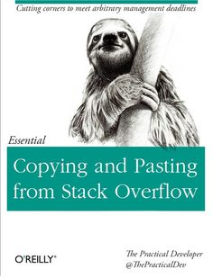

I had the wonderful opportunity to participate in the
[`{tidyverse}` Developer Day](https://www.tidyverse.org/articles/2018/11/tidyverse-developer-day-2019/)
the day after [rstudio::conf2019](https://blog.rstudio.com/2018/08/20/rstudio-conf-2019-contributed-talks-eposters/)
officially wrapped up. [^1]
[One of the objectives of the event](https://github.com/tidyverse/dev-day-2019)
was to encourage 
open-source contributor newbies (like me :smile:) to
gain some experience, namely through submitting
pull requests to address issues with `{tidyverse}` packages.


Having only ever worked with my own packages/repos before, 
I found this was to be perfect opportunity to "get my feet wet"!

## A "Minimal", Step-by-Step Breakdown of the Process

To the reader who is interested in nothing else other than the
"minimum" set of "required" steps of making a pull request [^2],
I've outlined the steps that I took below (with additional commentary
provided afterwards and/or with footnotes). I use double brackets `{{`/`}}`
to indicate names/variables that should be filled in by you for your particular
use case. More specifically,

+ `{{repo}}` refers to the GitHub repository (duh :stuck_out_tongue:);
+ `{{user}}` refers to your GitHub username;
+ `{{owner}}` refers to the owner of the GitHub repo;
+ `{{branch-name}}` refers to the name that you give your branch for your pull request (double duh :stuck_out_tongue: :stuck_out_tongue:); [^3] [^4] and
+ `{{message}}` refers to the commit message that you make with your pull request changes (duh x3 :stuck_out_tongue: :stuck_out_tongue: :stuck_out_tongue:).

1. **Fork the repo on GitHub.**

    At https://github.com/{{owner}}/{{repo}}.git (i.e. the repo's GitHub page),
select the "Fork" button. Wait for GitHub to generate the fork and for your browser
to navigate you to https://github.com/{{user}}/{{repo}}.git
(i.e. your copy of the repo on GitHub). [^5]

2. **Prepare your local environment to make the pull request.**

    Using the Git Bash terminal,

    - `git clone https://github.com/{{user}}/{{repo}}.git`
    - `cd {{repo}}`
    - `git remote add upstream https://github.com/{{owner}}/{{repo}}.git` [^6]
    - `git pull upstream master --ff-only` [^7]
    - `git branch {{branch-name}}` [^8] 
    - `git checkout {{branch-name}}`

3. **Make the changes (locally) for the pull request.**

4. **Review the changes (locally) and push.**

    Using the Git Bash terminal,

    - `git status`
    - `git add .`
    - `git commit -m "{{message}}"`
    - `git push -u origin {{branch-name}}` [^9]
    
5. **Finalize the pull request on GitHub.**

    At https://github.com/{{user}}/{{repo}}.git, select the "New pull request" button,
then "Create pull request" on the subsequent page, and then "Create pull request"
again (on the page that allows you to add comments). [^10]

Note that if your pull request is not accepted upon the first commit, then you'll
need to repeat steps 3 and 4. And, instead of repeating step 5, you should
make a comment on the existing pull request on GitHub. (Assuming that the pull
request reviewer left you some comments, then you should just reply to theirs.)

### Additional Notes

There are a couple of extra/alternative things you should consider doing 
in this process (although these are completely optional).

+ After `cd`'ing into the repo, a good "sanity check" to perform is a
`git remote -v` to verify that you are on `(master)` branch of the forked repo.
You should see the following when running this command.

```
origin https://github.com/{{user}}/{{repo}}.git (fetch)
origin https://github.com/{{user}}/{{repo}}.git (push)
```
Then, you could run this command again after the 
`git remote add upstream https://github.com/{{owner}}/{{repo}}.git` command
and verify that you see the following.

```
origin https://github.com/{{user}}/{{repo}}.git (fetch)
origin https://github.com/{{user}}/{{repo}}.git (push)
upstream https://github.com/{{owner}}/{{repo}}.git (fetch)
upstream https://github.com/{{owner}}/{{repo}}.git (push)
```

+ Regarding the `git pull upstream  --ff-only` step, it's actually
"safer" to break this step up into two: (1) `git fetch upstream`, followed by 
(2) `git merge upstream/master`.
Nonetheless, (I believe that) the `git pull` command shown here *should* 
achieve the same result.

+ Following the `git pull upstream  --ff-only` step, you might also want
to do a `git push` to **really** ensure that your master branch is "in 
sync" with the original repo. Nonetheless, this is completely optional, 
especially if you're working exclusively on a branch.
This is discussed by [Jenny Bryan](https://twitter.com/JennyBryan) in the
["Get upstream changes for a fork" chapter](https://happygitwithr.com/upstream-changes.html)
in her [*Happy Git and GitHub for the useR* book]
(https://happygitwithr.com) (which, I should note,
I used as a guide throughout this process).

+ In the last "Create pull request" page, where you have the option to write a comment,
it's useful to write something like "Fixes #{{#}}", where `{{#}}` is the number
of the issue. GitHub has a nice feature that can link the pull request to the
issue that it attempts to fix (assuming that the pull request is directed towards
a specific issue).

## My Experience

The RStudio staff sort of gave us a head-start by tagging some issues
beforehand. (Many of these
were supposed to be relatively straightforward to resolve.)
Trying to avoid something too difficult and not wanting to be stuck
in "indecision purgatory", I quickly jumped on one that *seemed* simple 
enough---[`{dplyr}`'s issue 4071: "Add examples for ``cumall()``](https://github.com/tidyverse/dplyr/issues/4071).
Note that I say that it "seemed simple enough"; in reality, it would go on to
take a little bit more effort than I had originally imagined it would
(which seems to be true of anything in software development :grimacing:).

First, it took me a minute or so to find out where I would need to add the documentation
examples. Normally, assuming one is following the
["typical" `{devtools}`/`{Roxygen2}` workflow for package documentation](http://r-pkgs.had.co.nz/man.html), 
one would add comments in the same file as the functions
that are being documented. In this case, however, the documentation
for `cumall()` (and also that for the
the `cumany()` and `cummean()` functions, which were also without examples), is
generated programmatically in `{dplyr}`'s 
[RcppExports.R](https://github.com/tidyverse/dplyr/blob/master/R/RcppExports.R) file from
a cpp (i.e. C++) file---[window.cpp](https://github.com/tidyverse/dplyr/blob/master/src/window.cpp).

Next was the actual "heart" of the process---creating the example(s). As a strong
advocate of the "copy-and-paste-from-StackOverflow" workflow :smile: (as well
as the "changing-things-and-seeing-what-works" workflow), I searched some
of the existing examples and found that the "ranking" documentation group
(in [rank.R](https://github.com/tidyverse/dplyr/blob/master/R/rank.R)) provided a good
starting point. I didn't take too long to come up with some basic 
examples. ([See the first commit on my pull request](https://github.com/tidyverse/dplyr/pull/4115/commits/4497ec4f6be1df4261a56abc971f3851bec2a9ba),
or, for all of the 
details, [the whole history of the request](https://github.com/tidyverse/dplyr/pull/4115).)
Then, after running a `devtools::check()` to regenerate the documentation,
rebuild the package (and verify that I didn't "break" anything), etc., I submitted
the pull request on GitHub.



I assumed (perhaps naively) that my pull request would be accepted without
question. However, that was without considering the fact
that it was going to be reviewed by none other than
[Hadley Wickham](https://twitter.com/hadleywickham) himself.
Hadley is certainly a meticulous person, so the changes would
not get approved without some level of well-intentioned, critical examination.
And, as it turns out, the request was not approved immediately.

Hadley identified some points of improvement and submitted some comments, 
obligating me to address his feedback.
Although failure to gain immediate acceptance for the pull request
might be discouraging, this was certainly not the case for me (and I hope
that it is not for anyone else, especially first-timers). My mindset was to treat
the feedback as an opportunity for improvement, which I'm always up for.
Moreover, Hadley's supportive statements and tone
provided additional
motivation for me to continue working toward something better. So, even
though I'm mostly writing from my own point of view as a first-time pull request
submitter, there is a lesson to be learned here for those
receiving and reviewing pull requests from other---be supportive! [^11]

After submitting some updates in a second commit to my branch,
I received another round of feedback from Hadley.
Again, his tone was supportive,
so I was more than happy to address his comments in a third commit shortly afterwards.

As it stands today--a day after I made the initial fork and pull
request---my pull request
has an "Open" status. Nonetheless, I'm optimistic that it will 
eventually be merged (perhaps with another round or two of feedback and commits).

## Parting Thoughts

To sum up my whole `{tidyverse}` Developer Day experience,
I'm really glad to have gone through the pull request process
in a setting with a bunch of experienced people who were ready and willing to help,
as well as others who were just as new to the whole thing as me! It really
made everything less intimidating. And now, after having gained the experience,
I won't hesitate to continue contributing to open-source projects going forward.

Also, I'm really happy for the other first-time pull request
submitters who were successful in their efforts!

 





### Additional Resources

Finally, as a "disclaimer" of sorts,
I should say that I'm certainly not the first person
to write about
how to make a pull request (and I'm by no means an expert on the matter).
For those looking for good reference material authored by people in the `R`
community, I'd recommend the following resources.

+ The ["Making a pull request" section in the "Git and GitHub" chapter](http://r-pkgs.had.co.nz/git.html#git-pullreq)
in [Hadley Wickham](https://twitter.com/hadleywickham)'s [*R Packages* book](http://r-pkgs.had.co.nz/). [^12]

+ The ["Get upstream changes for a fork" chapter](https://happygitwithr.com/upstream-changes.html)
in [Jenny Bryan](https://twitter.com/JennyBryan)'s in
[*Happy Git and GitHub for the useR* book] (https://happygitwithr.com).

----------------------------------------------------------------------

[^1]: Check out [this public Google photos album](https://photos.google.com/share/AF1QipMZwkL0M_MSQUPOB-HX2eppEvcmDMwF4CI_Wa81BrtnjpZBKKkXCtZ2TOzvX80ctQ?key=ekN5Zk9wMFAySlc5cTJuOW1vekFXRTh1LXJJOVBR) to see a ton of awesome pictures taken by[J.D. Long](https://twitter.com/CMastication).


[^2]: I know I can't be the only one who loves reading other people's blogs, but (admittedly) tends to skim through them to find parts that are most relevant to what I'm doing at the time.

[^3]: Note that these steps assumes that the project is on GitHub.

[^4]: You can technically make your pull request on the master branch of your forked repo (and avoid using branches whatsoever), but it's not a "best practice".

[^5]: I apologize for the lack of screenshot here. (I didn't want to obfuscate the text.) If you're a visual kind of person, then a [YouTube video such as this one might be helpful](https://www.youtube.com/watch?v=e3bjQX9jIBk).

[^6]: Even though I've read through most of this book before, I only found this part of the book after I went through the pull request process, and I wish I had seen it earlier!

[^7]: This step is necessary in order to ensure that your fork is truly "in sync" with the original rep, which could certainly be the case if you forked the repo a while ago and there have been updates to the original repo since then.

[^8]: The  `--ff-only` part of the command is actually optional here, but is highly recommended by [Jenny Bryan](https://twitter.com/JennyBryan)

[^9]: Note that the `-u` flag mean "upstream", but this is *NOT* the same as the `upstream` remote created earlier. **`u` IS necessary here**, but naming the remote `upstream` in a previous step was NOT.

[^10]: There may be some additional steps here if your request is "behind" the master branch of the source repository. Since each kind of case like this is unique, and because I've tried to describe the process as succinctly as possible, I don't discuss this situation.

[^11]: This reminds me of one of my favorite blog posts---[Yihui Xie](https://twitter.com/xieyihui)'s rant on the [over-eagerness of the Stack Overflow community to close "bad" questions](https://yihui.name/en/2017/12/so-bounties/).

[^12]: Note that `{{branch-name}}` can be anything, but something like `issue-{{#}}` is a good practice.


