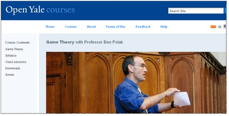

[Massive Online Open Courses](https://www.mooc-list.com/) (MOOCs) are
wonderful resources for people like me who have a passion to learn. In a
nutshell, they are college-level courses published by reputable
universities and/or instructors for free. Some of the most well-known
platforms include [Udacity](www.udacity.com/),
[Coursera](https://www.coursera.org/), and [edX](https://www.edx.org/),
but you can also find many courses and related materials directly on
university websites or other sites such as
[GitHub](https://github.com/). I took advantage of several freely
available resources, including MOOCs, while developing my skills as a
wannabe data analyst.

I’d like to share my thoughts on the five MOOCs that I (mostly)
completed during my final semester of undergraduate education at [UT
Austin](https://utexas.edu/), when I had a fairly light workload. Fair
warning–I didn’t finish every single part of every assignment, read
every last word of all the reading material, or watch every last second
of every lecture video. Nevertheless, I estimate that I completed
between 50% to 90% of the material for each MOOC that I discuss, so I
think that makes me sufficiently credible to give my opinion.

In the order in which I took them…

class="section level2">

[1. Udacity’s *UD 120: Intro to Machine Learning*](https://www.udacity.com/course/intro-to-machine-learning--ud120)
-------------------------------------------------------------------------------------------------------------------

This was the very first MOOC that I took (sometime in February and March
2016). It served as a great stepping stone for me to develop my
[`python`](https://www.python.org/) programming skills after learning
the basics with [Codeacademy](https://www.codecademy.com/)’s `python`
course. I wasn’t necessarily interested in learning about machine
learning, but I found that trying refine my skills with `python` beyond
the basics with another `python` tutorial was boring. I needed an
application, and this course provided me exactly that. (In retrospect, I
realized that I didn’t actually learn much more Along the way, it gave
me some familiarity with `python`’s scikit-learn package, which
familiarized me with concepts in applied statistics and provided me with
preview of what I would see in the Stanford MOOC that I would take
afterwards.

### Summary

-   **Prerequisites:** basic knowledge of statistics and `python`
-   **Topics:** some types of supervised machine learning (regression,
    Naive Bayes, support vectors machines (SVMs), decision trees),
    unsupervised machine learning (k-means clustering), pre-processing,
    cross-validation, feature manipulation (selection, extraction,
    principal component analysis (PCA)), `python`, scikit-learn package
-   **Audience:** students who are self-paced learners with some basic
    experience with programming
-   **Format:** real-word narrative-based story-line that ties lessons
    together, 15 lessons with \~10-20 short \~1-5 min. videos/ lesson,
    no required reading
-   **Workload:** occasional multiple-choice questions between videos, 1
    small coding project at the end of each lesson
-   **Completion Time:** \~6-8 weeks at \~1-1.5 hrs./day (or \~8-10
    hrs./week)
-   **Difficulty:** 2.5/5[^1]
    [^2]
-   **Rating:** 4/5
-   **Pro:** engaging lecture videos
-   **Con:** some topics are covered a bit too slowly and others deserve
    more attention
-   **Final Comments:** a bit disorganized, but really useful for those
    who may be intimated by a typical university class

class="section level2">

[2. Stanford’s *Intro to Statistical Learning*](https://statlearning.class.stanford.edu/)
-----------------------------------------------------------------------------------------

After I was exposed to a lot of advanced statistical concepts in the
previous course, I realized that I should back-track a bit and acquire a
firmer understanding of machine learning concepts from a theoretical
perspective. [^3] This course was exactly
what I was looking for. [^4] Not only would
it provide me with a solid foundation for understanding higher-level
statistics, but it would also provide me a friendly introduction to the
[`R` programming language](https://www.r-project.org/). Consequently, I
gained experience that would allow me to compare the two favorite
programming languages for data scientists–[`R` and
`python`](http://www.kdnuggets.com/2015/05/r-vs-python-data-science.html)–and
see which I prefer. [^5] Furthermore, after
I realized that the
[textbook](http://www-bcf.usc.edu/~gareth/ISL/getbook.html) was really
well-written and realized that the lecture videos were not very
entertaining because they mirror the material covered in the text so
closely, I abandoned the videos and online quizzes in favor of the
reading and lab material. Thus, this course provided a nice change of
pace after finishing the heavily video-based Udacity’s *Intro to Machine
Learning* MOOC.

### Summary

-   **Prerequisites:** basic knowledge of statistics
-   **Topics:** many types of supervised machine learning (regression,
    classification, decision trees, SVMs) re-sampling, cross-validation,
    regularization, unsupervised machine learning (k-means clustering),
    ensemble methods (bagging, random forests), `R`
-   **Format:** “by-the-book”; (reading textbook is highly recommended),
    10 lessons (1 lesson for each chapter) with\~3-8 \~5-15 min.
    videos/lesson
-   **Workload:** \~2-4 questions (multiple choice, fill-in-the-blank,
    etc.) per video, 1 coding lab for each lesson [^6]
-   **Audience:** students who learn best by reading
-   **Completion Time:** \~8-10 weeks at \~1.5-2 hrs./day (or \~10-15
    hrs./week)
-   **Difficulty:** 4/5
-   **Rating:** 4/5
-   **Pro:** very illustrative graphs in book
-   **Con:** fairly boring lecture videos
-   **Final Comments:** very well-structured, but questions and video
    content could be improved

[3. Yale’s *ECON 159: Game Theory*](http://oyc.yale.edu/economics/econ-159)
---------------------------------------------------------------------------

Admittedly, this course seems like it doesn’t really belong in the same
category as the others. Nevertheless, I believe it is substantial for
anyone interesting in learning “analysis” per se. It covers a wide range
of subjects related to game theory, but these concepts are always
contextualized with the assumptions that must be made and real-world
situations to which they can reasonably be applied. This course
certainly served as a nice break from programming projects and refined
my sense of rationality and deduction capabilities.

### Summary

-   **Prerequisites:** basic knowledge of statistics
-   **Topics:** dominance, Nash equilibrium, mixed strategies,
    evolutionary stability, sequential games, backward induction,
    imperfect information, sub-game perfect equilibrium, repeated games,
    asymmetric information
-   **Format:** 24 lessons with length of 75 min. each, posted lecture
    notes, optional readings (reading material is recommended only as a
    supplement for topics that are not made clear from lecture videos
    and notes)
-   **Workload:** 10 written problem sets with \~2-4 question/problem
    set (\~2-3 hrs./problem set), 1 midterm, 1 final
-   **Audience:** students who want a better understanding of human
    behavior and common logic fallacies
-   **Completion Time:** \~6-8 weeks at \~1.5-2 hrs./day (or \~10-15
    hrs./week)
-   **Difficulty:** 3.5/5
-   **Rating:** 5/5
-   **Pro:** very entertaining lecturer
-   **Con:** discussion of evolutionary stability seems out-of-place
-   **Final Comments:** very easy to keep up with because knowledge is
    continuously re-enforced with real-world applications

[4. Harvard’s *CS 109: Data Science*](http://cs109.github.io/2014/)
-------------------------------------------------------------------

After getting introduced to `R` with Stanford’s applied statistics class
and not having to code at all for Yale’s game theory course, I wanted to
make sure that I hadn’t lost any of my knowledge of `python`. Thus, I
found this Harvard course, which put me right back on track with more
practice with `python` and data. [^7] It
provides lots of instruction on web scraping and data munging, which I
hadn’t seen very formally up to that point. Furthermore, after realizing
how important illustrations can be for demonstrating new concepts after
going through the Stanford course, I knew I could learn a lot from the a
lessons on visualization methods offered by this course. Finally, I
found the class to be a good re-fresher on machine learning, even though
that isn’t necessarily its focus.

### Summary

-   **Prerequisites:** basic knowledge of stats and programming (not
    necessarily `python`)
-   **Topics:** data manipulation (munging, scraping, sampling,
    cleaning), data storage (Apache Spark, Amazon Web Services (AWS),
    Hadoop MapReduce), data visualization, machine learning (regression,
    classification, clustering), git
-   **Format:** 24 lectures with length of 75 min. each, posted lecture
    slides, no required readings
-   **Workload:** 5 HWs in the form of [IPython](https://ipython.org/)
    Notebooks (\~2-3 hrs. per HW with solutions posted separately), 11
    labs (same format as HWs), 1 month-long final project
-   **Audience:** students who want to learn how to portray
    relationships found from machine learning methods in an
    easy-to-understand way and aren’t afraid of a large workload
-   **Completion Time:** \~10-12 weeks at \~2-2.5 hour/day (or \~15-20
    hrs/week)
-   **Difficulty:** 4.5/5
-   **Rating:** 4.5/5
-   **Pro:** introduces a wide range of topics
-   **Con:** discussion of big data concepts could be expanded
-   **Final Comments:** discussion of data visualization (in the first
    half of this course) really makes this course unique, although its
    machine learning instruction is only average at best

class="section level2">

[5. U.C. Berkeley’s *CS 188: Artificial Intelligence*](http://ai.berkeley.edu/home.html)
----------------------------------------------------------------------------------------

This is the most recent class that I took. I actually went through it
after I graduated (and before the launch of this website.) In comparison
to the previous four MOOCs, this course’s discussion of search
algorithms, Markov Models, and Bayes’ Nets is unique. Furthermore, It
ties in many of the probability, machine learning, and game theory
concepts covered in the previous MOOCs and goes into much more depth on
some of the topics that were only briefly mentioned in others, such as
utilities and reinforcement learning. Finally, this class really stood
out to me because the homework assignments and projects (including the
multiple-choice questions in the edX modules) were the most difficult of
the five MOOCs by a fairly wide margin.

### Summary

-   **Prerequisites:** intermediate knowledge data structures,
    algorithms, and `python`
-   **Topics:** search algorithms (depth-first search (DFS),
    breadth-first search (BFS), A\*, constraint satisfaction problems
    (CSPs)), game/utility theory, (minimax, expectimax, utilities,
    decision diagrams, value of perfect information (VPI)), probability
    (independence, conditionals, inference) Markov decision processes
    (Markov models, hidden Markov models, Bayes’ Nets), machine learning
    (Naive Bayes, perceptrons, clustering)
-   **Format:** 26 lectures with length of 75 min. each, posted lecture
    slides, optional readings (not recommended because lecture material
    highlights readings fairly well and sometimes in a different
    fashion)
-   **Workload:** 10 written HWs (\~2-3 hrs./HW) with solutions posted
    separately, 11 section assignments (same format as HWs), 5 fairly
    lengthy coding projects, 1 midterm, 1 final
-   **Audience:** students who love computer science and robotics
-   **Completion Time:** \~12-14 weeks at \~2-2.5 hrs./day (or \~15-20
    hrs./week)
-   **Difficulty:** 5/5
-   **Rating:** 5/5
-   \_\_Pro:\_\_in-depth instruction on advanced probability
-   **Con:** discussion of real-world applications could be distributed
    throughout course in more orderly fashion
-   **Final Comments:** explores artificial intelligence (AI) concepts
    outside of a traditional robotics context in a useful manner for
    aspiring data analysts

Final Thoughts
--------------

Of course, there are many other great MOOCs related to programming,
probability, and data science out there. In fact, there were several
other MOOCs that I “test-piloted” in my process of learning to become
more than just a newbie data analyst. However, these other ones that I
found simply didn’t fit what I was hoping to learn at the time. As I
note in the paragraph above the “Summary” section of each course, each
of the five MOOCs that I have listed here served a specific purpose for
me while I was building my knowledge base.

For those aspiring data analysts out there, maybe you will follow the
path that I have laid out here. I hope your find these classes helpful
in your pursuit to become a better data analyst as well. However, no
matter what path you choose, I hope you all have success in reaching
your goals!

------------------------------------------------------------------------

[^1]: Difficulty scale is defined as follows: 1 = high school class, 2 = community college class, 3 = typical class at baseline college, 4 = typical class at elite college, and 5 = advanced class at elite college.

[^2]: This is the easiest of 5 MOOCs listed.

[^3]: I use the terms "machine learning" and "advanced statistics" interchangeably here, although I realize that some [data scientists](http://www.analyticsvidhya.com/blog/2015/07/difference-machine-learning-statistical-modeling) insist that there is some non-trivial difference between them.

[^4]: Interestingly, I don't think this is the most well-known statistics-based MOOC offered by Stanford. That honor belongs to *[CS 229: Machine Learning](http://cs229.stanford.edu/info.html)*.

[^5]: Most agree that choosing one language and sticking to it is a good idea. For the record, `python` is the winner of this debate for me.

[^6]: Although end-of-chapter book questions are not required, I would recommend them as a supplement. <a  href="https://github.com/asadoughi/stat-learning">Unofficial solutions to book questions</a> are available on GitHub.)

[^7]: I must warn you, this was the course whose material I skimmed over the most out of the five listed here, so my opinion here might be a bit misguided.
 