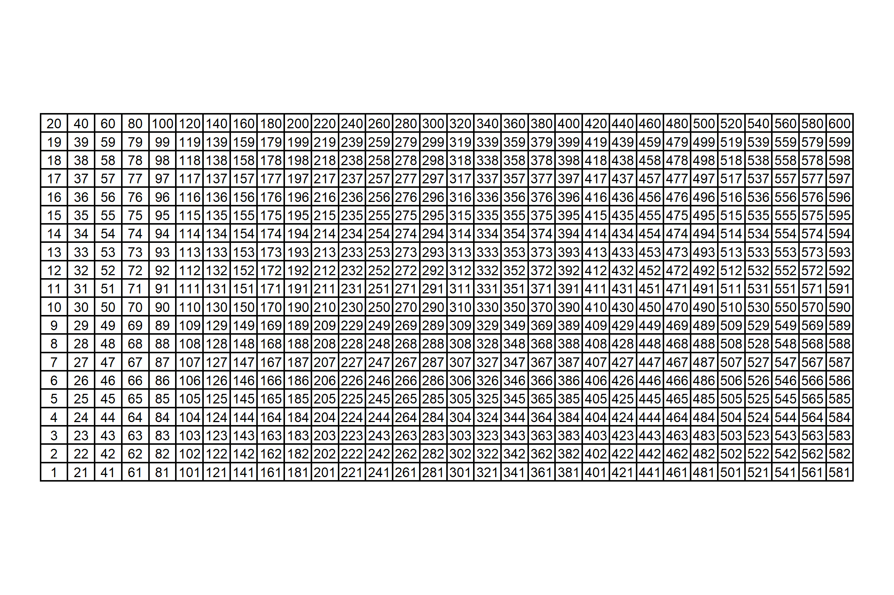
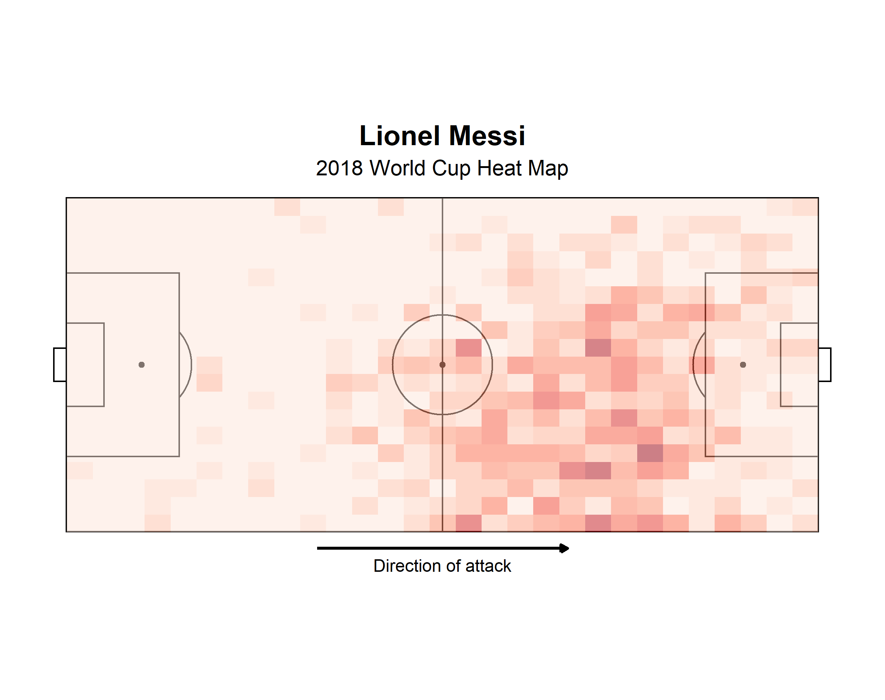
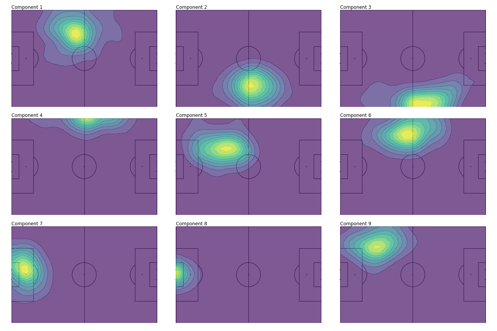

```{=html}
<!--
Using reticulate and data.table in a tidyverse-centric Workflow to Compute Non-Negative Matrix Factorization of Soccer Player Position Profiles
-->
```
```{r setup, include=F, echo=F, cache=F}
# .dir_proj <- here::here('content', 'post', 'variable-importance-compare')
# .dir_output <- file.path(.dir_proj, 'output')
# knitr::opts_knit$set(root.dir = here::here())
# Apply Claus' workflow?
knitr::opts_chunk$set(
  include = FALSE,
  echo = FALSE,
  cache = FALSE,
  eval = FALSE,
  cache.lazy = FALSE,
  fig.show = 'hide',
  fig.align = 'center',
  fig.width = 8,
  fig.asp = 0.75,
  fig.retina = 2,
  warning = FALSE,
  message = FALSE
)
```

## Intro

While reading up on modern soccer analytics ([going along with my recent itch for soccer and tracking data](https://www.tonyelhabr.rbind.io/soccer-pitch-control-r)), I stumbled upon [an excellent set of tutorials written by Devin Pleeuler](https://github.com/devinpleuler/analytics-handbook). In particular, his notebook on [non-negative matrix factorization (NNMF)](https://en.wikipedia.org/wiki/Non-negative_matrix_factorization) caught my eye. I hadn't really heard of the concept before, but it turned out to be much less daunting once I realized that it is somewhat related to [singular value decomposition (SVD)](https://en.wikipedia.org/wiki/Singular_value_decomposition). In an effort to really distill my newfound understanding of the concept, I set out to emulate his notebook.

In the process of converting his python code to R, I had to deal with two issues with resolutions are worth documenting.

1)  The only R implementation of NMMF (that I could find) comes with the [{NMF} package](https://cran.r-project.org/web/packages/NMF/index.html), which requires the installation of the [Bioconductor-exclusive {BiocManager} package](https://cran.r-project.org/web/packages/BiocManager/index.html). I'm relatively unfamiliar with Bioconductor, so this was not very appealing. As an alternative, why not `{reticulate}` to use the `sckikitlearn.decomposition` module directly? This is a perfect example of using `{reticulate}` for a non-trivial reason (in this case, the reason being for an algorithm).

2)  I would come upon the need to perform a non-equi join with a fairly size-able data set. If I wanted to stay completely in the tidy realm, I could use `{fuzzyjoin}` to get the job done. However, I would have to wait a couple of hours (or until my computer crashed) for the function call to complete 😭. Alternatively, I could get over any kind of stubbornness to only use "tidy"-ish function and instead use `{data.table}`.

I've always consider myself a "whatever gets the job done" kind of person, not insistent on ignoring solutions that use "base" R, python, etc. Nonetheless, the use of python and `{data.table}` alongside my normal `{tidyverse}`-centric workflow really distilled this mindset for me.

Anyways, keep reading to see how I did these things. I'll skip some of the details, emphasizing the things that are most interesting.

## Data

We'll be working with the [open-sourced StatsBomb data](https://github.com/statsbomb/open-data) for the 2018 Men's World Cup, which I've called `events` below. [^1]

[^1]: There's nothing too interesting about the data retrieval: I've essentially just called `StatsBombR::FreeCompetitions()`, `StatsBombR::FreeMatches()`,`StatsBombR::FreeEvents()`, and `StatsBombR::allclean()` in succession for `competition_id = 43`.

This is a relatively large data set with lots of columns and rows. We only need three columns for what we're going to do: (1) a unique identifier for each player, `player_id`, along with their (2) `x` and (3) `y` coordinates.

```{r include=T, echo=T}
library(tidyverse)
```

A quick summary of the data shows that there are 603 unique players, and that the `x` and `y` coordinates range from 1 to 120 (yards) and 1 to 80 respectively.

```{r include=T, echo=T}
events <-
  events %>% 
  select(player_id = player.id, x = location.x, y = location.y) %>% 
  drop_na() %>% 
  summarize(
    n = n(),
    n_player = n_distinct(player_id),
    across(c(x, y), list(min = min, max = max, mean = mean))
events
```

    ## # A tibble: 1 x 8
    ##        n n_player x_min x_max x_mean y_min y_max y_mean
    ##    <int>    <int> <dbl> <dbl>  <dbl> <dbl> <dbl>  <dbl>
    ## 1 224018      603     1   120  60.05     1    80  40.37

## Binning with a Non-Equi Join

Our first challenge is to convert the following chunk of python.

```{python include=T, echo=T}
import numpy as np

x_scale, y_scale = 30, 20

x_bins = np.linspace(0, 120, x_scale)
y_bins = np.linspace(0, 80, y_scale)

players = {}

for e in events:
    if 'player' in e.keys():
        player_id = e['player']['id']
        if player_id not in players.keys():
            players[player_id] = np.zeros((x_scale, y_scale))
        try:
            x_bin = int(np.digitize(e['location'][0], x_bins[1:], right=True))
            y_bin = int(np.digitize(e['location'][1], y_bins[1:], right=True))
            players[player_id][x_bin][y_bin] += 1
        except:
            pass
```

This code creates a nested `dict`, where the keys are player id's and the values are 20x30 matrices. Each element in the matrix is an integer that represents the count of times that the player was recorded being at a certain position on the pitch. (These counts range from 0 to 94 for this data set.)

Some technical details:

1.  The python `events` is actually a pretty heavily nested list[^2], hence the non-rectangular operations such as `e['player']['id']`.
2.  Observations with missing coordinates are ignored, hence the `try`-`except` combo.
3.  `x` and `y` values (elements of the `'location'` sub-list) are mapped to "bins" using `numpy`'s `digitize()` function, which is analogous to `base::cut()`.

[^2]: minimally converted from the original JSON format

How can we do this same data manipulation in an idiomatic R fashion? We could certainly create a named list element and `base::cut()` to closely match the python approach. However, I think we should stick with data frames and SQL-ish operations (i.e. joins) since I think these are much more "natural" for R users.[^3]

[^3]: compared to `dict` and `list`s or python users

So, going forward with data frames and joins, we realize that we'll have to do some ["non-equi" joining](https://www.w3resource.com/sql/joins/perform-a-non-equi-join.php) here.

`{fuzzyjoin}` and `{sqldb}` offer functionality for such an approach, but `{data.table}` is certainly the go-to option in the R ecosystem for non-equi joins.[^4] The only minor inconvenience here is that we have to explicitly coerce our `events` data to a `data.table`.

[^4]: As great as `{dplyr}` is, it does not have built-in support for these kinds of joins.

We'll also need a helper, grid-like data frame to assist with the binning. The 600-row `grid_xy_yards` data frame (30 `x` bins \* 20 `y` bins) below is essentially a "tidy" definition of the cells of the grid upon which we are binning the `events` data. (Use whatever flavor of `crossing()`, `expand.grid()`, `seq()`, etc. that you prefer to create a data frame like this.)

Visually, this grid looks like this.

```{r eval=F, include=T, echo=T}
viz_grid <-
  grid_xy_yards %>% 
  ggplot() +
  # .gg_pitch(pitch = ..get_pitch(dimension = ggsoccer::pitch_statsbomb)) +
  geom_rect(aes(xmin = x, ymin = y, xmax = next_x, ymax = next_y), fill = NA, color = 'black') +
  geom_text(
    aes(x = (x + next_x) / 2, y = (y + next_y) / 2, label = idx), size = 3
  ) +
  coord_fixed(ratio = 2 / 3) +
  theme_void()
viz_grid
```

```{r eval=F, include=T, echo=T}
ggsave(
  plot = viz_grid, 
  filename = fs::path(.get_dir_plots(), 'viz_grid_nnmf.png'), 
  width = 8, 
  height = 8 * 2 / 3
)
```



Some slices of its contents are shown below.

```{r eval=F, include=T, echo=T}
rng_x_yards <- c(0, 120)
rng_y_yards <- c(0, 80)
rng_x_m <- c(0, 105)
rng_y_m <- c(0, 68)

seq_coord_yards <- function(coord = c('x', 'y'), n) {
  rng <- switch(coord, x = rng_x_yards), y = rng_y_yards)
  seq(rng[1], rng[2], length.out = n)
}

seq_x_yards <- seq_coord_yards('x', n = 30)
seq_y_yards <- seq_coord_yards('y', n = 20)

grid_xy_yards <-
  crossing(x = seq_x_yards, y = seq_y_yards) %>% 
  arrange(x, y) %>% 
  mutate(idx = row_number())
grid_xy_yards

grid_xy_yards <-
  grid_xy_yards %>% 
  select(idx, x, y) %>% 
  group_by(x) %>% 
  mutate(next_y = dplyr::lead(y) %>% coalesce(y + (y - dplyr::lag(y)))) %>% 
  ungroup() %>% 
  group_by(y) %>% 
  mutate(next_x = dplyr::lead(x) %>% coalesce(x + (x - dplyr::lag(x)))) %>% 
  ungroup()
```

```{r eval=F, echo=T, include=T}
grid_xy_yards %>% head()
```

    ##  # A tibble: 6 x 5
    ##      idx     x      y next_y next_x
    ##    <int> <dbl>  <dbl>  <dbl>  <dbl>
    ##  1     1     0  0      4.211  4.138
    ##  2     2     0  4.211  8.421  4.138
    ##  3     3     0  8.421 12.63   4.138
    ##  4     4     0 12.63  16.84   4.138
    ##  5     5     0 16.84  21.05   4.138
    ##  6     6     0 21.05  25.26   4.138

Two things to note about this supplementary data frame:

1.  Cells aren't evenly spaced integers, i.e. `x` cells are defined at 0, 4.138, 8.276, ..., 80 instead of something like 0, 4, 8, ..., 80, and `y` cells are defined at 0, 4.211, 8.421, ..., 120 instead of something like 0, 4, 8, ..., 120). That's simply due to using 30 and 20 instead of 31 and 21 to split up the `x` and `y` ranges respectively. I point this out because this SQL-ish approach would have been much easier if these numbers were just integers! We could join on an integer grid instead of non-equi-joining upon a grid of floating point numbers. Unfortunately, joining on floating point numbers as keys leads to [inconsistent results, simply due to the nature of floating points](https://stackoverflow.com/questions/52207851/how-do-you-join-on-floating-point-columns-in-sql). (A potential solution would be to round the floating point numbers before joining and "restore" them after the join, but that's just kluge-y and inelegant.)

2.  The index `idx` is important! This will come back into play when we do the NNMF procedure, at which point we'll "flatten" out our `x`-`y` pairs into a 1-d format.

Ok, on to the actual data joining.

```{r eval=F, echo=T, include=T}
events_dt <- events %>% drop_na() %>% data.table::as.data.table()
grid_xy_yards_dt <- grid_xy_yards %>% data.table::as.data.table()
events_binned <-
  events_dt[grid_xy_yards_dt, on=.(x > x, x <= next_x, y >= y, y < next_y)] %>% 
  as_tibble() %>% 
  select(player_id, idx, x, y)
events_binned
```

    ##  # A tibble: 224,038 x 4
    ##     player_id   idx     x     y
    ##         <int> <int> <dbl> <dbl>
    ##   1      5462     1     0     0
    ##   2      5467     1     0     0
    ##   3      5488     1     0     0
    ##   4      3632     1     0     0
    ##   5      5576     1     0     0
    ##   6      5595     1     0     0
    ##   7      5263     1     0     0
    ##   8      4063     1     0     0
    ##   9      5231     1     0     0
    ##  10      5231     1     0     0
    ##  # ... with 224,028 more rows

The rest of this is just doing the actual tallying. First, we make an intermediate data set `grid_players`, which is the Cartesian product of all possible cells in the grid and all players in `events`. Second, we "add back" missing cells to `events_binned` using the intermediate data set `grid_players`.

In the end, we end up with a `players` data frame with 603 `player_id`s \* 30 `x` bins \* 20 `y` bins = 361,800 rows.

```{r }
# This `dummy` column approach is an easy way to do a Cartesian join when the two data frames don't share any column names.
grid_players <-
  grid_xy_yards %>% 
  mutate(dummy = 0L) %>% 
  # Cartesian join of all possible cells in the grid and all players in `events`.
  full_join(
    events %>% 
      drop_na() %>% 
      distinct(player_id) %>% 
      mutate(dummy = 0L),
    by = 'dummy'
  )

players <-
  events_binned %>% 
  group_by(player_id, x, y, idx) %>% 
  summarize(n = n()) %>% 
  ungroup() %>% 
  # Rejoin back on the grid to 'add back' cells with empty counts (i.e. `n = 0`).
  full_join(grid_players, by = c('player_id', 'x', 'y', 'idx')) %>% 
  select(-dummy, -next_x, -next_y) %>% 
  replace_na(list(n = 0L)) %>% 
  arrange(player_id, x, y)
players
```

    ##  # A tibble: 361,800 x 5
    ##     player_id     x      y   idx     n
    ##         <int> <dbl>  <dbl> <int> <int>
    ##   1      2941     0  0         1     0
    ##   2      2941     0  4.211     2     0
    ##   3      2941     0  8.421     3     0
    ##   4      2941     0 12.63      4     0
    ##   5      2941     0 16.84      5     0
    ##   6      2941     0 21.05      6     0
    ##   7      2941     0 25.26      7     0
    ##   8      2941     0 29.47      8     0
    ##   9      2941     0 33.68      9     0
    ##  10      2941     0 37.89     10     0
    ##  # ... with 361,790 more rows

To make this a little bit more tangible, let's plot Messi's heatmap. (Is this really a blog post about soccer if it doesn't mention Messi 😆?)

```{r eval=F, echo=F, include=F}
.rescale_vec <- function(x, rng1, rng2) {
  rng2[1] + ((x - rng1[1]) * (rng2[2] - rng2[1])) / (rng1[2] - rng1[1])
}

.rescale_xy_cols <-
  function(.data,
           rng_x_from = rng_x_yards,
           rng_y_from = rng_y_yards,
           rng_x_to = rng_x_m,
           rng_y_to = rng_y_m,
           rgx_x = '^x$',
           rgx_y = '^y$',
           scaler_x = 1,
           scaler_y = 1) {
    res <-
      .data %>%
      mutate(
        across(
        matches(rgx_x),
        ~ .rescale_vec(scaler_x * .x, rng_x_from, rng_x_to)
      ),
      across(
        matches(rgx_y),
        ~ .rescale_vec(scaler_y * .x, rng_y_from, rng_y_to)
      )
      )
    res
  }

viz_players1 <-
  ggplot() +
  .gg_pitch(pitch = ..get_pitch(dimension = ggsoccer::pitch_statsbomb)) +
  coord_fixed(ratio = 2 / 3, clip = 'off') +
  theme_void() +
  geom_raster(
    data =
      players %>% 
      filter(player_id == 5503L) %>% 
      filter(x != max(x) & y != max(y)) %>% 
      .rescale_xy_cols(
        rng_x_from = rng_x_yards,
        rng_y_from = rng_y_yards,
        rng_x_to = rng_x_yards, 
        # Need to flip y in order to put the origin on the bottom-left instead of the top-left.
        rng_y_to = c(rev(seq_y_yards)[1] - seq_y_yards[2], -seq_y_yards[2])
      ),
    aes(x = x, y = y, fill = n), alpha = 0.5, hjust = 1, vjust = 1
  ) +
  scale_fill_distiller(palette = 'Reds', direction = 1) +
  theme(
    legend.position = 'none',
    plot.title = element_text('Arial', face = 'bold', size = 18, color = 'black', hjust = 0.5),
    plot.subtitle = element_text('Arial', size = 14, color = 'black', hjust = 0.5),
    # plot.title.position = 'plot',
    plot.margin = margin(10, 10, 10, 10)
  ) +
  geom_segment(
    data = tibble(y = -4, x_start = 60 - 20, x_end = 60 + 20),
    aes(x = x_start, y = y, xend = x_end, yend = y),
    size = 1,
    arrow = arrow(length = unit(5, 'pt'), type = 'closed')
  ) +
  geom_text(
    data = tibble(y = -8, x = 60, lab = 'Direction of attack'),
    aes(x = x, y = y, label = lab),
    size = 4,
    # fontface = 'bold',
    family = 'Arial'
  ) +
  labs(title = 'Lionel Messi', subtitle = '2018 World Cup Heat Map')
viz_players1
```

```{r eval=F, echo=F, include=F}
ggsave(
  plot = viz_players1, 
  filename = fs::path(.get_dir_plots(), 'viz_43_messi_binned.png'), 
  width = 8, 
  height = 8 * 2 / 3 + 1
)
```



### Non-Negative Matrix Factorization (NNMF)

I don't care if you're the biggest R [stan](https://www.urbandictionary.com/define.php?term=Stan) in the world; you have to admit that the python code to perform the NNMF is quite elegant.

```{python eval=F, include=T, echo=T}
from sklearn.decomposition import NMF

# Flatten individual player matricies into shape=(600,) which is the product of the original shape components (30 by 20)
unraveled = [np.matrix.flatten(v) for k, v in players.items()]
comps = 30
model = NMF(n_components=comps, init='random', random_state=0)
W = model.fit_transform(unraveled)
```

After re-formatting our `players` data into a wide format---equivalent to the `numpy.matrix.flatten()` call in the python code---we could use the `{NMF}` package for an R-only replication.

```{r eval=F, include=T, echo=T}
# Convert from tidy format to wide format (603 rows x 600 columns)
players_mat <-
  players %>% 
  select(player_id, idx, n) %>% 
  pivot_wider(names_from = idx, values_from = n) %>% 
  select(-player_id) %>% 
  as.matrix()

comps <- 30L
W <- NMF::nmf(NMF::rmatrix(players_mat), rank = comps, seed = 0, method = 'Frobenius')
```

However, I found that the results weren't all that comparable to the python results. (Perhaps I needed to define the arguments in a different manner.) So why not use `{reticulate}` and call the `sklearn.decomposition` module directly to make sure that we exactly emulate the python decomposition?

```{r eval=F, include=T, echo=T}
sklearn <- reticulate::import('sklearn')
# Wont' work if `n_components` aren't explicitly defined as integers!
model <- sklearn$decomposition$NMF(n_components = comps, init = 'random', random_state = 0L)
W <- model$fit_transform(players_mat)
```

The result includes 30 20x30 matrices---one 30x20 `x`-`y` matrix for each of the 30 components (`comps`). We have some wrangling left to do to gain anything meaningful from this NNMF procedure, but we have something to work with!

## Gaussian Smoothing

The last thing to do is to post-process the NMMF results and make pretty plots! The python plotting is pretty standard `matplotlib`, with the exception of some non-trivial Guassian smoothing performed on each component's matrix `model.component_`.

```{python eval=F, include=T, echo=T}
from scipy.ndimage import gaussian_filter

for i in range(9):
    # ... Excerpted
    z = np.rot90(gaussian_filter(model.components_[i].reshape(x_scale, y_scale), sigma=1.5), 1)
    # ... Excerpted
```

The first 9 smoothed component component matrices come out looking like this.



So let's do the same thing in R. There's a couple of steps involved.

1.  We'll first convert the components matrices to a tidy format---`decomp_tidy` below.

2.  We'll join our tidied components matrices with our tidy grid of cells---grid\_xy\_yards---that maps our index of cells (`idx`, ranging from 1 to 600) to cells on a pitch, defined in meters. Note that the original StatsBomb data treats the origin as the top-left corner of the pitch, so this grid should be defined such that the `y` axis is flipped in translation.

3.  We perform the Gaussian smoothing on nested data frames with a custom function, `smoothen_dimension`, that wraps `spatstat::blur()`.

```{r eval=F, include=T, echo=T}
decomp_tidy <-
  model$components_ %>% 
  as_tibble() %>% 
  # "Un-tidy" tibble with 30 rows (one for each dimension) and 600 columns (one for every `idx`, of which there are 30 x 20 = 600)
  mutate(dimension = row_number()) %>% 
  # Convert to a tidy tibble with dimensions * x * y rows (30 * 30 * 20 = 1800)
  pivot_longer(-dimension, names_to = 'idx', values_to = 'value') %>% 
  # The columns from the matrix are named `V1`, `V2`, ... `V600` by default, so convert them to an integer that can be joined on.
  mutate(across(idx, ~str_remove(.x, '^V') %>% as.integer()))

decomp <-
  decomp_tidy %>% 
  # Join on our grid of x-y pairs.
  inner_join(
    # Using `dense_rank` because we need indexes here (i.e.. 1, 2, ..., 30 instead of 0, 4.1, 8.2, ..., 120 for `x`).
    grid_xy_yards %>% 
      select(idx, x, y) %>% 
      mutate(across(c(x, y), dense_rank))
  )

decomp_smooth <-
  decom %>% 
  # Prep for applying smoothing to each dimension individually.
  nest(data = -c(dimension)) %>% 
  # `sigma` passed into `...` of `smoothen_component()`. (`data` passed as first argument.)
  mutate(data = map(data, smoothen_component, sigma = 1.5)) %>% 
  unnest(data)
decomp_smooth
```

With the data in the proper format, the plotting is pretty straightforward `{ggplot2}` code (so it's excerpted). We use `geom_contour_filled()` and `scale_fill_viridis_d()` to match the python plot.

```{r eval=F, echo=F, include=F}
# Fix for pitch_international here: https://github.com/Torvaney/ggsoccer/blob/master/R/dimensions.R (which has length = 106 instead of 105).
.pitch_international <- list(
  length = 105,
  width = 68,
  penalty_box_length = 16.5,
  penalty_box_width = 40.32,
  six_yard_box_length = 5.5,
  six_yard_box_width = 18.32,
  penalty_spot_distance = 11,
  goal_width = 7.32,
  origin_x = 0,
  origin_y = 0
)

..get_pitch <- function(pitch_fill = 'white', pitch_color = 'black', limits = FALSE, dimension = .pitch_international) {
  ggsoccer::annotate_pitch(
    dimension = dimension,
    fill = pitch_fill, 
    colour = pitch_color,
    limits = limits
  )
}

.gg_pitch <- function(pitch = ..get_pitch(), ..., aspect_ratio = 68/105) {
  res <-
    list(
      ...,
      pitch,
      ggsoccer::theme_pitch(aspect_ratio = aspect_ratio),
      theme(legend.position = 'none')
    )
  res
}

grid_xy_rev_m <- 
  grid_xy_yards %>%
  .rescale_xy_cols(
    rng_x_from = rng_x_yards,
    rng_y_from = rng_y_yards,
    rng_x_to = rng_x_m, 
    # Need to flip y in order to put the origin on the bottom-left instead of the top-left.
    rng_y_to = rev(rng_y_m)
  )
grid_xy_rev_m


plot_dimensions <-
  function(.data,
           ...,
           dir = getwd(), # .get_dir_plots(),
           suffix = c('smooth', 'unsmooth'),
           prefix = 'viz_nnmf_dimensions_1to9_r',
           path = fs::path(dir, sprintf('%s_%s.png', prefix, suffix))) {
    suffix <- match.arg(suffix)
    viz <-
      .data %>%
      filter(dimension <= 9L) %>%
      mutate(lab_facet = sprintf('Component %d', dimension)) %>%
      ggplot() +
      aes(x = x, y = y) +
      theme_void() +
      .gg_pitch() +
      facet_wrap( ~ lab_facet, ncol = 3) +
      geom_contour_filled(aes(z = frac), alpha = 0.7) +
      theme(strip.text = element_text('Arial', size = 8, hjust = 0.05, vjust = 0.01)) +
      # labs(title = sprintf(
      #   'First 9 Components, %s',
      #   ifelse(suffix == 'smooth', 'Smoothed', 'Not Smoothed')
      # )) +
      scale_fill_viridis_d(direction = 1)
    ggsave(
      plot = viz,
      filename = path,
      width = 10,
      height = 10 * 2 / 3
    )
    viz
  }

viz_smooth <- decomp_smooth %>% plot_dimensions(suffix = 'smooth')
viz_smooth
```


Note that we could achieve a similar visual profile without the smoothing (see below), but the smoothing undoubtedly makes things pattern detection a little less ambiguous.

```{r eval=F, echo=F, include=F}
viz_unsmooth <- decomp_unsmooth %>% plot_dimensions(suffix = 'unsmooth')
viz_unsmooth
```


And that's it! From the smoothened plot, we can see discern different player profiles (in terms of positioning).

-   Components 1, 5, 9: left back
-   Components 2: right midfielder
-   Component 3: attacking right midfielder
-   Component 4: wide left midfielder
-   Component 6: central left midfielder
-   Components 7, 8: goalkeeper

The redundancy with left back and goalkeeper is not ideal. That's certainly something we could fine tune with more experimentation with components. (Anyways, the point of all of this wasn't so much about the insights.)

## Conclusion

Translating python code can be challenging, throwing us off from our typical workflow (for me, being `{tidyverse}`-centric). But hopefully one can see the value in "doing whatever it takes", even if it means using "non-tidy" R functions (e.g. `{data.table}` and friends) or a different language altogether!
