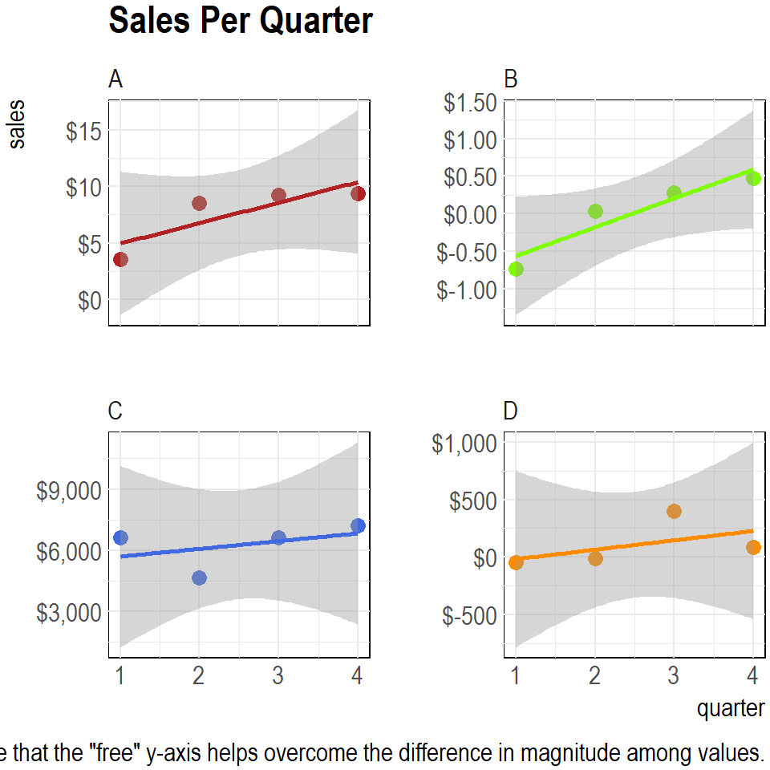
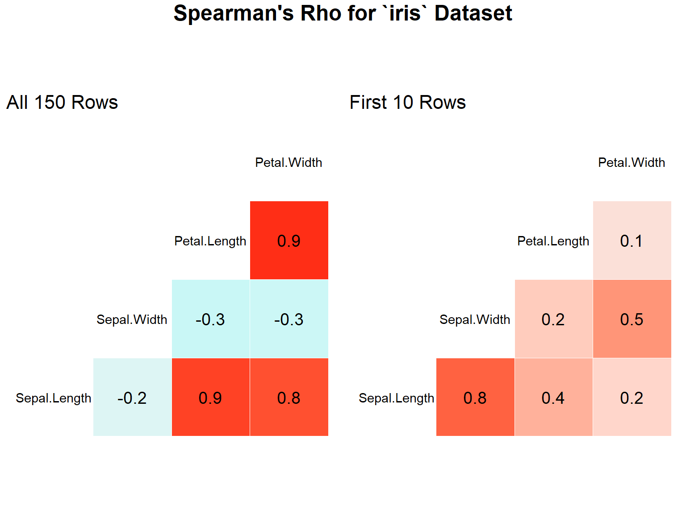
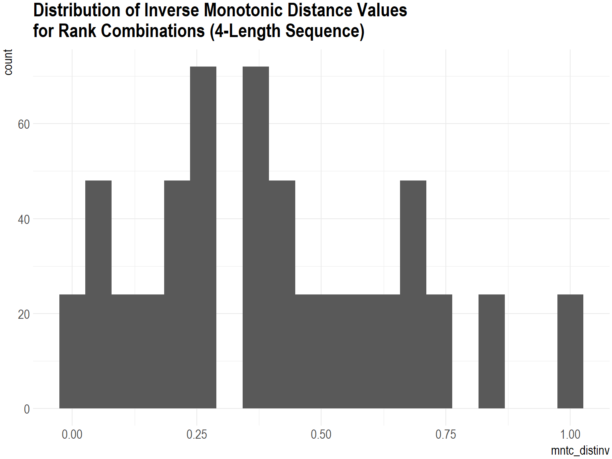
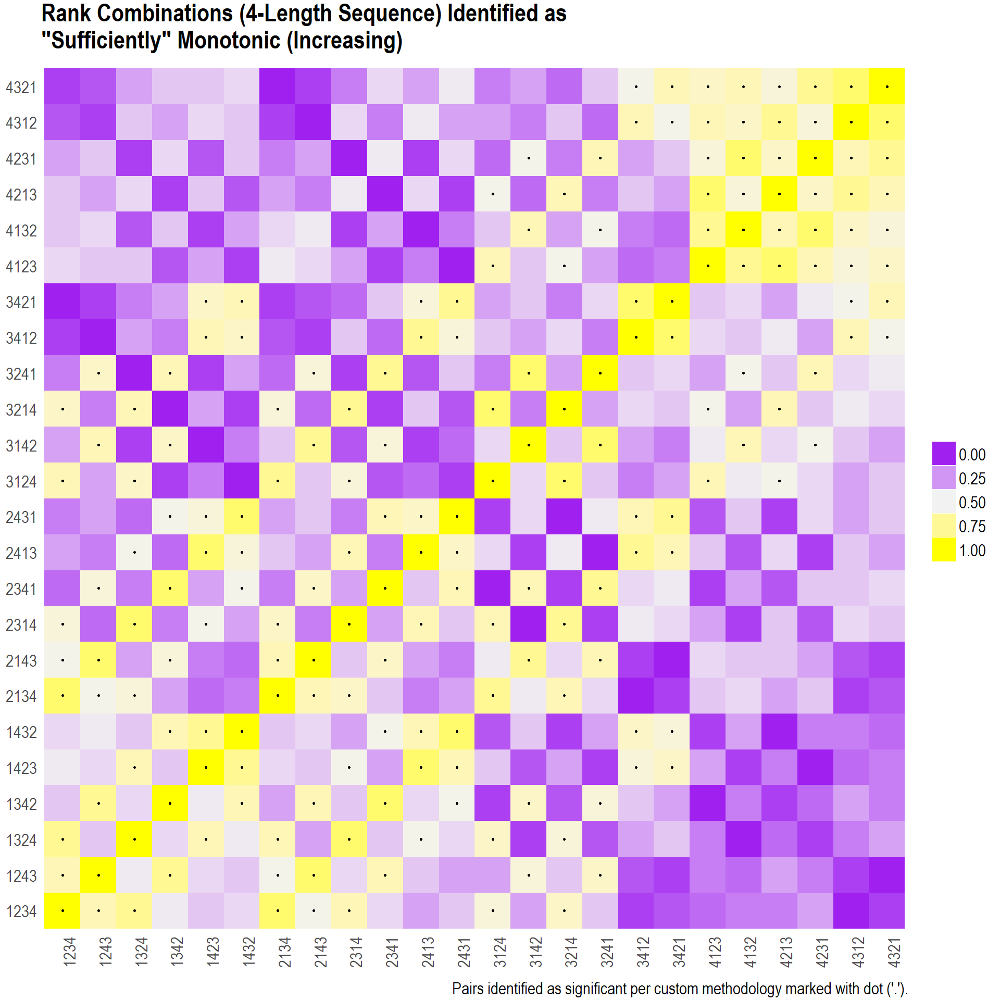
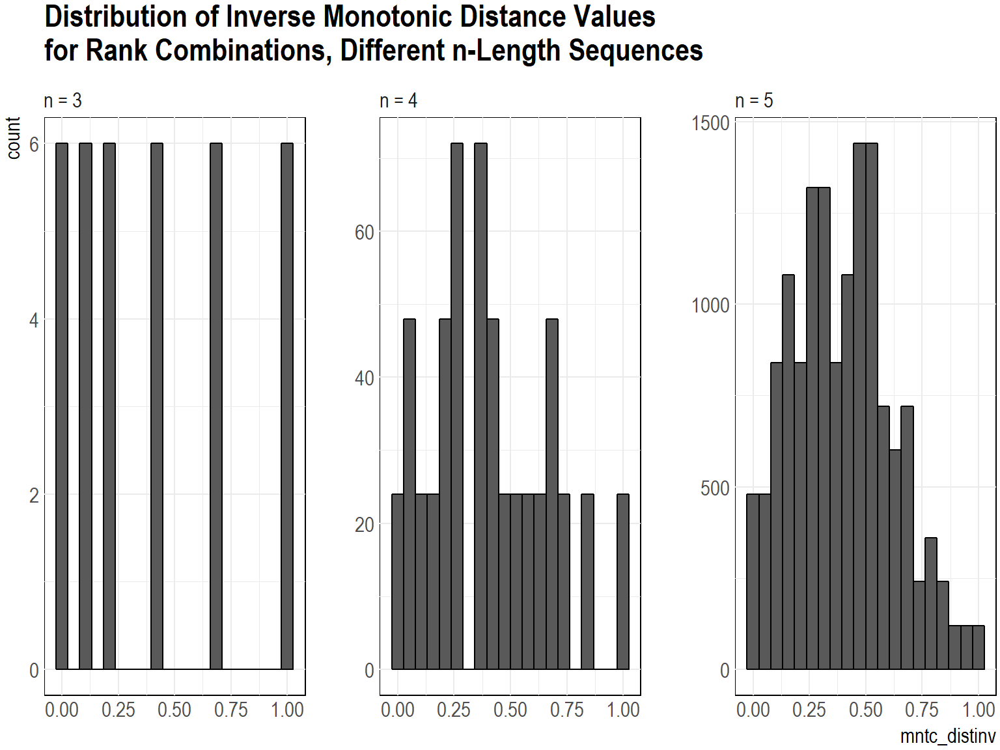
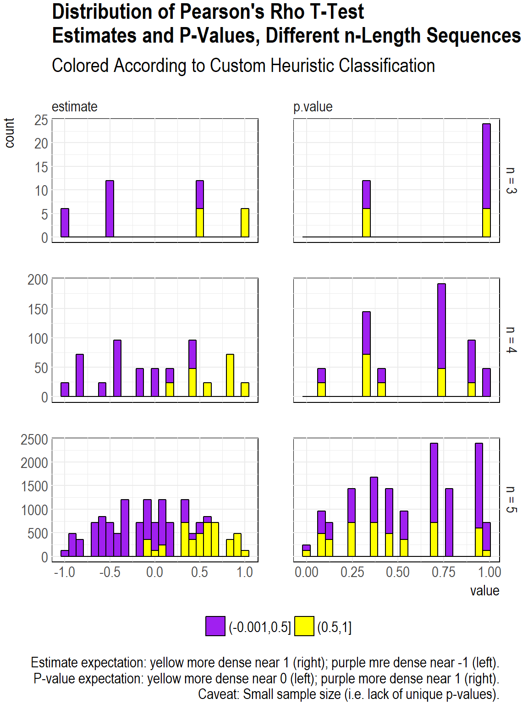

The Problem
-----------

I have a bunch of data that can be categorized into many small
**groups**. Each small group has a set of **values** for an ordered set
of **intervals**. Having observed that the values for most groups seem
to increase with the order of the interval, I hypothesize that their is
a statistically-significant, monotonically increasing trend.


### An Analogy

To make this abstract problem more relatable, imagine the following
scenario.

There are many companies (**groups**) selling products in an industry
that is on the verge of widespread growth. Each company sets a
projection (not a goal) for end-of-year sales (**value**). and adjust
this projection once per quarter (i.e. four times a year) (**interval**)
after analyzing their to-date sales. Having observed that most companies
that follow this scheme tend to increase their goals for next-quarter
sales (based on an initial, beginning-of-the-year projection that is too
low), the market analyst (me) wonders if there is a non-trivial,
positive trend across quarters in the year. [^1]

To summarize how the “variables” in this analogy relate to my abstract
description of the situation,

-   groups = companies
-   value = sales
-   interval = quarter-year

(Actually, there is one more variable in this context, given that I am
interested in relative value—the **rank** of the value, relative to the
other values.)

And, to make the example concrete, here is what the data (for four
companies) might look like.

  company   q1      q2     q3     q4
  --------- ------- ------ ------ ------
  A         3.6     8.5    9.2    9.4
  B         -0.73   0.04   0.28   0.47
  C         6604    4631   6604   7217
  D         -49     -9     400    87




### (Bad) Solution: Linear Regression

Just at first thought, running a univariate [linear
regression](https://en.wikipedia.org/wiki/Linear_regression) might seem
like a good way of attacking this problem. However, there are a couple
of basic “gotchas” that make ordinary linear regression a not-so-great
idea for this scenario:

-   There are not many intervals (i.e. independent variables) per group.
    (This condition inherently makes any kind of model—not just a linear
    regression one—sensitive to the samples. In general, there is a
    problem with creating models with [small sample
    sizes](https://garstats.wordpress.com/2017/02/04/small-sample-sizes/).)

-   The values across groups might have very different magnitudes.
    (Thus, trying to create a single, general model that groups all of
    the data and uses the group labels as a categorical independent
    variable would likely lead to unreliable results.)

-   The values themselves might be very volatile for a single group.
    (This might be interpreted as a violation of the [normal
    distribution assumption of linear
    regression](https://www.statisticssolutions.com/assumptions-of-linear-regression/).
    Additionally, if the values are truly monotonic, the assumption of
    no autocorrelation might also be violated.)

Aside from these caveats, the value for a given interval is not
relevant—rather, its relationship with all other values is, and, more
specifically, its relationships with the previous and subsequent values.
[^2]


### (Better) Solution: *Spearman’s Rho*

Given the nature of the data (which one might say is non linear) and my
intent to quantify ordinality between two variables, it turns out that
[Spearman’s
rho](https://en.wikipedia.org/wiki/Spearman%27s_rank_correlation_coefficient),
in theory, provides exactly the measurement that I want—it quantifies
the association between paired samples using the ranks of the variables
(not their values) relative to their samples. Notably, the statistical
significance (i.e. via a p-value) can be calculated (traditionally,
using a [t-test](https://en.wikipedia.org/wiki/Student%27s_t-test)),
which should be handy for my intent on identifying non-triviality.

Nonetheless, even though this metric seems promisable, it will certainly
be sensitive to the small samples of each group (assuming that it is
calculated for each group). Don’t believe me? Check out how the
Spearman’s rho value changes for the numerica columns in the built-in
`iris` dataset (which has 150 rows) when it is calculated for just the
first 10 rows.




### Another Solution: Custom Heuristic

So, what can be done? Well, even with the hope that the Spearman’s rho
metric provides for quantification and significance inference, I thought
that I would try to create some kind of easily understandable heuristic
that I could explain to someone else without having to delve into
statistical theory. Nonetheless, I would be ignorant to not compare (and
validate) the results of my heurisitc with those of statistical theory
after creating my heurisitc.

Having this plan in mind, I began to think about how I would define my
heuristic, which, in essence, tries to quantify
[**monotocity**](https://en.wikipedia.org/wiki/Monotonic_function). But
what exactly constitutes monoticity? Surprisingly, that’s a more complex
question than it might seem. [^3] (For
example, did you know that numbers may be strictly or weakly monotonic?)

For my purposes, I don’t necessarily care if the set of values is
*strictly* increasing or decreasing, but they should be “sufficiently”
increasing or decreasing. For example, while it is clear that the
sequence `1`, `2`, `3`, `4` is strictly monotonic (increasing) and the
sequence `1`, `2`, `4`, `3` is not, I would consider the latter
“sufficiently” monotonic. On the the hand, I would consider something
like `4`, `2`, `3`, `1` because the `1` and `4` are “badly” misplaced in
one another’s appropriate places, which are at the extreme ends of the
sequence. Moreover, if I was intent on identifying increasing monoticity
(as opposed to decreasing monotonicity), I would consider `4`, `3`, `2`,
`1` “bad”, even though it is strictly monotonically decreasing. But what
about something like `1`, `4`, `3`, `2` (again, assuming that I am
evaluating increasing monotonicity)? Even though the `2` and `4` are
swapped, I might still consider this sequence “sufficiently” monotonic
because the `1` and `3` are placed correctly and the `2` and `4` are
“not too far apart”. Anyways, it’s easy to see how having some kind of
formal definition/calculation/criteria for monotonicity is handy.


#### The “Algorithm”

After some thinking, I came up with the following algorithm (if one can
even call it that).

(**NOTE:** I explicitly list the variable names that I use in the code
that follows to help the reader understand the relationships between
these steps and the implementation.)

1.  Given an `n`-length sequence of arbitrary values, assign each value
    an integer value between `1` and `n` to represent its “actual” rank.
    This rank is to be assigned based on relative value in the set of
    [real numbers](https://en.wikipedia.org/wiki/Real_number).
    [^4]

-   In the machine learning setting, this set of ranks is the dependent
    variable (i.e. `y`) to predict.
-   In the example situation described before, it equates to the rank
    that would be assigned to the quarterly interval based on sales
    relative to the other quarters.
-   In the simulation that I run below, this is the variable `y0`.

2.  Create a matrix of all permutations of actual rank and “assigned”
    rank. To be clear, this “assigned” rank is independent of the actual
    rank and value. To make things straightforward, these assigned ranks
    should be transformed to use only the same set of possible rank
    values dictated by the actual ranks (i.e. integers between 1 and
    `n`).

-   In the machine learning setting, this “assigned” rank is the
    independent variable (i.e. `x`) used as a predictor.
-   In the example, it is the quarterly interval.
-   In the simulation that follows, assigned rank is `x0`, and the
    matrix (actually, a `tibble`) of combinations is `data_permn`.

3.  Calculate the absolute difference between the “actual” and
    “assigned” ranks for each value in the sequence. Subtract this
    distance from the maximum rank value in the sequence. The resulting
    value is what I call the “inverse monotonic distance”
    (`mntc_distinv` in the following code).

4.  Repeat the calculation of inverse monotonic distance for all groups
    (`grp`) of “actual” (`y0`) and “assigned” (`x0`) ranks.

5.  Sum up the inverse monotonic distance for each value in the
    permutation group and take the average of this sum for each group.
    [^5] Re-scale this per-group value to a
    0 to 1 basis. [^6] (In the code that
    follows, I re-use the variable name `mntc_distinv` for this
    transformed value.)

6.  Identify any group (`grp`) corresponding to a sum-averaged-re-scaled
    value (`mntc_distinv`) in the upper 50% quantile of all values
    (i.e. assigned the value `"(0.5,1]"` for the `mntc_tier2` variable)
    as **“sufficiently” monotonic**. (The `mntc_tier2` variable can be
    interpreted as my heuristic.)

Notably, even though the result set is split at the 50% threshold (which
is a subjective choice), this does not mean that 50% of all possible
groups are classified as 50%. (According to my method, only 33% are for
`n = 4`.)


Implementing the Heuristic
--------------------------

Ok, that is enough discussion. What follows is the implementation.

*NOTE:* In order to keep focus on how the code implements methodology, I
recommend reviewing the code but not worrying too much about the details
(such as the internal workings of my custom functions). Rather, I’d
recommend inspecting in detail only the parts that are printed out (and
going back later to understand the complexities, if curious).

``` {.r}
library("dplyr")
library("ggplot2")
library("tidyr")
# These packages are used, but their functions are called explicitly.
# library("purrr")
# library("broom")
# library("combinat")
```

The only choice that I need to make to begin is the length of the set of
values (i.e. `n`), which should be a “small” integer. I’ll choose `4`,
simply because `3` seems like it is “too small” and because subsequent
visualization(s) becomes “cluttered” (and interpretation becomes less
direct) if a number `5` or greater is chosen. [^7] 
(Nonetheless, the methodology and results remain valid for
any integer.)

The following code chunk corresponds to steps 1 and 2 in my methodology,
which are basically just set-up steps.

``` {.r}
create_permns <- function(n = 1L) {
  
  n_seq <- seq(1L, n, by = 1L)
  
  combs <-
    combinat::permn(n_seq) %>%
    purrr::map( ~ paste(.x, collapse = "")) %>%
    unlist() %>%
    as.integer()
  data_xy <-
    tibble(grp_x = combs, grp_y = combs) %>%
    expand(grp_x, grp_y) %>%
    mutate(grp = paste0("x", grp_x, "y", grp_y))
  
  into_seq <- seq(1L, n, by = 1L) %>% as.character()
  sep_seq <- seq(1L, n - 1L, by = 1L)
  wrangle_data_xy <-
    function(data = NULL, which = NULL) {
      col_grp <- rlang::sym(paste0("grp_", which))
      col_0 <- rlang::sym(paste0(which, "0"))
      data %>%
        separate(!!col_grp, into_seq, sep = sep_seq, remove = FALSE) %>%
        gather(idx, !!col_0, matches("^[0-9]$")) %>%
        mutate_at(vars(idx, !!col_0), funs(as.integer))
    }
  inner_join(data_xy %>% wrangle_data_xy("x"),
               data_xy %>% wrangle_data_xy("y")) %>%
    select(-idx) %>%
    arrange(grp_x, grp_y)
}

data_permns <- create_permns(n = n)
data_permns
```

grp\_x
grp\_y
grp
x0
y0
1234
1234
x1234y1234
1
1
1234
1234
x1234y1234
2
2
1234
1234
x1234y1234
3
3
1234
1234
x1234y1234
4
4
1234
1243
x1234y1243
1
1
1234
1243
x1234y1243
2
2
1234
1243
x1234y1243
3
4
1234
1243
x1234y1243
4
3
1234
1324
x1234y1324
1
1
1234
1324
x1234y1324
2
3
^1^ \# of total rows: 2304
Note(s) about the above code chunk:

-   Although the “actual” ranks (`y0`) could be any real numbers, I’m
    using values between `1` and `n` because my methodology dictates
    that the arbitrary set of values would need to be transformed to
    this range anyways. When transformed to this range, the values
    should be interpreted as ranks.

-   Like the “actual” `y0` ranks (representing the order of the
    original, arbitrary values), the `x0` ranks could technically be any
    real numbers, but they would need to be transformed to the
    `1`-to-`n` range anyways, so I do that directly.

-   The number of combinations of “actual” (`y0`) and “assigned” (`x0`)
    rank pairs is equal to `n! * n!` (i.e. 576). For my implementation,
    the data.frame `data_permns` actually has `n! * n! * n` (2304) rows
    (because it is arranged in a “long” format).

-   `grp_x` and `grp_y` (and the combination of the two in the `grp`
    column) identify the `n`-length groups of pairs of `x0` and `y0`
    ranks. These are primarily useful for human interpretability and are
    not actually relevant for computations.

-   I use a function here (and elsewhere) although it may seem
    unnecessary for a single execution because I’ll repeat the
    methodology for different values of `n` later.

Now, I implement the initial calculation of “inverse monotonic distance”
(`mntc_distinv`).

``` {.r}
add_mntc_cols <- function(data = NULL) {
  data %>%
    group_by(grp) %>%
    arrange(x0, .by_group = TRUE) %>% 
    mutate(mntc = ifelse((y0 == cummax(y0)) | (y0 == cummin(y0)), 1L, 0L)) %>% 
    mutate(mntc_distinv = as.integer(x0 * (max(x0) - abs(x0 - y0)))) %>% 
    ungroup()
}
data_mntc <- add_mntc_cols(data_permns)
data_mntc
```

grp\_x
grp\_y
grp
x0
y0
mntc
mntc\_distinv
1234
1234
x1234y1234
1
1
1
4
1234
1234
x1234y1234
2
2
1
8
1234
1234
x1234y1234
3
3
1
12
1234
1234
x1234y1234
4
4
1
16
1234
1243
x1234y1243
1
1
1
4
1234
1243
x1234y1243
2
2
1
8
1234
1243
x1234y1243
3
4
1
9
1234
1243
x1234y1243
4
3
0
12
1234
1324
x1234y1324
1
1
1
4
1234
1324
x1234y1324
2
3
1
6
^1^ \# of total rows: 2304
Note(s) about the above code chunk:

-   The `mntc` variable is a “running” binary `1` or `0` to indicate
    whether or not `y0` is monotonic up through its position in the
    sequence. (It does not differentiate between increasing or
    decreasing.)
-   I use the `integer` data type (as opposed to simply `numeric`) where
    possible because it is more memory efficient (although memory
    efficiency is not a concern with this data).

Next is the calculation of the transformed
(i.e. summed-averaged-re-scaled) version of the “inverse monotonic
distance” (`mntc_distinv`), as well as the split of the `mntc_distinv`
into upper and lower 50% quantiles (`mntc_tier2`).

``` {.r}
unitize <- function(x = NULL) {
  (x - min(x)) / (max(x) - min(x))
}
summarise_mntc <- function(data = NULL) {
  data %>%
    group_by(grp) %>% 
    summarise_at(vars(mntc_distinv), funs(mean)) %>% 
    ungroup() %>% 
    mutate_at(vars(mntc_distinv), funs(unitize)) %>% 
    mutate(mntc_tier2 = cut(mntc_distinv, 2))
}
summ_mntc <- summarise_mntc(data_mntc)
summ_mntc
```

Now, with the “algorithm” fully implemented, I can begin to evaluate the
results.

Exactly how many values make up each 50% quantile?

  mntc\_tier2     n     n\_pct
  --------------- ----- --------
  (-0.001,0.5\]   384   66.67
  (0.5,1\]        192   33.33

What does the distribution of all “inverse monotonic distance” values
look like?





The positive identificaiton (in yellow) of combinations along the
left-to-right, lower-to-upper diagonal is what I would expect. These are
the values where `x0` and `y0` are perfectly matched. Conversely, values
along the other diagonal are generally colored in purple, as I would
expect. These combinations consist of sequences of `x0` and `y0` values
that are “negatively” symmetric (e.g. (`1`, `2`, `3,` `4`) and (`4`,
`3`, `2`, `1`)).


Checking the Heuristic
----------------------

Ok, my heuristic seems valid, but how can I know for sure that it is
reasonable? I mentioned before that Spearman’s rho should serve a good
measure, so I’ll take a look at it now.

``` {.r}
add_cortest_cols <- function(data = NULL) {
  data %>%
    group_by(grp) %>%
    nest() %>%
    mutate(cortest =
             purrr::map(data, ~ broom::tidy(cor.test(.$x0, .$y0, method = "spearman")))
    ) %>%
    unnest(cortest, .drop = TRUE) %>%
    select(grp, estimate, p.value)
}
summarise_mntc_wcortest <- function(data = NULL) {
   summ <- summarise_mntc(data)
   data %>%
     add_cortest_cols() %>% 
     inner_join(summ, by = "grp")
}

summ_mntc_wcortest <- summarise_mntc_wcortest(data_mntc)
summ_mntc_wcortest
```

grp
estimate
p.value
mntc\_distinv
mntc\_tier2
n\_pct
x1234y1234
1.0
0.08
1.00
(0.5,1\]
100
x1234y1243
0.8
0.33
0.67
(0.5,1\]
100
x1234y1324
0.8
0.33
0.76
(0.5,1\]
100
x1234y1342
0.4
0.75
0.38
(-0.001,0.5\]
100
x1234y1423
0.4
0.75
0.48
(-0.001,0.5\]
100
x1234y1432
0.2
0.92
0.43
(-0.001,0.5\]
100
x1234y2134
0.8
0.33
0.86
(0.5,1\]
100
x1234y2143
0.6
0.42
0.52
(0.5,1\]
100
x1234y2314
0.4
0.75
0.57
(0.5,1\]
100
x1234y2341
-0.2
0.92
0.14
(-0.001,0.5\]
100
^1^ \# of total rows: 576
What exactly is the distribution of the Pearson’s rho t-test estimates
and p-values?

  abs(estimate)   p.value   n
  --------------- --------- -----
  0.4             0.75      192
  0.8             0.33      144
  0.2             0.92      96
  0.0             1.00      48
  0.6             0.42      48
  1.0             0.08      48

Note(s) about the above output:

-   By taking the absolute value of the estimate, I am essentially
    treating monotonically increasing and decreasing as equal.
-   There are a relatively “small” number of distinct values.
    [^8]

Now, to understand how the Pearson’s rho t-test `estimate`s and
`p.value`s correspond to my heuristic, I’ll simply overlay the
combinations that are identified as significant to my previous heat map
of rank combinations. Because I’m erring on the side of flexibility in
defining “sufficient” monotonicity, I’ll say that the pairs
corresponding to the bottom two tiers of p-values (corresponding to
`0.0833` and `0.33`) constitute “sufficient” monoticity.


``` {.r}
ns <- tibble(n = 3L:5L)
summ_mntc_byn <-
  ns %>% 
  mutate(data = purrr::map(n, ~(create_permns(.x) %>% add_mntc_cols()))) %>% 
  mutate(summ = purrr::map(data, summarise_mntc_wcortest)) %>% 
  unnest(summ, .drop = TRUE) %>% 
  ungroup() %>% 
  arrange(n)
```

What is the breakdown of `mntc_tier2` values?

  n   mntc\_tier2     nn     nn\_pct
  --- --------------- ------ ---------
  3   (-0.001,0.5\]   24     66.7
  3   (0.5,1\]        12     33.3
  4   (-0.001,0.5\]   384    66.7
  4   (0.5,1\]        192    33.3
  5   (-0.001,0.5\]   9720   67.5
  5   (0.5,1\]        4680   32.5

What about the distribution of `mntc_distinv` values? And of the
`estimate`s and `p.value`s?

n
abs(estimate)
p.value
mntc\_tier2
nn
nn\_pct
3
0.5
1.0
(-0.001,0.5\]
18
50.0
3
1.0
0.3
(-0.001,0.5\]
6
16.7
3
0.5
1.0
(0.5,1\]
6
16.7
3
1.0
0.3
(0.5,1\]
6
16.7
4
0.0
1.0
(-0.001,0.5\]
48
8.3
4
0.2
0.9
(-0.001,0.5\]
72
12.5
4
0.4
0.8
(-0.001,0.5\]
144
25.0
4
0.6
0.4
(-0.001,0.5\]
24
4.2
4
0.8
0.3
(-0.001,0.5\]
72
12.5
4
1.0
0.1
(-0.001,0.5\]
24
4.2
4
0.2
0.9
(0.5,1\]
24
4.2
4
0.4
0.8
(0.5,1\]
48
8.3
4
0.6
0.4
(0.5,1\]
24
4.2
4
0.8
0.3
(0.5,1\]
72
12.5
4
1.0
0.1
(0.5,1\]
24
4.2
5
0.0
1.0
(-0.001,0.5\]
600
4.2
5
0.1
1.0
(-0.001,0.5\]
1800
12.5
5
0.2
0.8
(-0.001,0.5\]
1440
10.0
5
0.3
0.7
(-0.001,0.5\]
1680
11.7
5
0.4
0.5
(-0.001,0.5\]
600
4.2
^1^ \# of total rows: 36





The distributions are sparse due to the relatively small number of
unique values for each metric (`mntc_distinv`, `p.value`, etc.).
[^10] Consequently, it is a bit difficult
to extract much meaningful insight about the relationships among the
metrics. To really understand how the distributions and relationships
scale with larger values of `n`, mathematical theory would need to be
applied.

Nonethless, without jumping more into statistical theory, It seems to me
that the identification of rank combinations as significant by my
heuristic classification and Spearman’s rho (assuming that one uses the
traditional p-value-below-a-thresshold approach) would become **more
dissimilar** as the value of `n` increases. This is because my
classification simply splits all possible values into two sets for any
value of `n`, meaning that the percentage of all possible combinations
is relatively insensitive to the value of `n`. [^11]
 On the other hand, the *Spearman’s rho* p-values would
become more refined with larger values of `n`.

Anyways, I believe that my heuristic serves my purposes well. I only
really intended it to be used for small values of `n`. Also, I intended
to create a “relaxed” definition of monotonocity, so having only a very
small percentage of all possible rank combinations meet the criteria
would have actually been undesireable.


Conclusion
----------

In the end, I think I did more work than I really needed to do to answer
my original question about quantifying monotonocity and inferring
significance, but I think, in all, this was a worthwhile exploration.


------------------------------------------------------------------------

[^1]: The market analyst does not necessarily hypothesize why annual
projections tend to be high (i.e. perhaps due to
over-confidence)

[^2]: Additionally, prediction is not the concern—rather, quantification
of trend is. (While regression certainly can help with trend
identification, its capability to create predictions is perhaps its
better use.)

[^3]: I’ll leave the reader to dive into all of the theory.

[^4]: In reality, the rank values could also be any arbitrary value on the
real number scale.

[^5]: A sum of sums (instead of an average of sums) could be used here and
the subsequent results would not change.\
[^6]: This is not completely necessary, but I believe that it makes the
computation(s) and the calculated values “generalizable” for any
`n`-length sequence.
[^7]: I realized this through some trial and error.

[^8]: Here, there are only `n + 1` (i.e. 5 unique `abs(estimate)`s and
`p.value`s. This result is **not** generally true. (For example,
when choosing `n = 5`, there will be more than `6` unique values of
each metric.)

[^9]: This presents a good opportunity to implement a version of the
“nest-mutate-unnest” idiom that can be very effective for creating
many models. The [“many models”
chapter](http://r4ds.had.co.nz/many-models.html) in the [*R For Data
Science* book](http://r4ds.had.co.nz) provides an excellent example
of this process.

[^10]: Unfortunately this is due to the nature of the data and the
simulation, so nothing can be done about it.

[^11]: Note that the 33% number found for `n = 4` is not generally true,
although this percentage does not seem to change drastically with
different values of `n`.
