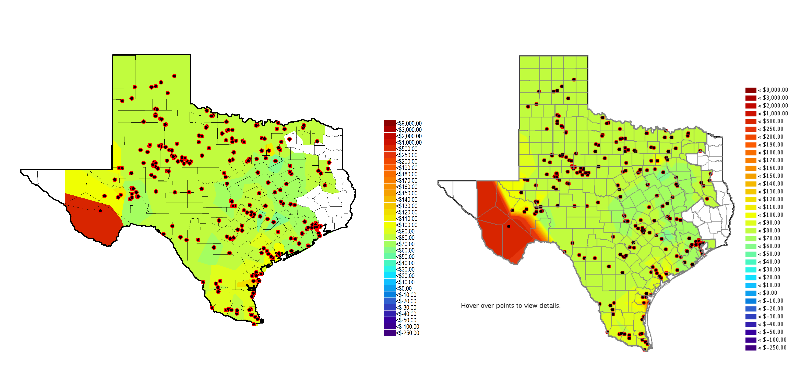

# Introduction

I've written some "tutorial"-like content recently---see 
[here](texas-high-schools-academics-fuzzy-join),
[here](/post/split-apply-combine-machine-learning-r), and
[here](/post/nested-json-to-tidy-data-frame-r)---but
I've been lacking on ideas for "original" content since then. With that said,
I thought it would to try to re-create something with `R`. (Not too long ago
I saw that 
[Andrew Heiss](https://www.andrewheiss.com/) did something akin to this with 
[Charles Minard’s well-known visualization of Napoleon’s 1812](https://www.andrewheiss.com/blog/2017/08/10/exploring-minards-1812-plot-with-ggplot2/).)

The focus of my re-creation here is the price contour map shown on the
front page of the website for the [Electric Reliability Council of Texas](http://http://www.ercot.com/),
the independent system operator of electric power flow
for about 90 percent of Texas residents, as well as the employer of yours truly).

Without going too much into the details of what kind of information
and insight the map is supposed to provide [^1], it's sufficient for the
reader to simply understand the following:

+ "cooler" colors (i.e. blue and green) 
generally indicate regions of electric energy stability---where electric power 
generation is sufficiently meeting electric demand at a given point 
in time;
+ and "warmer" colors (i.e. orange and red) generally represent the
opposite---regions where there is some "stress" at a given point in time
due to either the existence or threat of power imbalance.

Anyways, aside from my familiarity with the map (just from visiting
the website so often), I thought that it would
be interesting to try to re-create it because it presents some "challenges"
that I had not really tackled before (even in my previous endeavors
[with {ggplot2} and maps](/post/texas-high-schools-bubble-grid))---namely,
(1) manipulating [KML data](https://developers.google.com/kml/documentation/)
and (2) creating [Voronoi](https://en.wikipedia.org/wiki/Voronoi_diagram) 
shapes. [^2]

# Re-creation Process

Unfortunately, the code needed to re-produce the map is not exactly trivial,
so I'm going to leave details-hungry readers
[a link to the repository](https://github.com/tonyelhabr/voronoi-contour)
to explore the techniques that I used on their own time. [^3] To summarize the process,
here's what I did:

1. I downloaded the price data CSVs for a specific settlement 
interval---7:15 AM interval on November 15, 2018---from public links 
on ERCOT's website. [^4]

    + The "Settlement Point Prices at Resource Nodes, Hubs and Load Zones" link 
    in the "Real-Time Prices Reports" section at http://www.ercot.com/mktinfo.
    + The "DAM Settlement Point Prices" link in the "DAM Results Reports" section 
    at http://www.ercot.com/mktinfo.

    Additionally, I downloaded the "static" KML data upon which the map is built.

    + http://www.ercot.com/content/cdr/static/texas_counties.kml
    + http://www.ercot.com/content/cdr/static/ercot_boundary.kml

    Finally, I downloaded "dynamic" KML data representing the price points 
themselves (for both the Real-Time Market (RTM) and the Day-Ahead Market (DAM).

    + http://www.ercot.com/content/cdr/contours/rtmSppPoints.kml
    + http://www.ercot.com/content/cdr/contours/damSpp7Points.kml

    I should Note that with this step and the others that follow, 
I repeated the actions for both data sets---those representing the 
RTM and DAM prices and points.

2. With the KML files for the price points, I extracted the
longitude and latitude value pairs from the points defined in the KML
using the [`{tidykml}` package](https://github.com/briatte/tidykml).
Additionally, I converted the legend (embedded in the KML) into a vector
to be used  for the final recreated plot(s) themselves. [^5]

3. With the CSVs with the price data, I did a bit of "data munging" to convert
the data for the two markets into an equivalent, easy-to-work-with format, and
I joined this with the coordinate data from the previous step.

4. With the KML files representing the map's static data, I created
a `SpatialPolygonsDataFrame` encompassing both the Texas state and county boundaries,
as well as the ERCOT region boundaries (which is separate).

    This was probably the most difficult part for me to figure out. Nonetheless,
with the help of the R community's packages geared towards working with spatial
data---most notably, the [`{sp}`](https://cran.r-project.org/web/packages/sp/index.html) 
and [`{sf}`](https://cran.r-project.org/web/packages/sf/index.html) packages---as well as some great
documentation and tutorials---I found
[this one](https://mgimond.github.io/Spatial/interpolation-in-r.html)
particularly helpful, although one may consider its techniques "outdated" since it doesn't
utilize `{sf}` for interpolation. [^6]

5. Next was the "heart" of the process---the interpolation to create the Voronoi
shapes. [^7] This may be the part that is most interesting to the reader,
since a similar process could be applied to one's own project. [^8]

6. Finally, I used `{ggplot2}` to create the visualizations themselves.
Notably, one must be careful with the order of calls to
`geom_polygon()`, `geom_sf()`, and `coord_sf()` in order to get
the ordering of layers correct.

As for other details about the implementation, this process provided a perfect
example of how/why functions can be so useful---it was really nice to just call 
a custom function twice to repeat each step for
the two data sets, which certainly saved me some time and effort.

# The Maps

So what does the final product look like? Below, I've placed my re-creations
and the actual image side by side (with the help of the 
[`{magick}` package](https://cran.r-project.org/web/packages/magick/index.html)).

Not bad, right? OK, so the sizing isn't perfect, but I would say it's close enough.

To take things one step further, I tried "subtracting" the values between the two
re-created maps. There is some value to doing this---to visualize the discrepancies
between prices in the two markets (which, hypothetically, should be equal).

Because this map displays information that is inherently different than those
of the stand-alone RTM and DAM maps, I used a different color 
palette---specifically, the "E" palette that comes with the 
awesome [`{viridis}` package](https://cran.r-project.org/web/packages/viridis/index.html),
which is conveniently made available in 
[`{ggplot2}` ever since the v3 release](https://www.tidyverse.org/articles/2018/07/ggplot2-3-0-0/).

# Final Thoughts

I really enjoyed this challenge to myself. I can certainly see myself doing something
similar in the future, perhaps with a focus with which I'm less familiar (to give
myself an even greater challenge). [^9]

--------------------------------------------------------------------------------
[^1]: [Check out the pop-up help menu](http://www.ercot.com/help/popup/lmpContourMapHelp) for a bit more information about the map itself and [this link](https://www.e-education.psu.edu/ebf483/node/647) for more information about Locational Marginal Prices (LMPs).

[^2]: If you've never heard of [Voronoi diagrams](https://en.wikipedia.org/wiki/Voronoi_diagram), I would highly suggest reading a bit about them---the math behind them is fairly straightforward, and the results are quite elegant.

[^3]: I wouldn't normally use the `if ([... exists]) then [do ...] else [...]` technique heavily like I do in the "main" script in the repository (because I don't think it's exactly a "best practice" and I'd rather use functions to achieve the same thing), but this idiom fit what I was trying to achieve at the time.

[^4]: Note that the map updates every 5 minutes for Real-Time Market (RTM) Locational Marginal Prices (LMPs) and every 15 minutes for RTM Settlement Point Prices (SPPs). Additionally, the Day-Ahead Market (DAM) LMP and SPP maps are update once per day, with filters allowing user to browse prices at a specified hour.

[^5]: There was some serous "hard-coding" needed to do this.

[^6]: The [`{tidyverse}` set of packages](https://cran.r-project.org/web/packages/tidyverse/index.html), as well as [`{rvest}`](https://cran.r-project.org/web/packages/rvest/index.html) and [`{xml2}`](https://cran.r-project.org/web/packages/xml2/index.html) were also instrumental in this process.

[^7]: As with the previous step, `R`'s spatial packages were extremely helpful here.

[^8]: The rest of the steps may be too project-specific to be "generalizable".

[^9]: Just brainstorming, I really enjoyed [Kirk Goldsberry's piece post-2018-midterm elections](https://fivethirtyeight.com/features/how-beto-orourke-shifted-the-map-in-texas/) (mostly for the infomrative and "clean" visuals). The maps are practically begging to be re-created!