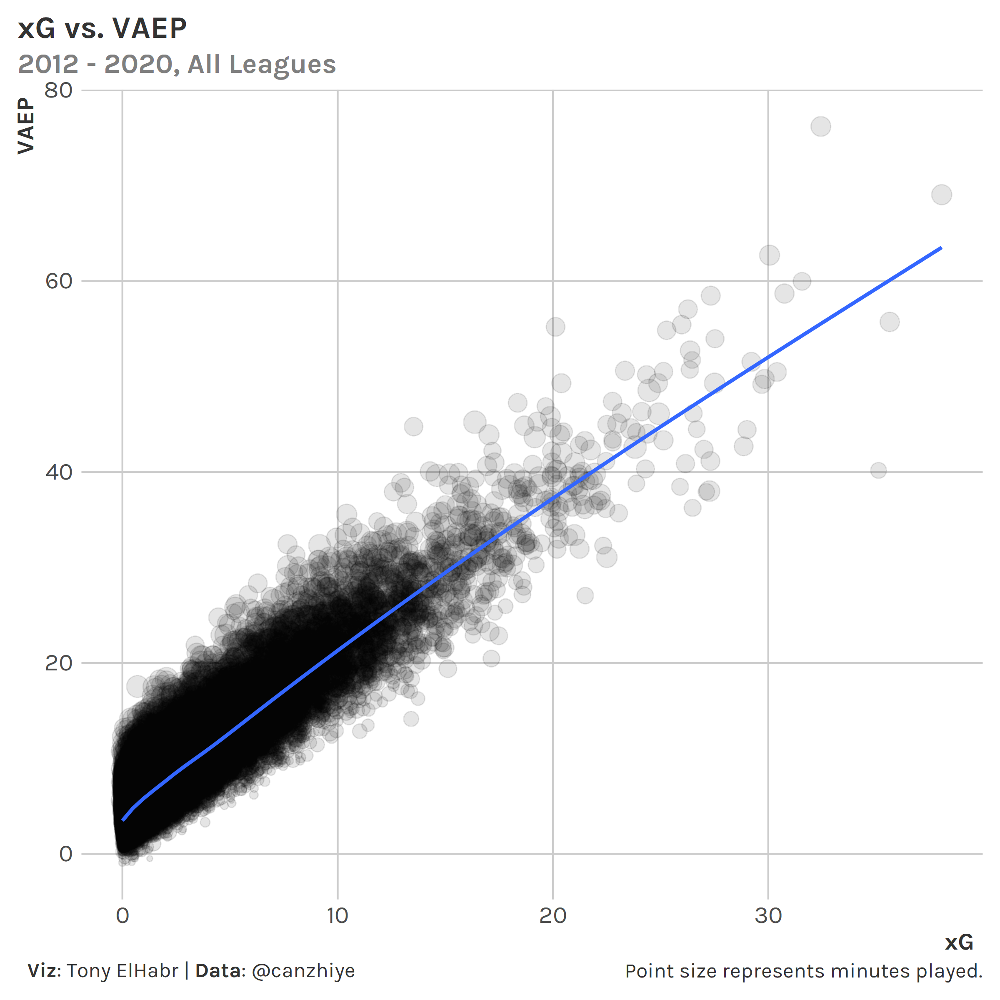

```{r setup, include=F, echo=F, cache=F}
knitr::opts_chunk$set(
  include = TRUE,
  echo = TRUE,
  cache = FALSE,
  eval = FALSE,
  cache.lazy = FALSE,
  fig.show = 'hide',
  fig.align = 'center',
  fig.width = 8,
  fig.asp = 0.75,
  fig.retina = 2,
  warning = FALSE,
  message = FALSE
)
```

## Introduction

Arguing about domestic league strength is something that soccer fans seems to never tire of. ([*"Could Messi do it on a cold rainy night in Stoke?"*](https://www.goal.com/en-us/news/what-does-can-they-do-it-on-a-cold-rainy-night-in-stoke-mean/1f7alegnrwfr01i5vj34vak59k)) Many of these conversations are anecdotal, leading to "hot takes" that are unfalsifiable. While we'll probably never completely move away from these kinds of discussions, we can at least try to inform them with a quantitative approach.

Perhaps the obvious way to do so is to take match results from international tournaments (e.g. Champions League, Europa). But such an approach can be flawed---there's not a large sample, and match results may not be reflective of "true" team strength (e.g. one team may win on xG by a large margin, but lose the game.)

## Methodology

But what if we used an approach rooted in player performance? I asked myself that very question and came up with the following methodology.

1.  Identify players who played in more than one league within the same season or across consecutive seasons.[^1] Calculate the difference in each player's [atomic VAEP](https://arxiv.org/pdf/1802.07127.pdf) per 90 minutes (VAEP/90) after changing leagues.

[^1]: It's closer to xG+xA, although the authors might disagree with that as well. It's really best treated separately, which perhaps explains why the authors often using "rating" and "contribution" when referring to VAEP.

```{r}
# # A tibble: 2,462 x 9
#    Season Player              Position `Age Group` `League A`               `League B`               `VAEP/90 A` `VAEP/90 B` `VAEP/90 Diff`
#     <dbl> <chr>               <chr>    <chr>       <chr>                    <chr>                          <dbl>       <dbl>          <dbl>
#  1   2020 Timo Werner         AM       24<=x<27    Bundesliga 1 (Germany)   Premier League (England)       1.25        0.638         0.610 
#  2   2020 Alexander Sørloth   FW       24<=x<27    Super Lig (Turkey)       Bundesliga 1 (Germany)         1.07        0.773         0.296 
#  3   2020 Hakim Ziyech        M        27<=x<30    Eredivisie (Netherlands) Premier League (England)       0.958       0.365         0.593 
#  4   2020 Nicolás González    M        18<=x<24    Bundesliga 2 (Germany)   Bundesliga 1 (Germany)         0.917       0.943        -0.0256
#  5   2020 Fabian Klos         FW       30<=x<36    Bundesliga 2 (Germany)   Bundesliga 1 (Germany)         0.904       0.547         0.358 
#  6   2020 Victor Osimhen      FW       18<=x<24    Ligue 1 (France)         Serie A (Italy)                0.889       1.01         -0.120 
#  7   2020 Eldor Shomurodov    FW       24<=x<27    Premier League (Russia)  Serie A (Italy)                0.882       0.755         0.126 
#  8   2020 Callum Robinson     AM       24<=x<27    Championship (England)   Premier League (England)       0.880       0.682         0.198 
#  9   2020 Jarrod Bowen        AM       18<=x<24    Championship (England)   Premier League (England)       0.871       0.448         0.423 
# 10   2020 Aleksandar Mitrovic FW       24<=x<27    Championship (England)   Premier League (England)       0.866       0.499         0.367 
# # ... with 2,452 more rows
```

Why VAEP? Theoretically it should capture more about in-game actions (including defense) than other stats such as xG, which is biased in favor of attacking players. It's not perfect by any means---for example, it does not capture off-ball actions---but, in theory, it should be a better measure of overall performance. [I had a Twitter thread in May 2021 describing how one could use VAEP ratings.](https://twitter.com/TonyElHabr/status/1393553732659519490)

Notably, we give up a little in interpretability in using VAEP, since it's not directly translatable to goals. [^2] See the following plot and table of top season-long xG totals since 2012 to contextualize the magnitudes of xG and VAEP.

[^2]: It's closer to xG+xA, although the authors might disagree with that as well. It's really best treated separately, which perhaps explains why the authors often using "rating" and "contribution" when referring to VAEP.



```{r}
# # A tibble: 36,857 x 5
#    Season Player             Minutes    xG  VAEP
#     <dbl> <chr>                <dbl> <dbl> <dbl>
#  1   2015 Lionel Messi          3529  38.1  69.0
#  2   2016 Luis Suárez           3294  35.6  55.7
#  3   2018 Robert Lewandowski    2259  35.1  40.2
#  4   2012 Lionel Messi          3425  32.4  76.2
#  5   2013 Lionel Messi          2776  31.6  60.0
#  6   2015 Cristiano Ronaldo     3236  30.8  58.7
#  7   2018 Mohamed Salah         3080  30.4  50.5
#  8   2012 Cristiano Ronaldo     3504  30.1  62.7
#  9   2017 Edin Dzeko            3216  29.8  49.7
# 10   2020 Robert Lewandowski    2902  29.7  49.2
# # ... with 36,847 more rows
```

2.  Convert the player-level VAEP/90 differences to z-scores by position and age group.

```{r}
# # A tibble: 2,462 x 8
#    Season Player              Position `Age Group` `League A`               `League B`               `VAEP/90 Diff` `VAEP/90 Diff Norm`
#     <dbl> <chr>               <chr>    <chr>       <chr>                    <chr>                             <dbl>               <dbl>
#  1   2020 Timo Werner         AM       24<=x<27    Bundesliga 1 (Germany)   Premier League (England)         0.610                2.28 
#  2   2020 Alexander Sørloth   FW       24<=x<27    Super Lig (Turkey)       Bundesliga 1 (Germany)           0.296                1.10 
#  3   2020 Hakim Ziyech        M        27<=x<30    Eredivisie (Netherlands) Premier League (England)         0.593                3.20 
#  4   2020 Nicolás González    M        18<=x<24    Bundesliga 2 (Germany)   Bundesliga 1 (Germany)          -0.0256              -0.148
#  5   2020 Fabian Klos         FW       30<=x<36    Bundesliga 2 (Germany)   Bundesliga 1 (Germany)           0.358                1.20 
#  6   2020 Victor Osimhen      FW       18<=x<24    Ligue 1 (France)         Serie A (Italy)                 -0.120               -0.439
#  7   2020 Eldor Shomurodov    FW       24<=x<27    Premier League (Russia)  Serie A (Italy)                  0.126                0.471
#  8   2020 Callum Robinson     AM       24<=x<27    Championship (England)   Premier League (England)         0.198                0.740
#  9   2020 Jarrod Bowen        AM       18<=x<24    Championship (England)   Premier League (England)         0.423                1.89 
# 10   2020 Aleksandar Mitrovic FW       24<=x<27    Championship (England)   Premier League (England)         0.367                1.37 
# # ... with 2,452 more rows
```

Why grouping? This is intended to account for the fact that attacking players and "peaking" players (usually age 24-30) tend to have higher VAEP/90, so their league-to-league differences have larger variation. The choice to normalize is perhaps more questionable. The mean of differences is \~0 for all groups already, but the dispersion is smaller without normalization (i.e. standard deviations are closer to 0). So, in this case, normalization theoretically helps the linear model capture variation.

```{r }
# # A tibble: 20 x 5
#    Position Age Group N    Mean   SD
#    <chr>    <chr>    <int> <dbl>  <dbl>
#  1 AM       18<=x<24   138     0 0.224 
#  2 AM       24<=x<27   128     0 0.268 
#  3 AM       27<=x<30   118     0 0.248 
#  4 AM       30<=x<36    68     0 0.248 
#  5 D        18<=x<24   203     0 0.112 
#  6 D        24<=x<27   268     0 0.101 
#  7 D        27<=x<30   295     0 0.0930
#  8 D        30<=x<36   316     0 0.0939
#  9 DM       18<=x<24    30     0 0.102 
# 10 DM       24<=x<27    48     0 0.0913
# 11 DM       27<=x<30    20     0 0.105 
# 12 DM       30<=x<36    13     0 0.0719
# 13 FW       18<=x<24    26     0 0.274 
# 14 FW       24<=x<27    67     0 0.268 
# 15 FW       27<=x<30    50     0 0.263 
# 16 FW       30<=x<36    66     0 0.297 
# 17 M        18<=x<24   113     0 0.173 
# 18 M        24<=x<27   130     0 0.147 
# 19 M        27<=x<30   189     0 0.185 
# 20 M        30<=x<36   186     0 0.171  
```

3.  Run a single regression where the response variable is the z-transformed VAEP/90 difference, and the features are indicators for leagues leagues, where -1 indicates player departure, a +1 indicates player arrival, and all other values are 0.[^3] [^4]

[^3]: Each row represents one player. Each row only has one +1 and one -1, and 0s for other features.

[^4]: We're including all positions and ages in this regression, even though these groupings have varying standard deviations for transformation of the response variable. (All have 0 mean, as one might expect with a feature representing the difference between values with the same distribution.)

For those familiar with basketball and hockey, this is similar to [an adjusted plus-minus (PM)](https://squared2020.com/2017/09/18/deep-dive-on-regularized-adjusted-plus-minus-i-introductory-example/) calculation. Here, each feature column is a league (instead of a player), each row represents a player (instead of a "stint"), and the response is a transformed VAEP/90 (instead of net points per possession).

```{r}
# tibble [2,472 x 16] (S3: tbl_df/tbl/data.frame)
#  $ VAEP/90 Diff Z-Trans     : num [1:2472] -0.0825 0.3285 -0.0143 0.1137 0.1526 ...
#  $ Serie A (Italy)          : int [1:2472] -1 -1 -1 -1 -1 -1 -1 -1 -1 -1 ...
#  $ Bundesliga 1 (Germany)   : int [1:2472] 1 1 0 0 0 0 0 0 0 0 ...
#  $ La Liga (Spain)          : int [1:2472] 0 0 0 0 0 0 0 0 0 0 ...
#  $ Serie A (Brazil)         : int [1:2472] 0 0 0 0 0 1 0 0 0 0 ...
#  $ Super Lig (Turkey)       : int [1:2472] 0 0 1 0 0 0 0 1 0 0 ...
#  $ Premier League (England) : int [1:2472] 0 0 0 0 0 0 0 0 0 0 ...
#  $ Super League (China)     : int [1:2472] 0 0 0 0 0 0 0 0 0 1 ...
#  $ Major League Soccer (USA): int [1:2472] 0 0 0 0 1 0 1 0 0 0 ...
#  $ Primeira Liga (Portugal) : int [1:2472] 0 0 0 0 0 0 0 0 0 0 ...
#  $ Ligue 1 (France)         : int [1:2472] 0 0 0 1 0 0 0 0 0 0 ...
#  $ Bundesliga 2 (Germany)   : int [1:2472] 0 0 0 0 0 0 0 0 0 0 ...
#  $ Championship (England)   : int [1:2472] 0 0 0 0 0 0 0 0 0 0 ...
#  $ Premier League (Russia)  : int [1:2472] 0 0 0 0 0 0 0 0 0 0 ...
#  $ Superliga (Argentina)    : int [1:2472] 0 0 0 0 0 0 0 0 1 0 ...
#  $ Eredivisie (Netherlands) : int [1:2472] 0 0 0 0 0 0 0 0 0 0 ...
```

The result is a set of coefficient estimates corresponding to each league. Notably, these are all positive (even if subtracting the intercept). Also, the Netherlands coefficient is `NA` due to multi-collinearity in the data. [^5]

[^5]: This `NA` occurs even when setting the intercept to 0, which is typically the way to get around this kind of issue with `lm` in R. When changing the order of columnS in the regression and forcing the Netherlands coefficient to be non-`NA`, it's estimate is lower than that of Bundesliga 2 (and a different league's estimate is `NA`).

```{r}
# # A tibble: 16 x 2
#    League                    Estimate
#    <chr>                        <dbl>
#  1 Premier League (England)    0.975 
#  2 La Liga (Spain)             0.869 
#  3 Ligue 1 (France)            0.786 
#  4 Serie A (Italy)             0.738 
#  5 Serie A (Brazil)            0.724 
#  6 Primeira Liga (Portugal)    0.675 
#  7 Bundesliga 1 (Germany)      0.649 
#  8 Championship (England)      0.641 
#  9 Super Lig (Turkey)          0.617 
# 10 Premier League (Russia)     0.485 
# 11 Superliga (Argentina)       0.463 
# 12 Super League (China)        0.360 
# 13 Major League Soccer (USA)   0.281 
# 14 Bundesliga 2 (Germany)      0.197 
# 15 (Intercept)                 0.0747
# 16 Eredivisie (Netherlands)   NA     
```

For APM, we might say the coefficient estimate represents how much a player contributes relative to an "average" player. We might be tempted to try to interpret these coefficients directly as well. However, we can't do that for a few reasons:

1.  This is not a zero-sum situation. Our data is fundamentally different. There is no notion of a matchup between one league and another like there is in hockey/basketball with players on the ice/court. Instead, our data is more analogous to a player playing against themselves (not a set of players versus another set of players). Also, we have to adjust for minutes taking the difference in rates before one would do so in APM because the minutes played will differ for the same player moving between two leagues (except by pure coincidence they play the same number of minutes)

In practice, all of this means that the target variable across all records does not sum to 0 (even without the z-normalization) like it would in the data for an APM model.

2.  Even if this were a zero-sum type of problem and the model returned some negative coefficient estimates, it's unclear what the intercept (or 0) even means. Does it mean "average"? If so, what is an "average" league?

If we want to convert numbers back to a VAEP/90 scale, we always have to interpret the numbers on a relative basis. Sure, we can infer the league "power rankings" from just this singular coefficient list (Premier League as the strongest and Bundesliga 2 as the weakest), but we'd like to translate the coefficients to something more interpretable.

With this in mind, we can take the difference between coefficient estimates to get closer to a direct interpretation.

```{r}
# # A tibble: 225 x 5
#    `League A`               `League B`               `Estimate A` `Estimate B` `Estimate Difference`
#    <fct>                    <fct>                           <dbl>        <dbl>                 <dbl>
#  1 Premier League (England) Premier League (England)         1.01        1.01                  0    
#  2 Premier League (England) La Liga (Spain)                  1.01        0.889                 0.119
#  3 Premier League (England) Ligue 1 (France)                 1.01        0.798                 0.210
#  4 Premier League (England) Serie A (Italy)                  1.01        0.761                 0.247
#  5 Premier League (England) Serie A (Brazil)                 1.01        0.759                 0.249
#  6 Premier League (England) Primeira Liga (Portugal)         1.01        0.692                 0.317
#  7 Premier League (England) Championship (England)           1.01        0.668                 0.340
#  8 Premier League (England) Bundesliga 1 (Germany)           1.01        0.662                 0.346
#  9 Premier League (England) Super Lig (Turkey)               1.01        0.656                 0.352
# 10 Premier League (England) Premier League (Russia)          1.01        0.509                 0.499
# # ... with 215 more rows
```

4.  Un-transform the coefficients of the regression (one for each league) using a "weighted-average" standard deviation and mean from the z-transformations of groups. [^6] [^7]

[^6]: "Weighted-average": `Raw Difference (Un-transformed) = (VAEP/90 Diff Z-Trans * sum(SD * (N * sum(N)))) - sum(Mean * (N * sum(N)))`

[^7]: This is for interpretation of the "overall" league strengths. For interpretation of a player falling in a specific group (e.g. 18-24 FWs), use just the standard deviation and mean from the the specified group.

```{r}
# # A tibble: 225 x 5
#    `League A`               `League B`               `Estimate A` `Estimate B` `Estimate Difference`
#    <fct>                    <fct>                           <dbl>        <dbl>                 <dbl>
#  1 Premier League (England) Premier League (England)         1.01        1.01                  0    
#  2 Premier League (England) La Liga (Spain)                  1.01        0.889                 0.119
#  3 Premier League (England) Ligue 1 (France)                 1.01        0.798                 0.210
#  4 Premier League (England) Serie A (Italy)                  1.01        0.761                 0.247
#  5 Premier League (England) Serie A (Brazil)                 1.01        0.759                 0.249
#  6 Premier League (England) Primeira Liga (Portugal)         1.01        0.692                 0.317
#  7 Premier League (England) Championship (England)           1.01        0.668                 0.340
#  8 Premier League (England) Bundesliga 1 (Germany)           1.01        0.662                 0.346
#  9 Premier League (England) Super Lig (Turkey)               1.01        0.656                 0.352
# 10 Premier League (England) Premier League (Russia)          1.01        0.509                 0.499
# # ... with 215 more rows
```

## Interpretation

Interpretation can be a little tricky.

a.  The differences between a specified pair of the final un-transformed coefficients represents the expected change (`Raw Difference (Un-transformed)`) in an average player's VAEP/90 when moving between the specified leagues.

b.  To interpret these raw differences as a percentage, use the median VAEP/90 across all leagues (e.g. 0.07/90) as a "baseline" by which the difference in (a) is interpreted as a deviation. For example, if the median VAEP/90 is 0.3 and the `Raw Difference (Un-transformed)` between league A and league B's VAEP/90 is 0.07, then the `% Difference` is (0.3-0.07)/0.3 = 22%.

```{r}
# # A tibble: 256 x 5
#    `League A`               `League B`               `Raw Difference (Transformed)` `Raw Difference (Un-transformed)` `% Difference`
#    <fct>                    <fct>                                             <dbl>                             <dbl> <chr>         
#  1 Premier League (England) Premier League (England)                          0                                0      0%            
#  2 Premier League (England) La Liga (Spain)                                   0.107                            0.0166 5%            
#  3 Premier League (England) Ligue 1 (France)                                  0.189                            0.0295 10%           
#  4 Premier League (England) Serie A (Italy)                                   0.238                            0.0371 12%           
#  5 Premier League (England) Serie A (Brazil)                                  0.252                            0.0393 13%           
#  6 Premier League (England) Primeira Liga (Portugal)                          0.300                            0.0469 15%           
#  7 Premier League (England) Bundesliga 1 (Germany)                            0.326                            0.0509 17%           
#  8 Premier League (England) Championship (England)                            0.334                            0.0521 17%           
#  9 Premier League (England) Super Lig (Turkey)                                0.358                            0.0559 18%           
# 10 Premier League (England) Premier League (Russia)                           0.491                            0.0766 25%           
# # ... with 246 more rows
```

## Commentary

-   A big assumption that I'm implicitly making here is that relative league strengths are the same every year. This is clearly a stretch.

-   Atomic VAEP is not xG

-   

## Other Approaches

[Aditya Kothari](https://twitter.com/thecomeonman) proposed re-defining the target variable in the regression to be the **ratio of VAEP/minute** (instead of a z-transformed difference in VAEP/90) between the leagues that a player moves to and from. The main advantage of this approach is more direct interpretation of the model coefficients. (There is no need to determine a "baseline" upon which to compute differences.) Perhaps the main disadvantage is sensitivity to low minutes played. [^8]

[^8]: This is also a weakness of my approach, but arguably ratios exacerbate this.
