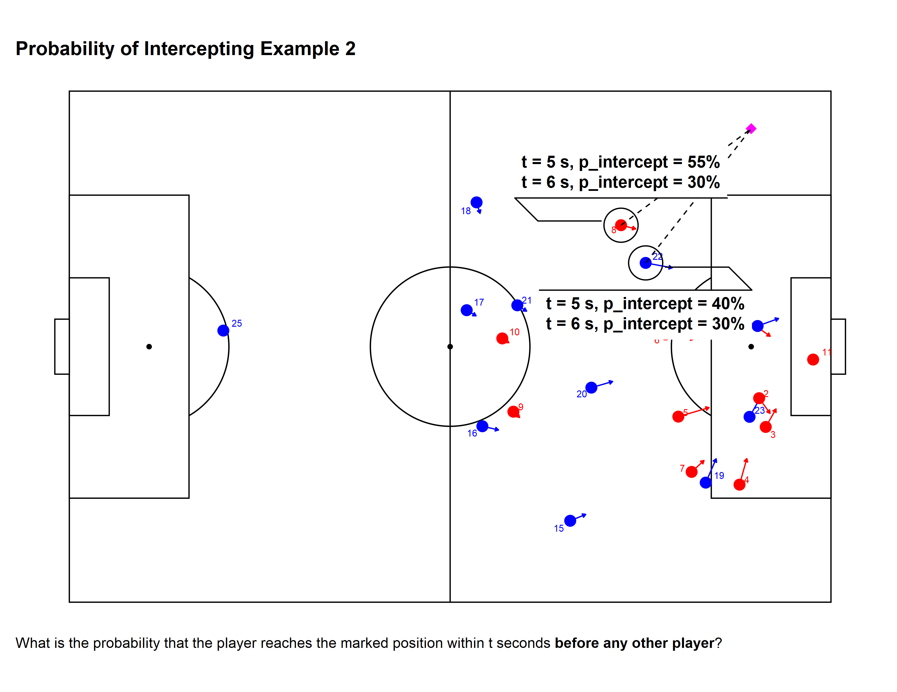

```{r setup, include=F, echo=F, cache=F}
# .dir_proj <- here::here('content', 'post', 'variable-importance-compare')
# .dir_output <- file.path(.dir_proj, 'output')
# knitr::opts_knit$set(root.dir = here::here())
# Apply Claus' workflow?
knitr::opts_chunk$set(
  include = FALSE,
  echo = FALSE,
  cache = FALSE,
  eval = FALSE,
  cache.lazy = FALSE,
  fig.show = 'hide',
  fig.align = 'center',
  fig.width = 8,
  fig.asp = 0.75,
  fig.retina = 2,
  warning = FALSE,
  message = FALSE
)
```

***Note: This post was update on 2020-09-24 to correct field dimension translations that were previously distorting the pitch control contours. The R analogues now match up much more closely with the python versions after the updates.***

## Intro

There's never been a better time to be involved in sports analytics. There is a wealth of open-sourced data and code (not to mention well-researched and public analysis) to digest and use. Both people working for teams and people just doing at as a hobby are publishing new and interesting analyses every day.

In particular, the [FriendsOfTracking (FOT)](https://www.youtube.com/channel/UCUBFJYcag8j2rm_9HkrrA7w) group, co-led by Professor and author [David Sumpter](ttps://twitter.com/Soccermatics)[^1] have put together an awesome series of videos on YouTube discussing modern soccer analytics, along with a collection of repositories on GitHub sharing the code shown in videos.

[^1]: author of one of my favorite books **Soccermatics**

[Laurie Shaw](https://twitter.com/EightyFivePoint) has shared code that implements the [pitch control model](https://www.youtube.com/watch?v=X9PrwPyolyU) described in [William Spearman](https://twitter.com/the_spearman)'s paper ["Beyond Expected Goals"](http://www.sloansportsconference.com/wp-content/uploads/2018/02/2002.pdf) is interesting to me. The model is different than the one that I used [to create some animations on Twitter](https://twitter.com/TonyElHabr/status/1304766718468857857?s=20). Those were based on the pitch control model described by [Javier Fernandez](https://twitter.com/JaviOnData) and [Luke Bornn](https://twitter.com/lukebornn) in their paper ["Wide Open Spaces"](http://www.sloansportsconference.com/wp-content/uploads/2018/03/1003.pdf) ([code](https://www.robert-hickman.eu/post/fall_back_in_to_space/) courtesy of [Rob Hickman](https://twitter.com/robwhickman)). (Apologies for the onslaught of links!)

Now, I am not one for language wars---and, in fact, I use python often---but I thought it would be awesome to be able to plot Spearman's pitch control model directly with `{ggplot2}` and friends. Thus, I set out to convert Laurie's code to R, attempting to give it a "native" R feel while I was at it.

Most of the process of translating python to R was relatively straightforward (slicing and dicing data frames and arrays/vectors is just part of data cleaning), so I won't detail them here. However, there was one part that was particularly interesting---the conversion of a python class object. This was actually the key (and most challenging part) of the conversion process.

There are some great resources for describing how to implement [object-orientated programming (OOP)](https://en.wikipedia.org/wiki/Object-oriented_programming) in R, including a couple of chapter's from [Hadley Wickham](https://twitter.com/hadleywickham)'s [Advanced R book](https://adv-r.hadley.nz/oo.html) and a [very practical write-up](https://blog.earo.me/2019/11/03/practical-guide-to-s3/) from [Earo Wang](https://twitter.com/earowang). Every object-oriented task has its unique aspects, so hopefully my discussion here has something to add to what has already been written on the subject matter.

***For demonstration purposes, I'm going to walk through my steps for converting the python class object as if I were doing it for the first time.***

## Contructor

Below is a stripped down version of Laurie's code, showing the "essence" of what we need to replicate.[^2]

[^2]: If you actually browse Laurie's code, you'll notice that I've changed some of the names of these functions, e.g. `tti()` here instead of `simple_time_to_intercept()` there, `tracking_df` instead of `team` there. Don't worry about that. I just wanted to make things as comparable as possible for the diligent reader, and I tried to make variable names that were either (or both) more succinct or more clear.

```{python player-python, include=T, echo=T, eval=F}
class player(object):
    def __init__(self,player_id,frame):
        self.id = player_id
        self.get_position(frame)
        self.get_velocity(frame)
        
    def .get_position(self,frame):
        self.position = np.array(frame[self.player_id + 'x', self.player_id + 'y'])
        
    def .get_velocity(self,frame):
        self.velocity = np.array(frame[self.player_id + 'x_v', self.player_id + 'y_v'])
    
    def tti(self,final_position):
        reaction_time = 0.7 # in s
        vmax = 5 # in m/s
        reaction_position = self.position + self.velocity * reaction_time
        self.tti = reaction_time + np.linalg.norm(final_positon - reaction_position)/vmax

    def p_intercept(self,t):
        tti_sigma = 0.45
        den = 1 + np.exp(-np.pi/np.sqrt(3.0)/tti_sigma * (t-self.tti)))
        return 1 / den
      
```

Let's make some notes and come back to these as we develop our R class.

1.  We need a unique identifier: `player_id`. This is really just a "best practice" thing for object-oriented programming and makes sense given our context. For a sport like soccer, a unique identifier could just be the player's name, a combination of the team name and the player jersey number, a league unique identifier, etc.

2.  A single-row data frame `frame` is passed to several of the methods, including the constructor `__init__`. This single row data frame is sourced from a much larger `tracking` data frame, with rows for every 0.04 second time interval (25 frames per second, or one frame per 0.04 seconds) in the game.

3.  The python code stores both the player's `position` and `velocity` as 2x1 arrays. This works well with the [unpacking](https://www.w3schools.com/python/gloss_python_assign_value_to_multiple_variables.asp) that is done in other places in Laurie's code.

4.  `tti`, short for "time to intercept (a target location)", uses the player's `position` and `velocity` to define the attribute `tti` (not to be confused with the method itself). This implies that `position` and `velocity` should be defined before `tti()` is ever called, as they are in `__init__`. `tti` needs the `position_final` 2x1 array to calculate `tti` which is not known upon instantiation; rather, `tti` can only be properly defined when called to do a specific calculation relating the player's `position` and `velocity` (both defined implicitly in the class, without needing user-specification) with a user-supplied `position_final` pair of x and y values.

5.  `p_intercept`, short for "probability to intercept (a target location)" depends on `tti` and an additional parameter `t`, a user-specified value representing how much time is allotted to reach the ball. Like `tti`, `p_intercept` is only "properly" defined when actually doing a calculation on the player's attributes. Unlike `tti`, there is no attribute in the `player` instance that stores this probability; it's value must be saved in a variable external to the player class if the user wants to use it for something other than an ephemeral calculation.[^3]

[^3]: One might argue that we should be consistent with `tti` and `p_intercept` and store them in the same way---either both as attributes or neither as attributes---given that both are dependent on some user-specified values (`final_position` for `tti` and `t` for `p_intercept`). I'm just showing how it is done in Laurie's code. I think it is simple enough as is and there is no compelling functional reason why we should change the implementation.

Time to intercept a "target" location (`tti`) may not be intuitive to comprehend immediately. The plot[^4] below annotates the `tti` of a "target" location on the pitch (which does **not** have to be where the ball actually is). `tti` assumes that the player continues moving at their current speed (annotated by the arrows) for `reaction_time` seconds before running at `vmax` (full speed) to the target position. `tti` for each player is independent of the `tti` of all other players, which is a relatively reasonable assumption. [^5]

[^4]: Data for this plot and all that follow from post-processed [Metrica Sports sample game 2 data](https://github.com/metrica-sports/sample-data).

[^5]: author of one of my favorite books **Soccermatics**


The probability of reaching the "target" location (`p_intercept`) is directly related to the player's `tti`. Uncertainty about how long it will take the player to reach the target location is quantified by the constant `tti_sigma` in the calculation. (`tti` is the mean and `tti_sigma` is the standard deviation of the distribution for a player's time to arrive at the target location.)


Notably, this probability is independent of all other players' probabilities (which explains how it is possible that both players are shown to have probabilities greater than 50% when `t = 6` above). When adjusting for all players' probabilities (by dividing by the sum of all probabilities), the numbers change. This probability adjustment is key when we calculate pitch control.



Ok, on to the R code. We'll be using [S3](https://adv-r.hadley.nz/s3.html) and the [`{vctrs}` package](https://vctrs.r-lib.org/) to help create our `player` class. (As with the python class, I've simplified the actual implementation for demonstration purposes.)

First, we start with the constructor `new_player()`. Note that there is no direct `__init__` equivalent in R. Here we will make a function that is prefixed with `new_` and ends with the name of our class (`player`).

```{r new_player, include=T, echo=T, eval=F}
new_player <-
  function(player_id = integer(),
           x = double(),
           y = double(),
           x_v = double(),
           y_v = double()) {
    vctrs::new_rcrd(
      list(
        player_id = player_id,
        x = x,
        y = y,
        x_v = x_v,
        y_v = y_v,
        tti = -1 # dummy value
      ),
      class = 'player'
    )
  }
```

Now let's reflect upon our prior notes.

1.  We have the `player_id` in this constructor.

2.  We don't pass the data frame `tracking` here. We'll do it in our helper function. We might say that our constructor is "low-level", not intended for the user to call directly.

3.  We split the position and velocity vectors into their individual x and y components, resulting in four total variables instead of two. I don't think a vector (unnamed or named), list, or matrix are particularly compelling data types to use for an x-y pair of values in R. None natively support unpacking (although R vectors do have some form of "broadcasting" with their recycling behavior).

4.  We assign a "dummy" value (-1) to `tti` when initializing the class instance. We will have a method to update `tti` based on x and y components.

5.  Like `tti`, we will need a separate `p_intercept` method to be used to calculate the probabililty of intercepting a ball given a player's position, speed, and the final position of the ball (all fed as inputs to `tti`), as well as the additional user-specified `t`, representing how much time is allotted to reach the ball.

## Validator

Let's proceed by creating a validator function to, you guessed it, validate fields in the `player` class. It is good practice to check the values used to construct the class. The python code did not have any validation like this, but I don't think it was ever expected to be extremely robust to any user input.

```{r validate_player, include=T, echo=T, eval=F}
validate_player <- function(player) {
  vctrs::vec_assert(vctrs::field(player, 'player_id'), integer())
  vctrs::vec_assert(vctrs::field(player, 'x'), double())
  vctrs::vec_assert(vctrs::field(player, 'y'), double())
  vctrs::vec_assert(vctrs::field(player, 'tti'), double())
  player
}
```

Note that we could have simply done this validation in the constructor function, but I think it makes sense to put the validation in its own function so that the constructor is more direct (especially if the validation checks are complex).

## Helper

Finally, we'll create a helper `player()` function, which is our "user-facing" function that we expect/want users to use to instantiate objects.

```{r player, include=T, echo=T, eval=F}
player <- 
  function(player_id, frame, tracking) {
    
    player_id <- as.integer(player_id)
    frame <- as.integer(frame)

    assertthat::assert_that(is.data.frame(tracking))
    nms_req <- c('player_id', 'frame', 'x', 'y', 'x_v', 'y_v')
    assertthat::assert_that(all(nms_req %in% names(tracking)))
    
    # `!!` to make sure that we filter using the integer values, not the column itself.
    tracking_filt <- tracking %>% filter(player_id == !!player_id, frame == !!frame)
    assertthat::assert_that(nrow(tracking_filt) == 1L)
    
    player <-
      new_player(
        player_id = player_id,
        x = tracking_filt[['x']],
        y = tracking_filt[['y']],
        x_v = tracking_filt[['x_v']],
        y_v = tracking_filt[['y_v']]
      )
    validate_player(player)
  }
```

Note the following:

-   We coerce `player_id` and `frame` to integers instead of doubles (particularly since they are expected to be integers in the constructor). This ensures that the new `player` is instantiated properly by the constructor and passes our validation.
-   We pass in our entire `tracking` data frame (that has rows for every 0.04 second interval in the game), as well as the `frame` to slice out of it. (`player_id` is also used to filter `tracking`.) This makes it convenient for user to instantiate new `player` objects when operating on the `tracking` data frame. There is no need to extract the singular initial position and velocity components "manually"; instead, the helper function does it for the user.

## Aside

R's S3 framework is not a formal OOP framework (not even close really). Note that it does not have a reserved keyword to represent the instance of the class like `self` in python. Also, it is not actually necessary to much of what is done above (with the constructor, validator, and helper).

For example, we don't actually have to create a formal-ish constructor prefixed with `new_`. We don't even need a constructor function at all in S3. We could do something like `class(var) <- 'player'` to create a a `player` object. Of course, this is prone to errors down the line, so we don't do that. Likewise with the validator and helper functions. The point of these constructs is to add clarity to our class code. They aren't strictly necessary.

## Printing

Let's do one more thing for our `player` class---create a custom print method. (Writing a custom print method is not required whatsoever, but it can be very helpful for debugging.) If we weren't using `{vctrs}` and just S3, we would do this by writing a `print.player` function. However, `{vctrs}` provides a "pretty" header for us auto-magically (that looks like `<player[1]>`) if we use it to write our print method.

To take advantage of the pretty-printing functionality offered by `{vctrs}`, we write a `format.player()` method that will be called by a subclass of the generic `vctrs::obj_print_data` method[^6], which itself is called whenever we print out an object (whether explicitly with `print` or just by typing the name of the variable representing our `player` instance). We'll add the player's position and velocity components to the print out.

[^6]: `vctrs::obj_print_data` that can also handle [Unicode](https://home.unicode.org/) easily, although we are not using any Unicode characters here. Also, it is able to handle extra `NULL`s and `[1]` that may be printed out if we just use `cat` or `print` directly.

```{r players-print, include=T, echo=T, eval=F}
format.player <- function(player, ...) {
  if(vctrs::field(player, 'in_frame')) {
    suffix <- 
      sprintf(
        'with `position = (%.2f, %.2f)` and `velocity = <%.1f, %.1f>`', 
        vctrs::field(player, 'player_id'), 
        vctrs::field(player, 'y'), 
        vctrs::field(player, 'x_v'),
        vctrs::field(player, 'y_v')
      )
  } else {
    suffix <- 'is not on the pitch'
  }
  prefix <- sprintf('`player_id = %s` ', vctrs::field(player, 'player_id'))
  msg <- sprintf('%s%s', prefix, suffix)
  paste(msg, sep = '\n')
}

obj_print_data.player <- function(player) {
  cat(format(player), sep = '\n')
}
```

## Basic Usage

Ok, so that is all fine and dandy, but how would we go about instantiating `player`s in a normal workflow?

Let's say that we want to calculate the pitch control for a single `frame` in the `tracking` data (called `tracking_start` below).[^7] Note that the pitch dimensions have been translated to a 100x100 unit-less grid. (A real pitch is something like 105x68 m).

[^7]: This is the same data used to generate the first handful of plots.

```{r tracking_start, include=T, echo=T, eval=F}
tracking_start
```

    ## # A tibble: 26 x 9
    ##    frame ball_x ball_y side  player_id     x     y   x_v    y_v
    ##    <int>  <dbl>  <dbl> <chr>     <int> <dbl> <dbl> <dbl>  <dbl>
    ##  1 53027  89.25  36.11 home          1 86.40 57.90 5.625 -5.861
    ##  2 53027  89.25  36.11 home          2 90.57 39.92 1.429 -2.975
    ##  3 53027  89.25  36.11 home          3 91.44 34.29 1.35   3.521
    ##  4 53027  89.25  36.11 home          4 87.99 23.00 0.957  5.107
    ##  5 53027  89.25  36.11 home          5 79.96 36.31 4.036  1.764
    ##  6 53027  89.25  36.11 home          6 78.28 52.40 3.707 -0.911
    ##  7 53027  89.25  36.11 home          7 81.71 25.49 1.621  2.239
    ##  8 53027  89.25  36.11 home          8 72.44 73.77 1.921 -0.725
    ##  9 53027  89.25  36.11 home          9 58.30 37.28 0.821 -1.132
    ## 10 53027  89.25  36.11 home         10 56.85 51.61 0.857 -0.843
    ## # ... with 16 more rows

Let's convert players with id's 10 through 12 (on the home team) to `player` instances and see how they look when printed out.

```{r players-init, include=T, echo=T, eval=F}
10L:12L %>% map(~player(player_id = .x, frame = 53027L, tracking = tracking_start))
```

    ## [[1]]
    ## <player[1]>
    ## `player_id = 10` with `position = (10.00, 51.61)` and `velocity = <0.9, -0.8>`
    ## 
    ## [[2]]
    ## <player[1]>
    ## `player_id = 11` with `position = (11.00, 47.48)` and `velocity = <-0.3, 0.9>`
    ## 
    ## [[3]]
    ## <player[1]>
    ## `player_id = 12` is not on the pitch

## Pseudo-Encapsulation

We still need to implement analogues for the `tti` and `p_intercept` methods in the python `player` class. Starting with `tti`, let's use [some pseudo-encapsulation (with getters and setters)](https://www.w3schools.com/java/java_encapsulation.asp) for a player's `tti` value.

```{r tti, include=T, echo=T, eval=F}
# Frobenious norm
euclidean_norm <- function(x1, x2, y1, y2) {
  m <- matrix(c(x1, y1)) - matrix(c(x2, y2))
  sqrt(sum(m^2))
}

.get_tti.player <- function(player, x2, y2) {
  ri <- 0.7 # in s
  vmax <- 5 # in m/s
  x1 <- vctrs::field(player, 'x') + vctrs::field(player, 'x_v') * ri
  y1 <- vctrs::field(player, 'y') + vctrs::field(player, 'y_v') * ri
  ri + euclidean_norm(x1, x2, y1, y2) / vmax
}

.msg_cls_err <- function(player, f) {
  cls <- class(player)[1]
  sprintf('`%s()` doesn\'t know how to handle class `%s`!', f, cls) 
}

.get_tti.default <- function(player, ...) {
  stop(.msg_cls_err(player, '.get_tti'), call. = FALSE)
}

.get_tti <- function(player, ...) {
  UseMethod('.get_tti')
}

`.set_tti<-.player` <- function(player, value) {
  vctrs::field(player, 'tti') <- value
  player
}

`.set_tti<-.default` <- function(player, ...) {
  stop(.msg_cls_err(player, '.set_tti'), call. = FALSE)
}

`.set_tti<-` <- function(player, ...) {
  UseMethod('.set_tti<-')
}
```

There's a couple of things going on here:

-   The `.get_tti` and `.set_tti` functions that call `UseMethod` are true S3 generics that perform method dispatch, i.e. find the correct method for the object passed to the generic (based on the class of the object). The `.get_tti.player` and `.set_tti.player` with the `.player` "suffix" so that they only work in their defined manners when passed in a `player` instance. (They won't be called with an object that is not of the `player` class.)
-   The ellipses (`...`) in the S3 generic function signatures may be a bit mysterious since they aren't passed explicitly to `UseMethod`. Any non-`player` arguments are captured in these ellipses and passed to whatever method that is called from the generic (e.g. `.get_tti.player` method called from the `.get_tti` generic). For `.get_tti`, the ellipses is intended to capture `x2` and `y2`, and for `.set_tti`, it captures `value`.
-   We must use the "strange" syntax `.set_tti<-.player` (instead of just `.set_tti.player`, which may seem more "natural") in order to update an attribute in an already instantiated class. [^8]
-   We define the function `euclidean_norm()` outside of `.get_tti.player` simply because it is not something that is specific to the time to intercept calculation for a player; it can work with any two pairs of x and y coordinates.[^9]
-   `ri` and `vmax`, representing a player's reaction time and a player's maximum velocity respectively, are constants defined in the Spearman paper. We could change these if we wanted to, or even make them dynamic (i.e. configurable via other function parameters, or even at instantiation time).

[^8]: [R6](https://adv-r.hadley.nz/r6.html) is probably a better OOP system to use for this whole use case. The capability to update instance attributes is more native to that framework.

[^9]: It's best to separate out logic in functions like this where it makes sense to do so. It ultimately makes re-factoring and debugging a lot easier.

To really complete our getter and setter methods for `tti`, we should write methods to handle the case when a non-`player` object is passed to them. The generic `.get_tti` and `.set_tti` methods will dispatch to these functions if the object passed to them (the first argument named `player`) doesn't actually inherit from the `player` class.

```{r tti-2-fake, include=T, echo=T, eval=F}
.get_tti.default <- function(player, ...) {
  stop(.msg_cls_err(player, '.get_tti'), call. = FALSE)
}

.set_tti.default <- function(player, ...) {
  stop(.msg_cls_err(player, '.get_tti'), call. = FALSE)
}
```

Let's see how our pseudo-encapsulation looks in action.

```{r players-fake-2, include=T, echo=T, eval=F}
players <- 8L:10L %>% map(~player(player_id = .x, frame = 53027L, tracking = tracking_start))
map(players, ~vctrs::field(.x, 'tti'))
```

    ## [[1]]
    ## [1] -1
    ## 
    ## [[2]]
    ## [1] -1
    ## 
    ## [[3]]
    ## [1] -1

```{r tti-demo, include=T, echo=T, eval=F}
target_x <- 89
target_y <- 36
for(i in seq_along(players)) {
  value <- .get_tti(players[[i]], x2 = target_x, y2 = target_y)
  .set_tti(players[[i]]) <- value
}
map(players, ~vctrs::field(.x, 'tti'))
```

    ## [[1]]
    ## [1] 8.749699
    ## 
    ## [[2]]
    ## [1] 6.72504
    ## 
    ## [[3]]
    ## [1] 7.689027

Note how the player `tti` values changed after we defined them for a specified `target_x` and `target_y`.

Our approach to `p_intercept` is very similar to that for `tti`, so I don't show most of it here. As before, we define getters and setters, as well as generics for the class (the intended target of method dispatch), as well as a default class to handle unexpected inputs. Probably the only interesting part is the calculation itself, as shown below. If you compare it to the `p_intercept` method in the python object definition, you'll see it's basically identical.

```{r p_intercept, include=T, echo=T, eval=F}
.get_p_intercept.player <- function(player, t) {
  tti_sigma <- 0.45
  den <- 1 + exp((-base::pi / sqrt(3) / tti_sigma) * (t - vctrs::field(player, 'tti')))
  1 / den
}
```

There is certainly more to show, especially for what is needed to calculate pitch control. (We need to integrate probabilities across all players over time, and do it for the entire pitch.) Nonetheless, the `player` class and the pseudo-encapsulation that we've implemented with S3 and `{vctrs}` is really the key component underlying the whole pitch control calculation.

## Advanced Usage

To really motivate the reader, let's see what this implementation allows us to do.

First, let's emulate the pitch control plot of event 823, which is a pass by the away (blue) team in the home (red) team's penalty area preceding a successful shot.


Compare this to the python version.


It's not a perfect replication, but I think it's very close overall.

Second, let's replicate the [expected possession value (EPV)](http://www.sloansportsconference.com/wp-content/uploads/2019/02/Decomposing-the-Immeasurable-Sport.pdf) plot of the same event, including the EPV added by the pass.


Again, we can compare this plot to the python equivalent.


Cool, my R version seems to very close to the python original. We do have a small discrepancy in the EPV added calculation. (This EPV is actually an "expected" EPV calculation that uses pitch control to weight the pre-learned EPV grid). I believe this is probably due to discrepancies in the integration done in the pitch control calculation and not due to a significant a code issue.

The code to prepare the data for these plots gets more complex, which is why I have excluded it here.[^10] However, none of it is unreasonably difficult to understand or implement once we have a properly defined `player` object.

[^10]: Feel free to check out the source the [code](https://github.com/tonyelhabr/LaurieOnTracking/blob/master/analysis/01-freestyle-blog.R) used in the full implementation, as well as the code to generate the plots.

## Conclusion

Thus, we see that there is a huge payoff to creating a sound and robust `player` object---we can calculate pitch control and EPV, and feed them into pretty visualizations that can provide insight. I believe that the code here could be easily adapted to fit whatever one would like to study. For example, the valuation grid used here could be easily swapped out with [expected threat (xT)](https://karun.in/blog/expected-threat.html), which is a more modern and probably a better valuation framework than the one used here.[^11] Furthermore, one could calculate EPV across the entire game. The possibilities for analyses really open up.

[^11]: [Here](https://raw.githubusercontent.com/anenglishgoat/InteractivePitchControl/master/xT.csv) is a CSV with the grid for xT.
