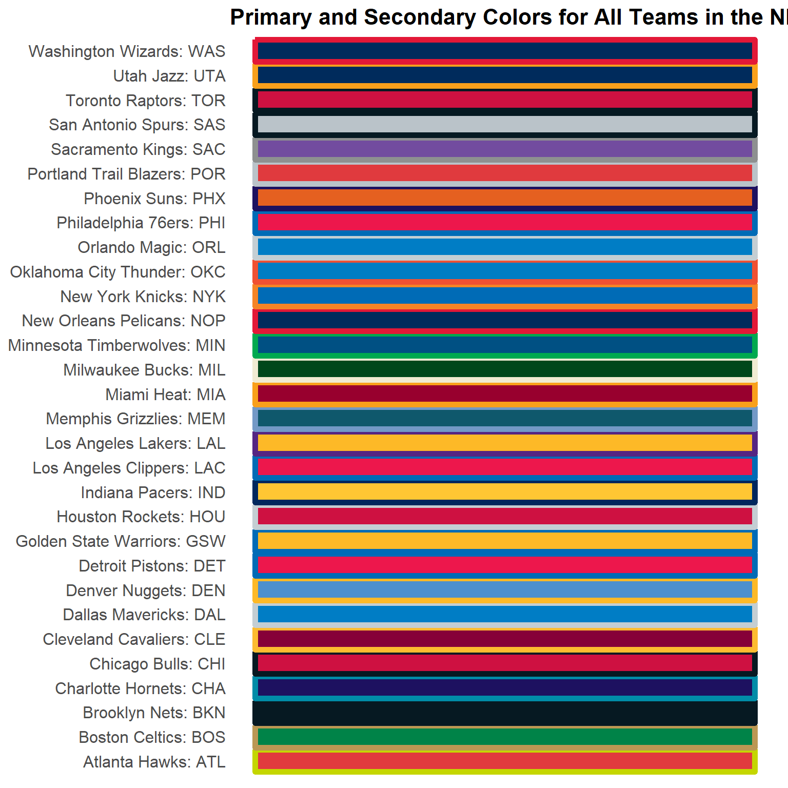
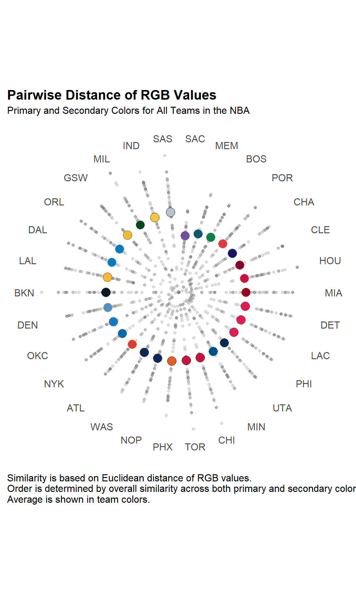
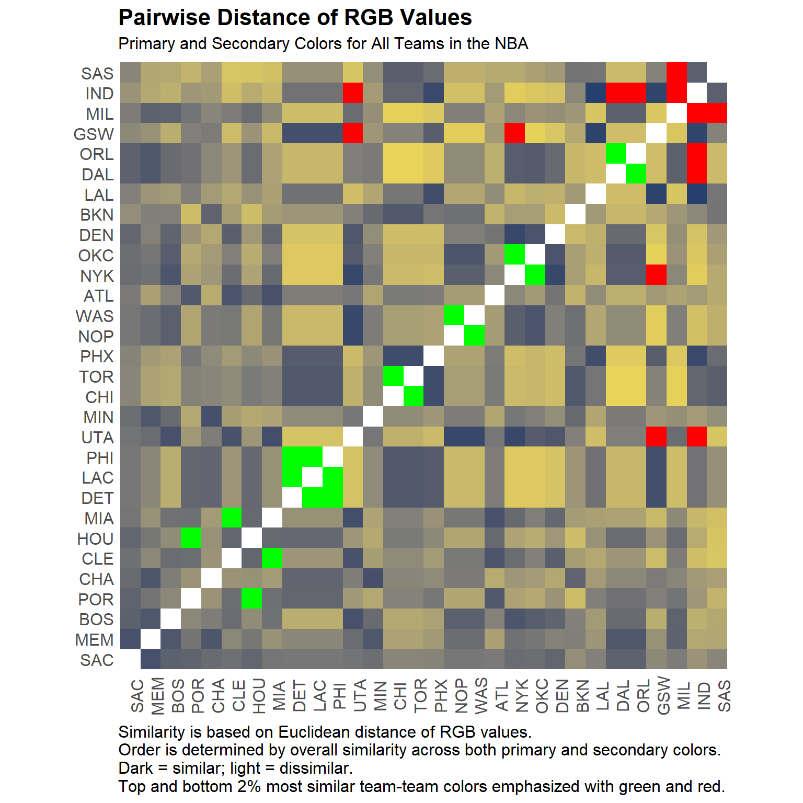
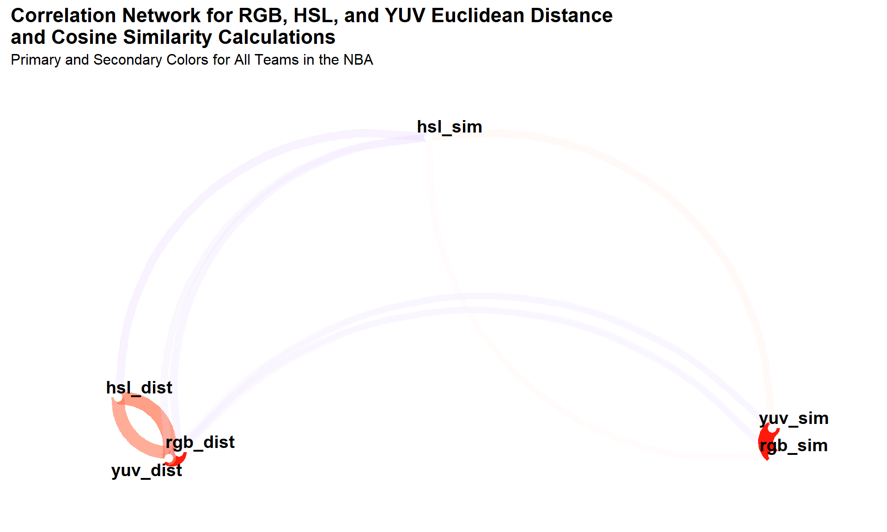

*NOTE: This write-up picks up where [the previous
one](https://tonyelhabr.rbind.io/post/sports-colors-analysis-r/) left
off. All of the session data is carried over.*


Color Similarity
----------------

Now, I’d like to evaluate color similarity more closely. To help verify
any quantitative deductions with some intuition, I’ll consider only a
single league for this–the NBA, the league that I know the best.

Because I’ll end up plotting team names at some point and some of the
full names are relatively lengthy, I want to get the official
abbreviations for each team. Unfortunately, these don’t come with the
[`teamcolor` package](https://github.com/beanumber/teamcolors), but I
can use [Alex Bresler](http://asbcllc.com/)’s [`nbastatR`
package](https://github.com/abresler/nbastatR) to get them.

``` {.r}
# Assign `df_dict_nba_teams` to Global environment.
nbastatR::assign_nba_teams()
nms_nba <-
  teamcolors::teamcolors %>% 
  filter(league == "nba") %>% 
  inner_join(
    df_dict_nba_teams %>%
      setNames(snakecase::to_snake_case(names(.))) %>%
      filter(!is_non_nba_team) %>% 
      select(name = name_team, slug = slug_team),
    by = c("name")
  )

colors_tidy_ord2_nba <-
  nms_nba %>% 
  select(name, league, slug) %>% 
  inner_join(colors_tidy_ord2, by = c("name", "league"))
```

To give the unfamiliar reader a better understanding of what exactly
this subset of the `teamcolors` data incorporate, here’s a visualization
of the primary and secondary colors of all NBA teams



After grabbing the abbreviations (or `slug`s), I can move on to breaking
up the hex values into their RGB components. [^1]
I’ll be looking at only the primary and secondary colors
again.

``` {.r}
colors_ord2_nba_rgb_tidy <-
  colors_tidy_ord2_nba %>%
  add_rgb_cols() %>% 
  select(-hex) %>%
  tidyr::gather(rgb, value, red, green, blue)

colors_ord2_nba_rgb_tidy %>% 
  create_kable()
```

<table>
<thead>
<tr>
<th>name</th>
<th>league</th>
<th>slug</th>
<th>ord</th>
<th>rgb</th>
<th>value</th>
</tr>
</thead>
<tbody>
<tr>
<td>Atlanta Hawks</td>
<td>nba</td>
<td>ATL</td>
<td>primary</td>
<td>red</td>
<td>225</td>
</tr>
<tr>
<td>Atlanta Hawks</td>
<td>nba</td>
<td>ATL</td>
<td>secondary</td>
<td>red</td>
<td>196</td>
</tr>
<tr>
<td>Boston Celtics</td>
<td>nba</td>
<td>BOS</td>
<td>primary</td>
<td>red</td>
<td>0</td>
</tr>
<tr>
<td>Boston Celtics</td>
<td>nba</td>
<td>BOS</td>
<td>secondary</td>
<td>red</td>
<td>187</td>
</tr>
<tr>
<td>Brooklyn Nets</td>
<td>nba</td>
<td>BKN</td>
<td>primary</td>
<td>red</td>
<td>6</td>
</tr>
<tr>
<td>Brooklyn Nets</td>
<td>nba</td>
<td>BKN</td>
<td>secondary</td>
<td>red</td>
<td>6</td>
</tr>
<tr>
<td>Charlotte Hornets</td>
<td>nba</td>
<td>CHA</td>
<td>primary</td>
<td>red</td>
<td>29</td>
</tr>
<tr>
<td>Charlotte Hornets</td>
<td>nba</td>
<td>CHA</td>
<td>secondary</td>
<td>red</td>
<td>0</td>
</tr>
<tr>
<td>Chicago Bulls</td>
<td>nba</td>
<td>CHI</td>
<td>primary</td>
<td>red</td>
<td>206</td>
</tr>
<tr>
<td>Chicago Bulls</td>
<td>nba</td>
<td>CHI</td>
<td>secondary</td>
<td>red</td>
<td>6</td>
</tr>
</tbody>
<tfoot>
<tr>
<td style="padding: 0; border:0;" colspan="100%">
<sup>1</sup> # of total rows: 180
</td>
</tr>
</tfoot>
</table>

With the RGB values extracted, I can use the `widyr::pairwise_dist()`
function to compute the relative distance among teams in terms of RGB
values for each color ordinality.I think the default method–[“Euclidean”
distance](https://en.wikipedia.org/wiki/Euclidean_distance)–is
reasonable.

``` {.r}
do_pairwise_dist <- function(data, method) {
  data %>% 
    group_by(ord) %>% 
    widyr::pairwise_dist(name, rgb, value, upper = TRUE, method = method) %>% 
    rename(name1 = item1, name2 = item2) %>% 
    select(everything(), value = ncol(.)) %>% 
    arrange(value, .by_group = TRUE) %>% 
    ungroup()
}
```

As one might expect, there’s not much difference between these two
distance methods (if correlation is deemed a valid metric for
quantifying similarity).

How exactly do all of the individual distances compare?



I think that the above plot does a good job of highlighting the average
distance values (in terms of RGB) of each team. Additionally, by sorting
the teams by value, it illustrates exactly which teams are the most
“generic” (i.e. most similar to all other teams) and the most “unique”
(i.e. least similar to all other teams.)

I can also use a heat map to visualize the same data (Who doesn’t like a
good heat map?)



Like with the previous plot, I order the teams on each axis by total
distance from all other teams–teams with the highest cumulative
similarity to all other teams appear towards the bottom and left, while
teams that contrast most with all others appear towards the top and
right. And, to add some nuance, I emphasize the individual pairs that
have the highest and lowest similarity with different colors.

Exactly which teams match most and least closely with one another (in
terms of color similarity)? Here’s a list of the top and bottom matches
for each team.
<table>
<thead>
<tr>
<th>rank_overall</th>
<th>name1</th>
<th>name2</th>
<th>dist</th>
</tr>
</thead>
<tbody>
<tr>
<td>1</td>
<td>Sacramento Kings</td>
<td>Memphis Grizzlies</td>
<td>173</td>
</tr>
<tr>
<td>1</td>
<td>Sacramento Kings</td>
<td>Indiana Pacers</td>
<td>399</td>
</tr>
<tr>
<td>2</td>
<td>Memphis Grizzlies</td>
<td>Sacramento Kings</td>
<td>173</td>
</tr>
<tr>
<td>2</td>
<td>Memphis Grizzlies</td>
<td>Indiana Pacers</td>
<td>463</td>
</tr>
<tr>
<td>3</td>
<td>Boston Celtics</td>
<td>Utah Jazz</td>
<td>174</td>
</tr>
<tr>
<td>3</td>
<td>Boston Celtics</td>
<td>Indiana Pacers</td>
<td>483</td>
</tr>
<tr>
<td>4</td>
<td>Portland Trail Blazers</td>
<td>Houston Rockets</td>
<td>63</td>
</tr>
<tr>
<td>4</td>
<td>Portland Trail Blazers</td>
<td>Brooklyn Nets</td>
<td>521</td>
</tr>
<tr>
<td>5</td>
<td>Charlotte Hornets</td>
<td>Minnesota Timberwolves</td>
<td>171</td>
</tr>
<tr>
<td>5</td>
<td>Charlotte Hornets</td>
<td>Atlanta Hawks</td>
<td>472</td>
</tr>
<tr>
<td>6</td>
<td>Cleveland Cavaliers</td>
<td>Miami Heat</td>
<td>55</td>
</tr>
<tr>
<td>6</td>
<td>Cleveland Cavaliers</td>
<td>San Antonio Spurs</td>
<td>544</td>
</tr>
<tr>
<td>7</td>
<td>Houston Rockets</td>
<td>Portland Trail Blazers</td>
<td>63</td>
</tr>
<tr>
<td>7</td>
<td>Houston Rockets</td>
<td>San Antonio Spurs</td>
<td>541</td>
</tr>
<tr>
<td>8</td>
<td>Miami Heat</td>
<td>Cleveland Cavaliers</td>
<td>55</td>
</tr>
<tr>
<td>8</td>
<td>Miami Heat</td>
<td>San Antonio Spurs</td>
<td>529</td>
</tr>
<tr>
<td>9</td>
<td>Detroit Pistons</td>
<td>Los Angeles Clippers</td>
<td>0</td>
</tr>
<tr>
<td>9</td>
<td>Detroit Pistons</td>
<td>Oklahoma City Thunder</td>
<td>559</td>
</tr>
<tr>
<td>10</td>
<td>Los Angeles Clippers</td>
<td>Detroit Pistons</td>
<td>0</td>
</tr>
<tr>
<td>10</td>
<td>Los Angeles Clippers</td>
<td>Oklahoma City Thunder</td>
<td>559</td>
</tr>
<tr>
<td>11</td>
<td>Philadelphia 76ers</td>
<td>Detroit Pistons</td>
<td>0</td>
</tr>
<tr>
<td>11</td>
<td>Philadelphia 76ers</td>
<td>Oklahoma City Thunder</td>
<td>559</td>
</tr>
<tr>
<td>12</td>
<td>Utah Jazz</td>
<td>New Orleans Pelicans</td>
<td>141</td>
</tr>
<tr>
<td>12</td>
<td>Utah Jazz</td>
<td>Golden State Warriors</td>
<td>593</td>
</tr>
<tr>
<td>13</td>
<td>Minnesota Timberwolves</td>
<td>Charlotte Hornets</td>
<td>171</td>
</tr>
<tr>
<td>13</td>
<td>Minnesota Timberwolves</td>
<td>Houston Rockets</td>
<td>464</td>
</tr>
<tr>
<td>14</td>
<td>Chicago Bulls</td>
<td>Toronto Raptors</td>
<td>0</td>
</tr>
<tr>
<td>14</td>
<td>Chicago Bulls</td>
<td>Orlando Magic</td>
<td>584</td>
</tr>
<tr>
<td>15</td>
<td>Toronto Raptors</td>
<td>Chicago Bulls</td>
<td>0</td>
</tr>
<tr>
<td>15</td>
<td>Toronto Raptors</td>
<td>Orlando Magic</td>
<td>584</td>
</tr>
<tr>
<td>16</td>
<td>Phoenix Suns</td>
<td>Indiana Pacers</td>
<td>143</td>
</tr>
<tr>
<td>16</td>
<td>Phoenix Suns</td>
<td>Orlando Magic</td>
<td>561</td>
</tr>
<tr>
<td>17</td>
<td>New Orleans Pelicans</td>
<td>Washington Wizards</td>
<td>0</td>
</tr>
<tr>
<td>17</td>
<td>New Orleans Pelicans</td>
<td>Golden State Warriors</td>
<td>568</td>
</tr>
<tr>
<td>18</td>
<td>Washington Wizards</td>
<td>New Orleans Pelicans</td>
<td>0</td>
</tr>
<tr>
<td>18</td>
<td>Washington Wizards</td>
<td>Golden State Warriors</td>
<td>568</td>
</tr>
<tr>
<td>19</td>
<td>Atlanta Hawks</td>
<td>Miami Heat</td>
<td>175</td>
</tr>
<tr>
<td>19</td>
<td>Atlanta Hawks</td>
<td>Brooklyn Nets</td>
<td>493</td>
</tr>
<tr>
<td>20</td>
<td>New York Knicks</td>
<td>Oklahoma City Thunder</td>
<td>75</td>
</tr>
<tr>
<td>20</td>
<td>New York Knicks</td>
<td>Golden State Warriors</td>
<td>586</td>
</tr>
<tr>
<td>21</td>
<td>Oklahoma City Thunder</td>
<td>New York Knicks</td>
<td>75</td>
</tr>
<tr>
<td>21</td>
<td>Oklahoma City Thunder</td>
<td>Golden State Warriors</td>
<td>578</td>
</tr>
<tr>
<td>22</td>
<td>Denver Nuggets</td>
<td>New York Knicks</td>
<td>142</td>
</tr>
<tr>
<td>22</td>
<td>Denver Nuggets</td>
<td>Golden State Warriors</td>
<td>546</td>
</tr>
<tr>
<td>23</td>
<td>Brooklyn Nets</td>
<td>Chicago Bulls</td>
<td>203</td>
</tr>
<tr>
<td>23</td>
<td>Brooklyn Nets</td>
<td>Portland Trail Blazers</td>
<td>521</td>
</tr>
<tr>
<td>24</td>
<td>Los Angeles Lakers</td>
<td>Indiana Pacers</td>
<td>111</td>
</tr>
<tr>
<td>24</td>
<td>Los Angeles Lakers</td>
<td>Milwaukee Bucks</td>
<td>542</td>
</tr>
<tr>
<td>25</td>
<td>Dallas Mavericks</td>
<td>Orlando Magic</td>
<td>0</td>
</tr>
<tr>
<td>25</td>
<td>Dallas Mavericks</td>
<td>Indiana Pacers</td>
<td>586</td>
</tr>
<tr>
<td>26</td>
<td>Orlando Magic</td>
<td>Dallas Mavericks</td>
<td>0</td>
</tr>
<tr>
<td>26</td>
<td>Orlando Magic</td>
<td>Indiana Pacers</td>
<td>586</td>
</tr>
<tr>
<td>27</td>
<td>Golden State Warriors</td>
<td>Los Angeles Lakers</td>
<td>122</td>
</tr>
<tr>
<td>27</td>
<td>Golden State Warriors</td>
<td>Utah Jazz</td>
<td>593</td>
</tr>
<tr>
<td>28</td>
<td>Milwaukee Bucks</td>
<td>Dallas Mavericks</td>
<td>231</td>
</tr>
<tr>
<td>28</td>
<td>Milwaukee Bucks</td>
<td>San Antonio Spurs</td>
<td>644</td>
</tr>
<tr>
<td>29</td>
<td>Indiana Pacers</td>
<td>Los Angeles Lakers</td>
<td>111</td>
</tr>
<tr>
<td>29</td>
<td>Indiana Pacers</td>
<td>Milwaukee Bucks</td>
<td>617</td>
</tr>
<tr>
<td>30</td>
<td>San Antonio Spurs</td>
<td>Chicago Bulls</td>
<td>225</td>
</tr>
<tr>
<td>30</td>
<td>San Antonio Spurs</td>
<td>Milwaukee Bucks</td>
<td>644</td>
</tr>
</tbody>
</table>

These results don’t really agree with what I–and maybe other NBA
fans–would have guessed. The Sacramento Kings (`SAC`) have purple as
their primary color, which is relatively unusual. I would think that
they would be in the lower half of these rankings. Whats going on? …


Color Theory
------------

When doing this color-based analysis, several questions came to mind:

1.  Is the [RGB model](https://en.wikipedia.org/wiki/RGB_color_model)
    really the best framework to use for comparing colors? What about
    the [HSL](https://en.wikipedia.org/wiki/HSL_and_HSV) (Hue,
    Saturation, Lightness) model? Additionally, a quick Google search
    for [“What is the best method for identifying similarity between
    colors?”](https://stackoverflow.com/questions/5392061/algorithm-to-check-similarity-of-colors)
    indicates the [YUV
    representation](https://en.wikipedia.org/wiki/YUV)–a model I hadn’t
    heard of before–is best, (if human perception is the main concern).

2.  Is Euclidean distance the best “distance” method to use? But,
    because I’m curious, I’ll look at how different the results would be
    if the [“Manhattan”
    distance](https://en.wiktionary.org/wiki/Manhattan_distance) is used
    instead.

3.  Is “distance” even the best method for determining color similarity.
    Why not a “similarity” metric (such as [cosine
    similarity](https://en.wikipedia.org/wiki/Cosine_similarity))?

Since I’m not expert in color models, and because I there is no
definitive/conclusive research with which I can cross-check my findings
for color similarity among NBA teams, I think its worthwhile to explore
these questions in more detail. First, I’ll need to create HSL and YUV
variations of the color data that I can compare to the RGB version that
I’ve used up to this point. (This will help me answer the first
question.) [^2] Then, with each of these
data sets in hand, I’ll tackle the latter two questions directly. In the
end, by comparing the different models with different methods, I hope to
come to some stronger conclusions and/or justifications of my findings
about NBA team colors.

class="section level3">

### Euclidean Distance vs. Manhattan Distance

I’ll look at two distance methods–Euclidean and Manhattan–to justify my
choice of Euclidean distance before. To do this, I want to verify that
the similarity determined by the two methods is nearly identical. (I
would be surprised if they aren’t.)
<table>
<thead>
<tr>
<th>rgb_euclidean</th>
<th>rgb_manhattan</th>
</tr>
</thead>
<tbody>
<tr>
<td>NA</td>
<td>97.16</td>
</tr>
<tr>
<td>97.16</td>
<td>NA</td>
</tr>
</tbody>
</table>
<table>
<thead>
<tr>
<th>hsl_euclidean</th>
<th>hsl_manhattan</th>
</tr>
</thead>
<tbody>
<tr>
<td>NA</td>
<td>97.62</td>
</tr>
<tr>
<td>97.62</td>
<td>NA</td>
</tr>
</tbody>
</table>
<table>
<thead>
<tr>
<th>yuv_euclidean</th>
<th>yuv_manhattan</th>
</tr>
</thead>
<tbody>
<tr>
<td>NA</td>
<td>96.26</td>
</tr>
<tr>
<td>96.26</td>
<td>NA</td>
</tr>
</tbody>
</table>


Indeed, it looks like there is high correlation found between the
Euclidean and Manhattan distances calculated when the hex color values
are broken down into color components, regardless of whether the RGB,
HSL, or YUV representation is used.

Now, when keeping the distance method constant (Euclidean), how do the
color models compare?

<thead>
<tr>
<th>rowname</th>
<th>rgb_dist</th>
<th>hsl_dist</th>
<th>yuv_dist</th>
</tr>
</thead>
<tbody>
<tr>
<td>rgb_dist</td>
<td>NA</td>
<td>62.53</td>
<td>97.88</td>
</tr>
<tr>
<td>hsl_dist</td>
<td>62.53</td>
<td>NA</td>
<td>68.12</td>
</tr>
<tr>
<td>yuv_dist</td>
<td>97.88</td>
<td>68.12</td>
<td>NA</td>
</tr>
</tbody>
</table>

The numbers indicate that there is some strong positive correlation,
especially between the RGB and YUV color schemas. This indicates that
the conclusions that I came to regarding most similar and dissimilar NBA
team colors would not be much different if using the HSL or YUV models
instead of the RGB model.


### Distance vs. Similarity

To compare distance (Euclidean) with cosine similarity, I can create and
use a similar set of functions to those used for comparing distance
methods. To visualize the results in an interpretable manner, I can use
the `network_plot()` function from
[Dr. Simon](https://drsimonj.svbtle.com/)’s [`corrr`
package\`](https://github.com/drsimonj/corrr). This function is cool for
visualizing correlation data in a way other than with a traditional
correlation matrix. [^3]



It’s clear that the RGB and YUV schemas are fairly similar “within” both
metrics–Euclidean distance and cosine similarity–and both are relatively
dissimilar to HSL. However, all three color models show negative
correlations “within” themselves when comparing the two metrics against
one another. (i.e. The RGB schema has a negative correlation when
comparing its distance values to its similarity values, and likewise for
the HSL and YUV models.)

***So, which color model and which metric should be used?*** In my
opinion, the RGB model seems like a good choice, both because it is
relatively similar to at least one other method (YUV) and because it is
(probably) the most relatable scheme to people who don’t know much about
color theory. For metric, I think that the choice of Euclidean distance
is valid. My Google search (which makes the case for YUV) makes the
assumption that Euclidean distance is being used. Additionally, a
separate Google search for “euclidean distance vs. cosine similarity”
turns up [an easy-to-follow technical
write-up](https://cmry.github.io/notes/euclidean-v-cosine) that implies
that cosine similarity is probably not really appropriate for this kind
of color analysis.


Conclusion
----------

That’s all I got for this topic. I hope that the techniques shown here
are general enough that they can be applied to any set of color to
extract some fun (and meaningful) insight.


------------------------------------------------------------------------

[^1]: I use the same method as the one I used before.

[^2]: I don’t show the code for this, so check out the .Rmd document for detail.

[^3]: I could have actually used this same function to visualize the various distance methods all in one plot.

