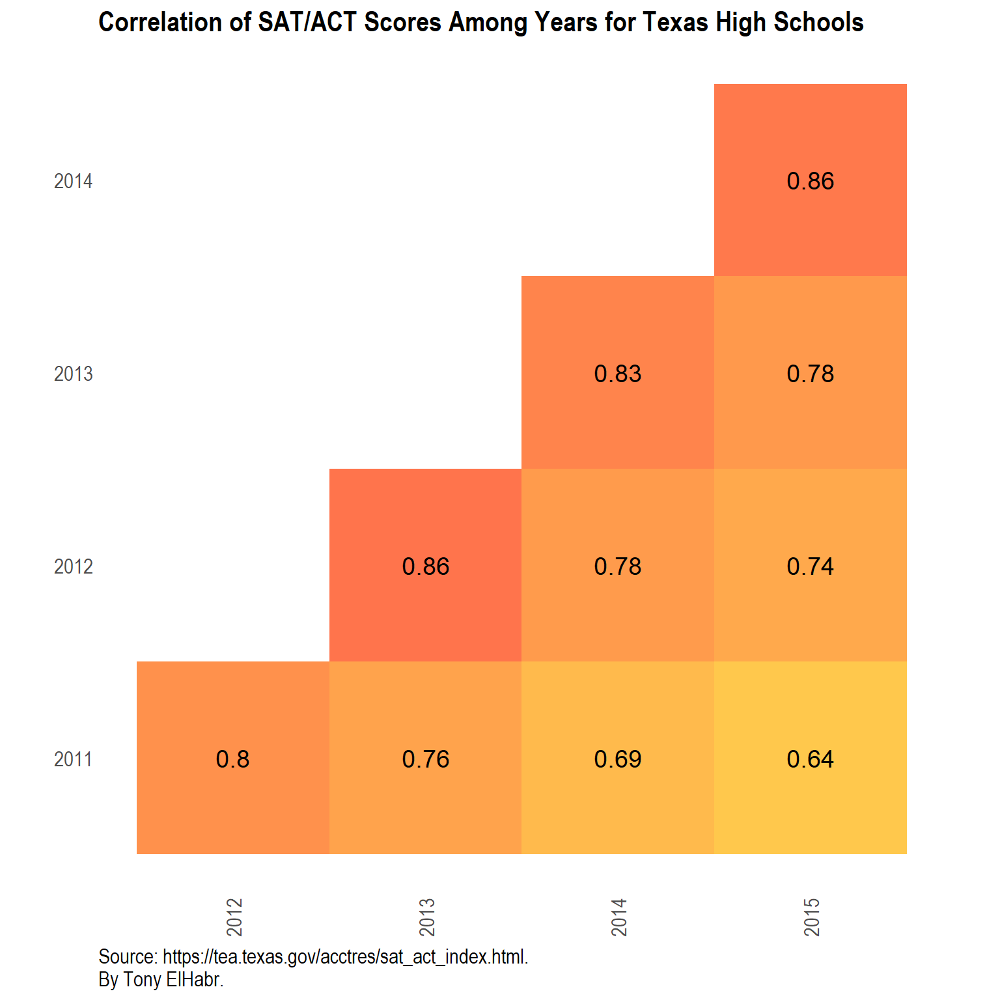
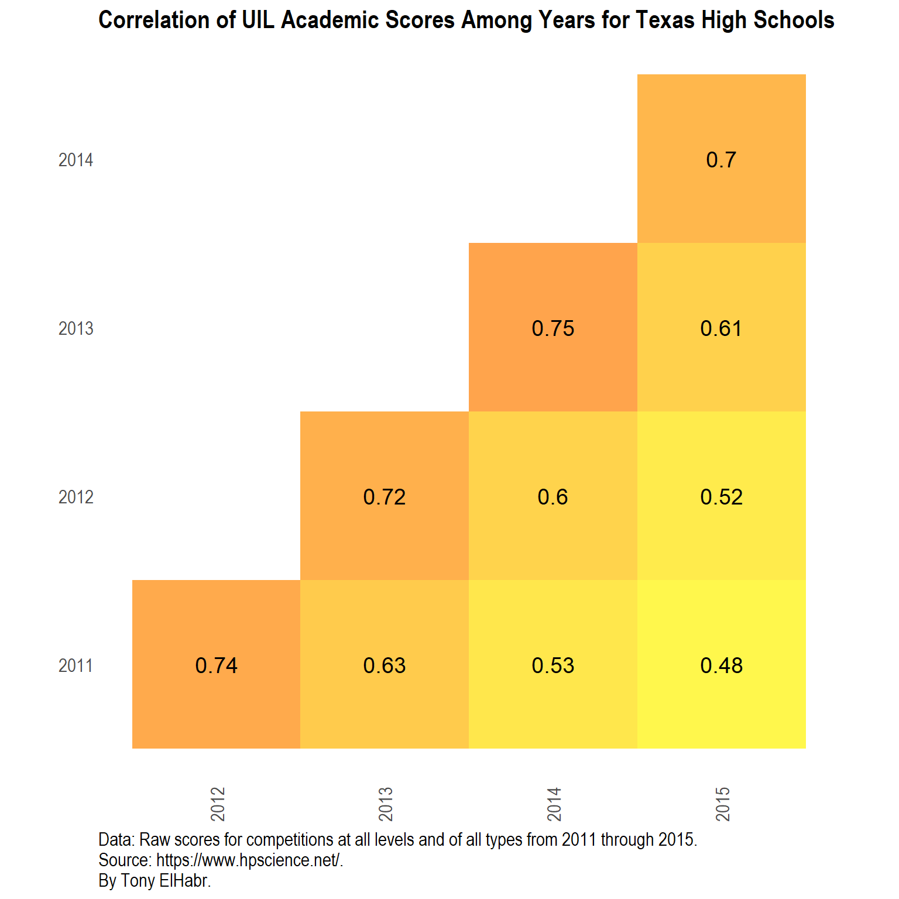
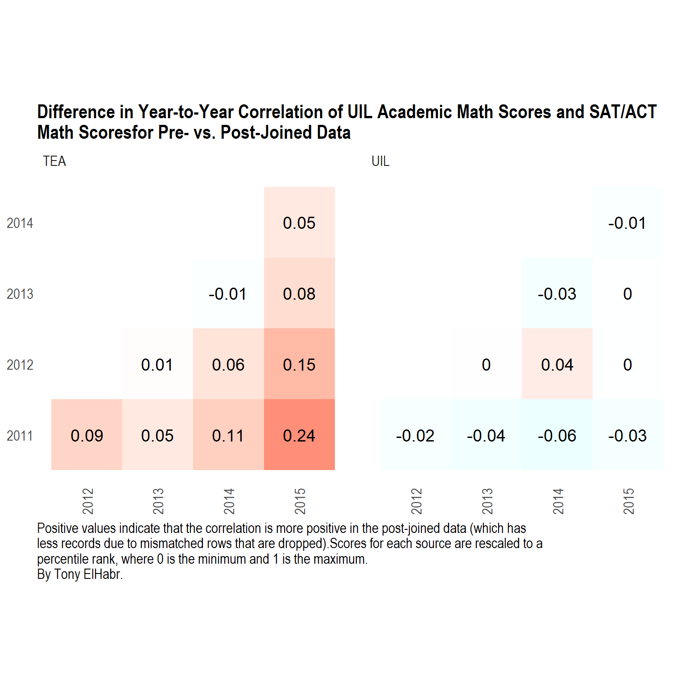

Introduction
------------

I wanted to do a follow-up on [my series of
posts](/post/analysis-texas-high-school-academics-intro/) about Texas
high school [University Interscholastic
League](http://www.uiltexas.org/) (UIL) academic competitions to more
closely evaluate the relationship between the school performance in
those competitions with school-wide
[SAT](https://en.wikipedia.org/wiki/SAT)) and
[ACT](https://www.act.org/) scores. For those who may not be familiar
with these tests, these are the two most popular standardized tests used
for college admission in the United States.

In my introduction to that series, I stated the following: *School-wide
… scores on state- and national-standardized tests (e.g. the SAT)
certainly are the most common measure of academic strength, but I think
rankings by academic competitions may be more indicative.*

Essentially, I was implying that the academic UIL scores may not
correspond well, or at all, with standardized test scores. However, I
did not attempt to prove this hypothesis, which is what I set out to do
here. While I’m at it, I’ll show the code and provide some commentary to
explain my process.


Data Collection
---------------

While I already have collected and cleaned the UIL data that I’ll need
by virtue of my work for [my series of posts analyzing the UIL
competitions](/post/analysis-texas-high-school-academics-intro/), I did
not retrieve data for standardized test scores. To my delight, the
[Texas Education Agency’s website](https://tea.texas.gov) publishes
Texas high school SAT and ACT scores for the years 2011 through 2015.
The task of scraping from this source is a perfect use-case for the
super-handy `{xml2}` and `{rvest}` packages, as well the well-known
awesome `{stringr}` and `{purrr}` packages in the `{tidyverse}`.

``` {.r}
library("tidyverse")
library("rlang")
library("teplot") # Personal package.
```

``` {.r}
urls_tea <-
  "https://tea.texas.gov/acctres/sat_act_index.html" %>%
  xml2::read_html() %>%
  rvest::html_nodes(xpath = "//tr //td //a") %>%
  rvest::html_attr("href") %>% 
  str_subset("^\\/acctres\\/[:alpha:]{3}_[Cc]ampus_[Dd]ata")
urls_tea
```

``` {.r}
create_path_tea <-
  function(url_suffix, dir = "data-raw", ext = "csv") {
    if(!dir.exists(dir)) {
       dir.create(dir)
    }
    url_suffix %>%
      str_remove_all("acctres|\\/") %>% 
      paste0(".", ext) %>% 
      file.path(dir, .)
  }
```

``` {.r}
# NOTE(s):
# + `urls_tea_dl` is actually the same as `url_tea` because `purrr::walk()` returns its first argument.
# + `mode = "wb"` is important! Otherwise, the downloaded files have empty lines every other line
# (due to the way that CR and LFs are handled.
urls_tea_dl <-
  urls_tea %>%
  walk(
    ~download.file(
      url = paste0("https://tea.texas.gov/", .x),
      destfile = create_path_tea(url_suffix = .x),
      mode = "wb"
    )
  )
```


Data Cleaning
-------------

Next, I bind the data from all of the downloaded files together and do
some cleaning. I put these actions in function(s) because I plan on
re-using them in future posts where I explore this data set in other
ways.

One relatively significant choice that I make here is to only include
the data for the school-wide level (via the `"All Students"` filtering
criteria), although data for different demographics within each school
is provided. The other data set that I am evaluating—the academic UIL
data— does not have demographci-specific information, so I want to treat
the two set as “equally” as possible.

Additionally, in order to better understand the resulting data set, the
reader should be made aware of some of the details of the tests. The SAT
has `math`, `reading`, and `writing` sections, each having minimum and
maximum scores of 200 and 800, meaning that the `total` can range from
600 to 2400. The ACT has `math`, `reading`, `english`, and `science`
sections, each having a minimum and maximum score of 1 and 36, combined
for a single `compos` score also ranging from 1 to 36. To eliminate
duplicate columns representing the same underlying “thing”. I don’t
distinguish the `math` and `reading` section scores for each test in
separate columns, I rename the ACT’s `compos` score to `total`,
following the convention used for the SAT’s cumulative score. The other
sections—`writing` for the SAT and `english` and `science` for the ACT—
are not really analogous to sections in the other test, so they are
filled with `NA`s appropriately.

Finally, for the interEsted reader, there are some details regarding the
code implementation that I document in comments (both for explaining
actions for myself and for the reader).

``` {.r}
import_tea_data <-
  function(path, rgx_grp) {
    res <-
      path %>%
      readr::read_csv() %>%
      rename_all(funs(tolower))
    
    if(!is.null(rgx_grp)) {
      res <-
        res %>%
        filter(group %>% str_detect(rgx_grp))
    }
    res <-
      res %>%
      select(
        matches(
          "^group$|name$|math|reading|writing|total|english|science|compos"
        )
      )
    res
  }

import_tea_data_cleanly <-
  function(urls, rgx_grp, ...) {

    res <-
      urls %>%
      create_path_tea(...) %>%
      tibble(path = .) %>%
      mutate(
        test = stringr::str_extract(path, "([Ss][Aa][Tt])|([Aa][Cc][Tt])") %>% toupper(),
        year = stringr::str_extract(path, "[:digit:]+") %>% as.integer()
      ) %>%
      mutate(contents = purrr::map(path, ~import_tea_data(.x, rgx_grp = rgx_grp))) %>%
      unnest() %>%
      # NOTE: No longer need this columns(s) any more.
      select(-path) %>%
      mutate_at(vars(total), funs(ifelse(test == "ACT", compos, .))) %>% 
      # NOTE: No longer need this column(s) any more.
      select(-compos) %>% 
      # NOTE: Rearranging score columns in a more logical fashion.
      select(-total, everything(), total) %>% 
      # NOTE: Renaming "important" columns.
      rename(school = campname,
             district = distname,
             county = cntyname,
             city = regnname) %>%
      mutate_if(is.character, funs(str_replace_all(., "=|\"", ""))) %>%
      mutate_at(vars(school, district, county, city), funs(toupper)) %>% 
      # NOTE: Some county names are truncated and end with COUN or COUNT.
      # (The max seems to be 18 characters).
      # Fortunately, ther are no county names with COUN in their names, so the following
      # regular expression is sufficient.
      mutate_at(vars(county), funs(str_remove_all(., "\\s+COUN.*$"))) %>%
      # NOTE: Remove all HS/H S at the end of school names, as well as ampersands.
      # This seems to improve join percentages with other data sets.
      mutate_at(vars(school), funs(str_remove_all(., "([H]\\s*[S]$)|(\\s+\\&)") %>% str_trim())) %>%
      # NOTE: This is (try to) to resolve duplicates in raw data.
      # group_by_at(vars(matches("test|year|school|district|county|city"))) %>% 
      # summarise_all(funs(max(., na.rm = TRUE))) %>% 
      # ungroup() %>% 
      arrange(test, year, school)
    res
  }
```

``` {.r}
schools_tea <-
  urls_tea %>%
  import_tea_data_cleanly(rgx_grp = "All Students")
schools_tea
```

<table>
<thead>
<tr>
<th>test</th>
<th>year</th>
<th>school</th>
<th>district</th>
<th>county</th>
<th>city</th>
<th>math</th>
<th>reading</th>
<th>writing</th>
<th>english</th>
<th>science</th>
<th>total</th>
</tr>
</thead>
<tbody>
<tr>
<td>ACT</td>
<td>2011</td>
<td>A C JONES</td>
<td>BEEVILLE ISD</td>
<td>BEE</td>
<td>CORPUS CHRISTI</td>
<td>19</td>
<td>18</td>
<td>NA</td>
<td>17</td>
<td>19</td>
<td>18</td>
</tr>
<tr>
<td>ACT</td>
<td>2011</td>
<td>A J MOORE ACAD</td>
<td>WACO ISD</td>
<td>MCLENNAN</td>
<td>WACO</td>
<td>19</td>
<td>18</td>
<td>NA</td>
<td>16</td>
<td>18</td>
<td>18</td>
</tr>
<tr>
<td>ACT</td>
<td>2011</td>
<td>A M CONS</td>
<td>COLLEGE STATION ISD</td>
<td>BRAZOS</td>
<td>HUNTSVILLE</td>
<td>26</td>
<td>24</td>
<td>NA</td>
<td>23</td>
<td>24</td>
<td>24</td>
</tr>
<tr>
<td>ACT</td>
<td>2011</td>
<td>A MACEO SMITH HIGH SCHOOL</td>
<td>DALLAS ISD</td>
<td>DALLAS</td>
<td>RICHARDSON</td>
<td>16</td>
<td>14</td>
<td>NA</td>
<td>13</td>
<td>15</td>
<td>14</td>
</tr>
<tr>
<td>ACT</td>
<td>2011</td>
<td>ABBOTT SCHOOL</td>
<td>ABBOTT ISD</td>
<td>HILL</td>
<td>WACO</td>
<td>20</td>
<td>20</td>
<td>NA</td>
<td>19</td>
<td>21</td>
<td>20</td>
</tr>
<tr>
<td>ACT</td>
<td>2011</td>
<td>ABERNATHY</td>
<td>ABERNATHY ISD</td>
<td>HALE</td>
<td>LUBBOCK</td>
<td>22</td>
<td>20</td>
<td>NA</td>
<td>19</td>
<td>21</td>
<td>21</td>
</tr>
<tr>
<td>ACT</td>
<td>2011</td>
<td>ABILENE</td>
<td>ABILENE ISD</td>
<td>TAYLOR</td>
<td>ABILENE</td>
<td>21</td>
<td>21</td>
<td>NA</td>
<td>20</td>
<td>21</td>
<td>21</td>
</tr>
<tr>
<td>ACT</td>
<td>2011</td>
<td>ACADEMY</td>
<td>ACADEMY ISD</td>
<td>BELL</td>
<td>WACO</td>
<td>24</td>
<td>23</td>
<td>NA</td>
<td>21</td>
<td>24</td>
<td>23</td>
</tr>
<tr>
<td>ACT</td>
<td>2011</td>
<td>ACADEMY HIGH SCHOOL</td>
<td>HAYS CISD</td>
<td>HAYS</td>
<td>AUSTIN</td>
<td>NA</td>
<td>NA</td>
<td>NA</td>
<td>NA</td>
<td>NA</td>
<td>NA</td>
</tr>
<tr>
<td>ACT</td>
<td>2011</td>
<td>ACADEMY OF CAREERS AND TECHNOLOGIE</td>
<td>ACADEMY OF CAREERS AND TECHNOLOGIE</td>
<td>BEXAR</td>
<td>SAN ANTONIO</td>
<td>15</td>
<td>14</td>
<td>NA</td>
<td>12</td>
<td>14</td>
<td>14</td>
</tr>
<tr>
<td>ACT</td>
<td>2011</td>
<td>ACADEMY OF CREATIVE ED</td>
<td>NORTH EAST ISD</td>
<td>BEXAR</td>
<td>SAN ANTONIO</td>
<td>NA</td>
<td>NA</td>
<td>NA</td>
<td>NA</td>
<td>NA</td>
<td>NA</td>
</tr>
<tr>
<td>ACT</td>
<td>2011</td>
<td>ADRIAN SCHOOL</td>
<td>ADRIAN ISD</td>
<td>OLDHAM</td>
<td>AMARILLO</td>
<td>19</td>
<td>18</td>
<td>NA</td>
<td>20</td>
<td>19</td>
<td>19</td>
</tr>
<tr>
<td>ACT</td>
<td>2011</td>
<td>ADVANTAGE ACADEMY</td>
<td>ADVANTAGE ACADEMY</td>
<td>DALLAS</td>
<td>RICHARDSON</td>
<td>18</td>
<td>20</td>
<td>NA</td>
<td>19</td>
<td>16</td>
<td>18</td>
</tr>
<tr>
<td>ACT</td>
<td>2011</td>
<td>AGUA DULCE</td>
<td>AGUA DULCE ISD</td>
<td>NUECES</td>
<td>CORPUS CHRISTI</td>
<td>21</td>
<td>19</td>
<td>NA</td>
<td>18</td>
<td>20</td>
<td>19</td>
</tr>
<tr>
<td>ACT</td>
<td>2011</td>
<td>AIM CENTER</td>
<td>VIDOR ISD</td>
<td>ORANGE</td>
<td>BEAUMONT</td>
<td>NA</td>
<td>NA</td>
<td>NA</td>
<td>NA</td>
<td>NA</td>
<td>NA</td>
</tr>
<tr>
<td>ACT</td>
<td>2011</td>
<td>AKINS</td>
<td>AUSTIN ISD</td>
<td>TRAVIS</td>
<td>AUSTIN</td>
<td>19</td>
<td>17</td>
<td>NA</td>
<td>16</td>
<td>17</td>
<td>17</td>
</tr>
<tr>
<td>ACT</td>
<td>2011</td>
<td>ALAMO HEIGHTS</td>
<td>ALAMO HEIGHTS ISD</td>
<td>BEXAR</td>
<td>SAN ANTONIO</td>
<td>25</td>
<td>24</td>
<td>NA</td>
<td>24</td>
<td>24</td>
<td>24</td>
</tr>
<tr>
<td>ACT</td>
<td>2011</td>
<td>ALBA-GOLDEN</td>
<td>ALBA-GOLDEN ISD</td>
<td>WOOD</td>
<td>KILGORE</td>
<td>20</td>
<td>19</td>
<td>NA</td>
<td>18</td>
<td>20</td>
<td>19</td>
</tr>
<tr>
<td>ACT</td>
<td>2011</td>
<td>ALBANY JR-SR</td>
<td>ALBANY ISD</td>
<td>SHACKELFORD</td>
<td>ABILENE</td>
<td>24</td>
<td>22</td>
<td>NA</td>
<td>21</td>
<td>22</td>
<td>22</td>
</tr>
<tr>
<td>ACT</td>
<td>2011</td>
<td>ALDINE</td>
<td>ALDINE ISD</td>
<td>HARRIS</td>
<td>HOUSTON</td>
<td>19</td>
<td>17</td>
<td>NA</td>
<td>16</td>
<td>18</td>
<td>18</td>
</tr>
</tbody>
<tfoot>
<tr>
<td style="padding: 0; border:0;" colspan="100%">
<sup>1</sup> # of total rows: 15,073
</td>
</tr>
</tfoot>
</table>

### EDA: Year-to-Year Correlations

First, before evaluating the primary concern at hand—the relationship
between the academic UIL scores and the SAT/ACT scores (available in the
`schools_tea` data created above)—I want to verify that there is some
non-trivial relationship among the scores for a given school on a given
test across years. (I would be surprised if this were not shown to be
true.)

``` {.r}
schools_tea_cors_byyear <-
  schools_tea %>%
  distinct(test, year, school, .keep_all = TRUE) %>%
  filter(!is.na(total)) %>%
  unite(test_school, test, school) %>%
  widyr::pairwise_cor(
    feature = test_school,
    item = year,
    value = total
  ) %>% 
  rename(year1 = item1, year2 = item2, cor = correlation)
schools_tea_cors_byyear %>% 
  filter(year1 <= year2)
```

<table>
<thead>
<tr>
<th>year1</th>
<th>year2</th>
<th>cor</th>
</tr>
</thead>
<tbody>
<tr>
<td>2011</td>
<td>2012</td>
<td>0.80</td>
</tr>
<tr>
<td>2011</td>
<td>2013</td>
<td>0.76</td>
</tr>
<tr>
<td>2012</td>
<td>2013</td>
<td>0.86</td>
</tr>
<tr>
<td>2011</td>
<td>2014</td>
<td>0.69</td>
</tr>
<tr>
<td>2012</td>
<td>2014</td>
<td>0.78</td>
</tr>
<tr>
<td>2013</td>
<td>2014</td>
<td>0.83</td>
</tr>
<tr>
<td>2011</td>
<td>2015</td>
<td>0.64</td>
</tr>
<tr>
<td>2012</td>
<td>2015</td>
<td>0.74</td>
</tr>
<tr>
<td>2013</td>
<td>2015</td>
<td>0.78</td>
</tr>
<tr>
<td>2014</td>
<td>2015</td>
<td>0.86</td>
</tr>
</tbody>
</table>


As expected, there are some strong correlations among the years for
school-wide scores on these tests.

Ok, now let’s bring in the “cleaned” school data (`schools_uil`) that I
collected and cleaned in my UIL analysis. I’ll subset the data to
include only the same years found in `schools_tea`—2011 through 2015.

<table>
<thead>
<tr>
<th>school</th>
<th>city</th>
<th>complvl_num</th>
<th>score</th>
<th>year</th>
<th>conf</th>
<th>complvl</th>
<th>comp</th>
<th>advanced</th>
<th>n_state</th>
<th>n_bycomp</th>
<th>prnk</th>
<th>n_defeat</th>
<th>w</th>
</tr>
</thead>
<tbody>
<tr>
<td>HASKELL</td>
<td>HASKELL</td>
<td>13</td>
<td>616</td>
<td>2011</td>
<td>1</td>
<td>District</td>
<td>Calculator Applications</td>
<td>1</td>
<td>0</td>
<td>8</td>
<td>1.00</td>
<td>7</td>
<td>TRUE</td>
</tr>
<tr>
<td>POOLVILLE</td>
<td>POOLVILLE</td>
<td>13</td>
<td>609</td>
<td>2011</td>
<td>1</td>
<td>District</td>
<td>Calculator Applications</td>
<td>1</td>
<td>0</td>
<td>8</td>
<td>0.86</td>
<td>6</td>
<td>FALSE</td>
</tr>
<tr>
<td>LINDSAY</td>
<td>LINDSAY</td>
<td>17</td>
<td>553</td>
<td>2011</td>
<td>1</td>
<td>District</td>
<td>Calculator Applications</td>
<td>1</td>
<td>0</td>
<td>7</td>
<td>1.00</td>
<td>6</td>
<td>TRUE</td>
</tr>
<tr>
<td>PLAINS</td>
<td>PLAINS</td>
<td>3</td>
<td>537</td>
<td>2011</td>
<td>1</td>
<td>District</td>
<td>Calculator Applications</td>
<td>1</td>
<td>0</td>
<td>10</td>
<td>1.00</td>
<td>9</td>
<td>TRUE</td>
</tr>
<tr>
<td>SAN ISIDRO</td>
<td>SAN ISIDRO</td>
<td>32</td>
<td>534</td>
<td>2011</td>
<td>1</td>
<td>District</td>
<td>Calculator Applications</td>
<td>1</td>
<td>0</td>
<td>4</td>
<td>1.00</td>
<td>3</td>
<td>TRUE</td>
</tr>
<tr>
<td>CANADIAN</td>
<td>CANADIAN</td>
<td>7</td>
<td>527</td>
<td>2011</td>
<td>1</td>
<td>District</td>
<td>Calculator Applications</td>
<td>1</td>
<td>0</td>
<td>7</td>
<td>1.00</td>
<td>6</td>
<td>TRUE</td>
</tr>
<tr>
<td>GARDEN CITY</td>
<td>GARDEN CITY</td>
<td>10</td>
<td>518</td>
<td>2011</td>
<td>1</td>
<td>District</td>
<td>Calculator Applications</td>
<td>1</td>
<td>0</td>
<td>8</td>
<td>1.00</td>
<td>7</td>
<td>TRUE</td>
</tr>
<tr>
<td>WATER VALLEY</td>
<td>WATER VALLEY</td>
<td>10</td>
<td>478</td>
<td>2011</td>
<td>1</td>
<td>District</td>
<td>Calculator Applications</td>
<td>0</td>
<td>0</td>
<td>8</td>
<td>0.86</td>
<td>6</td>
<td>FALSE</td>
</tr>
<tr>
<td>GRUVER</td>
<td>GRUVER</td>
<td>7</td>
<td>464</td>
<td>2011</td>
<td>1</td>
<td>District</td>
<td>Calculator Applications</td>
<td>0</td>
<td>0</td>
<td>7</td>
<td>0.83</td>
<td>5</td>
<td>FALSE</td>
</tr>
<tr>
<td>YANTIS</td>
<td>YANTIS</td>
<td>19</td>
<td>451</td>
<td>2011</td>
<td>1</td>
<td>District</td>
<td>Calculator Applications</td>
<td>1</td>
<td>0</td>
<td>10</td>
<td>1.00</td>
<td>9</td>
<td>TRUE</td>
</tr>
<tr>
<td>SHINER</td>
<td>SHINER</td>
<td>27</td>
<td>450</td>
<td>2011</td>
<td>1</td>
<td>District</td>
<td>Calculator Applications</td>
<td>1</td>
<td>0</td>
<td>9</td>
<td>1.00</td>
<td>8</td>
<td>TRUE</td>
</tr>
<tr>
<td>WEST TEXAS</td>
<td>STINNETT</td>
<td>7</td>
<td>443</td>
<td>2011</td>
<td>1</td>
<td>District</td>
<td>Calculator Applications</td>
<td>0</td>
<td>0</td>
<td>7</td>
<td>0.67</td>
<td>4</td>
<td>FALSE</td>
</tr>
<tr>
<td>HONEY GROVE</td>
<td>HONEY GROVE</td>
<td>17</td>
<td>440</td>
<td>2011</td>
<td>1</td>
<td>District</td>
<td>Calculator Applications</td>
<td>1</td>
<td>0</td>
<td>7</td>
<td>0.83</td>
<td>5</td>
<td>FALSE</td>
</tr>
<tr>
<td>LATEXO</td>
<td>LATEXO</td>
<td>23</td>
<td>439</td>
<td>2011</td>
<td>1</td>
<td>District</td>
<td>Calculator Applications</td>
<td>1</td>
<td>0</td>
<td>10</td>
<td>1.00</td>
<td>9</td>
<td>TRUE</td>
</tr>
<tr>
<td>MUENSTER</td>
<td>MUENSTER</td>
<td>17</td>
<td>436</td>
<td>2011</td>
<td>1</td>
<td>District</td>
<td>Calculator Applications</td>
<td>0</td>
<td>0</td>
<td>7</td>
<td>0.67</td>
<td>4</td>
<td>FALSE</td>
</tr>
<tr>
<td>VAN HORN</td>
<td>VAN HORN</td>
<td>1</td>
<td>436</td>
<td>2011</td>
<td>1</td>
<td>District</td>
<td>Calculator Applications</td>
<td>1</td>
<td>0</td>
<td>7</td>
<td>1.00</td>
<td>6</td>
<td>TRUE</td>
</tr>
<tr>
<td>SLOCUM</td>
<td>ELKHART</td>
<td>23</td>
<td>415</td>
<td>2011</td>
<td>1</td>
<td>District</td>
<td>Calculator Applications</td>
<td>0</td>
<td>0</td>
<td>10</td>
<td>0.89</td>
<td>8</td>
<td>FALSE</td>
</tr>
<tr>
<td>ERA</td>
<td>ERA</td>
<td>17</td>
<td>415</td>
<td>2011</td>
<td>1</td>
<td>District</td>
<td>Calculator Applications</td>
<td>0</td>
<td>0</td>
<td>7</td>
<td>0.50</td>
<td>3</td>
<td>FALSE</td>
</tr>
<tr>
<td>GOLDTHWAITE</td>
<td>GOLDTHWAITE</td>
<td>15</td>
<td>413</td>
<td>2011</td>
<td>1</td>
<td>District</td>
<td>Calculator Applications</td>
<td>1</td>
<td>0</td>
<td>7</td>
<td>1.00</td>
<td>6</td>
<td>TRUE</td>
</tr>
<tr>
<td>NEWCASTLE</td>
<td>NEWCASTLE</td>
<td>12</td>
<td>408</td>
<td>2011</td>
<td>1</td>
<td>District</td>
<td>Calculator Applications</td>
<td>1</td>
<td>0</td>
<td>10</td>
<td>1.00</td>
<td>9</td>
<td>TRUE</td>
</tr>
</tbody>
<tfoot>
<tr>
<td style="padding: 0; border:0;" colspan="100%">
<sup>1</sup> # of total rows: 27,359
</td>
</tr>
</tfoot>
</table>

Now let’s try to evaluate whether or not year-to-year correlations also
exist with this data set.

Importantly, some choice about how to quantify performance needs to be
made. As I discussed in [my long-form series of posts exploring the UIL
academic data](/post/analysis-texas-high-school-academics-intro/), the
evaluation of performance is somewhat subjective. Should we use number
of times a school advanced to the next level of competition in a given
year? (Note that there are three competition levels—`District`,
`Region`, and `State`.) What about the number the number of other
schools it “defeated” in head-to-head competitions? In that separate
analysis, I made the choice to use the percentile rank (`prnk`) of the
school’s placings across all competition levels for a given competition
type (`comp`). I believe this measure bests represent a school’s quality
of performance (where a higher value indicates better performance). As I
stated there when explaining my choice to use percent rank for
identifying “dominant” individual“, *”I choose to use percent rank—which
is a always a value between 0 and 1—because it inherently accounts for
the wide range of number of competitors across all competitions. (For
this context, a percent rank of 1 corresponds to the highest score in a
given competition, and, conversely, a value of 0 corresponds to the
lowest score.)"*

Aside from this decision regarding performance evaluation in academic
UIL competitions, note that I treat the competition type (`comp`) in
`schools_uil` as analogous to the `test` variable indicating SAT or ACT
score in the `schools_tea` data set. For those who have not read through
my UIL analysis, note that scores for five different competition types
was collected—`Calculator Applications`, `Computer Science`,
`Mathematics`, `Number Sense`, and `Science`.

``` {.r}
schools_uil_cors_byyear <-
  schools_uil %>% 
  select(year, school, city, comp, prnk) %>% 
  group_by(year, school, city, comp) %>% 
  summarise(prnk_sum = sum(prnk, na.rm = TRUE)) %>%
  ungroup() %>% 
  unite(comp_school, comp, school) %>%
  widyr::pairwise_cor(
    feature = comp_school,
    item = year,
    value = prnk_sum
  ) %>% 
  rename(year1 = item1, year2 = item2, cor = correlation)

schools_uil_cors_byyear %>% 
  filter(year1 <= year2) 
```

table class="table" style="width: auto !important; margin-left: auto; margin-right: auto;">
<thead>
<tr>
<th>year1</th>
<th>year2</th>
<th>cor</th>
</tr>
</thead>
<tbody>
<tr>
<td>2011</td>
<td>2012</td>
<td>0.74</td>
</tr>
<tr>
<td>2011</td>
<td>2013</td>
<td>0.63</td>
</tr>
<tr>
<td>2012</td>
<td>2013</td>
<td>0.72</td>
</tr>
<tr>
<td>2011</td>
<td>2014</td>
<td>0.53</td>
</tr>
<tr>
<td>2012</td>
<td>2014</td>
<td>0.60</td>
</tr>
<tr>
<td>2013</td>
<td>2014</td>
<td>0.75</td>
</tr>
<tr>
<td>2011</td>
<td>2015</td>
<td>0.48</td>
</tr>
<tr>
<td>2012</td>
<td>2015</td>
<td>0.52</td>
</tr>
<tr>
<td>2013</td>
<td>2015</td>
<td>0.61</td>
</tr>
<tr>
<td>2014</td>
<td>2015</td>
<td>0.70</td>
</tr>
</tbody>
</table>



We can see that correlations among years do exist, as we would expect.
The strength of the correlations decrease for years that are farther
apart, which is also what we might expect.


### “Final” Correlation Analysis

So, at this point, I have set myself up to do that which I set out to
do—evaluate the relationship between the academic UIL competition scores
and the national SAT/ACT scores.

In order to put the two sets of data on “equal grounds”, I only evaluate
math scores. In particular, I filter `comp` in the UIL data to just the
mathematically-based competitions—`Calculator Applications`,
`Mathematics`, and `Number Sense`—excluding `Science` and
`Computer Science`. And, for the SAT/ACT data, I select only the `math`
score, which is available fore both tests, excluding the `total` and
`reading` scores also available for each and the `writing`, `english`,
and `science` scores available for one or the other. (Perhaps the ACT’s
`science` score could be compared to the `Science` UIL scores, but I
choose not to do so here.)

``` {.r}
schools_uil_math <-
  schools_uil %>%
  filter(str_detect(comp, "Calculator|Math|Number")) %>%
  group_by(year, school, city) %>% 
  summarise(prnk_sum = sum(prnk, na.rm = TRUE)) %>%
  ungroup() %>% 
  # NOTE: "Renormalize" `prnk_sum`.
  mutate(math_prnk = percent_rank(prnk_sum)) %>% 
  select(-prnk_sum)
schools_uil_math
```

<table>
<thead>
<tr>
<th>year</th>
<th>school</th>
<th>city</th>
<th>math_prnk</th>
</tr>
</thead>
<tbody>
<tr>
<td>2011</td>
<td>ABBOTT</td>
<td>ABBOTT</td>
<td>0.82</td>
</tr>
<tr>
<td>2011</td>
<td>ABERNATHY</td>
<td>ABERNATHY</td>
<td>0.59</td>
</tr>
<tr>
<td>2011</td>
<td>ABILENE</td>
<td>ABILENE</td>
<td>0.00</td>
</tr>
<tr>
<td>2011</td>
<td>ACADEMY</td>
<td>KINGSVILLE</td>
<td>0.70</td>
</tr>
<tr>
<td>2011</td>
<td>ACADEMY</td>
<td>LITTLE RIVER</td>
<td>0.81</td>
</tr>
<tr>
<td>2011</td>
<td>ACADEMY OF FINE ARTS</td>
<td>FORT WORTH</td>
<td>0.55</td>
</tr>
<tr>
<td>2011</td>
<td>ADAMS</td>
<td>DALLAS</td>
<td>0.47</td>
</tr>
<tr>
<td>2011</td>
<td>ADAMSON</td>
<td>DALLAS</td>
<td>0.42</td>
</tr>
<tr>
<td>2011</td>
<td>ADRIAN</td>
<td>ADRIAN</td>
<td>0.36</td>
</tr>
<tr>
<td>2011</td>
<td>ADVANTAGE ACADEMY</td>
<td>WAXAHACHE</td>
<td>0.22</td>
</tr>
<tr>
<td>2011</td>
<td>AGUA DULCE</td>
<td>AGUA DULCE</td>
<td>0.57</td>
</tr>
<tr>
<td>2011</td>
<td>ALAMO HEIGHTS</td>
<td>SAN ANTONIO</td>
<td>0.70</td>
</tr>
<tr>
<td>2011</td>
<td>ALBA-GOLDEN</td>
<td>ALBA</td>
<td>0.72</td>
</tr>
<tr>
<td>2011</td>
<td>ALBANY</td>
<td>ALBANY</td>
<td>0.95</td>
</tr>
<tr>
<td>2011</td>
<td>ALEDO</td>
<td>ALEDO</td>
<td>0.89</td>
</tr>
<tr>
<td>2011</td>
<td>ALEXANDER</td>
<td>LAREDO</td>
<td>0.56</td>
</tr>
<tr>
<td>2011</td>
<td>ALICE</td>
<td>ALICE</td>
<td>0.10</td>
</tr>
<tr>
<td>2011</td>
<td>ALLEN</td>
<td>ALLEN</td>
<td>0.85</td>
</tr>
<tr>
<td>2011</td>
<td>ALPINE</td>
<td>ALPINE</td>
<td>0.57</td>
</tr>
<tr>
<td>2011</td>
<td>ALTO</td>
<td>ALTO</td>
<td>0.19</td>
</tr>
</tbody>
<tfoot>
<tr>
<td style="padding: 0; border:0;" colspan="100%">
<sup>1</sup> # of total rows: 5,596
</td>
</tr>
</tfoot>
</table>

``` {.r}
schools_tea_math <-
  schools_tea %>%
  select(test, year, school, city, math) %>%
  filter(!is.na(math)) %>% 
  group_by(test) %>% 
  mutate(math_prnk = percent_rank(math)) %>%
  ungroup() %>% 
  group_by(year, school, city) %>% 
  summarise_at(vars(math_prnk), funs(mean(., na.rm = TRUE))) %>% 
  ungroup()
schools_tea_math
```

<table>
<thead>
<tr>
<th>year</th>
<th>school</th>
<th>city</th>
<th>math_prnk</th>
</tr>
</thead>
<tbody>
<tr>
<td>2011</td>
<td>A C JONES</td>
<td>CORPUS CHRISTI</td>
<td>0.51</td>
</tr>
<tr>
<td>2011</td>
<td>A J MOORE ACAD</td>
<td>WACO</td>
<td>0.24</td>
</tr>
<tr>
<td>2011</td>
<td>A M CONS</td>
<td>HUNTSVILLE</td>
<td>0.97</td>
</tr>
<tr>
<td>2011</td>
<td>A MACEO SMITH HIGH SCHOOL</td>
<td>RICHARDSON</td>
<td>0.03</td>
</tr>
<tr>
<td>2011</td>
<td>A+ ACADEMY</td>
<td>RICHARDSON</td>
<td>0.14</td>
</tr>
<tr>
<td>2011</td>
<td>ABBOTT SCHOOL</td>
<td>WACO</td>
<td>0.72</td>
</tr>
<tr>
<td>2011</td>
<td>ABERNATHY</td>
<td>LUBBOCK</td>
<td>0.63</td>
</tr>
<tr>
<td>2011</td>
<td>ABILENE</td>
<td>ABILENE</td>
<td>0.60</td>
</tr>
<tr>
<td>2011</td>
<td>ACADEMY</td>
<td>WACO</td>
<td>0.91</td>
</tr>
<tr>
<td>2011</td>
<td>ACADEMY HIGH SCHOOL</td>
<td>AUSTIN</td>
<td>0.32</td>
</tr>
<tr>
<td>2011</td>
<td>ACADEMY OF CAREERS AND TECHNOLOGIE</td>
<td>SAN ANTONIO</td>
<td>0.03</td>
</tr>
<tr>
<td>2011</td>
<td>ACADEMY OF CREATIVE ED</td>
<td>SAN ANTONIO</td>
<td>0.48</td>
</tr>
<tr>
<td>2011</td>
<td>ADRIAN SCHOOL</td>
<td>AMARILLO</td>
<td>0.27</td>
</tr>
<tr>
<td>2011</td>
<td>ADVANTAGE ACADEMY</td>
<td>RICHARDSON</td>
<td>0.25</td>
</tr>
<tr>
<td>2011</td>
<td>AGUA DULCE</td>
<td>CORPUS CHRISTI</td>
<td>0.66</td>
</tr>
<tr>
<td>2011</td>
<td>AKINS</td>
<td>AUSTIN</td>
<td>0.25</td>
</tr>
<tr>
<td>2011</td>
<td>ALAMO HEIGHTS</td>
<td>SAN ANTONIO</td>
<td>0.95</td>
</tr>
<tr>
<td>2011</td>
<td>ALBA-GOLDEN</td>
<td>KILGORE</td>
<td>0.52</td>
</tr>
<tr>
<td>2011</td>
<td>ALBANY JR-SR</td>
<td>ABILENE</td>
<td>0.83</td>
</tr>
<tr>
<td>2011</td>
<td>ALDINE</td>
<td>HOUSTON</td>
<td>0.23</td>
</tr>
</tbody>
<tfoot>
<tr>
<td style="padding: 0; border:0;" colspan="100%">
<sup>1</sup> # of total rows: 7,730
</td>
</tr>
</tfoot>
</table>

``` {.r}
schools_join_math <-
  schools_tea_math %>%
  rename_at(vars(matches("^math")), funs(paste0("tea_", .))) %>% 
  inner_join(schools_uil_math %>% 
             rename_at(vars(matches("^math")), funs(paste0("uil_", .))),
           by = c("year", "school", "city")) %>%
  select(year, school, city, matches("math"))
schools_join_math
```

<table>
<thead>
<tr>
<th>year</th>
<th>school</th>
<th>city</th>
<th>tea_math_prnk</th>
<th>uil_math_prnk</th>
</tr>
</thead>
<tbody>
<tr>
<td>2011</td>
<td>ABILENE</td>
<td>ABILENE</td>
<td>0.60</td>
<td>0.00</td>
</tr>
<tr>
<td>2011</td>
<td>ALAMO HEIGHTS</td>
<td>SAN ANTONIO</td>
<td>0.95</td>
<td>0.70</td>
</tr>
<tr>
<td>2011</td>
<td>AMERICAS</td>
<td>EL PASO</td>
<td>0.31</td>
<td>0.69</td>
</tr>
<tr>
<td>2011</td>
<td>ANDERSON</td>
<td>AUSTIN</td>
<td>0.98</td>
<td>0.64</td>
</tr>
<tr>
<td>2011</td>
<td>ANDRESS</td>
<td>EL PASO</td>
<td>0.15</td>
<td>0.56</td>
</tr>
<tr>
<td>2011</td>
<td>ARLINGTON HEIGHTS</td>
<td>FORT WORTH</td>
<td>0.63</td>
<td>0.49</td>
</tr>
<tr>
<td>2011</td>
<td>AUSTIN</td>
<td>AUSTIN</td>
<td>0.89</td>
<td>0.22</td>
</tr>
<tr>
<td>2011</td>
<td>AUSTIN</td>
<td>EL PASO</td>
<td>0.22</td>
<td>0.68</td>
</tr>
<tr>
<td>2011</td>
<td>AUSTIN</td>
<td>HOUSTON</td>
<td>0.09</td>
<td>0.85</td>
</tr>
<tr>
<td>2011</td>
<td>BEL AIR</td>
<td>EL PASO</td>
<td>0.17</td>
<td>0.49</td>
</tr>
<tr>
<td>2011</td>
<td>BERKNER</td>
<td>RICHARDSON</td>
<td>0.80</td>
<td>0.50</td>
</tr>
<tr>
<td>2011</td>
<td>BOSWELL</td>
<td>FORT WORTH</td>
<td>0.83</td>
<td>0.22</td>
</tr>
<tr>
<td>2011</td>
<td>BOWIE</td>
<td>AUSTIN</td>
<td>0.97</td>
<td>0.70</td>
</tr>
<tr>
<td>2011</td>
<td>BOWIE</td>
<td>EL PASO</td>
<td>0.15</td>
<td>0.15</td>
</tr>
<tr>
<td>2011</td>
<td>BRANDEIS</td>
<td>SAN ANTONIO</td>
<td>0.79</td>
<td>0.39</td>
</tr>
<tr>
<td>2011</td>
<td>BREWER</td>
<td>FORT WORTH</td>
<td>0.48</td>
<td>0.19</td>
</tr>
<tr>
<td>2011</td>
<td>BURBANK</td>
<td>SAN ANTONIO</td>
<td>0.22</td>
<td>0.76</td>
</tr>
<tr>
<td>2011</td>
<td>BURGES</td>
<td>EL PASO</td>
<td>0.57</td>
<td>0.70</td>
</tr>
<tr>
<td>2011</td>
<td>CALALLEN</td>
<td>CORPUS CHRISTI</td>
<td>0.47</td>
<td>0.93</td>
</tr>
<tr>
<td>2011</td>
<td>CANUTILLO</td>
<td>EL PASO</td>
<td>0.18</td>
<td>0.81</td>
</tr>
</tbody>
<tfoot>
<tr>
<td style="padding: 0; border:0;" colspan="100%">
<sup>1</sup> # of total rows: 699
</td>
</tr>
</tfoot>
</table>

``` {.r}
schools_join_math_cors <-
  schools_join_math %>%
  select(-year) %>% 
  select_if(is.numeric) %>%
  corrr::correlate()
schools_join_math_cors
```

<table>
<thead>
<tr>
<th>rowname</th>
<th>tea_math_prnk</th>
<th>uil_math_prnk</th>
</tr>
</thead>
<tbody>
<tr>
<td>tea_math_prnk</td>
<td>NA</td>
<td>0.36</td>
</tr>
<tr>
<td>uil_math_prnk</td>
<td>0.36</td>
<td>NA</td>
</tr>
</tbody>
</table>

So, this correlation value—0.36—seems fairly low. At face value, it
certainly does not provide any basis to claim that schools that do well
in the academic UIL competitions also do well with SAT/ACT tests.
However, perhaps if I used a different methodology, the result would be
different. Other metrics used to quantify academic UIL performance could
be tested in some kind of sensitivity analysis.


### EDA: Year-to-Year Correlations, Cont.

While I won’t do any kind of rigorous second evaluation here, I do want
to try to quantify the impact of the “missing” data dropped due to
mismatched school names. If all possible data had been used, would the
final correlation value have increased (or decreased) with more (or
less) data? Although finding direct answer to this question is
impossible, we can evaluate the difference in the year-to-year
correlations of scores from the schools that **are joined** with the
correlations calculated for all in **“unjoined”** `schools_tea` and
`schools_uil` data sets. If we find that there are large discrepancies
(one way or the other), then we may have some reason to believe that the
0.36 number found above is misleading.

To perform this task, I create a couple of intermediary data sets, as
well as some functions.

``` {.r}
schools_postjoin_math_tidy <-
  schools_join_math %>%
  unite(school_city, school, city) %>% 
  gather(metric, value, matches("prnk"))
```

``` {.r}
pairwise_cor_f1 <-
  function(data, which = c("tea", "uil")) {
    which <- match.arg(which)
    data %>%
      filter(metric %>% str_detect(which)) %>% 
      # filter_at(vars(value), all_vars(!is.nan(.))) %>% 
      widyr::pairwise_cor(
        feature = school_city,
        item = year,
        value = value
      ) %>% 
      rename(year1 = item1, year2 = item2, cor = correlation) %>% 
      mutate(source = which %>% toupper())
  }

pairwise_cor_f2 <-
  function(data, which = c("tea", "uil")) {
    which <- match.arg(which)
    col <-
      data %>%
      names() %>% 
      str_subset("math")
    data %>%
      unite(school_city, school, city) %>% 
      rename(value = !!rlang::sym(col)) %>%
      mutate(source = which %>% toupper()) %>% 
      widyr::pairwise_cor(
        feature = school_city,
        item = year,
        value = value
      ) %>% 
      rename(year1 = item1, year2 = item2, cor = correlation) %>% 
      mutate(source = which %>% toupper())
  }
```

``` {.r}
schools_postjoin_math_cors_byyear <-
  bind_rows(
    schools_postjoin_math_tidy %>% 
      pairwise_cor_f1("tea"),
    schools_postjoin_math_tidy %>% 
      pairwise_cor_f1("uil")
  )

schools_prejoin_math_cors_byyear <-
  bind_rows(
    schools_tea_math %>%
      pairwise_cor_f2("tea"),
    schools_uil_math %>%
      pairwise_cor_f2("uil")
  )

schools_math_cors_byyear_diffs <-
  schools_postjoin_math_cors_byyear %>% 
  inner_join(schools_prejoin_math_cors_byyear, 
             by = c("year1", "year2", "source"), 
             suffix = c("_join", "_unjoin")) %>% 
  mutate(cor_diff = cor_join - cor_unjoin)
```

Ok, enough of the data munging—let’s review the results!

``` {.r}
schools_math_cors_byyear_diffs_wide <-
  schools_math_cors_byyear_diffs %>% 
  filter(year1 <= year2) %>% 
  select(-matches("join$")) %>% 
  unite(year_pair, year1, year2) %>% 
  spread(source, cor_diff)
schools_math_cors_byyear_diffs_wide
```

<table>
<thead>
<tr>
<th>year_pair</th>
<th>TEA</th>
<th>UIL</th>
</tr>
</thead>
<tbody>
<tr>
<td>2011_2012</td>
<td>0.09</td>
<td>-0.02</td>
</tr>
<tr>
<td>2011_2013</td>
<td>0.05</td>
<td>-0.04</td>
</tr>
<tr>
<td>2011_2014</td>
<td>0.11</td>
<td>-0.06</td>
</tr>
<tr>
<td>2011_2015</td>
<td>0.24</td>
<td>-0.03</td>
</tr>
<tr>
<td>2012_2013</td>
<td>0.01</td>
<td>0.00</td>
</tr>
<tr>
<td>2012_2014</td>
<td>0.06</td>
<td>0.04</td>
</tr>
<tr>
<td>2012_2015</td>
<td>0.15</td>
<td>0.00</td>
</tr>
<tr>
<td>2013_2014</td>
<td>-0.01</td>
<td>-0.03</td>
</tr>
<tr>
<td>2013_2015</td>
<td>0.08</td>
<td>0.00</td>
</tr>
<tr>
<td>2014_2015</td>
<td>0.05</td>
<td>-0.01</td>
</tr>
</tbody>
</table>



Note that the correlations in the joined data are a bit “stronger”—in
the sense that they are more positive—among the TEA SAT/ACT data,
although not in any kind of magnificent way. Additionally, the
differences for the UIL data are trivial. Thus, we might say that the
additional data that could have possibly increased (or decreased) the
singular correlation value found—0.36—would not have changed much at
all.


Conclusion
----------

So, my initial inclination [in my analysis of academic UIL
competitions](/post/analysis-texas-high-school-academics-intro/)) seems
correct—there is no significant relationship between Texas high school
academic competition scores and standardized test scores (for math,
between 2011 and 2015). And, with that question answered, I intend to
explore this rich data set in other ways in future blog posts.

