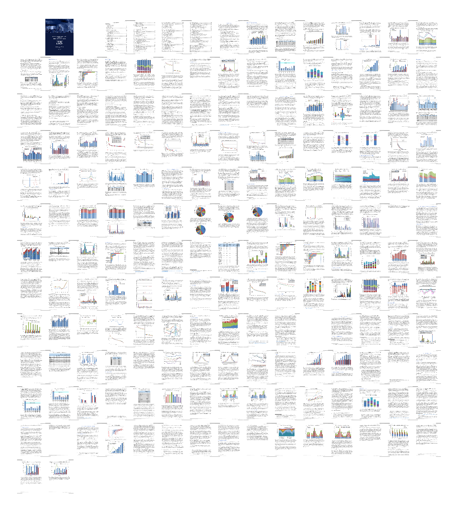
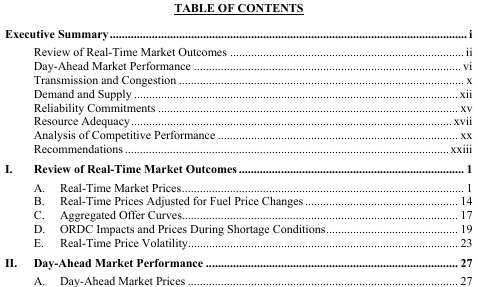
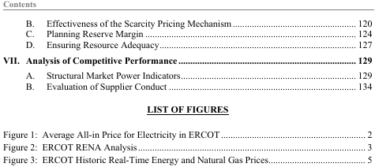
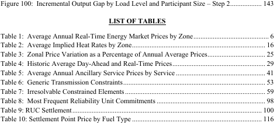
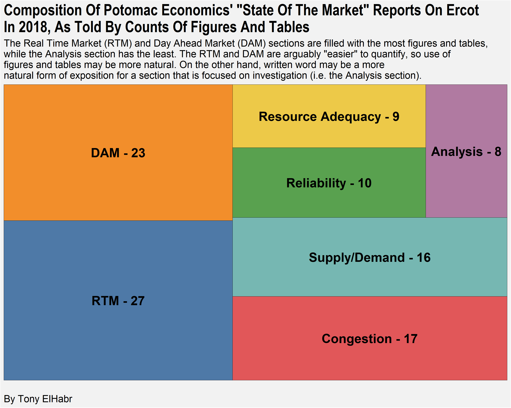
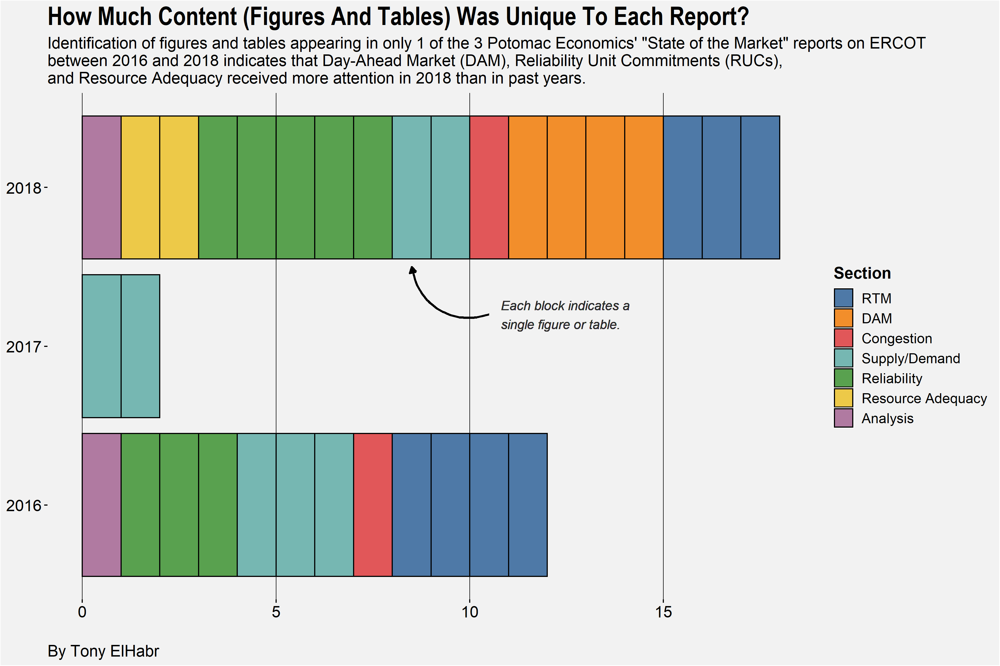
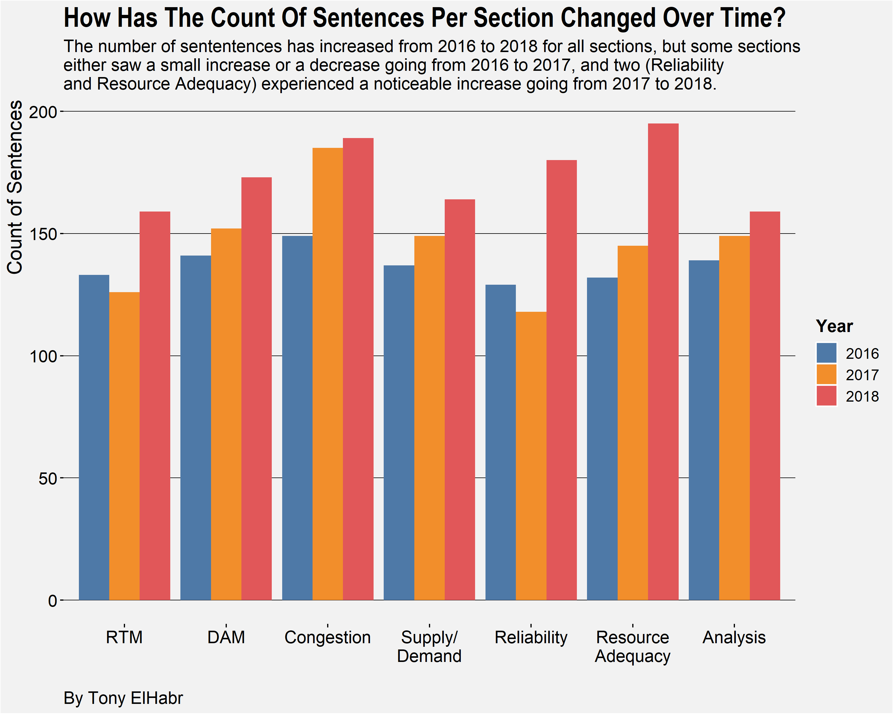
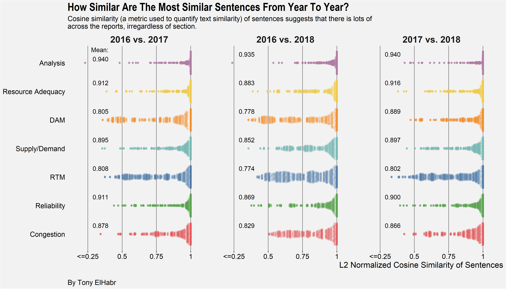

## Some Context

Those of you non-academia folk who work in industry (like me)
are probably conscious of any/all periodic reports that an independent entity
publishes for your company's industry. For example, in the insurance industry in
the United States, the
[Federal Insurance Office of the U.S. Department of the Treasury](https://home.treasury.gov/policy-issues/financial-markets-financial-institutions-and-fiscal-service/federal-insurance-office)
publishes [several reports on an annual
basis](https://www.treasury.gov/initiatives/fio/reports-and-notices/Pages/default.aspx)
discussing the industry at large, like this past year's
[***Annual Report on the Insurance Industry***](https://www.treasury.gov/initiatives/fio/reports-and-notices/Documents/2018_FIO_Annual_Report.pdf).
(Admittedly, these kinds of reports are not always the most interesting things
to read 😛, but they are (usually) very
informative.)

The same goes for the electricity grid and markets operated by the
[Electric Reliability Council of Texas (ERCOT)](http://www.ercot.com/) in Texas (which
just so happens to be particularly relevant to me).
[Potomac Economics](https://www.potomaceconomics.com/) publishes an annual report
["providing an independent assessment of the competitive performance and operational efficiency of the market"](https://www.potomaceconomics.com/markets-monitored/ercot/) operated by
ERCOT. This report tends to be pretty long---over 160 pages
in every reports since 2016. A relatively large amount of
the content is replication of language, figures, and tables from the prior
years' report, substituting and updating numbers from the past year. [^1] As
an annual reader of said report, I wish it were easier to "parse out" the most
important things from a given year's report. [^2]

[^1]: This is not a knock on the report whatsoever---annual reports will inevitably have redundancy like this! In fact, I really do enjoy the report. The explanations of the various (and sometimes complex) aspects of the electric reliability and market operation are fantastic.

[^2]: The executive summary section at the beginning of each report actually does a very good job of this already, but I was curious if we could identify "highlights" from a given year in a more quantitative/rigorous manner.

With that in mind, I thought I would take a shot at using text analysis to
compare Potomac Economics' annual reports on ERCOT for three years---2016, 2017,
and 2018---to, among other things,
identify the most "unique" things in each report. This kind of
analysis can enhance one's understanding of
current grid and market trends, as well as make one aware of
things to look out for in the future.

## A Brief Outline of the "Process"

While I initially planned on doing some kind of code tutorial with this project
(primarily to demonstrate techniques for parsing and cleaning PDF text with `R`),
I found that the code became more complex than I would have liked [^3].
(Let's just say that [regular expressions](https://en.wikipedia.org/wiki/Regular_expression)
were my best friend 😢.)
Instead, I decided to focus this post the visuals I created,
providing some brief commentary where needed.

[^3]: Not to say that it is extremely complex, but it's not exactly trivial.

Nonetheless, I think a high-level description of my "process" may be
useful to the reader, as I think it is probably generalizable to any project of
this likeness (i.e. text analysis of similarly structured documents).
(For those who are
interested in the code, it can all be found in
[this GitHub repo](https://github.com/tonyelhabr/state-of-the-market).)
My approach (using `R`, of course 😛) can be simplified to the following set of steps.

1.  Download the reports to a local directory and create a data frame with the year and file location of the report.

2.  Import the raw text for each report to create a singular data frame with nested data frames storing the text for each year's report.

3.  "Unnest" the singular data frame to create a "long" data frame where each row represents a page in the reports.

4.  Split this long data frame (with pages as observations) into two data frames, one for the table of contents (TOC) for each report and another for the body of each report.

5.  Clean the two data frames (for TOC and body content) separately.

6.  Create "child" data frames as needed for analysis, and make plots for key insights from this analysis.

From this breakdown of the steps, it is evident that the effort 
that goes into the data pre-processing (i.e. steps 1
through 5) makes up most of the work! 
What most people perceive to be "data analysis" is all in step 6.
In this case, the saying about
["80% of data science is really data cleaning"](https://www.infoworld.com/article/3228245/the-80-20-data-science-dilemma.html)
could not be any truer.

## The Analysis

So, what exactly does this report look like? Well, you could always open up one
of the reports yourself and peruse the 160+ pages [^4], but maybe the
following screenshot of the 2018 report can provide some visual context. (If
for nothing else, I thought this would be fun to look at.) I borrowed some code
that data visualization phenom [Nathan Yau](https://flowingdata.com/about)
demonstrated in [a short write-up](https://flowingdata.com/2019/04/18/redacted/)
at his awesome website [FlowingData](https://flowingdata.com/).

[^4]: The 2016 report has 160 pages total, and the 2017 and 2018 reports are even longer, so we can say 160 pages is a lower bound for our purposes. These totals include the title page, blank pages, and the table of contents, so its an overestimation of the actual content presented in the report.

You can really get an idea of the vast amount of charts and tables that make up
each one of these reports just from this one figure!

### Table of Contents (TOC)

Next, let's begin to shape out this initial holistic 
perspective of the reports with
some analysis of the table of contents (TOC). This may seem trivial, but I
assure you that it's not! With a large document like this, we really ought to
have a solid understanding of the content that the document discusses.

Each document's TOC is broken down into a couple of sections, including:

  - An outline for the executive summary (on the first page of the TOC);

  - An outline of the first- and second-level sections of the 
    body of the document (also starting on the first page of the TOC);

  - A list of figures (starting on the second page of the TOC);

  - A list of tables (on the fourth page).

Screenshots of parts of the TOC of the 2018 report are shown below.

A first question we might ask is 
"How do (counts of) the lists of figures and tables correspond to the sections of the
text?" (For the sake of readability, I've truncated some of the section labels,
e.g. "Review of Real-Time Market Outcomes" was truncated to just "RTM",
which is an abbreviation for Real-Time Market.)

So we see that the [Real-Time Market (RTM) and Day-Ahead Market (DAM)](https://www.e-education.psu.edu/ebf483/node/527)
sections seem to make a larger-than-equal share of the reports
in terms of simple counts
of figures and tables. We might hypothesize that these things are arguably the
"easiest" things to track in a graphical or quantitative manner among the
many aspects of electricity markets and grid operations.
Conversely, we see that the Analysis section (truncated from "Analysis of
Competitive Performance") leverages plots and tables the least. We might say
that this supports our hypothesis that, in a few words, may be stated as
**"easy-to-quantify topics have more figures and tables"**.
The section labels "Analysis"
(shortend from "Analysis of Competitive Performance" for visualization purposes)
suggests that its content is "deeper" in nature, and that its may not
be quite as easy to illustrate via figures and tables.

Our initial hypothesis---that easy-to-quantify topics 
have more figures and tables---seems reasonable enough, but is it just a
direct consequence of the
sections having more pages? We can plot the number of pages per section
against the count of sections to help us answer this question.

So it seems that those sections having more pages do **NOT** necessarily
have more figures and tables. So our hypothesis still seems reasonable.

You might have noticed that the first plot 
(the ["treemap"](https://datavizcatalogue.com/methods/treemap.html)) only showed data for
the 2018 report. I didn't deem it necessary/helpful to make the same plot for
each of the three reports from 2016 through 2018 because, as it turns out,
the TOC of the three reports are nearly identical in composition! (Really, this
is probably unsurprising 😛.) That is, they have
identical---or near identical---names and indexes for sections, figures, and
tables. From an analysis point of view, this is good--the structure of the three reports facilitates direct comparison.

But note that I say that the TOCs as **nearly** identical, not **exactly**
identical. What exactly are the differences between the three? More specifically,
we might be curious to know which figures and tables were only in one of the three
reports.

Aha! We see that the 2016 and 2018 reports had more than a handful of
figures and tables that were unique to those reports. The table below lists exactly
which figures and tables those are.

| Year|Section           |Type   |Label                                                             |
|----:|:-----------------|:------|:-----------------------------------------------------------------|
| 2016|RTM               |figure |implied heat rate duration curve – top 2 percent of hours         |
| 2016|RTM               |figure |aggregated peak hour generation offer stack                       |
| 2016|RTM               |figure |load, reserves and prices in august                               |
| 2016|Supply/Demand     |figure |load duration curve – top five percent of hours                   |
| 2016|Supply/Demand     |figure |historic coal generation and capacity factor                      |
| 2016|Supply/Demand     |figure |top and bottom ten percent of net load                            |
| 2016|Reliability       |figure |frequency of reliability unit commitments                         |
| 2016|Reliability       |figure |average on-line summer reserves                                   |
| 2016|Reliability       |figure |potential for combined cycle capacity available to ruc in houston |
| 2016|Analysis          |figure |surplus capacity                                                  |
| 2016|RTM               |table  |15-minute price changes as a percentage of annual average prices  |
| 2016|Congestion        |table  |irresolvable elements                                             |
| 2017|Supply/Demand     |figure |load duration curve – top five percent of hours with highest load |
| 2017|Supply/Demand     |figure |energy transacted across dc ties in august                        |
| 2018|RTM               |figure |ercot rena analysis                                               |
| 2018|RTM               |figure |average real-time energy price spikes                             |
| 2018|RTM               |figure |monthly load exposure                                             |
| 2018|DAM               |figure |daily collateral                                                  |
| 2018|DAM               |figure |average costs of procured sasm ancillary services                 |
| 2018|DAM               |figure |ercot-wide net ancillary service shortages                        |
| 2018|DAM               |figure |qse-portfolio net ancillary service shortages                     |
| 2018|Congestion        |figure |[year] crr auction revenue                                        |
| 2018|Supply/Demand     |figure |load duration curve – top 5% of hours with highest load           |
| 2018|Supply/Demand     |figure |annual energy transacted across dc ties                           |
| 2018|Reliability       |figure |capacity commitment timing – july and august hour ending 17       |
| 2018|Reliability       |figure |real-time to cop comparisons for renewable capacity               |
| 2018|Reliability       |figure |real-time to cop comparisons for thermal capacity                 |
| 2018|Reliability       |figure |standard deviations of real-time to cop capacity differences      |
| 2018|Resource Adequacy |figure |west zone net revenues                                            |
| 2018|Resource Adequacy |figure |net revenues by generation resource type                          |
| 2018|Analysis          |figure |derating, planned outages and forced outages                      |
| 2018|Reliability       |table  |ruc settlement                                                    |

Ok, enough about the TOC. Let's see what kind of things we can learn about the
text.

### Sentences

We saw that some sections have many more figures and tables than others and that
this does not necessarily correlate with the number of pages in the section. Is
there some kind of correlation with the number of sentences of text in each
section?

It may (or may not) be surprising to find a lack of a relationship here. Given
our previous finding that the number of figures and tables and the number of pages
in a given section are not really related. [^5]

[^5]: A similar plot could have been made for the counts of figures and tables, but, as I hinted at before, doing so was would have been trivial since those totals weren't much different across the three reports. (That's why it was more interesting to look at the differences in the figures and tables included in the reports.)

Next, I think it is interesting to look at how the counts of sentences
per section has changed over time.

The first thing we might notice from the plot is that the
number of sentences has increased across all sections from their totals in 2016.
Ok, so maybe that's not so interesting---I think it's reasonable to assume that
an annual report like this incrementally adds on its "foundation"
from the prior year(s).

Perhaps the most interesting that we might observe from this graph
is the "leaps" in the sentence
counts from 2017 to 2018 for the Reliability and Resource Adequacy sections. One
might draw a connection between this and what we observed earlier when looking
at the figures and tables that were unique to a single report. There were more than
a handful of observations for Resource Adequacy and Reliability (2 and 5
respectively) exclusive to the 2018 report.

A final takeaway that I have from this chart is the "evenness" of
the counts across the sections (which wasn't quite as obvious in the previous
plot depicting sentence counts). The 
difference between the maximum and the minimum number of sentences per
section in a given year is always below 50. Personally, I might have expected
greater variation. Either way, it doesn't really say anything about the
"goodness" of the content; this is just something---the count of sentences in
a section of a long document---for which I don't really have a strong prior
knowledge. [^6]

[^6]: That's the cool thing about plotting this kind of data---you gain an understanding of something that you wouldn't have known otherwise, which often invites further questions and insight. This is true of data visualization in general

Ok, so the prior plot wasn't so complex, so let's now
look at something more complicated and which deserves some explanation.

One of the things that I really wanted to investigate when I started
this analysis was "text similarity"---just how much of each report
is "boiler-plate, copy-paste" text?
There are lots of ways of going about quantifying this. (Just do an Internet search
for [Natural Language Processing (NLP)](https://www.google.com/search?q=natural+language+processing)
and  [word embeddings](https://www.google.com/search?q=word+embeddings) and
see what kind of rabbit hole that takes you down.)
I decided to use [cosine similarity](https://blog.exploratory.io/demystifying-text-analytics-finding-similar-documents-with-cosine-similarity-e7b9e5b8e515) [^7] of
sentences. [^8]

[^7]: also employing normalization and penalization

[^8]: I might have instead tried using [Jaccard Similarity](https://en.wikipedia.org/wiki/Jaccard_index),  [word mover's distance](http://www.cs.cornell.edu/~kilian/papers/wmd_metric.pdf),  or one of the several others described eloquently in [this blog post](https://medium.com/@adriensieg/text-similarities-da019229c894); and, furthermore, I could have used other forms of text tokens, such as words (more granular) or paragraphs (less granular).

To provide a kind of "baseline" expectation of what these cosine similarity
values might be, see the table below. It provides a handful of
simple examples of the cosine similarity for singular strings of characters. [^9]

[^9]: These calculations employ the [`{tidystringdist}` package](https://github.com/ColinFay/tidystringdist), written by the one-and-only [Colin Fay](https://colinfay.me/).

| Case|Description                                                                                |String 1 |String 2 |Cosine Similarity |
|----:|:------------------------------------------------------------------------------------------|:--------|:--------|:-----------------|
|    1|Identical strings.                                                                         |abcde    |abcde    |1.00              |
|    2|One different character ("z" in String 2 instead of "a").                                |abcde    |zbcde    |0.80              |
|    3|Two different characters  ("z" and "y" in String 2 instead of "a" and "b").              |abcde    |zycde    |0.60              |
|    4|All different characters.                                                                  |abcde    |fghij    |0.00              |
|    5|Different ordering of characters, but identical characters.                                |abcde    |baecd    |1.00              |
|    6|Repeated characters ("a" in String 2), one-character difference in string lengths.       |abcde    |aabcde   |0.95              |
|    7|Repeated characters ("a" twice in String 2), two-character difference in string lengths. |abcde    |aaabcde  |0.87              |
|    8|Same characters, one additional character ("z" in String 2) in one string.               |abcde    |abcdef   |0.91              |
|    9|Same characters, one additional character ("e" in String 1) in one string.               |abcde    |abcd     |0.89              |

Cases 2 and 3 in the table above are probably the most illustrative of the cosine
similarity calculation. In case 2, a one-character difference in two
strings having five characters total results in a value of 0.8. 
(i.e. Four of five characters matched.)
In case 3, a two-character difference (given the same setup) results
in a value of 0.6. (i.e. Three of five characters matched.)

Note that the cosine similarity calculation is identical for different types
of text tokens (i.e. sentences, paragraphs, etc.).
In general, the calculated values are likely to be smaller for longer tokens.

Ok, so given the above examples and explanation,
we now have some context for understanding
(and appreciating) the high degree of sentence
similarity demonstrated across the reports, as illustrated
in the figure below.

If you have read the reports, you'll realize that there are lots of
"repeated" sentences across the documents.
For example, take the description of the first figure in 2018:
<i>"Figure 1 summarizes changes in energy prices and other market costs by showing
the all-in price of electricity, which is a measure of the total cost of serving
load in ERCOT for 2016 through 2018."</i> The "same" sentence in the 2017 report is
<i>"Figure 1 summarizes changes in energy prices and other market costs by showing
the all-in price of electricity, which is a measure of the total cost of serving
load in ERCOT for 2015 through 2017."</i> Just by inspection, you can tell
that these two sentences would have a cosine similarity almost equal to 1.
In fact, I did some extra text-processing---most notably, replacing
year and months with generic labels, e.g. "[year]" and "[month]"---that
would make these two sentences
appear exactly identical (and, consequently, have a cosine similarity of exactly 1).
This whole effort to quantify of sentence similarity was probably the most interesting
thing to me out of this entire analysis! [^10]

[^10]: If nothing else, this part of the analysis was a great opportunity to experiment with the wonderful [`{text2vec}` package](http://text2vec.org/).

I think that's enough about sentences. Let's next explore what we might
learn from just the words.

### Words

One of the best ways to gauge "importance" of words (or any kind of text token)
across multiple documents is 
[term-frequency, inverse-document-frequency](https://en.wikipedia.org/wiki/Tf%E2%80%93idf) (TF-IDF). [^11]

[^11]: If you're looking to do text analysis using `R`, then I highly recommend reading through the wonderful [Tidy Text Mining with R book](https://www.tidytextmining.com/) by [David Robinson](http://varianceexplained.org/) and [Julia Silge](https://juliasilge.com/)

First, let's use TFIDF to identify which sections have the most "unique" words
(aggregating across the three reports).

So we see that the Analysis section appears to be the most unique
from this perspective. This deduction can be interpreted as an
extension of the hypothesis
developed earlier---that easy-to-quantify topics have more figures and tables. The extension of this notion
can be stated explicitly as **"easy-to-quantify topics" have less unique words**.

What exactly are some of the words that were identified as the most unique?

The ["chatter" plot](https://towardsdatascience.com/rip-wordclouds-long-live-chatterplots-e76a76896098) [^12] above depicts the most unique words
identified by TFIDF (after applying common text processing techniques such as
["stemming"](https://en.wikipedia.org/wiki/Stemming) and dropping
["stop words"](https://en.wikipedia.org/wiki/Stop_words)).
Several of the words shown happen to be words associated with
sources of high [electric transmission congestion](https://www.e-education.psu.edu/ebf483/node/671) [^13] in the Texas grid during the year for the which the report was made.
This set of words could be potentially leveraged as a
starting point for an ambitious reader who is curious
to learn more about the Texas electricity grid. 

[^12]: which, in my opinion, is a better format for illustrating word importance compared to a word cloud

[^13]: This concept is analogous to traffic congestion, but for electricity.

## The End

I had a really fun time exploring this topic. I encourage any readers to
do something similar with periodic or standardized reports that are
relevant to you in some way. If they are boring to you (yet you must read
them for whatever reason), then a text analysis like that demonstrated here
can really spark some life into your consumption of the report!

