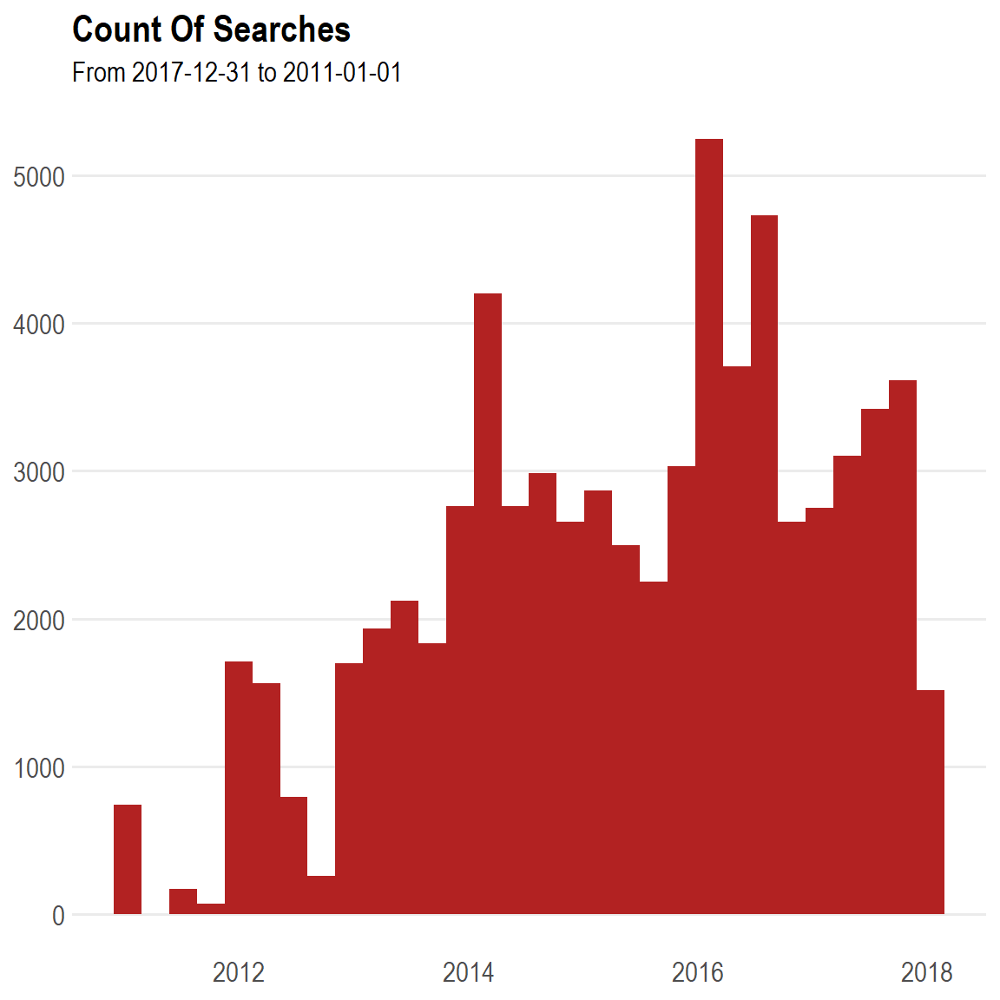
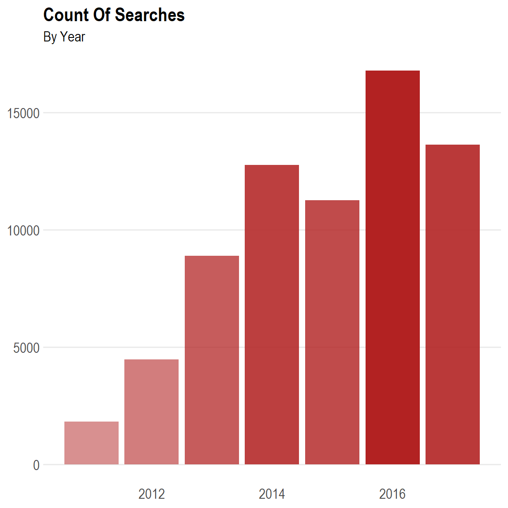
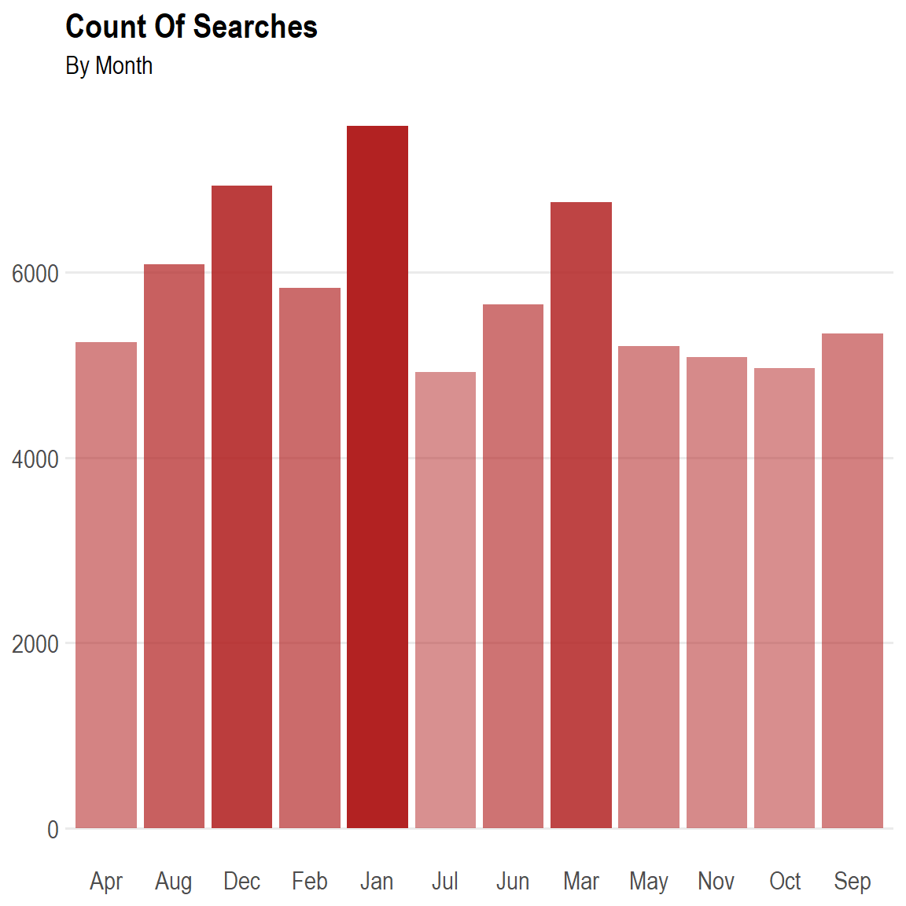
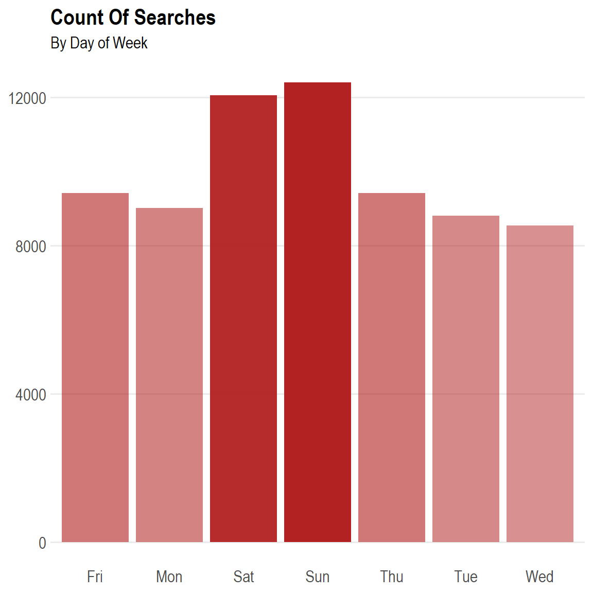
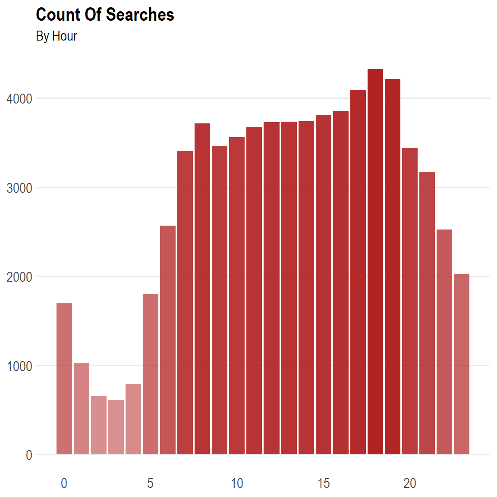
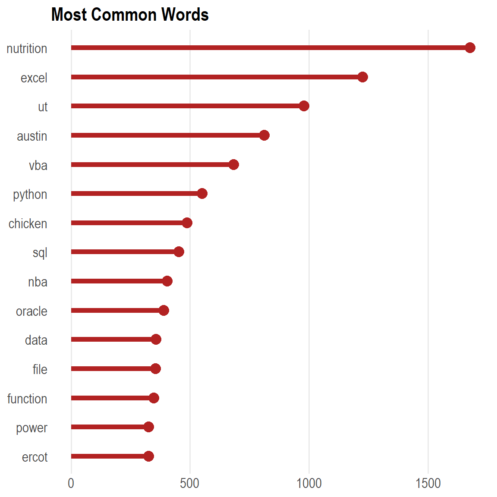
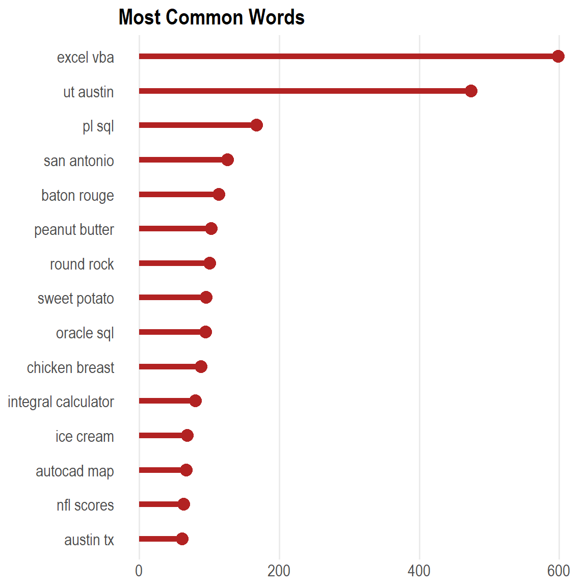
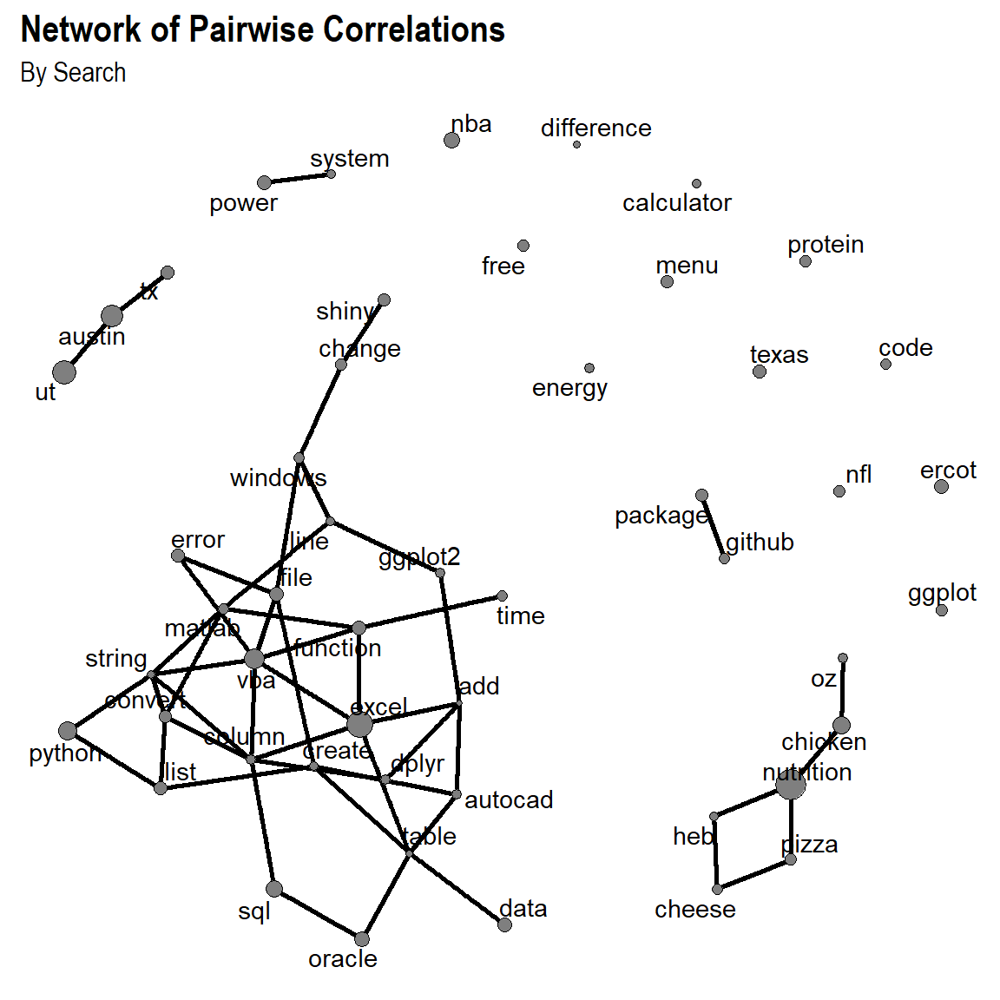
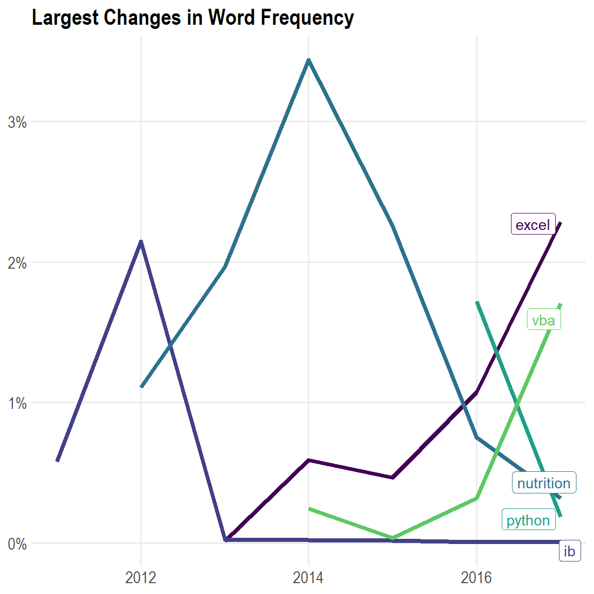
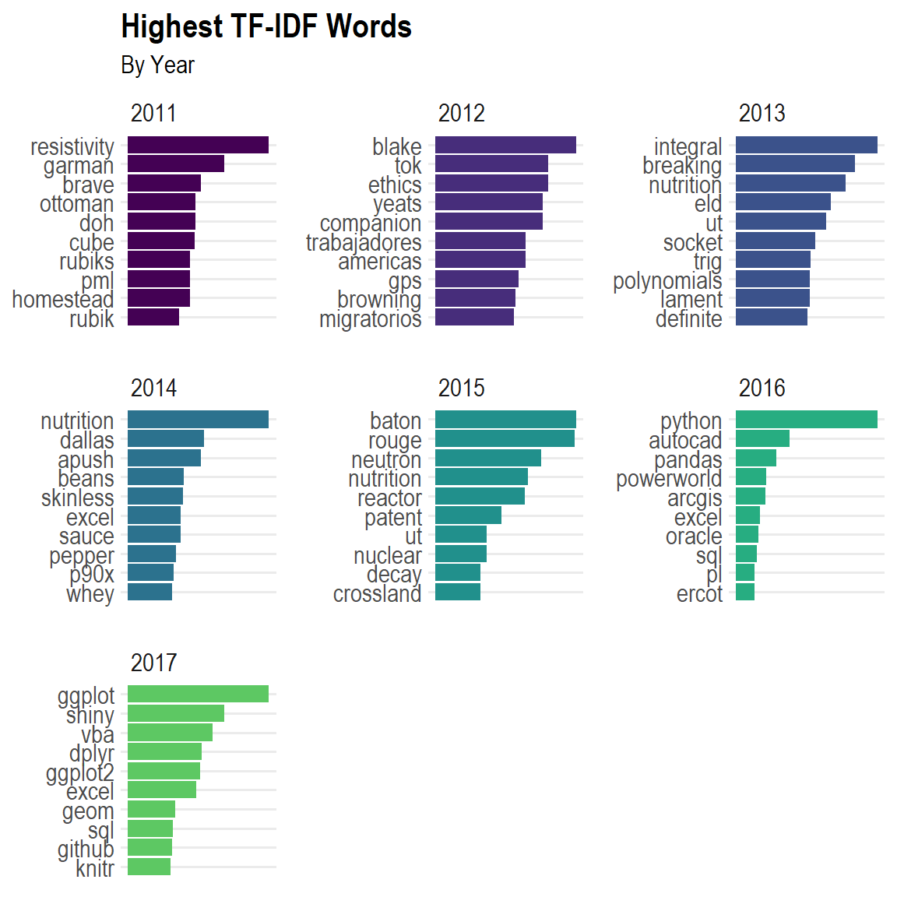

While brainstorming about cool ways to practice text mining with R I
came up with the idea of exploring my own Google search history. Then,
after googling (ironically) if anyone had done something like this, I
stumbled upon [Lisa Charlotte’s blog
post](https://lisacharlotterost.github.io/2015/06/20/Searching-through-the-years/).
Lisa’s post (actually, a series of posts) are from a while back, so her
instructions for how to download your personal Google history and the
format of the downloads (nowadays, it’s in a .html file instead of a
series of .json files) are no longer applicable.

I googled a bit more and found a recent [RPubs write-up by Stephanie
Lancz](https://rstudio-pubs-static.s3.amazonaws.com/355045_90b7464be9b4437393670340ad67c310.html#)
that not only included concise instructions on how/where to get personal
Google data, but also how to clean it with `R`! With the hard work of
figuring out how to set up the data provided for me, I was excited to
find out what I could do.

In this write-up (which can be downloaded from GitHub and re-used for
one’s own analysis), I explore different techniques for visualizing and
understanding my data. I do my best to implement methods that are
generic and could be applied to any kind of similar analysis,
irregardless of the topic. Much of my code is guided by the work of
others, especially that of David Robinson and Julia Silge, who have
written an amazingly helpful book on text analysis– [*Tidy Text Mining
with R* book](https://www.tidytextmining.com/), I provide references for
my inspiration where appropriate.


Setup
-----

First, following “best practices”, I import all of the packages that
I’ll be using.

``` {.r}
library("dplyr")
library("stringr")
library("xml2")
library("rvest")
library("lubridate")
library("viridis")
library("ggplot2")
library("tidytext")
library("tidyr")
library("ggalt")
library("widyr")
library("drlib")
library("igraph")
library("ggraph")
# library("topicmodels")
# devtools::install_github("tonyelhabr/temisc")
library("teplot") # Personal package.
```

Next, I create a `config` list in order to emulate what one might do
with a parameterized RMarkdown report (where the `config` would be a
part of the yaml header.

``` {.r}
config <-
  list(
    path = file.path("data-raw", "Tony-My Activity-Search-MyActivity.html"),
    name_main = "Tony",
    color_main = "firebrick"
  )
```

I’ll also go ahead and create a couple of functions for coloring some of
the plots that I’ll create. These can be customized to one’s personal
preferences.

``` {.r}
scale_color_func <- function() {
  viridis::scale_color_viridis(
    option = "D",
    discrete = TRUE,
    begin = 0,
    end = 0.75
  ) 
}

scale_fill_func <- function() {
  viridis::scale_fill_viridis(
    option = "D",
    discrete = TRUE,
    begin = 0,
    end = 0.75
  ) 
}
```


### Import and Clean

Then, on to the “dirty” work of importing and cleaning the data. I don’t
deviate much from [Stephanie Lancz’s
methods](https://rstudio-pubs-static.s3.amazonaws.com/355045_90b7464be9b4437393670340ad67c310.html#)
for extracting data elements from the .html file

``` {.r}
# Reference:
# + https://rstudio-pubs-static.s3.amazonaws.com/355045_90b7464be9b4437393670340ad67c310.html#

doc_html <- config$path
search_archive <- xml2::read_html(doc_html)

# Extract search time.
date_search <-
  search_archive %>%
  html_nodes(xpath = '//div[@class="mdl-grid"]/div/div') %>%
  str_extract(pattern = "(?<=<br>)(.*)(?<=PM|AM)") %>%
  mdy_hms()

# Extract search text.
text_search <-
  search_archive %>%
  html_nodes(xpath = '//div[@class="mdl-grid"]/div/div') %>%
  str_extract(pattern = '(?<=<a)(.*)(?=</a>)') %>%
  str_extract(pattern = '(?<=\">)(.*)')

# Extract search type.
type_search <-
  search_archive %>% 
  html_nodes(xpath = '//div[@class="mdl-grid"]/div/div') %>% 
  str_extract(pattern = "(?<=mdl-typography--body-1\">)(.*)(?=<a)") %>% 
  str_extract(pattern = "(\\w+)(?=\\s)")

# Differences from reference:
# + Using `lubridate::wday()` instead of calling `weekdays()` and coercing to factors.
# + Using `yyyy`, `mm`, `wd`, and `hh` instead of `year`, `month`, `wday`, and `hour`.
# + Convert `yyyy` to an integer (from a double).
# + Adding a `time` column to use for a later visualization.
# + Adding a `name` column to make this code more "parametric".
data <-
  tibble(
    name = config$name_main,
    timestamp = date_search,
    date = lubridate::as_date(date_search),
    yyyy = lubridate::year(date_search) %>% as.integer(),
    mm = lubridate::month(date_search, label = TRUE),
    wd = lubridate::wday(date_search, label = TRUE),
    hh = lubridate::hour(date_search),
    time = lubridate::hour(timestamp) + (lubridate::minute(timestamp) / 60),
    type = type_search,
    text = text_search
  )
```

Notably, there are some rows that did not get parsed correctly. I decide
to exclude them from the rest of the analysis. Also, my first searches
come at the end of 2010, and my most recent ones (i.e. the ones just
before I downloaded my data) come in the first month or so of 2018. To
make the aspect of my analysis that deal with years a bit “cleaner”,
I’ll truncate these ends so that my data spans the years 2011 through
2017.

``` {.r}
data %>% count(yyyy, sort = TRUE)
data <- data %>% filter(!is.na(yyyy))
data <- data %>% filter(!(yyyy %in% c(2010, 2018)))
```


Analysis
--------


### Search Count Distributions

Next, it’s time to start doing some basic exploratory data analysis
(EDA). Given the temporal nature of the data, an easy EDA approach to
implement is visualization across different time periods. To save some
effort (or, as I like to see it, make my code more efficient), we can
create a helper function. (Notably, the `geom` to use is a parameter to
this function. Through experimentation, I found that
`ggplot2::geom_bar()` seems to work best with most temporal periods,
with the exception of plotting `Date` variables, where
`ggplot2::geom_hist()` seems more appropriate.)

``` {.r}
# Reference: 
# + https://juliasilge.com/blog/ten-thousand-data-ext/.
visualize_time <-
  function(data,
           colname_x,
           geom = c("bar", "hist"),
           color = "grey50",
           lab_subtitle = NULL) {

    geom <- match.arg(geom)
    viz_labs <-
      labs(
        x = NULL,
        y = NULL,
        title = "Count Of Searches",
        subtitle = lab_subtitle
      )
    viz_theme <-
      teplot::theme_te() +
      theme(panel.grid.major.x = element_blank()) +
      theme(legend.position = "none")

    viz <- ggplot(data, aes_string(x = colname_x)) 
    if (geom == "bar") {
      viz <-
        viz +
        geom_bar(aes(y = ..count.., alpha = ..count..), fill = color) +
        scale_alpha(range = c(0.5, 1))
    } else if (geom == "hist") {
      viz <-
        viz +
        geom_histogram(aes(y = ..count..), fill = color, bins = 30)
    }

    viz <-
      viz +
      viz_labs +
      viz_theme
    viz
  }
```

Using this function is fairly straightforward. For example, to visualize
the count of searches by year, it can be invoked in the following
manner.

``` {.r}
viz_time_yyyy <-
  visualize_time(
    data = data,
    colname_x = "yyyy",
    geom = "bar",
    color = config$color_main,
    lab_subtitle = "By Year"
  )
```

The same pattern can be repeated for `timestamp`, `yyyy`, `mm`, `wd`,
and `hh`.







I can make a couple of interesting observations about my data.

-   It’s evident that I’ve googled stuff more and more frequently over
    the years.
-   It seems like my most active months correspond with typical American
    high school/college breaks–winter break occurs during
    December/January, spring break occurs in March, and the end of
    summer break occurs in August.
-   My relatively high activity on Saturdays and Sundays (compared to
    the rest of the days of the week) indicate that I like to spend my
    “breaks” of weekly school/work on the Internet.
-   Regarding my hour-to-hour activity, mine seems relatively even
    throughout the day. I think if you compared my by-hour activity to
    others, mine would stand out as abnormally consistent.


### Word Frequencies

Now we’ll “tokenize” the search text into n-grams. We’ll parse each
search query into unigrams and bigrams.

``` {.r}
# Reference (for regular expression):
# + https://rstudio-pubs-static.s3.amazonaws.com/355045_90b7464be9b4437393670340ad67c310.html#
rgx_patt <- '(http|https)\\S+\\s*|(#|@)\\S+\\s*|\\n|\\"|(.*.)\\.com(.*.)\\S+\\s|[^[:alnum:]]'
rgx_repl <- " "
rgx_custom_ignore <- "google|search"

# References:
# + https://www.tidytextmining.com/
# + https://www.tidytextmining.com/ngrams.html
# + https://www.tidytextmining.com/twitter.html
stop_words <- tidytext::stop_words
unigrams <-
  data %>%
  mutate(text = str_replace_all(text, rgx_patt, rgx_repl)) %>% 
  tidytext::unnest_tokens(word, text) %>% 
  anti_join(stop_words, by = "word") %>% 
  filter(!str_detect(word, rgx_custom_ignore)) %>% 
  filter(str_detect(word, "[a-z]"))
unigrams %>% select(word) %>% count(word, sort = TRUE)
```

    ## # A tibble: 15,299 x 2
    ##    word          n
    ##    <chr>     <int>
    ##  1 nutrition  1677
    ##  2 excel      1224
    ##  3 ut          979
    ##  4 austin      811
    ##  5 vba         683
    ##  6 python      551
    ##  7 chicken     486
    ##  8 sql         453
    ##  9 nba         404
    ## 10 oracle      389
    ## # ... with 1.529e+04 more rows

``` {.r}
# References:
# + https://www.tidytextmining.com/
# + https://www.tidytextmining.com/ngrams.html
bigrams <-
  data %>%
  mutate(text = str_replace_all(text, rgx_patt, rgx_repl)) %>% 
  tidytext::unnest_tokens(word, text, token = "ngrams", n = 2) %>% 
  tidyr::separate(word, into = c("word1", "word2"), sep = " ", remove = FALSE) %>% 
  anti_join(stop_words, by = c("word1" = "word")) %>% 
  anti_join(stop_words, by = c("word2" = "word")) %>% 
  filter(!str_detect(word1, rgx_custom_ignore)) %>% 
  filter(!str_detect(word2, rgx_custom_ignore)) %>% 
  filter(str_detect(word1, "[a-z]")) %>% 
  filter(str_detect(word2, "[a-z]"))
bigrams %>% select(word) %>% count(word, sort = TRUE)
```

    ## # A tibble: 33,404 x 2
    ##    word               n
    ##    <chr>          <int>
    ##  1 excel vba        598
    ##  2 ut austin        474
    ##  3 pl sql           167
    ##  4 san antonio      126
    ##  5 baton rouge      113
    ##  6 peanut butter    102
    ##  7 round rock       100
    ##  8 sweet potato      95
    ##  9 oracle sql        94
    ## 10 chicken breast    88
    ## # ... with 3.339e+04 more rows

With the data parsed into tokens, we can visualize counts of individual
n-grams.

``` {.r}
# Reference:
# + https://github.com/dgrtwo/dgrtwo.github.com/blob/master/_R/2016-08-09-trump-data.Rmd.
visualize_cnts <- function(data, color = "grey50", num_top = 20) {
  data %>% 
    count(word, sort = TRUE) %>%
    filter(row_number(desc(n)) <= num_top) %>%
    mutate(word = reorder(word, n)) %>% 
    ggplot(aes(x = word, y = n)) +
    ggalt::geom_lollipop(size = 2, point.size = 4, color = color) +
    coord_flip() +
    teplot::theme_te() +
    labs(x = NULL, y = NULL) +
    labs(title = "Most Common Words") +
    theme(legend.position = "none") +
    theme(panel.grid.major.y = element_blank())
}

num_top_cnt <- 15
viz_unigram_cnts <-
  visualize_cnts(
    data = unigrams,
    color = config$color_main,
    num_top = num_top_cnt
  )
viz_unigram_cnts
```



``` {.r}
viz_bigram_cnts <-
  visualize_cnts(
    data = bigrams,
    color = config$color_main,
    num_top = num_top_cnt
  )
viz_bigram_cnts
```



These count totals reflect my personal interests relatively well. In
particular, words like `nutrition` and `chicken breast`, `excel vba` and
`python`, and `nba` and `nfl scores` highlight my interest in in
food/nutrition, software and data analysis, and sports. Additionally,
the places I’ve lived re apparent from my searches– `ut austin` reflects
my undergraduate studies at the [University of Texas at
Austin](https://www.utexas.edu), `baton rouge` alludes to my internship
with [ExxonMobil](https://corporate.exxonmobil.com/) in Baton Rouge in the
summer of 2015, `round rock` hints to my current residence in Round
Rock, Texas.


#### Word Clouds

Another method of visualizing counts is with a word cloud. Normally, I’m
staunchly opposed to word clouds; however, when used to initialize a
mental model of the data, they’re not so bad. I write a basic function
so I can use it twice.

``` {.r}
visualize_cnts_wordcloud <-
  function(data, color, num_top = 25) {
    data_proc <- data %>% count(word, sort = TRUE)
    wordcloud::wordcloud(
      word = data_proc$word,
      freq = data_proc$n,
      random.order = FALSE,
      colors = color,
      max.words = num_top
    )
  }
get_rpal_byname <- function(name) {
  paste0(name, c("", as.character(seq(1, 4, 1))))
}

colors_wordcloud <- get_rpal_byname(config$color_main)
num_top_cnt_wordcloud <- 25
viz_unigram_cnts_wordcloud <-
  visualize_cnts_wordcloud(
    data = unigrams,
    color = colors_wordcloud,
    num_top = num_top_cnt_wordcloud
  )
```

    ## NULL

``` {.r}
viz_bigram_cnts_wordcloud <-
  visualize_cnts_wordcloud(
    data = bigrams,
    color = colors_wordcloud,
    num_top = num_top_cnt_wordcloud
  )
```

    ## NULL

These word clouds essentially show the same information as the other
frequency plots, so it’s not surprising to see the same set of words
shown. The word clouds arguably do a better job of emphasizing the words
themselves (as opposed to the raw count totals associated with each
word(s)).

``` {.r}
compute_freqs <- function(data, colname_cnt = "word") {
  colname_cnt_quo <- rlang::sym(colname_cnt)
  
  data %>% 
    group_by(!!colname_cnt_quo) %>% 
    mutate(n = n()) %>%
    # ungroup() %>% 
    # group_by(!!colname_cnt_quo) %>% 
    summarize(freq = sum(n) / n()) %>% 
    ungroup() %>% 
    arrange(desc(freq))
}

unigram_freqs <-
  compute_freqs(
    data = unigrams,
    colname_cnt = "word"
  )
unigram_freqs
```

    ## # A tibble: 15,299 x 2
    ##    word       freq
    ##    <chr>     <dbl>
    ##  1 nutrition  1677
    ##  2 excel      1224
    ##  3 ut          979
    ##  4 austin      811
    ##  5 vba         683
    ##  6 python      551
    ##  7 chicken     486
    ##  8 sql         453
    ##  9 nba         404
    ## 10 oracle      389
    ## # ... with 1.529e+04 more rows

``` {.r}
bigram_freqs <-
  compute_freqs(
    data = bigrams,
    colname_cnt = "word"
  )
bigram_freqs
```

    ## # A tibble: 33,404 x 2
    ##    word            freq
    ##    <chr>          <dbl>
    ##  1 excel vba        598
    ##  2 ut austin        474
    ##  3 pl sql           167
    ##  4 san antonio      126
    ##  5 baton rouge      113
    ##  6 peanut butter    102
    ##  7 round rock       100
    ##  8 sweet potato      95
    ##  9 oracle sql        94
    ## 10 chicken breast    88
    ## # ... with 3.339e+04 more rows


### Word Correlations

Let’s add a layer of complexity to our analysis. We can look at
correlations among individual words in each search. We’ll create a
fairly robust function here because we’ll need to perform the same
actions twice–once to view the computed values, and another time to put
the data in the proper format for a network visualization. (We need both
the counts and the correlations of each word pair to create node-edge
pairs.)

``` {.r}
# Reference:
# + https://www.tidytextmining.com/ngrams.html
# + http://varianceexplained.org/r/seven-fav-packages/.
compute_corrs <-
  function(data = NULL,
           colname_word = NULL,
           colname_feature = NULL,
           num_top_ngrams = 50,
           num_top_corrs = 50,
           return_corrs = TRUE,
           return_words = FALSE,
           return_both = FALSE) {

    colname_word_quo <- rlang::sym(colname_word)
    colname_feature_quo <- rlang::sym(colname_feature)
    
    data_cnt <-
      data %>%
      count(!!colname_word_quo, sort = TRUE)

    data_cnt_top <-
      data_cnt %>% 
      mutate(rank = row_number(desc(n))) %>% 
      filter(rank <= num_top_ngrams)
    
    data_joined <-
      data %>% 
      semi_join(data_cnt_top, by = colname_word) %>% 
      rename(
        word = !!colname_word_quo,
        feature = !!colname_feature_quo
      )
    data_corrs <-
      widyr::pairwise_cor(
        data_joined,
        word,
        feature,
        sort = TRUE,
        upper = FALSE
      )
    
    data_corrs_top <-
      data_corrs %>% 
      mutate(rank = row_number(desc(correlation))) %>% 
      filter(rank <= num_top_corrs)
    
    if(return_both | (return_words & return_corrs)) {
      out <- list(words = data_cnt_top, corrs = data_corrs_top)
    } else if (return_corrs) {
      out <- data_corrs_top
    } else if (return_words) {
      out <- data_cnt_top
    }
    out
  }

num_top_ngrams <- 50
num_top_corrs <- 50

unigram_corrs <-
  compute_corrs(
    unigrams,
    num_top_ngrams = num_top_ngrams,
    num_top_corrs = num_top_corrs,
    colname_word = "word",
    colname_feature = "timestamp"
  )
unigram_corrs
```

Not surprisingly, many of the same word pairs seen among the most
frequently used bigrams also appear here.

``` {.r}
# Reference:
# + http://varianceexplained.org/r/seven-fav-packages/.
unigram_corrs_list <-
  compute_corrs(
    unigrams,
    num_top_ngrams = num_top_ngrams,
    num_top_corrs = num_top_corrs,
    colname_word = "word",
    colname_feature = "timestamp",
    return_both = TRUE
  )

seed <- 42
set.seed(seed)
viz_corrs_network <-
  igraph::graph_from_data_frame(
    d = unigram_corrs_list$corrs, 
    vertices = unigram_corrs_list$words, 
    directed = TRUE
  ) %>% 
  ggraph::ggraph(layout = "fr") +
  ggraph::geom_edge_link(edge_width = 1) +
  ggraph::geom_node_point(aes(size = n), fill = "grey50", shape = 21) +
  ggraph::geom_node_text(ggplot2::aes_string(label = "name"), repel = TRUE) +
  teplot::theme_te() +
  theme(line = element_blank(), rect = element_blank(), axis.text = element_blank(), axis.ticks = element_blank()) +
  theme(legend.position = "none") +
  labs(x = NULL, y = NULL) +
  labs(title = "Network of Pairwise Correlations", subtitle = "By Search")
viz_corrs_network
```



It looks like the network captures most of the similar terms fairly
well. The words for food/nutrition, software, and locations are grouped.


### Word Changes Over Time

We might be interested to find out whether certain words have either
been used more or less as time has passed. Determining the highest
changes in word usage is not quite as straightforward as some of the
other components of the text analysis so far. There are various valid
approaches that could be implemented. Here, we’ll follow the approach
shown in the [Twitter chapter in the *Tidy Text Mining*
book](https://www.tidytextmining.com/twitter.html#changes-in-word-use).

First, we’ll group my word usage by year and look only at the most used
words.

``` {.r}
# Reference:
# + https://www.tidytextmining.com/twitter.html#changes-in-word-use.
timefloor <- "year"
top_pct_words <- 0.05
unigram_bytime <-
  unigrams %>%
  mutate(time_floor = floor_date(timestamp, unit = timefloor)) %>%
  group_by(time_floor, word) %>% 
  summarise(n = n()) %>% 
  ungroup() %>%
  group_by(time_floor) %>%
  mutate(time_total = sum(n)) %>%
  ungroup() %>% 
  group_by(word) %>%
  mutate(word_total = sum(n)) %>%
  ungroup() %>%
  filter(word_total >= quantile(word_total, 1 - top_pct_words)) %>% 
  arrange(desc(word_total))
unigram_bytime
```

    ## # A tibble: 1,377 x 5
    ##    time_floor          word          n time_total word_total
    ##    <dttm>              <chr>     <int>      <int>      <int>
    ##  1 2012-01-01 00:00:00 nutrition    63       5683       1677
    ##  2 2013-01-01 00:00:00 nutrition   263      13380       1677
    ##  3 2014-01-01 00:00:00 nutrition   647      18824       1677
    ##  4 2015-01-01 00:00:00 nutrition   388      17202       1677
    ##  5 2016-01-01 00:00:00 nutrition   215      28586       1677
    ##  6 2017-01-01 00:00:00 nutrition   101      31681       1677
    ##  7 2013-01-01 00:00:00 excel         2      13380       1224
    ##  8 2014-01-01 00:00:00 excel       111      18824       1224
    ##  9 2015-01-01 00:00:00 excel        80      17202       1224
    ## 10 2016-01-01 00:00:00 excel       307      28586       1224
    ## # ... with 1,367 more rows

Next, we’ll create logistic models for each word-year pair. These models
attempt essentially answer the question “How likely is it that a given
word appears in a given year?”

``` {.r}
unigram_bytime_models <- 
  unigram_bytime %>% 
  tidyr::nest(-word) %>% 
  mutate(
    models =
      purrr::map(data, ~ glm(cbind(n, time_total) ~ time_floor, ., family = "binomial"))
  )

unigram_bytime_models_slopes <-
  unigram_bytime_models %>%
  tidyr::unnest(purrr::map(models, broom::tidy)) %>%
  filter(term == "time_floor") %>%
  mutate(adjusted_p_value = p.adjust(p.value))
unigram_bytime_models_slopes
```

    ## # A tibble: 255 x 7
    ##    word   term    estimate std.error statistic    p.value adjusted_p_value
    ##    <chr>  <chr>      <dbl>     <dbl>     <dbl>      <dbl>            <dbl>
    ##  1 nutri~ time_~ -1.033e-8 4.891e-10   -21.12  5.093e- 99       1.294e- 96
    ##  2 excel  time_~  2.060e-8 9.561e-10    21.54  6.326e-103       1.613e-100
    ##  3 ut     time_~ -9.729e-9 6.339e-10   -15.35  3.748e- 53       9.370e- 51
    ##  4 austin time_~ -4.307e-9 7.014e-10    -6.141 8.197e- 10       1.476e-  7
    ##  5 vba    time_~  3.471e-8 1.892e- 9    18.35  3.415e- 75       8.641e- 73
    ##  6 python time_~ -7.032e-8 4.364e- 9   -16.11  2.092e- 58       5.250e- 56
    ##  7 chick~ time_~ -1.010e-8 8.992e-10   -11.24  2.708e- 29       6.634e- 27
    ##  8 sql    time_~  3.082e-8 2.148e- 9    14.35  1.098e- 46       2.735e- 44
    ##  9 nba    time_~  1.522e-8 1.392e- 9    10.93  8.010e- 28       1.947e- 25
    ## 10 oracle time_~  2.175e-8 2.042e- 9    10.65  1.727e- 26       4.129e- 24
    ## # ... with 245 more rows

The p.values of the logistic models indicate whether or not the change
in usage of a given word over time is non-trivial. We’ll look at the
words with the smallest p.values, indicating that they have the most
significant change in usage.

``` {.r}
num_top_change <- 5
unigram_bytime_models_slopes_top <-
  unigram_bytime_models_slopes %>% 
  top_n(num_top_change, -adjusted_p_value) 

viz_unigram_change_bytime <-
  unigram_bytime %>% 
  inner_join(unigram_bytime_models_slopes_top, by = c("word")) %>%
  mutate(pct = n / time_total) %>%
  mutate(label = if_else(time_floor == max(time_floor), word, NA_character_)) %>%
  ggplot(aes(x = time_floor, y = pct, color = word)) +
  geom_line(size = 1.5) +
  ggrepel::geom_label_repel(aes(label = label), nudge_x = 1, na.rm = TRUE) +
  scale_y_continuous(labels = scales::percent_format()) +
  scale_color_func() +
  teplot::theme_te() +
  theme(legend.position = "none") +
  labs(x = NULL, y = NULL) +
  labs(title = "Largest Changes in Word Frequency")
viz_unigram_change_bytime
```



This visualization does a great job of capturing how my interests/skills
have changed over time.

-   The rise of `excel` and `vba` recently reflect how much I have had
    to develop my Excel VBA skills at work (after starting my job in
    mid-2016). (I’ve actually had to enhance other software-related
    skills, such as with those with `SQL`, `R`, and mapping software
    such as `AutoCAD`, but Excel’s `VBA` has a lot of little nuances
    that make it not so intuitive (in my opinion) and put me more in
    need of Internet help than anything else.)
-   The steep decline in `python` from 2016 to 2017 illustrates how I
    learned python early in 2016 as part of a “side-project”, but then
    stopped my learning of it in favor of other languages/technologies
    that I need/use for my job.
-   My interest in nutrition has waxed and waned over time. I think this
    is probably because I learned a lot when reading about it for a
    couple of years, but now have found myself less in need of
    researching because I know a good deal about it now.
-   The appearance of `ib` might be confusing to the reader. “IB” stands
    for [International Baccalaureate](https://www.ibo.org/) (IB) which is a high
    school program for that is similar to th [Advanced
    Placement](https://apstudent.collegeboard.org/apcourse) (AP) program
    that United States high school students are probably more familiar
    with. After participating in the IB program in high school, it is
    evident that my interest in it dropped off.


### Unique Words


#### Term-Frequency Inverse Document Frequency (TF-IDF)

Another good way of evaluating my search behavior is to look at
term-frequency inverse-document-frequency (TF-IDF). I’ll leave the
reader to read the details in the [*Tidy Text
Mining*](https://www.tidytextmining.com/tfidf.html) book, but, in a
nutshell, TF-IDF provides a good measure of the most “unique” words in a
given document compared to other documents. For this analysis, we’ll
treat the years of search history as documents.

``` {.r}
# References:
# + https://www.tidytextmining.com/tfidf.html
# + https://juliasilge.com/blog/sherlock-holmes-stm/
data_tfidf <-
  unigrams %>%
  count(yyyy, word, sort = TRUE) %>% 
  tidytext::bind_tf_idf(word, yyyy, n)

num_top_tfidf <- 10
viz_tfidf <-
  data_tfidf %>%
  group_by(yyyy) %>%
  # arrange(yyyy, desc(tf_idf)) %>%
  # slice(1:num_top_tfidf) %>%
  top_n(num_top_tfidf, tf_idf) %>% 
  ungroup() %>% 
  mutate(yyyy = factor(yyyy)) %>% 
  mutate(word = drlib::reorder_within(word, tf_idf, yyyy)) %>%
  ggplot(aes(word, tf_idf, fill = yyyy)) +
  geom_col() +
  scale_fill_func() +
  facet_wrap(~ yyyy, scales = "free") +
  drlib::scale_x_reordered() +
  coord_flip() +
  teplot::theme_te_dx() +
  theme(legend.position = "none") +
  theme(axis.text.x = element_blank()) +
  labs(x = NULL, y = NULL) +
  labs(title = "Highest TF-IDF Words", subtitle = "By Year")
viz_tfidf
```



This TF-IDF plot is probably my favorite one out of all of them. It
really highlights how my use of the Internet and personal interests have
changed over time (perhaps even better than the previous plot.

-   Up through graduating from high school in the middle of 2012, my
    search terms don’t appear correlated with anything in particular.
    This makes sense to me–at this point in my life, I mostly used
    Google for doing research for school projects.
-   From the middle of 2012 to the middle of 2016, I was in college
    studying to get a degree in Electrical Engineering. Words such as
    `integral`, `ut`, and `neutron`, reflect my education. At the same
    time, my interest in health was strongest during these years, so the
    food-related words are not surprising.
-   My more recent focus on software-related skills is evident in 2016
    and beyond. In particular, my growing passion for `R` in 2017 is
    illustrated with words such as `{ggplot}`, `{shiny}`, `{dplyr}`, and
    `{knitr}`. This is one aspect of my personal skill development that
    was not as evident in the previous plot.


Conclusion
----------

I’ll continue this analysis in a separate write-up, where I plan to
investigate how “topic modeling” can be applied to gain further insight.
Topic modeling is much more dependent on the nature of the data than the
analysis done here (which is fairly “generalizable”), so I think it
deserves distinct treatment.

Thanks again to David Robinson and Julia Silge for their great [*Tidy
Text Mining with R* book](https://www.tidytextmining.com/)! It
demonstrates simple, yet powerful, techniques that can be easily
leveraged to gain meaningful insight into nearly anything you can
imagine.

