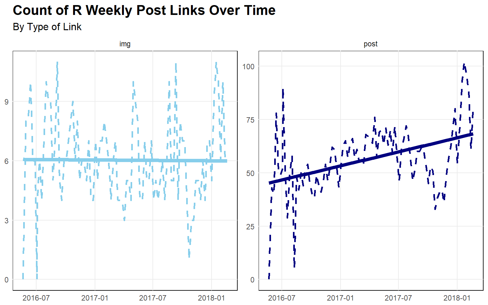
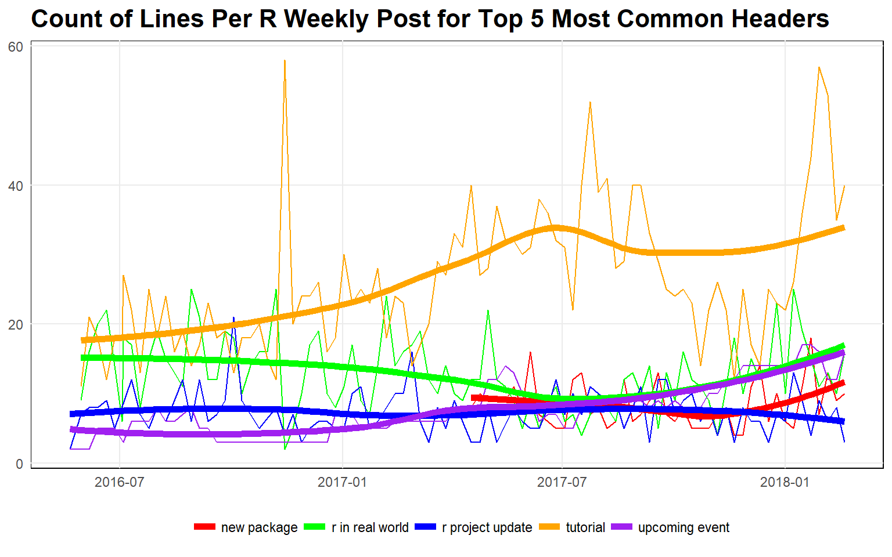
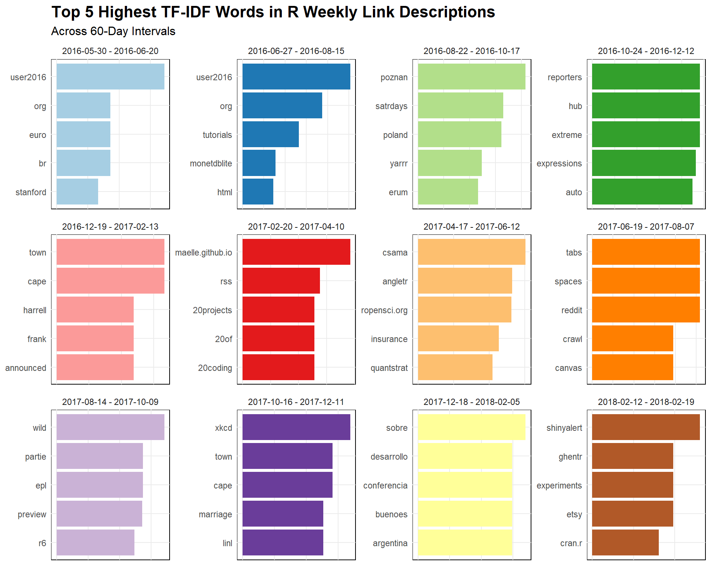

I’m always intrigued by data science “meta” analyses or
programming/data-science. For example, [Matt Dancho’s analysis of renown
data scientist David
Robinson](http://www.business-science.io/learning-r/2018/03/03/how_to_learn_R_pt1.html).
[David Robinson](http://varianceexplained.org/) himself has done some
good ones, such as [his blog posts for *Stack Overflow* highlighting the
growth of “incredible” growth of
`python`](https://stackoverflow.blog/2017/09/06/incredible-growth-python/),
and [the “impressive” growth of
`R`](https://stackoverflow.blog/2017/10/10/impressive-growth-r/) in
modern times.

With that in mind, I thought it would try to identify if any interesting
trends have risen/fallen *within* the `R` community in recent years. To
do this, I scraped and analyzed the “weekly roundup” posts put together
by [*R Weekly*](https://rweekly.org/), which was originated in May 2016.
These posts consist of links and corresponding descriptions, grouped
together by topic. It should go without saying that this content serves
as a reasonable heuristic for the interests of the `R` community at any
one point in time. (Of course, the posts of other aggregate R blogs such
as [R Bloggers](https://www.r-bloggers.com/) or [Revolution
Analytics](http://blog.revolutionanalytics.com/) might serve as better
resources since they post more frequently and have been around for quite
a bit longer than [*R Weekly*](https://rweekly.org/).)


Scraping and Cleaning
---------------------

As always, it’s good to follow the best practice of importing all needed
packages before beginning. Notably, I’m testing out a personal package
(`tetext`) that I’m currently developing to facilitate some of the text
analysis actions demonstrated in the [*Tidy Text Mining with R*
book](https://www.tidytextmining.com/). Looking into the future, it’s my
hope that I can use this package to quickly analyze any kind of
text-based data in a concise and understandable manner.
[^1]

``` {.r}
library("dplyr")
library("rlang")
library("stringr")
library("lubridate")
library("gh")
library("purrr")
library("ggplot2")
library("viridisLite")
library("tetext") # Personal package.
```

For the scraping, I drew upon some the principles shown by [Maelle
Salmon](http://www.masalmon.eu/) in [her
write-up](https://itsalocke.com/blog/markdown-based-web-analytics-rectangle-your-blog/)
detailing how she scraped and cleaned the blog posts of the [Locke Data
blog](https://itsalocke.com/blog). [^2]

``` {.r}
# Reference: https://itsalocke.com/blog/markdown-based-web-analytics-rectangle-your-blog/
posts <-
  gh::gh(
    endpoint = "/repos/:owner/:repo/contents/:path",
    owner = "rweekly",
    repo = "rweekly.org",
    path = "_posts"
  )

# Only do this to replicate the `posts` that were originally pulled.
# posts <- posts[1:93]

posts_info <-
  dplyr::data_frame(
    name = purrr::map_chr(posts, "name"),
    path = purrr::map_chr(posts, "path")
  )
```

In all, [*R Weekly*](https://rweekly.org/) has made 93 (at the time of
writing).

Next, before parsing the text of the posts, I add some “meta-data”
(mostly for dates) that is helpful for subsequent exploration and
analysis. [^3]

``` {.r}
convert_name_to_date <- function(x) {
  x %>% 
    stringr::str_extract("[0-9]{4}-[0-9]+-[0-9]+") %>% 
    strftime("%Y-%m-%d") %>% 
    lubridate::ymd()
}

posts_info <-
  posts_info %>% 
  mutate(date = convert_name_to_date(name)) %>% 
  mutate(num_post = row_number(date)) %>% 
    mutate(
    yyyy = lubridate::year(date) %>% as.integer(),
    mm = lubridate::month(date, label = TRUE),
    wd = lubridate::wday(date, label = TRUE)
  ) %>% 
  select(date, yyyy, mm, wd, num_post, everything())

posts_info <-
  posts_info %>% 
  mutate(date_min = min(date), date_max = max(date)) %>% 
  mutate(date_lag = date - date_min) %>% 
  mutate(date_lag30 = as.integer(round(date_lag / 30, 0)), 
         date_lag60 = as.integer(round(date_lag / 60, 0)), 
         date_ntile = ntile(date, 6)) %>% 
  select(-date_min, -date_max) %>% 
  select(date_lag, date_lag30, date_lag60, date_ntile, everything())
posts_info
```

Let’s quickly look at whether or not [R Weekly](https://rweekly.org/)
has been consistent with its posting frequency since its inception. The
number of posts across 30-day windows should be around 4 or 5.


Now, I’ll do the dirty work of cleaning and parsing the text of each
post. My function for doing so is not particularly robust, so it would
need to be modified if being applied to another data set/GitHub repo.

``` {.r}
get_rweekly_post_data <-
  function(filepath) {
    # This would be necessary if downloading directly from the repo.
    # path <-
    #   gh::gh(
    #     "/repos/:owner/:repo/contents/:path",
    #     owner = "rweekly",
    #     repo = "rweekly.org",
    #     path = path
    #   )

    path_prefix <- "data-raw"
    path <- file.path(path_prefix, path)
    rgx_rmv <- "Â|Å|â€|œ|\u009d"
    rgx_detect_link <- "^\\+\\s+\\["
    rgx_detect_head <- "^\\s*\\#"
    rgx_link_post <- "(?<=\\+\\s\\[).*(?=\\])"
    rgx_link_img <- "(?<=\\!\\[).*(?=\\])"
    rgx_url <- "(?<=\\().*(?=\\))"
    rgx_head <- "(?<=\\#\\s).*$"
    
    lines <- readLines(path)
    lines_proc <-
      lines %>%
      # This would be necessary if downloading directly from the repo.
      # base64enc::base64decode() %>%
      # rawToChar() %>%
      stringr::str_split("\n") %>%
      purrr::flatten_chr() %>%
      as_tibble() %>%
      rename(text = value) %>%
      transmute(line = row_number(), text) %>%
      filter(text != "") %>%
      mutate(text = stringr::str_replace_all(text, rgx_rmv, "")) %>%
      mutate(text = stringr::str_replace_all(text, "&", "and")) %>% 
      mutate(
        is_link = ifelse(stringr::str_detect(text, rgx_detect_link), TRUE, FALSE),
        is_head = ifelse(stringr::str_detect(text, rgx_detect_head), TRUE, FALSE)
      ) %>%
      mutate(
        link_post = stringr::str_extract(text, rgx_link_post),
        link_img = stringr::str_extract(text, rgx_link_img),
        url = stringr::str_extract(text, rgx_url),
        head = 
          stringr::str_extract(text, rgx_head) %>% 
          stringr::str_to_lower() %>% 
          stringr::str_replace_all("s$", "") %>% 
          stringr::str_replace_all(" the", "") %>% 
          stringr::str_trim()
      ) %>%
      mutate(
        is_head = ifelse(line == 1, TRUE, is_head),
        head = ifelse(line == 1, "yaml and intro", head)
      )

    # Couldn't seem to get `zoo::na.locf()` to work properly.
    lines_head <-
      lines_proc %>%
      mutate(line_head = ifelse(is_head, line, 0)) %>%
      mutate(line_head = cumsum(line_head))
    
    out <-
      lines_head %>%
      select(-head) %>%
      inner_join(
        lines_head %>%
          filter(is_head == TRUE) %>%
          select(head, line_head),
        by = c("line_head")
      ) %>% 
      select(-line_head)
    out
  }

data <-
  posts_info %>% 
  tidyr::nest(path, .key = "path") %>% 
  mutate(data = purrr::map(path, get_rweekly_post_data)) %>% 
  select(-path) %>% 
  tidyr::unnest(data)
data
```

Analyzing
---------

### Lines and Links

Now, with the data in a workable format, let’s do some exploration of
the post content itself.

``` {.r}
metrics_bypost <-
  data %>% 
  group_by(name, date) %>% 
  summarize(
    num_lines = max(line),
    num_links = sum(!is.na(is_link)),
    num_links_post = sum(!is.na(link_post)),
    num_links_img = sum(!is.na(link_img))
  ) %>% 
  ungroup() %>% 
  arrange(desc(num_lines))
```

Have the number of links per post increased over time?


It looks like there has been a correlated increase in the overall length
of the posts (as determined by non-empty lines) and the number of links
in each post.

``` {.r}
corrr::correlate(metrics_bypost %>% select(num_lines, num_links))
```

    ## # A tibble: 2 x 3
    ##   rowname   num_lines num_links
    ##   <chr>         <dbl>     <dbl>
    ## 1 num_lines    NA         0.970
    ## 2 num_links     0.970    NA

``` {.r}
broom::tidy(lm(num_lines ~ num_links, data = metrics_bypost))
```

    ##          term  estimate  std.error statistic      p.value
    ## 1 (Intercept) 12.317353 4.93345168  2.496701 1.433479e-02
    ## 2   num_links  1.796912 0.04754462 37.794219 2.016525e-57

Let’s break down the increase of the number of links over time. Are
there more links simply due to an increased use of images?



It is evident that the increase in the number of links is not the result
of increased image usage, but, instead, to increased linkage to
non-trivial content.

``` {.r}
corrr::correlate(metrics_bypost %>% select(num_links, num_links_img, num_links_post))
```

    ## # A tibble: 3 x 4
    ##   rowname        num_links num_links_img num_links_post
    ##   <chr>              <dbl>         <dbl>          <dbl>
    ## 1 num_links         NA             0.324          0.865
    ## 2 num_links_img      0.324        NA              0.264
    ## 3 num_links_post     0.865         0.264         NA

``` {.r}
broom::tidy(lm(num_links ~ num_links_img + num_links_post, data = metrics_bypost))
```

    ##             term  estimate std.error statistic      p.value
    ## 1    (Intercept) 29.094312 4.7262724  6.155869 2.040398e-08
    ## 2  num_links_img  1.008073 0.5275685  1.910790 5.921483e-02
    ## 3 num_links_post  1.168952 0.0749660 15.593093 2.586469e-27

[R Weekly](https://rweekly.org/) uses a fairly consistent set of
“topics” (corresponding to the `head` variable in the scraped data)
across all of their posts.

``` {.r}
head_rmv <- "yaml and intro"
data %>%
  distinct(head, name) %>%
  filter(!(head %in% head_rmv)) %>% 
  count(head, sort = TRUE)
```

    ## # A tibble: 44 x 2
    ##    head                   n
    ##    <chr>              <int>
    ##  1 r in real world       92
    ##  2 tutorial              92
    ##  3 upcoming event        92
    ##  4 highlight             89
    ##  5 r project update      89
    ##  6 r in organization     80
    ##  7 resource              71
    ##  8 quotes of week        63
    ##  9 insight               55
    ## 10 videos and podcast    55
    ## # ... with 34 more rows

Is there a certain topic (or topics) in the RWeekly posts that are
causing the increased length of posts?



The steady increase in the length of the `tutorial` section stands out.
(I suppose the `R` community really enjoys code-walkthroughs (like this
one).) Also, the introduction of the `new package` header about a year
after the first RWeekly post suggests that R developers really care
about what their fellow community members are working on.

### Words

The words used in the short descriptions that accompany each link to
external content should provide a more focused perspective on what
specifically is of interest in the `R` community. What are the most
frequently used words in these short descriptions?


Some unsurprising words appear at the top of this list, such as `data`
and `analysis`. Some words that one would probably not see among the top
of an analogous list for another programming community are `rstudio`,
`shiny`, `ggplot2`, and `tidy`. It’s interesting that `shiny` actually
appears as the top individual package–this could indicate that bloggers
like to share their content through interactive apps (presumably because
it is a great way to captivate and engage an audience).

It’s one thing to look at individual words, but it is perhaps more
interesting to look at word relationships.


This visual highlights a lot of the pairwise word correlations that we
might expect in the data science realm: `data` and `science`, `time` and
`series`, `machine` and `learning`, etc. Nonetheless, there are some
that are certainly unique to the `R` community: `purrr` with `mapping`;
`community` with `building`; `shiny` with `interactive` and `learning`;
and `rstudio` with (`microsoft`) `server`.

The numerical values driving this correlation network not only is useful
for quantifying the visual relationships, but, in this case, it actually
highlights some relationships that get a bit lost in the graph (simply
due to clustering). In particular, the prominence of the words
`tutorial`, `conf`, `user`, and `interactive` stand out.

``` {.r}
unigram_corrs <-
  unigrams %>%
  tetext::compute_corrs_at(
    word = "word",
    feature = "name",
    num_top_ngrams = 100,
    num_top_corrs = 100
  )
unigram_corrs %>% head(20)
```

    ## # A tibble: 20 x 4
    ##    item1       item2     correlation  rank
    ##    <chr>       <chr>           <dbl> <int>
    ##  1 tutorials   html            0.966     1
    ##  2 user2016    tutorials       0.955     2
    ##  3 user2016    html            0.950     3
    ##  4 machine     learning        0.726     4
    ##  5 user        user2016        0.708     5
    ##  6 slides      html            0.698     6
    ##  7 time        series          0.695     7
    ##  8 slides      tutorials       0.695     8
    ##  9 rstudio     conf            0.691     9
    ## 10 user        tutorials       0.690    10
    ## 11 user        html            0.687    11
    ## 12 user2016    slides          0.687    12
    ## 13 interactive html            0.668    13
    ## 14 text        mining          0.659    14
    ## 15 interactive user            0.658    15
    ## 16 interactive user2016        0.653    16
    ## 17 interactive tutorials       0.650    17
    ## 18 earl        london          0.594    18
    ## 19 network     building        0.582    19
    ## 20 interactive slides          0.550    20

### Most Unique Words

Let’s try to identify words that have risen and fallen in popularity.
While there are many ways of doing, let’s try segmenting the [R
Weekly](https://rweekly.org/) posts into intervals of 60 days and
computing the [term-frequency,
inverse-document-frequency]((https://www.tidytextmining.com/tfidf)
(TF-IDF) of words across these intervals. (I apologize if the resolution
is sub-par.)



A couple of things stand out:

-   Posts were heavily influenced by [`user2016`
    conference](http://user2016.r-project.org/) content in the early
    days of [*R Weekly*](https://rweekly.org/) (light blue and blue)
-   There was clearly a `20` theme in the 60 days between 2017-02-20 and
    2017-04-10 (red).
-   The [“tabs
    vs. spaces”](https://softwareengineering.stackexchange.com/questions/57/tabs-versus-spaces-what-is-the-proper-indentation-character-for-everything-in-e)
    debate rose to prominence during the late summer days of 2017
    (orange), presumably after [David Robinson’s *Stack Overflow* post
    on the
    topic](https://stackoverflow.blog/2017/06/15/developers-use-spaces-make-money-use-tabs/).
-   R’s ongoing global influence is apparent with the appearance of
    `euro` with the [`user2016`
    conference](http://user2016.r-project.org/) (light blue and blue);
    `poland` and `satrdays` (presumably due to the [Cape Town R
    conference of the namesake](https://capetown2018.satrdays.org/) in
    late 2016 (green), and several Spanish words in January 2018
    (yellow).

I tried some different methods, but did not find much interesting
regarding change in word frequency over time (aside from the TF-IDF
approach). [^4] When using the method
discussed in the [*Tidy Text Mining* book for identifying change in word
usage](https://www.tidytextmining.com/twitter.html#changes-in-word-use)
across 60-day intervals, I found only two non-trivial “significant”
changes among the top 5% of most frequently used words, which are for
`user` and `tutorials`. \[\^fn\_top5pct\] `user` has dropped off a bit
since the `useR2016` conference, and `tutorials` has grown in usage,
which is evident with the increasing length of the `tutorial` section in
posts.

That’s all I got for this subject. As I mentioned at the top, there are
many of other great “meta” analyses like this one that are worth looking
at, so definitely check them out!

------------------------------------------------------------------------

[^1]: Who knows, if it’s good enough, maybe I’ll even make an attempt to make it available on [CRAN](https://cran.r-project.org/).

[^2]: Actually, I downloaded the data locally so that I would not have to worry about GitHub API request limits. Thus, in addition to other custom processing steps that I added, my final code does not necessarily resemble hers.

[^3]: I didn’t end up actually using all of the added columns here.

[^4]: I think many academics face this same “issue” with their own research, which can tempt them to [p-hack](https://en.wikipedia.org/wiki/Data_dredging) simply so that they can claim that they have deduced something significant
