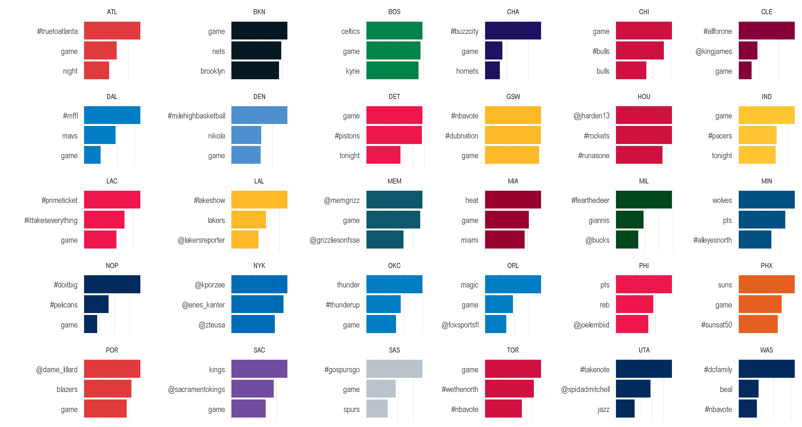
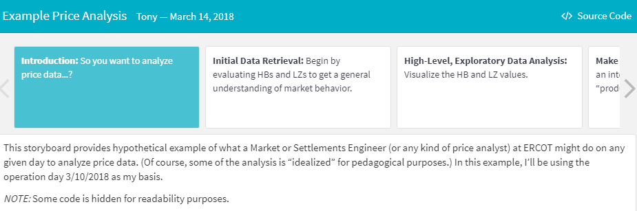
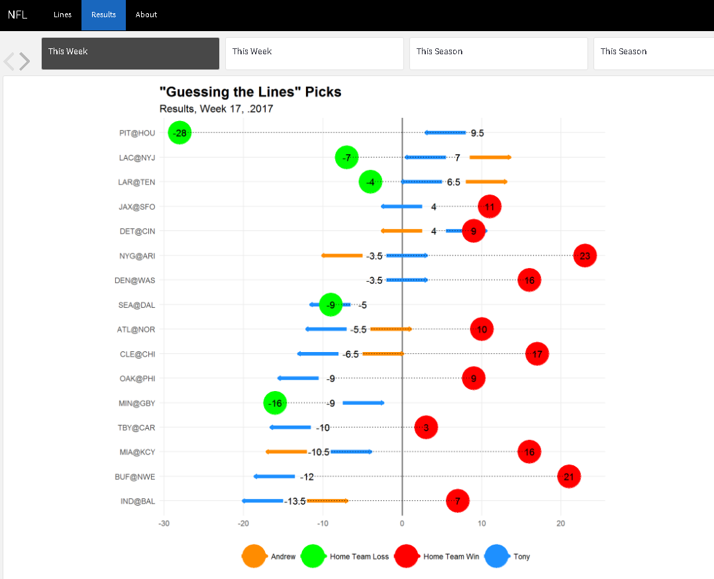

I’ve experimented with the [`{flexdashboard}`
package](https://rmarkdown.rstudio.com/flexdashboard/) for a couple of
things after first trying out not so long ago. In particular, I found
the
[`storyboard`](https://rmarkdown.rstudio.com/flexdashboard/using.html#storyboards)
format to be my favorite. I used it to create the storyboard that I
wrote about in a [previous post about tracking the activity of NBA team
Twitter
accounts](/post/nba-tweets-tms-flexdashboard).

I also used `{flexdashboard}` for a presentation that I gave at my
company’s data science group.

Recently, I’ve been experimenting with the storyboard `{flexdashboard}`
format for visualizing the weekly NFL picks that my brother and I do.

The Alternatives
----------------

In all, I have found `{flexdashboard}`s to be an extremely effective
format. It functions as a good compromise among a number of different
alternatives.

-   ***A “standard” document knitted from a .Rmd file*** (e.g. HTML,
    Markdown, Word, or PDF). In my opinion, the main advantage of
    `{flexdashboard}` compared to the traditional .Rmd-`knitr`-Rmarkdown
    workflow is the ease with which
    [`shiny`](https://shiny.rstudio.com/) apps and other interactive
    formats (e.g. [`htmlwidgets`](https://www.htmlwidgets.org/) can be
    integrated. [^1]

-   ***A presentation knitted from a .Rmd file*** (i.e. a
    `beamer_presentation`, `ioslides_presentation`,
    `slidy_presentation`, or a `revealjs::revealjs_presentation`).
    Compared to these formats, I have found that modifying the default
    styling of the base CSS is much simpler with the themes in the
    `{flexdashboard}` package.

-   ***A “standard” R presentation*** (with the .Rpres extension). I
    must admit that I don’t have much experience with the .Rpres
    format–I prefer Rmarkdown and the capability that it offers to
    create different kinds of output from a single “base” file.

-   ***A `shinydashboard`*** (created with the
    [`shinydashboard`](https://rstudio.github.io/shinydashboard/)
    package). In comparison to `shinydashboard`s, I like the
    “light-weight” framework offered by `{flexdashboard}`. While
    `shinydashboard` is certainly a better option for developing a
    complex dashboard (perhaps for a business purpose), this is not
    typically my use case.

Some Other Opinions
-------------------

Here’s a couple of my other thoughts and tips for using
`{flexdashboard}`:

-   Adding `JavaScript` functionality is straightforward.

For example, I have used the following snippet of code to add
functionality for a “toggle” button to show/hide code.

    

-   Customizing the colors and styles (with `.css`) is also simple.

When modifying a theme’s CSS, the typical/recommended approach is to use
the browser’s “Inspect” tool (or some browser extension such as
[Selector Gadget](http://selectorgadget.com/) to identify which specific styles
to adjust.

For example, if the theme that is chosen for the `{flexdashboard}` (in
particular, the `storyboard` format) uses the same styling for code and
its output, the following CSS code can be used to distinguish the two.

    pre.sourceCode.r {
      background-color: #ffffff;
    }

To add to this technique, because the CSS files in the `{flexdashboard}`
package, it’s not too difficult to simply pick out the file for the
theme that is being used (see the [`resources/`
folder](https://github.com/rstudio/flexdashboard/blob/master/inst/rmarkdown/templates/flex_dashboard/resources/)
in the [package’s GitHub
repo](https://github.com/rstudio/flexdashboard)) and quickly identify
what to modify.

Conclusion
----------

As if I need to re-iterate it again, I would highly recommend trying out
the `{flexdashboard}` package. If anything, you’ll learn that you don’t
like it.

------------------------------------------------------------------------

[^1]: These can also be be embedded into .html files knitted from a .Rmdfile, but I think that it's more natural in the `{flexdashboard}`  context. Also, I believe that the HTML format is the only standard .Rmd output format that has interactive capability, so other output formats cannot be used if opting for the `knitr`-Rmarkdown combo.
